# 第一部分 运用领域模型

**领域模型的用途和意义:**

1. 模型和设计的核心互相影响。正是模型与实现之间的紧密联系才使模型变得有用，并确保我们在模型中所进行的分析能够转化为最终产品（即一个可运行的程序）。模型与实现之间的这种紧密结合在维护和后续开发期间也会很有用，因为我们可以基于对模型的理解来解释代码。（参见第3章）
2. 模型是团队所有成员使用的通用语言的中枢。由于模型与实现之间的关联，开发人员可以使用该语言来讨论程序。他们可以在无需翻译的情况下与领域专家进行沟通。而且，由于该语言是基于模型的，因此我们可借助自然语言对模型本身进行精化。（参见第2章）
3. 模型是浓缩的知识。模型是团队一致认同的领域知识的组织方式和重要元素的区分方式。透过我们如何选择术语、分解概念以及将概念联系起来，模型记录了我们看待领域的方式。当开发人员和领域专家在将信息组织为模型时，这一共同的语言（模型）能够促使他们高效地协作。模型与实现之间的紧密结合使来自软件早期版本的经验可以作为反馈应用到建模过程中。（参见第1章）

## 第1章 消化知识

**有效建模的要素(有一个可演进的模型)**

1. 模型和实现的绑定。最初的原型虽然简陋，但它在模型与实现之间建立了早期链接，而且在所有后续的迭代中我们一直在维护该链接。
2. 建立了一种基于模型的语言。最初，工程师们不得不向我解释基本的PCB问题，而我也必须向他们解释类图的含义。但随着项目的进展，双方都能够直接使用模型中的术语，并将它们组织为符合模型结构的语句，而且无需翻译即可理解互相要表达的意思。
3. 开发一个蕴含丰富知识的模型。对象具有行为和强制性规则。模型并不仅仅是一种数据模式，它还是解决复杂问题不可或缺的部分。模型包含各种类型的知识。
4. 提炼模型。在模型日趋完整的过程中，重要的概念不断被添加到模型中，但同样重要的是，不再使用的或不重要的概念则从模型中被移除。当一个不需要的概念与一个需要的概念有关联时，则把重要的概念提取到一个新模型中，其他那些不要的概念就可以丢弃了。
5. 头脑风暴和实验。语言和草图，再加上头脑风暴活动，将我们的讨论变成“模型实验室”，在这些讨论中可以演示、尝试和判断上百种变化。当团队走查场景时，口头表达本身就可以作为所提议的模型的可行性测试，因为人们听到口头表达后，就能立即分辨出它是表达得清楚、简捷，还是表达得很笨拙。 正是头脑风暴和大量实验的创造力才使我们找到了一个富含知识的模型并对它进行提炼，在这个过程中，基于模型的语言提供了很大帮助，而且贯穿整个实现过程中的反馈闭环也对模型起到了“训练”作用。这种知识消化将团队的知识转化为有价值的模型。

## 第2章 交流与语言的使用Ubiquitous Language(通用语言)

**Ubiquitous Language(通用语言):** 要想创建一种灵活的、蕴含丰富知识的设计，需要一种通用的、共享的团队语言，以及对语言不断的试验并且在软件项目中需要有UBIQUITOUS LANGUAGE沟通领域专家和技术

**Ubiquitous Language(通用语言)产生的方法:** "大声地"建模: 讨论系统时要结合模型。使用模型元素及其交互来大声描述场景，并且按照模型允许的方式将各种概念结合到一起。找到更简单的表达方式来讲出你要讲的话，然后将这些新的想法应用到图和代码中。

图是一种沟通和解释手段，它们可以促进头脑风暴。简洁的小图能够很好地实现这些目标，而涵盖整个对象模型的综合性大图反而失去了沟通或解释能力，因为它们将读者淹没在大量细节之中，加之这些图也缺乏目的性。鉴于此，我们应避免使用包罗万象的对象模型图，甚至不能使用包含所有细节的UML数据存储库。相反，应使用简化的图，图中只包含对象模型的重要概念——这些部分对于理解设计至关重要。


## 第3章 绑定模型和实现(Model-Driven Design)

**DDD目的**
1. 领域驱动设计要求模型不仅能够指导早期的分析工作，还应该成为设计的基础。
2. 软件系统各个部分的设计应该忠实地反映领域模型，以便体现出这二者之间的明确对应关系。我们应该反复检查并修改模型，以便软件可以更加自然地实现模型，即使想让模型反映出更深层次的领域概念时也应如此。我们需要的模型不但应该满足这两种需求，还应该能够支持健壮的UBIQUITOUS LANGUAGE（通用语言）。

# 第二部分模型驱动设计的构造块 


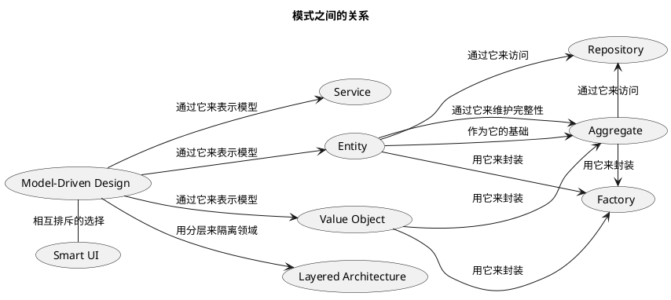


## 第4章 分离领域 Layered Architecture(分层架构) 

**LAYERED ARCHITECTURE的基本原则**是层中的任何元素都仅依赖于本层的其他元素或其下层的元素。向上的通信必须通过间接的方式进行  

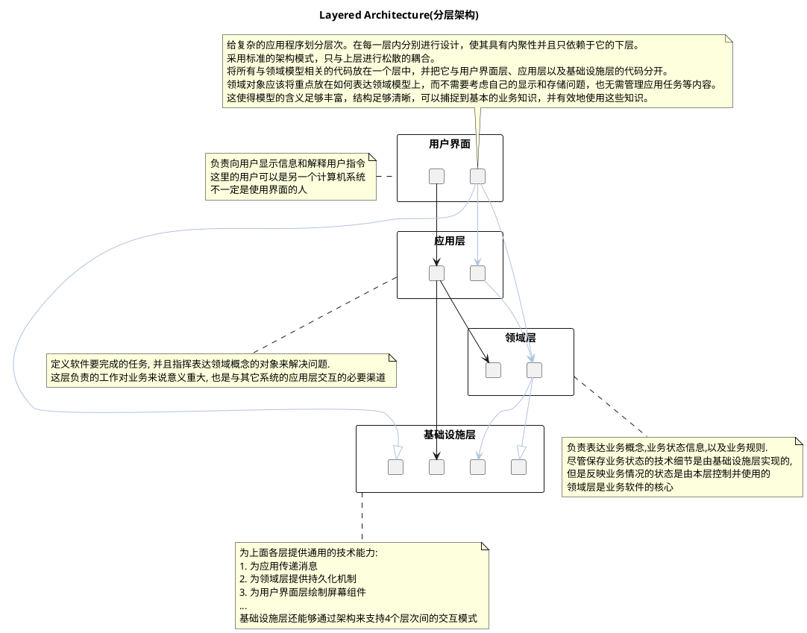


## 第5章 软件中所表示的模型

### Entity(Reference Object)

**Entity(Reference Object):** 很多事物是由它们的标识定义的，而不是由任何属性定义的。我们一般会认为，一个人（继续使用非技术示例）有一个标识，这个标识会陪伴他走完一生（甚至死后）。这个人的物理属性会发生变化，最后消失。他的名字可能改变，财务关系也会发生变化，没有哪个属性是一生不变的，但标识却是永久的。

ENTITY可以是任何事物，只要满足两个条件即可，一是它在整个生命周期中具有连续性，二是它的区别并不是由那些对用户非常重要的属性决定的

当一个对象由其标识（而不是属性）区分时，那么在模型中应该主要通过标识来确定该对象的定义。使类定义变得简单，并集中关注生命周期的连续性和标识。定义一种区分每个对象的方式，这种方式应该与其形式和历史无关。要格外注意那些需要通过属性来匹配对象的需求。在定义标识操作时，要确保这种操作为每个对象生成唯一的结果，这可以通过附加一个保证唯一性的符号来实现。这种定义标识的方法可能来自外部，也可能是由系统创建的任意标识符，但它在模型中必须是唯一的标识。模型必须定义出“符合什么条件才算是相同的事物”


### Value Object(值对象)

**Value Object(值对象):** 用于描述领域的某个方面而本身没有概念标识的对象称为VALUE OBJECT（值对象）。VALUE OBJECT被实例化之后用来表示一些设计元素，对于这些设计元素，我们只关心它们是什么，而不关心它们是谁。即value object 只关系它是什么(属性有什么), 而不关心它是谁(标识符)

当我们只关心一个模型元素的属性时，应把它归类为VALUE OBJECT。我们应该使这个模型元素能够表示出其属性的意义，并为它提供相关功能。VALUE OBJECT应该是不可变的。不要为它分配任何标识，而且不要把它设计成像ENTITY那么复杂。


**value object 属性不可变(共享)的使用场景**
1. 节省数据库空间或减少对象数量是一个关键要求时；
2. 通信开销很低时（如在中央服务器中）；
3. 共享的对象被严格限定为不可变时。


**value object 值(value)可变的场景**
1. 如果VALUE频繁改变；
2. 如果创建或删除对象的开销很大；
3. 如果替换（而不是修改）将打乱集群（像前面示例中讨论的那样）；

如果VALUE的共享不多，或者共享不会提高集群性能，或其他某种技术原因。


### Entity与Value Object对比

一个对象是用来表示某种具有连续性和标识的事物的呢（可以跟踪它所经历的不同状态，甚至可以跨不同的实现跟踪它），还是用于描述某种状态的属性呢？这是ENTITY与VALUE OBJECT之间的根本区别。

- Entity: 是可连续修改的事物
- Value Object: 只是某种状态的描述


### Service

**Service:** 所谓SERVICE，它强调的是与其他对象的关系。与ENTITY和VALUE OBJECT不同，它只是定义了能够为客户做什么。SERVICE往往是以一个活动来命名，而不是以一个ENTITY来命名，也就是说，它是动词而不是名词。Service 并不只是在领域层中使用, 在应用层, 领域层, 基础设施层都可以使用


**好的SERVICE有以下3个特征。**
1. 与领域概念相关的操作不是ENTITY或VALUE OBJECT的一个自然组成部分。
2. 接口是根据领域模型的其他元素定义的。
3. 操作是无状态的。


### 关联


**简化对象之间的关联方式**
1. 规定一个遍历方向。
2. 添加一个限定符，以便有效地减少多重关联。
3. 消除不必要的关联。


## 第6章 领域对象的生命周期


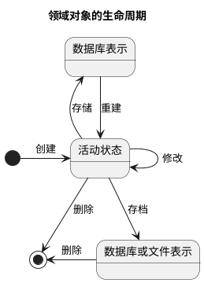

**管理领域对象的生命周期主要的挑战有以下两类。**
1. 在整个生命周期中维护完整性。
2. 防止模型陷入管理生命周期复杂性造成的困境当中。

### Aggregate

**Aggregate定义:** 首先，我们需要用一个抽象来封装模型中的引用。AGGREGATE就是一组相关对象的集合，我们把它作为数据修改的单元。每个AGGREGATE都有一个根（root）和一个边界（boundary）。边界定义了AGGREGATE的内部都有什么。根则是AGGREGATE所包含的一个特定ENTITY。对AGGREGATE而言，外部对象只可以引用根，而边界内部的对象之间则可以互相引用。除根以外的其他ENTITY都有本地标识，但这些标识只在AGGREGATE内部才需要加以区别，因为外部对象除了根ENTITY之外看不到其他对象。

**Aggregate原则**
1. 固定规则（invariant）是指在数据变化时必须保持的一致性规则，其涉及AGGREGATE成员之间的内部关系。而任何跨越AGGREGATE的规则将不要求每时每刻都保持最新状态。通过事件处理、批处理或其他更新机制，这些依赖会在一定的时间内得以解决。但在每个事务完成时，AGGREGATE内部所应用的固定规则必须得到满足。
2. 现在，为了实现这个概念上的AGGREGATE，需要对所有事务应用一组规则。
3. 根ENTITY具有全局标识，它最终负责检查固定规则。
4. 根ENTITY具有全局标识。边界内的ENTITY具有本地标识，这些标识只在AGGREGATE内部才是唯一的。
5. AGGREGATE外部的对象不能引用除根ENTITY之外的任何内部对象。根ENTITY可以把对内部ENTITY的引用传递给它们，但这些对象只能临时使用这些引用，而不能保持引用。根可以把一个VALUE OBJECT的副本传递给另一个对象，而不必关心它发生什么变化，因为它只是一个VALUE，不再与AGGREGATE有任何关联。
6. 作为上一条规则的推论，只有AGGREGATE的根才能直接通过数据库查询获取。所有其他对象必须通过遍历关联来发现。
7. AGGREGATE内部的对象可以保持对其他AGGREGATE根的引用。
8. 删除操作必须一次删除AGGREGATE边界之内的所有对象。（利用垃圾收集机制，这很容易做到。由于除根以外的其他对象都没有外部引用，因此删除了根以后，其他对象均会被回收。）
9. 当提交对AGGREGATE边界内部的任何对象的修改时，整个AGGREGATE的所有固定规则都必须被满足。


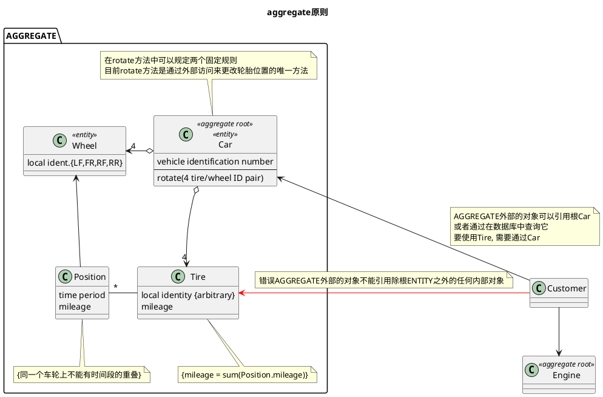


### Factory

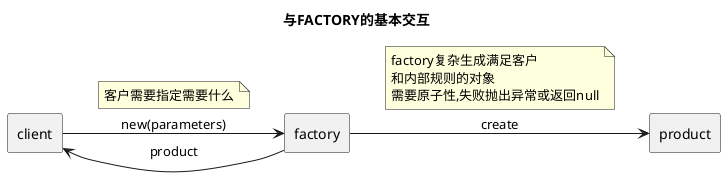


**factory(工厂)的意义:** factory是为了产生复杂的aggregate内的一组对象. 对象的创建本身可以是一个主要操作，但被创建的对象并不适合承担复杂的装配操作。将这些职责混在一起可能产生难以理解的拙劣设计。让客户直接负责创建对象又会使客户的设计陷入混乱，并且破坏被装配对象或AGGREGATE的封装，而且导致客户与被创建对象的实现之间产生过于紧密的耦合。应该将创建复杂对象的实例和AGGREGATE的职责转移给单独的对象，这个对象本身可能没有承担领域模型中的职责，但它仍是领域设计的一部分。提供一个封装所有复杂装配操作的接口，而且这个接口不需要客户引用要被实例化的对象的具体类。在创建AGGREGATE时要把它作为一个整体，并确保它满足固定规则。

**任何好的工厂都需满足以下基本需求。**
1. 每个创建方法都是原子的，而且要保证被创建对象或AGGREGATE的所有固定规则。FACTORY生成的对象要处于一致的状态。在生成ENTITY时，这意味着创建满足所有固定规则的整个AGGREGATE，但在创建完成后可以向聚合添加可选元素。在创建不变的VALUE OBJECT时，这意味着所有属性必须被初始化为正确的最终状态。如果FACTORY通过其接口收到了一个创建对象的请求，而它又无法正确地创建出这个对象，那么它应该抛出一个异常，或者采用其他机制，以确保不会返回错误的值。
2. FACTORY应该被抽象为所需的类型，而不是所要创建的具体类。[Gamma et al.1995]中的高级FACTORY模式介绍了这一话题。
3. 整个AGGREGATE通常由一个独立的FACTORY来创建，FACTORY负责把对根的引用传递出去，并确保创建出的AGGREGATE满足固定规则。如果AGGREGATE内部的某个对象需要一个FACTORY，而这个FACTORY又不适合在AGGREGATE根上创建，那么应该构建一个独立的FACTORY。但仍应遵守规则——把访问限制在AGGREGATE内部，并确保从AGGREGATE外部只能对被构建对象进行临时引用


**使用构造方法不使用factory的场景**
1. 类（class）是一种类型（type）。它不是任何相关层次结构的一部分，而且也没有通过接口实现多态性。
2. 客户关心的是实现，可能是将其作为选择STRATEGY的一种方式。
3. 客户可以访问对象的所有属性，因此向客户公开的构造函数中没有嵌套的对象创建。
4. 构造并不复杂。
5. 公共构造函数必须遵守与FACTORY相同的规则：它必须是原子操作，而且要满足被创建对象的所有固定规则。
6. 不要在构造函数中调用其他类的构造函数。构造函数应该保持绝对简单。复杂的装配，特别是AGGREGATE，需要使用FACTORY。使用FACTORY METHOD的门槛并不高。


**固定规则的相关逻辑应放置在哪里:** FACTORY已经知道被创建对象的内部结构，而且创建FACTORY的目的与被创建对象的实现有着密切的联系。在某些情况下，把固定规则的相关逻辑放到FACTORY中是有好处的，这样可以让被创建对象的职责更明晰。对于AGGREGATE规则来说尤其如此（这些规则会约束很多对象）。但固定规则的相关逻辑却特别不适合放到那些与其他领域对象关联的FACTORY METHOD中。


**重建对象的FACTORY与用于创建对象的FACTORY很类似，主要有以下两点不同。**
1. 用于重建对象的ENTITY FACTORY不分配新的跟踪ID。如果重新分配ID，将丢失与先前对象的连续性。因此，在重建对象的FACTORY中，标识属性必须是输入参数的一部分。
2. 当固定规则未被满足时，重建对象的FACTORY采用不同的方式进行处理。当创建新对象时，如果未满足固定规则，FACTORY应该简单地拒绝创建对象，但在重建对象时则需要更灵活的响应。如果对象已经在系统的某个地方存在（如在数据库中），那么不能忽略这个事实。但是，同样也不能任凭规则被破坏。必须通过某种策略来修复这种不一致的情况，这使得重建对象比创建新对象更困难。

### REPOSITORY

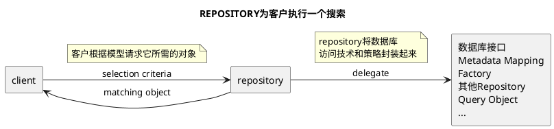

**已有的糟糕现象(数据库查询对aggregate的破坏):** 
1. 客户需要一种有效的方式来获取对已存在的领域对象的引用。如果基础设施提供了这方面的便利，那么开发人员可能会增加很多可遍历的关联，这会使模型变得非常混乱。另一方面，开发人员可能使用查询从数据库中提取他们所需的数据，或是直接提取具体的对象，而不是通过AGGREGATE的根来得到这些对象。这样就导致领域逻辑进入查询和客户代码中，而ENTITY和VALUE OBJECT则变成单纯的数据容器。采用大多数处理数据库访问的技术复杂性很快就会使客户代码变得混乱，这将导致开发人员简化领域层，最终使模型变得无关紧要。
2. 在所有持久化对象中，有一小部分必须通过基于对象属性的搜索来全局访问。当很难通过遍历方式来访问某些AGGREGATE根的时候，就需要使用这种访问方式。它们通常是ENTITY，有时是具有复杂内部结构的VALUE OBJECT，还可能是枚举VALUE。而其他对象则不宜使用这种访问方式，因为这会混淆它们之间的重要区别。随意的数据库查询会破坏领域对象的封装和AGGREGATE。技术基础设施和数据库访问机制的暴露会增加客户的复杂度，并妨碍模型驱动的设计。

**Repository优点**
1. 为每种需要全局访问的对象类型创建一个对象，这个对象相当于该类型的所有对象在内存中的一个集合的“替身”。通过一个众所周知的全局接口来提供访问。提供添加和删除对象的方法，用这些方法来封装在数据存储中实际插入或删除数据的操作。提供根据具体条件来挑选对象的方法，并返回属性值满足查询条件的对象或对象集合（所返回的对象是完全实例化的），从而将实际的存储和查询技术封装起来。只为那些确实需要直接访问的AGGREGATE根提供REPOSITORY。让客户始终聚焦于模型，而将所有对象的存储和访问操作交给REPOSITORY来完成。
2. 它们为客户提供了一个简单的模型，可用来获取持久化对象并管理它们的生命周期；
3. 它们使应用程序和领域设计与持久化技术（多种数据库策略甚至是多个数据源）解耦；
4. 它们体现了有关对象访问的设计决策；
5. 可以很容易将它们替换为“哑实现”（dummy implementation），以便在测试中使用（通常使用内存中的集合）。

**repository注意事项**
1. 对类型进行抽象。REPOSITORY“含有”特定类型的所有实例，但这并不意味着每个类都需要有一个REPOSITORY。类型可以是一个层次结构中的抽象超类（例如，TradeOrder可以是BuyOrder或SellOrder）。类型可以是一个接口——接口的实现者并没有层次结构上的关联，也可以是一个具体类。记住，由于数据库技术缺乏这样的多态性质，因此我们将面临很多约束。
2. 充分利用与客户解耦的优点。我们可以很容易地更改REPOSITORY的实现，但如果客户直接调用底层机制，我们就很难修改其实现。也可以利用解耦来优化性能，因为这样就可以使用不同的查询技术，或在内存中缓存对象，可以随时自由地切换持久化策略。通过提供一个易于操纵的、内存中的（in-memory）哑实现，还能够方便客户代码和领域对象的测试。
3. 将事务的控制权留给客户。尽管REPOSITORY会执行数据库的插入和删除操作，但它通常不会提交事务。例如，保存数据后紧接着就提交似乎是很自然的事情，但想必只有客户才有上下文，从而能够正确地初始化和提交工作单元。如果REPOSITORY不插手事务控制，那么事务管理就会简单得多。


### REPOSITORY与FACTORY的关系


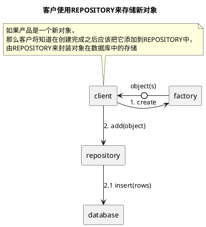

FACTORY和REPOSITORY具有完全不同的职责。FACTORY负责制造新对象，而REPOSITORY负责查找已有对象。REPOSITORY应该让客户感觉到那些对象就好像驻留在内存中一样。对象可能必须被重建（的确，可能会创建一个新实例），但它是同一个概念对象，仍旧处于生命周期的中间。

REPOSITORY也可以委托FACTORY来创建一个对象，这种方法（虽然实际很少这样做，但在理论上是可行的）可用于从头开始创建对象，此时就没有必要区分这两种看问题的角度了


## 第7章 使用语言：一个扩展的示例

假设我们正在为一家货运公司开发新软件。最初的需求包括3项基本功能：
1. 跟踪客户货物的主要处理；
2. 事先预约货物；
3. 当货物到达其处理过程中的某个位臵时，自动向客户寄送发票。

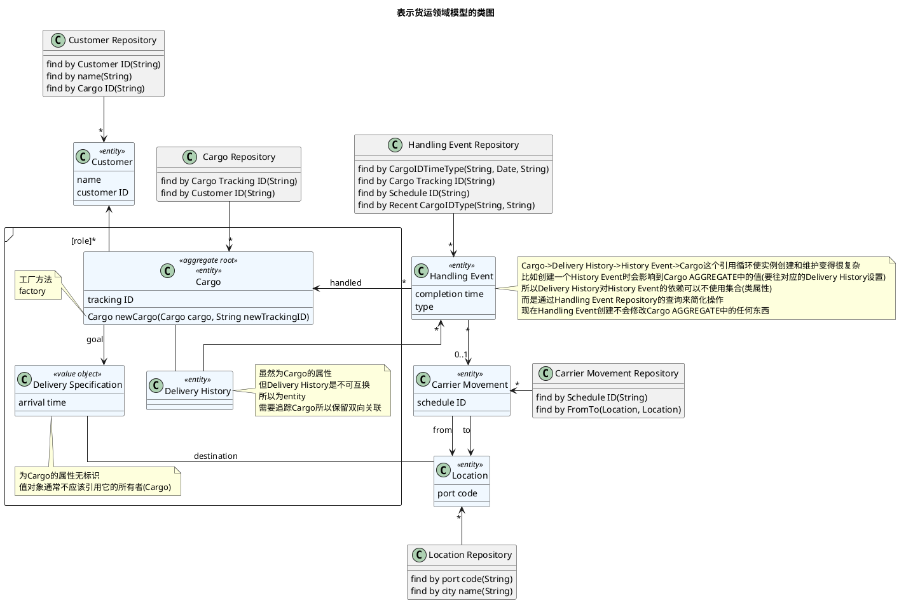
一个Cargo（货物）涉及多个Customer（客户），每个Customer承担不同的角色  
Cargo的运送目标已指定  
由一系列满足Specification（规格）的Carrier Movement（运输动作）来完成运送目标  
Handling Event（处理事件）是对Cargo采取的不同操作，如将它装上船或清关。这个类可以被细化为一个由不同种类的事件（如装货、卸货或由收货人提货）构成的层次结构。  
Delivery Specification（运送规格）定义了运送目标，这至少包括目的地和到达日期，但也可能更为复杂。这个类遵循规格模式  
Delivery Specification的职责本来可以由Cargo对象承担，但将Delivery Specification抽象出来至少有以下3个优点。  
1. 如果没有Delivery Specification，Cargo对象就需要负责提供用于指定运送目标的所有属性和关联。这会把Cargo对象搞乱，使它难以理解或修改。  
2. 当将模型作为一个整体来解释时，这个抽象使我们能够轻松且安全地省略掉细节。例如，Delivery Specification中可能还封装了其他标准，但就图7-1所要展示的细节而言，可以不必将其显示出来。这个图告诉读者存在运送规格，但其细节并非思考的重点（事实上，过后修改细节也很容易）。  
3. 这个模型具有更强的表达力。Delivery Specification清楚地表明：运送Cargo的具体方式没有明确规定，但它必须完成Delivery Specification中规定的目标。  

Customer在运输中所承担的部分是按照角色（role）来区分的，如shipper（托运人）、receiver （收货人）、payer（付款人）等。由于一个Cargo只能由一个Customer来承担某个给定的角色，因此它们之间的关联是限定的多对一关系，而不是多对多。角色可以被简单地实现为字符串，当需要其他行为的时候，也可以将它实现为类。  
Carrier Movement表示由某个Carrier（如一辆卡车或一艘船）执行的从一个Location（地点）到另一个Location的旅程。Cargo被装上Carrier后，通过Carrier的一个或多个Carrier Movement，就可以在不同地点之间转移  
Delivery History（运送历史）反映了Cargo实际上发生了什么事情，它与Delivery Specification正好相对，后者描述了目标。Delivery History对象可以通过分析最后一次装货和卸货以及对应的Carrier Movement的目的地来计算货物的当前位臵。成功的运送将会得到一个满足Delivery Specification目标的 Delivery History。  


### 连接其他系统

当本系统有依赖其他未使用领域模型或领域模型与本系统不一致的情况时可以通过防腐层(anticorruption layer)和企业部门单元(enterprise segment)保证本系统的清晰  
enterprise segment是一组维度，它们定义了一种对业务进行划分的方式。

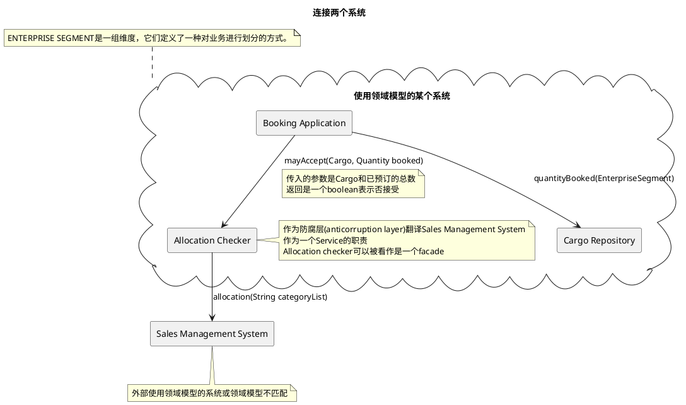

# 第三部分 通过重构来加深理解

## 第9章 将隐式概念转变为显式概念

约束是模型概念中非常重要的类别。它们通常是隐含的，将它们显式地表现出来可以极大地提高设计质量。 比如将某个字段不能小于0, 可以将这个条件提取到一个方法上做校验, 如果是较复杂的约束甚至可以提取成某个特殊简单类(比如某个策略类)

### SPECIFICATION

**Specification:** 为特殊目的创建谓词形式的显式的VALUE OBJECT。SPECIFICATION就是一个谓词(是否是xxx,比如判断某个简单约束是否满足)，可用来确定对象是否满足某些标准。

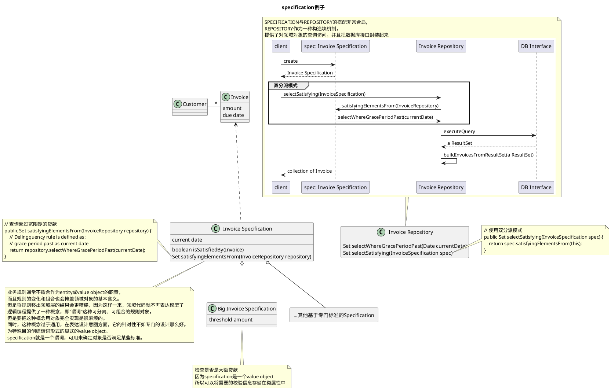

## 第10章 柔性设计

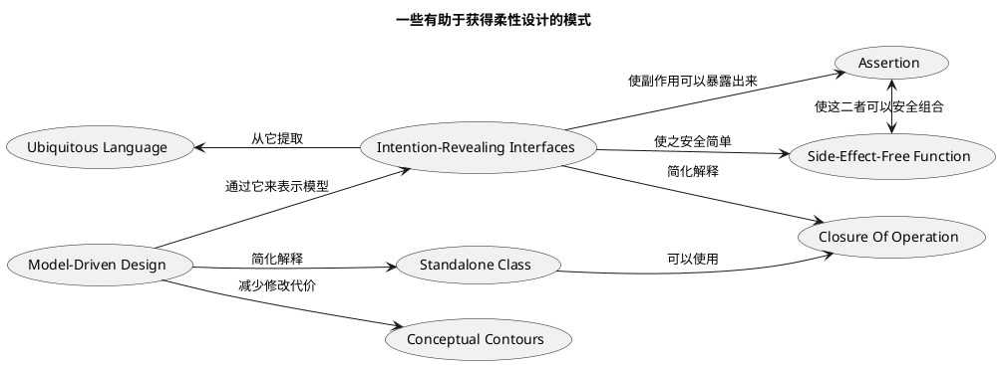

### INTENTION-REVEALING INTERFACES

**Intention-Revealing Interfaces(释意接口)定义:** 设计中的所有公共元素共同构成了接口，每个元素的名称都提供了揭示设计意图的机会。类型名称、方法名称和参数名称组合在一起，共同形成了一个INTENTION-REVEALING INTERFACE（释意接口）。


**Intention-Revealing Interfaces(释意接口)如何做:** 

在命名类和操作时要描述它们的效果和目的，而不要表露它们是通过何种方式达到目的的。这样可以使客户开发人员不必去理解内部细节。这些名称应该与UBIQUITOUS LANGUAGE保持一致，以便团队成员可以迅速推断出它们的意义。在创建一个行为之前先为它编写一个测试，这样可以促使你站在客户开发人员的角度上来思考它。

所有复杂的机制都应该封装到抽象接口的后面，接口只表明意图，而不表明方式。

在领域的公共接口中，可以把关系和规则表述出来，但不要说明规则是如何实施的；可以把事件和动作描述出来，但不要描述它们是如何执行的；可以给出方程式，但不要给出解方程式的数学方法。可以提出问题，但不要给出获取答案的方法。

### 10.2 模式：SIDE-EFFECT-FREE FUNCTION

**查询与命令的定义:** 查询的方式可能只是简单地访问变量中的数据，也可能是用这些数据执行计算。命令（也称为修改器)是修改系统的操作（举一个简单的例子，设臵变量

**副作用的定义:** 任何对未来操作产生影响的系统状态改变都可以称为副作用

**Side-Effect-Freefunction(无副作用函数)的定义和作用:** 返回结果而不产生副作用的操作称为函数。一个函数可以被多次调用，每次调用都返回相同的值。一个函数可以调用其他函数，而不必担心这种嵌套的深度。函数比那些有副作用的操作更易于测试。由于这些原因，使用函数可以降低风险。

**减少命令产生的方法:**
1. 可以把命令和查询严格地放在不同的操作中。确保导致状态改变的方法不返回领域数据，并尽可能保持简单。在不引起任何可观测到的副作用的方法中执行所有查询和计算[Meyer 1988］。
2. 总是有一些替代的模型和设计，它们不要求对现有对象做任何修改。相反，它们创建并返回一个VALUE OBJECT，用于表示计算结果。这是一种很常见的技术，在接下来的示例中我们就会演示它的使用。VALUE OBJECT可以在一次查询的响应中被创建和传递，然后被丢弃——不像ENTITY，实体的生命周期是受到严格管理的。
3. VALUE OBJECT是不可变的，这意味着除了在创建期间调用的初始化程序之外，它们的所有操作都是函数。像函数一样，VALUE OBJECT使用起来很安全，测试也很简单。如果一个操作把逻辑或计算与状态改变混合在一起，那么我们就应该把这个操作重构为两个独立的操作［Fowler 1999,p.279］。但从定义上来看，这种把副作用隔离到简单的命令方法中的做法仅适用于ENTITY。在完成了修改和查询的分离之后，可以考虑再进行一次重构，把复杂计算的职责转移到VALUE OBJECT中。通过派生出一个VALUE OBJECT（而不是改变现有状态），或者通过把职责完全转移到一个VALUE OBJECT中，往往可以完全消除副作用

```java
// Side-Effect-Free Function(无副作用方法) 和Closure Of Operation(闭合操作)例子
// 油漆例子
class ValueObject {}
// PigmentColor为ValueObject, 所以不可变
class PigmentColor extends ValueObject {
    private int red;
    private int blue;
    private int yellow;
    // Closure Of Operation(闭合操作), 参数和返回值,都是本身类 PigmentColor
    // Closure Of Operation(闭合操作) 一般用于Value Object而不用于Entity
    public PigmentColor mixedWith(PigmentColor other, double ratio) {
        // Many lines of complicated color-mixing logic
        // ending with the creation of a new PigmentColor object
        // with appropriate new red, blue, and yellow value
        return null;
    }
}

// 油漆, 油漆有颜色和容量属性
class Paint {
    private double volume;
    private PigmentColor pigmentColor;

    // 混合油漆
    public void mixIt(Paint other) {
        this.volume = this.volume + other.volume;
        double ratio = other.volume / this.volume;
        // 修改(命令)和查询分离
        // pigmentColor.mixedWith() 返回一个新对象本身并非修改(命令)
        this.pigmentColor = this.pigmentColor.mixedWith(other.pigmentColor, ratio);
    }
}
```

### ASSERTION

**Assertion(断言)作用:** 把复杂的计算封装到SIDE-EFFECT-FREE FUNCTION中可以简化问题，但实体仍然会留有一些有副作用的命令，使用这些ENTITY的人必须了解使用这些命令的后果。在这种情况下，使用ASSERTION（断言）可以把副作用明确地表示出来，使它们更易于处理

### CONCEPTUAL CONTOUR

**Conceptual Contours(概念轮廓)的用处:** 把设计元素（操作、接口、类和AGGREGATE）分解为内聚的单元，在这个过程中，你对领域中一切重要划分的直观认识也要考虑在内。在连续的重构过程中观察发生变化和保证稳定的规律性，并寻找能够解释这些变化模式的底层CONCEPTUAL CONTOUR。使模型与领域中那些一致的方面（正是这些方面使得领域成为一个有用的知识体系）相匹配。

### STANDALONE CLASS

**Standalone Class(独立类)作用:** 低耦合是对象设计的一个基本要素。尽一切可能保持低耦合。把其他所有无关概念提取到对象之外。这样类就变得完全独立了，这就使得我们可以单独地研究和理解它。每个这样的独立类都极大地减轻了因理解ＭODULE而带来的负担。

**Standalone Class(独立类)如何实现:** 尽力把最复杂的计算提取到STANDALONE CLASS（独立的类）中，实现此目的的一种方法是从存在大量依赖的类中将VALUE OBJECT建模出来。

### CLOSURE OF OPERATION

**Closure Of Operation(闭合操作)的定义** 在适当的情况下，在定义操作时让它的返回类型与其参数的类型相同。如果实现者（implementer）的状态在计算中会被用到，那么实现者实际上就是操作的一个参数，因此参数和返回值应该与实现者有相同的类型。这样的操作就是在该类型的实例集合中的闭合操作。闭合操作提供了一个高层接口，同时又不会引入对其他概念的任何依赖。(参数, 返回值, 操作者 为一个类, 即某个类A, 有个方法参数和返回值都是A, A一般为Value Object)

### 10.8 声明式设计风格

**声明式设计:** 声明式设计（Declarative Design）是一种设计理念，侧重于描述"什么"是需要完成的，而不是"如何"去完成。它与命令式设计（Imperative Design）不同，后者关注于具体的执行步骤和过程。在领域模型中，声明式设计通常用于描述业务领域中的对象、关系和行为，而不需要深入到具体的操作细节。

```java
// Intention-Revealing Interface、Side-Effect-Free Function和Assertion
// 三者合作设计声明式设计风格的例子: 使用逻辑运算对SPECIFICATION进行组合
interface Specification {
    public boolean isSatisfiedBy(Object candidate);
    // Closure Of Operation(闭合操作)
    public Specification and(Specification other);
    public Specification or(Specification other);
    public Specification not();
     
}

abstract class AbstractSpecification  implements Specification {
    public Specification and(Specification other) {
        return new AndSpecification(this, other);
    }
    public Specification or(Specification other) {
        return new OrSpecification(this, other);
    }
    public Specification not() {
        return new NotSpecification(this);
    }
}

class AndSpecification extends AbstractSpecification {
    private Specification one;
    private Specification other;

    public AndSpecification(Specification one, Specification other) {
        this.one = one;
        this.other = other;
    }

    @Override
    public boolean isSatisfiedBy(Object candidate) {
        return one.isSatisfiedBy(candidate) && other.isSatisfiedBy(candidate); 
    }
}

class OrSpecification extends AbstractSpecification {
    private Specification one;
    private Specification other;

    public OrSpecification(Specification one, Specification other) {
        this.one = one;
        this.other = other;
    }

    @Override
    public boolean isSatisfiedBy(Object candidate) {
        return one.isSatisfiedBy(candidate) || other.isSatisfiedBy(candidate); 
    }
}
class NotSpecification extends AbstractSpecification {
    private Specification wrapped;


    public NotSpecification(Specification wrapped) {
        this.wrapped = wrapped;
    }


    @Override
    public boolean isSatisfiedBy(Object candidate) {
        return !wrapped.isSatisfiedBy(candidate);
    }
}
```

### 10.9 切入问题的角度

**尽可能利用已有的形式**

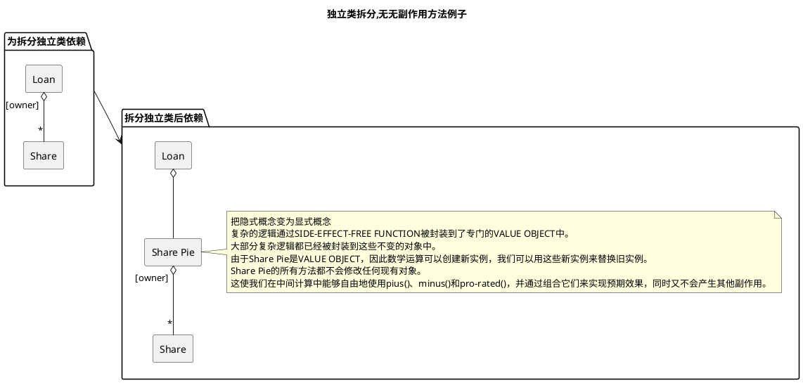


```java
import java.util.Collection;
import java.util.HashMap;
import java.util.HashSet;
import java.util.Iterator;
import java.util.Map;
import java.util.Map.Entry;
import java.util.Set;

class Share {
    // 所有者
    String owner;
    // 数量(百分比)
    double amount;
    public Share(String owner, double amount) {
        this.owner = owner;
        this.amount = amount;
    }
    public double getAmount() {
        return amount;
    }

}


class Loan {

    private Map<String/*owner*/, Share> shares;

    // NOTE 3 第三个版本, 提取Standalone Class(独立类)为一个Value Object 负责计算
    // 使用这个属性后废弃属性shares, 被提取到SharePie中了
    private SharePie sharePie;
    

    // NOTE 1 第一个版本, 查询和修改混杂在一起
    // TODO distributePrincipalPayment 这个方法是一个危险操作, 在一个方法中同时计算又修改属性(命令)
    public Map<String/*owner*/, Share> distributePrincipalPayment(double paymentAmount) {
        Map<String/*owner*/, Share> paymentShares = new HashMap<>();
        Map<String/*owner*/, Share> loanShares = getShares();
        Set<Entry<String, Share>> entrys = loanShares.entrySet();
        double total = getAmount();
        for(Entry<String, Share> entry : entrys) {
            String owner = entry.getKey();
            double initialLoanShareAmount = getShareAmount(owner); 
            double paymentSharesAmount = initialLoanShareAmount / (total * paymentAmount);
            paymentShares.put(owner, new Share(owner, paymentSharesAmount));

            // 修改原始数据, TODO 危险操作, 在一个方法中同时计算又修改属性, 这个是一个命令
            shares.put(owner, new Share(owner, initialLoanShareAmount - paymentSharesAmount));

        }

        return paymentShares;
    }

    // NOTE 2 第二个版本, 查询和修改分离
    // 改进 distributePrincipalPayment 通过重构把查询从修改操作中分离出来 , applyPrincipalPaymentShares() 只做修改
    // 客户端使用逻辑如下
    // Map<String, Share> distributon = loan.calculatePrincipalPaymentShares(paymentAmount);
    // loan.applyPrincipalPaymentShares(distributon);
    public void applyPrincipalPaymentShares(Map<String/*owner is lender*/, Share> paymentShares) {
        Map<String/*owner*/, Share> loanShares = getShares();
        Set<Entry<String, Share>> entrys = paymentShares.entrySet();
        for(Entry<String, Share> entry : entrys) {
            String lender = entry.getKey();
            Share paymentShare = entry.getValue();
            Share loanShare = loanShares.get(lender);
            // 独立的修改方法
            loanShares.put(lender, new Share(lender, loanShare.getAmount() - paymentShare.getAmount()));
        }

    }

    // 提取出查询方法, 只做查询, 不做修改为Side-Effect-Free Function(无副作用方法)
    public Map<String/*owner*/, Share> calculatePrincipalPaymentShares(double paymentAmount) {
        Map<String/*owner*/, Share> paymentShares = new HashMap<>();
        Map<String/*owner*/, Share> loanShares = getShares();
        Set<Entry<String, Share>> entrys = loanShares.entrySet();
        double total = getAmount();
        for(Entry<String, Share> entry : entrys) {
            String owner = entry.getKey();
            double initialLoanShareAmount = getShareAmount(owner); 
            double paymentSharesAmount = initialLoanShareAmount / (total * paymentAmount);
            paymentShares.put(owner, new Share(owner, paymentSharesAmount));
        }

        return paymentShares;
    }

    // NOTE 3 第三个版本, 查询和修改分离而且改用Standalone Class(独立类) 
    // 客户端使用逻辑如下
    // Map<String, Share> distributon = loan.calculatePrincipalPaymentShares(paymentAmount);
    // SharePie  distributon = loan.calculatePrincipalPaymentShares_Standalone(paymentAmount);
    // loan.applyPrincipalPaymentShares_Standalone(distributon);
    public void applyPrincipalPaymentShares_Standalone(SharePie paymentShares) {
        this.sharePie = this.sharePie.minus(paymentShares);
    }

    // 提取出查询方法, 只做查询, 不做修改为Side-Effect-Free Function(无副作用方法)
    // 为Standalone Class(独立类)版本
    public SharePie calculatePrincipalPaymentShares_Standalone(double paymentAmount) {
        return this.sharePie.prorated(paymentAmount);
    }

    public double getShareAmount(String owner) {
        if (shares.containsKey(owner)) {
            return shares.get(owner).getAmount();
        }
        // 没这个返回0
        return 0D; 
    }

    public double getAmount() {

        Map<String/*owner*/, Share> loanShares = getShares();
        double total = 0D;
        Iterator<Share> iterator = loanShares.values().iterator();
        while (iterator.hasNext()) {
            total += iterator.next().getAmount();
        }

        return total;
    }

    public Map<String, Share> getShares() {
        return shares;
    }


}

// Standalone Class(独立类) 为一个Value Object, 只负责计算
// SharePie把隐式概念变为显式概念
class SharePie {

    private Map<String/*owner*/, Share> shares;

    
    // 比例分配
    // Closure Of Operation(闭合操作) , Side-Effect-Free Function(无副作用方法)
    public SharePie prorated(double amountToProrate) {
        SharePie proration = new SharePie();
        double basis = getAmount();
        Set<Entry<String, Share>> entrys = shares.entrySet();
        for (Entry<String, Share> entry : entrys) {
            String owner = entry.getKey();
            Share share = entry.getValue();

            proration.add(owner, share.getAmount() / (basis * amountToProrate));
        }
        return proration;
    }

    // 两个Pie之差等于这两个股东所持股份之差
    // Closure Of Operation(闭合操作) , Side-Effect-Free Function(无副作用方法)
    public SharePie minus(SharePie otherShares) {
        SharePie result = new SharePie();
        Set<String> owners = new HashSet<>();
        owners.addAll(getOwners());
        owners.addAll(otherShares.getOwners());
        for (String owner : owners) {
            // TODO 这里隐藏了一个规则, amount 不能小于 0 , 需要提取到 Specification（规格）中
            result.add(owner, getShareAmount(owner) - otherShares.getShareAmount(owner));
        }

        return result;
    }

    public void add(String owner, double amount) {
        this.shares.put(owner, new Share(owner, amount));
    }

    private Collection<? extends String> getOwners() {
        return this.shares.keySet();
    }

    public double getShareAmount(String owner) {
        if (shares.containsKey(owner)) {
            return shares.get(owner).getAmount();
        }
        // 没这个返回0
        return 0D; 
    }

    
    public double getAmount() {

        Map<String/*owner*/, Share> loanShares = getShares();
        double total = 0D;
        Iterator<Share> iterator = loanShares.values().iterator();
        while (iterator.hasNext()) {
            total += iterator.next().getAmount();
        }

        return total;
    }

    public Map<String, Share> getShares() {
        return shares;
    }

}
```

# 第四部分 战略设计

## 第14章 保持模型的完整性

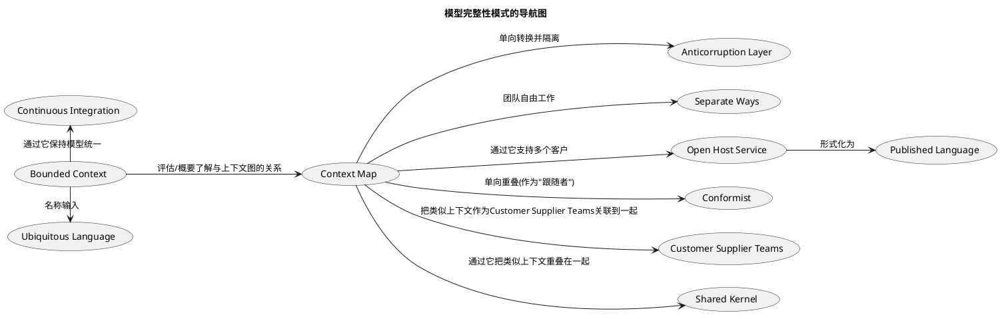

**保持模型的完整性的模式**
1. Bounded Context(限界上下文): 特定模型的限界应用, 明确地定义模型所应用的上下文。根据团队的组织、软件系统的各个部分的用法以及物理表现（代码和数据库模式等）来设臵模型的边界。在这些边界中严格保持模型的一致性，而不要受到边界之外问题的干扰和混淆。
2. Continuous Integration(持续集成): 一个上下文中的所有工作足够频繁地合并到一起，并使它们保持一致，以便当模型发生分裂时，可以迅速发现并纠正问题。像领域驱动设计中的其他方法一样，CONTINUOUS INTEGRATION也有两个级别的操作：(1) 模型概念的集成；(2) 实现的集成。
3. Context Map(上下文图): 项目所涉及的限界上下文以及它们与模型之间的关系的一种表示(分别在两个限界上下文的模型的关系)。
4. Shared Kernel(共享内核): 从领域模型中选出两个团队都同意共享的一个子集。当然，除了这个模型子集以外，还包括与该模型部分相关的代码子集，或数据库设计的子集。这部分明确共享的内容具有特殊的地位，一个团队在没与另一个团队商量的情况下不应擅自更改它。
5. Customer Supplier Teams(客户/供应商团队): 在两个团队之间建立一种明确的客户/供应商关系。在计划会议中，下游团队相当于上游团队的客户。根据下游团队的需求来协商需要执行的任务并为这些任务做预算，以便每个人都知道双方的约定和进度。两个团队共同开发自动化验收测试，用来验证预期的接口。把这些测试添加到上游团队的测试套件中，以便作为其持续集成的一部分来运行。这些测试使上游团队在做出修改时不必担心对下游团队产生副作用。
6. Conformist(跟随): 严格遵从上游团队的模型，可以消除在BOUNDED CONTEXT之间进行转换的复杂性。尽管这会限制下游设计人员的风格，而且可能不会得到理想的应用程序模型，但选择CONFORMITY模式可以极大地简化集成。此外，这样还可以与供应商团队共享UBIQUITOUS LANGUAGE。供应商处于统治地位，因此最好使沟通变容易。他们从利他主义的角度出发，会与你分享信息
7. Anticorruption Layer(反腐层): 创建一个隔离层，以便根据客户自己的领域模型来为客户提供相关功能。这个层通过另一个系统现有接口与其进行对话，而只需对那个系统作出很少的修改，甚至无需修改。在内部,这个层在两个模型之间进行必要的双向转换。
8. Separate Ways(各行其道): 不进行集成, 声明一个与其他上下文毫无关联的BOUNDED CONTEXT，使开发人员能够在这个小范围内找到简单、专用的解决方案。
9. Open Host Service(开放主机): 定义一个协议，把你的子系统作为一组SERVICE供其他系统访问。开放这个协议，以便所有需要与你的子系统集成的人都可以使用它。当有新的集成需求时，就增强并扩展这个协议，但个别团队的特殊需求除外。满足这种特殊需求的方法是使用一次性的转换器来扩充协议，以便使共享协议简单且内聚。
10. Published Language(共享语言): 把一个良好文档化的、能够表达出所需领域信息的共享语言(业内已有的标准格式语言比如CML（化学标记语言）)作为公共的通信媒介，必要时在其他信息与该语言之间进行转换。


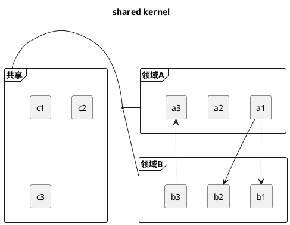

### Anticorruption Layer

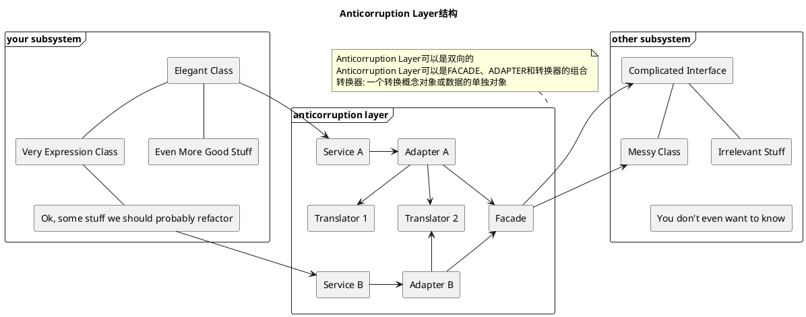

**Anticorruption Layer的基本元素**
1. FACADE是子系统的一个可供替换的接口，它简化了客户访问，并使子系统更易于使用。由于我们非常清楚要使用另一个系统的哪些功能，因此可以创建FACADE来促进和简化对这些特性的访问，并把其他特性隐藏起来。FACADE并不改变底层系统的模型。它应该严格按照另一个系统的模型来编写。否则会产生严重的后果：轻则导致转换职责蔓延到多个对象中，并加重FACADE的负担；重则创建出另一个模型，这个模型既不属于另一个系统，也不属于你自己的BOUNDED CONTEXT。FACADE应该属于另一个系统的BOUNDED CONTEXT，它只是为了满足你的专门需要而呈现出的一个更友好的外观。
2. ADAPTER是一个包装器，它允许客户使用另外一种协议，这种协议可以是行为实现者不理解的协议。当客户向适配器发送一条消息时，ADAPTER把消息转换为一条在语义上等同的消息，并将其发送给“被适配者”（adaptee）。之后ADAPTER对响应消息进行转换，并将其发回。我在这里使用适配器（adapter）这个术语略微有点儿不严谨，因为[Gamma et al.1995]一书中强调的是使包装后的对象符合客户所期望的标准接口，而我们选择的是被适配的接口，而且被适配者甚至可能不是一个对象。我们强调的是两个模型之间的转换，但我认为这与ADAPTER的意图是一致的。
3. 我们所定义的每种SERVICE都需要一个支持其接口的ADAPTER，这个适配器还需要知道怎样才能向其他系统及其FACADE发出相应的请求）。
4. 剩下的要素就是转换器了。ADAPTER的工作是知道如何生成请求。概念对象或数据的实际转换是一种完全不同的复杂任务，我们可以让一个单独的对象来承担这项任务，这样可以使负责转换的对象和ADAPTER都更易于理解。转换器可以是一个轻量级的对象，它可以在需要的时候被实例化。由于它只属于它所服务的ADAPTER，因此不需要有状态，也不需要是分布式的。


## 第15章 精炼

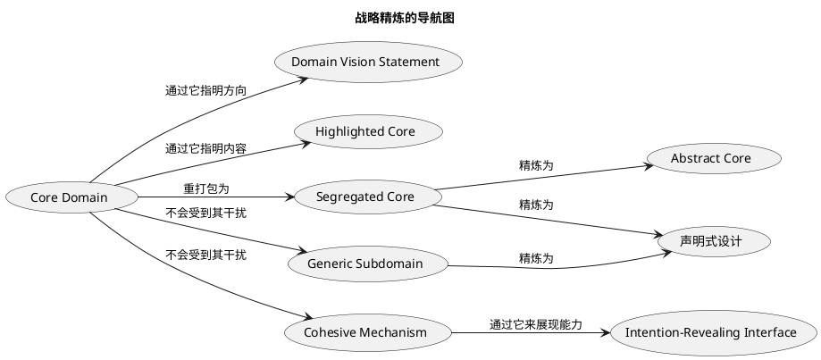

**战略精炼相关概念**
1. Core Domain(核心领域): 模型的独特部分，是用户的核心目标，它使得应用程序与众不同并且有价值。
2. Generic Subdomain(通用子领域): 识别出那些与项目意图无关的内聚子领域。把这些子领域的通用模型提取出来，并放到单独的MODULE中。还可以考虑为这些GENERIC SUBDOMAIN使用现成的解决方案或“公开发布的模型”（PUBLISHED MODEL）。
3. Domain Vision Statement(领域愿景说明): 写一份CORE DOMAIN的简短描述（大约一页纸）以及它将会创造的价值，也就是“价值主张”。那些不能将你的领域模型与其他领域模型区分开的方面就不要写了。展示出领域模型是如何实现和均衡各方利益的。这份描述要尽量精简。尽早把它写出来，随着新的理解随时修改它。DOMAIN VISION STATEMENT可以用作一个指南，它帮助开发团队在精炼模型和代码的过程中保持统一的方向。团队中的非技术成员、管理层甚至是客户也都可以共享领域愿景说明（当然，包含专有信息的情况除外）。
4. Highlighted Core(突出核心): 标明Core Domain,有哪些(比如不同的颜色或原型之类的标记) (可以编写一个非常简短的文档，用于描述CORE DOMAIN以及CORE元素之间的主要交互过程。)
5. Cohesive Mechanism(内聚机制): 把概念上的COHESIVE MECHANISM（内聚机制）分离到一个单独的轻量级框架中。要特别注意公式或那些有完备文档的算法。用一个INTENTION-REVEALING INTERFACE来暴露这个框架的功能。现在，领域中的其他元素就可以只专注于如何表达问题（做什么）了，而把解决方案的复杂细节（如何做）转移给了框架,COHESIVE MECHANISM并不表示领域，它的目的是解决描述性模型所提出来的一些复杂的计算问题。
6. Segregated Core(分离的核心): 把核心概念从支持性元素（包括定义得不清楚的那些元素）中分离出来，并增强CORE的内聚性，同时减少它与其他代码的耦合。把所有通用元素或支持性元素提取到其他对象中，并把这些对象放到其他的包中——即使这会把一些紧密耦合的元素分开。
7. Abstract Core(抽象内核): 把模型中最基本的概念识别出来，并分离到不同的类、抽象类或接口中。设计这个抽象模型，使之能够表达出重要组件之间的大部分交互。把这个完整的抽象模型放到它自己的MODULE中，而专用的、详细的实现类则留在由子领域定义的MODULE中。

## 第16章 大型结构

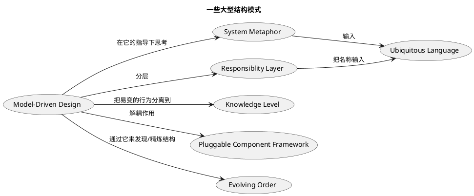


**大型结构模式**
1. Evolving Order(持续发展): 让这种概念上的大型结构随着应用程序一起演变，甚至可以变成一种完全不同的结构风格。不要依此过分限制详细的设计和模型决策，这些决策和模型决策必须在掌握了详细知识之后才能确定。
2. System Metaphor(系统隐喻): 当系统的一个具体类比正好符合团队成员对系统的想象，并且能够引导他们向着一个有用的方向进行思考时，就应该把这个类比用作一种大型结构。围绕这个隐喻来组织设计，并把它吸收到UBIQUITOUS LANGUAGE中。SYSTEM METAPHOR应该既能促进系统的交流，又能指导系统的开发。它可以增加系统不同部分之间的一致性，甚至可以跨越不同的BOUNDED CONTEXT。但所有隐喻都不是完全精确的，因此应不断检查隐喻是否过度或不恰当，当发现它起到妨碍作用时，要随时准备放弃它。
3. Responsiblity Layer(职责层): 。为了保持大模型的一致，有必要在职责分配上实施一定的结构化控制。
4. Knowledge Level(知识级别): 创建一组不同的对象，用它们来描述和约束基本模型的结构和行为。把这些对象分为两个“级别”，一个是非常具体的级别，另一个级别则提供了一些可供用户或超级用户定制的规则和知识。
5. Pluggable Component Framework(可插入式组件框架): 从接口和交互中提炼出一个ABSTRACT CORE，并创建一个框架，这个框架要允许这些接口的各种不同实现被自由替换。同样，无论是什么应用程序，只要它严格地通过ABSTRACT CORE的接口进行操作，那么就可以允许它使用这些组件。

### Responsiblity Layer

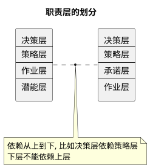

**有哪些职责层**
1. 潜能层。我们能够做什么？潜能层不关心我们打算做什么，而关心能够做什么。企业的资源（包括人力资源）以及这些资源的组织方式是潜能层的核心。
2. 作业层。我们正在做什么？我们利用这些潜能做了什么事情？像潜能层一样，这个层也应该反映出现实状况，而不是我们设想的状况。我们希望在这个层中看到自己的工作和活动：我们正在销售什么，而不是能够销售什么。通常来说，作业层对象可以引用潜能层对象，它甚至可以由潜能层对象组成，但潜能层对象不应该引用作业层对象。
3. 决策支持层。应该采取什么行动或制定什么策略？这个层是用来作出分析和制定决策的。它根据来自较低层（如潜能层或作业层）的信息进行分析。决策支持软件可以利用历史信息来主动寻找适用于当前和未来作业的机会。
4. 策略层。规则和目标是什么？规则和目标主要是被动的，但它们约束着其他层的行为。这些交互的设计是一个微妙的问题。有时策略会作为一个参数传给较低层的方法。有时会使用STRATEGY模式。策略层与决策支持层能够进行很好的协作，决策支持层提供了用于搜索策略层所设定的目标的方式，这些目标又受到策略层所设定的规则的约束。
5. 承诺层。我们承诺了什么？这个层具有策略层的性质，因为它表述了一些指导未来运营的目标；但它也有作业层的性质，因为承诺是作为后续业务活动的一部分而出现和变化的。潜能层和承诺层并不是互相排斥的。在有的领域中（如一家提供很多定制运输服务的运输公司），这两个层都很重要，因此可以同时使用它们


## 第17章 领域驱动设计的综合运用

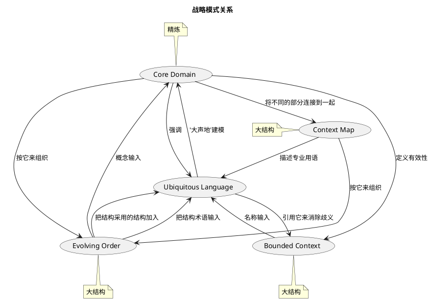

# 术语

AGGREGATE（聚合）——聚合就是一组相关对象的集合，我们把聚合作为数据修改的单元。外部对象只能引用聚合中的一个成员，我们把它称为根。在聚合的边界之内应用一组一致的规则。
1. 分析模式（analysis pattern）——分析模式是用来表示业务建模中的常见构造的概念集合。它可能只与一个领域有关，也可能跨多个领域[Fowler 1997,p.8]。
2. ASSERTION（断言）——断言是对程序在某个时刻的正确状态的声明，它与如何达到这个状态无关。通常，断言指定了一个操作的结果或者一个设计元素的固定规则。
3. BOUNDED CONTEXT（限界上下文）——特定模型的限界应用。限界上下文使团队所有成员能够明确地知道什么必须保持一致，什么必须独立开发。
4. 客户（client）——一个程序元素，它调用正在设计的元素，使用其功能。
5. 内聚（cohesion）——逻辑上的协定和依赖。
6. 命令，也称为修改器命令（command/modifier）——使系统发生改变的操作（例如，设臵变量）。它是一种有意产生副作用的操作。
7. CONCEPTUAL CONTOUR（概念轮廓）——领域本身的基本一致性，如果它能够在模型中反映出来的话，则有助于使设计更自然地适应变化。
8. 上下文（context）——一个单词或句子出现的环境，它决定了其含义。参见 BOUNDED CONTEXT。
9. CONTEXT MAP（上下文图）——项目所涉及的限界上下文以及它们与模型之间的关系的一种表示(分别在两个限界上下文的模型的关系)。
10. CORE DOMAIN（核心领域）——模型的独特部分，是用户的核心目标，它使得应用程序与众不同并且有价值。
11. 声明式设计（declarative design）——一种编程形式，由精确的属性描述对软件进行实际的控制。它是一种可执行的规格。
12. 深层模型（deep model）——领域专家们最关心的问题以及与这些问题最相关的知识的清晰表示。深层模型不停留在领域的表层和粗浅的理解上。
13. 设计模式（design pattern）——设计模式是对一些互相交互的对象和类的描述，我们通过定制这些对象和类来解决特定上下文中的一般设计问题[Gamma et al.1995,p.3]。
14. 精炼（distillation）——精炼是把一堆混杂在一起的组件分开的过程，从中提取出最重要的内容，使得它更有价值，也更有用。在软件设计中，精炼就是对模型中的关键方面进行抽象，或者是对大系统进行划分，从而把核心领域提取出来。
15. 领域（domain）——知识、影响或活动的范围。
16. 领域专家（domain expert）——软件项目的成员之一，精通的是软件的应用领域而不是软件开发。并非软件的任何使用者都是领域专家，领域专家需要具备深厚的专业知识。
17. 领域层（domain layer）——在分层架构中负责领域逻辑的那部分设计和实现。领域层是在软件中用来表示领域模型的地方。
18. ENTITY（实体）——一种对象，它不是由属性来定义的，而是通过一连串的连续事件和标识定义的。
19. FACTORY（工厂）——一种封装机制，把复杂的创建逻辑封装起来，并为客户抽象出所创建的对象的类型。
20. 函数（function）——一种只计算和返回结果而没有副作用的操作。
21. 不可变的（immutable）——在创建后永远不发生状态改变的一种特性。
22. 隐式概念（implicit concept）——一种为了理解模型和设计的意义而必不可少的概念，但它从未被提及。
23. INTENTION-REVEALING INTERFACE（释意接口）——类、方法和其他元素的名称既表达了初始开发人员创建它们的目的，也反映出了它们将会为客户开发人员带来的价值。
24. 固定规则（invariant）——一种为某些设计元素做出的断言，除了一些特殊的临时情况（例如，方法执行的中间，或者尚未提交的数据库事务的中间）以外，它必须一直保持为真。
25. 迭代（iteration）——程序反复进行小幅改进的过程。也表示这个过程中的一个步骤。
26. 大型结构（large-scale structure）——一组高层的概念和/或规则，它为整个系统建立了一种设计模式。它使人们能够从大的角度来讨论和理解系统。
27. LAYERED ARCHITECTURE（分层架构）——一种用于分离软件系统关注点的技术，它把领域层与其他层分开。
28. 生命周期（life cycle）——一个对象从创建到删除中间所经历的一个状态序列，通常具有一些约束，以确保从一种状态变为另一种状态时的完整性。它可能包括ENTITY在不同的系统和BOUNDED CONTEXT之间的迁移。
29. 模型（model）——一个抽象的系统，描述了领域的所选方面，可用于解决与该领域有关的问题。
30. MODEL-DRIVEN DESIGN（模型驱动的设计）——软件元素的某个子集严格对应于模型的元素。也代表一种合作开发模型和实现以便互相保持一致的过程。
31. 建模范式（modeling paradigm）——一种从领域中提取概念的特殊方式，与工具结合起来使用，为这些概念创建软件类比。(例如，面向对象编程和逻辑编程。)
32. REPOSITORY（存储库）——一种把存储、检索和搜索行为封装起来的机制，它类似于一个对象集合。
33. 职责（responsibility）——执行任务或掌握信息的责任[Wirfs-Brock et al.2003,p.3]。
34. SERVICE（服务）——一种作为接口提供的操作，它在模型中是独立的，没有封装的状态。
35. 副作用（side effect）——由一个操作产生的任何可观测到的状态改变，不管这个操作是有意的还是无意的（即使是一个有意的更新操作）。
36. SIDE-EFFECT-FREE FUNCTION（无副作用的函数）——参见[FUNCTION]。
37. STANDALONE CLASS（孤立的类）——无需引用任何其他对象（系统的基本类型和基础库除外）就能够理解和测试的类。
38. 无状态（stateless）——设计元素的一种属性，客户在使用任何无状态的操作时，都不需要关心它的历史。无状态的元素可以使用甚至修改全局信息（即它可以产生副作用），但它不保存影响其行为的私有状态。
39. 战略设计（strategic design）——一种针对系统整体的建模和设计决策。这样的决策影响整个项目，而且必须由团队来制定。
40. 柔性设计（supple design）——柔性设计使客户开发人员能够掌握并运用深层模型所蕴含的潜力来开发出清晰、灵活且健壮的实现，并得到预期结果。同样重要的是，利用这个深层模型，开发人员可以轻松地实现并调整设计，从而很容易地把他们的新知识加入到设计中。
41. UBIQUITOUS LANGUAGE（通用语言）——围绕领域模型建立的一种语言，团队所有成员都使用这种语言把团队的所有活动与软件联系起来。
42. 统一（unification）——模型的内部一致性，使得每个术语都没有歧义且没有规则冲突。
43. VALUE OBJECT（值对象）——一种描述了某种特征或属性但没有概念标识的对象。
44. WHOLE VALUE（完整值）——对单一、完整的概念进行建模的对象
