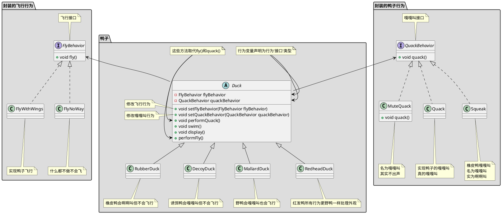
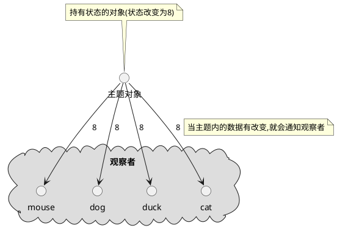
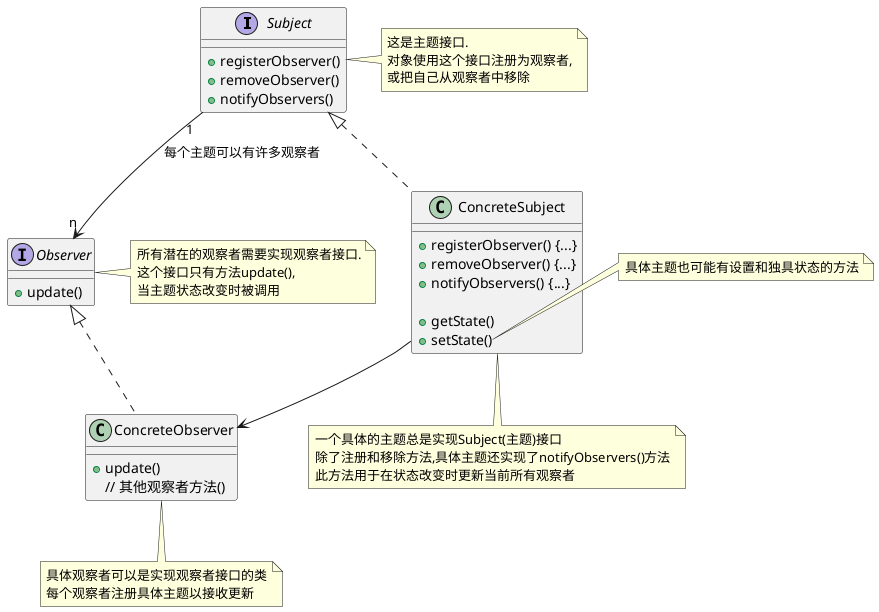
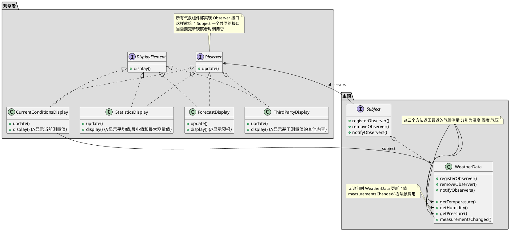
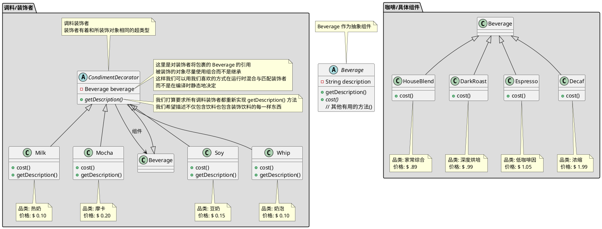
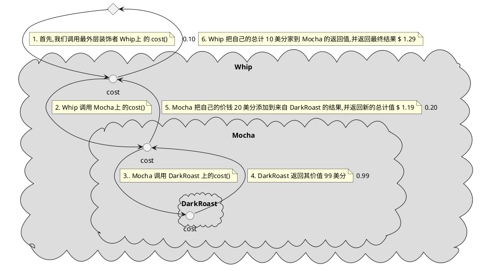
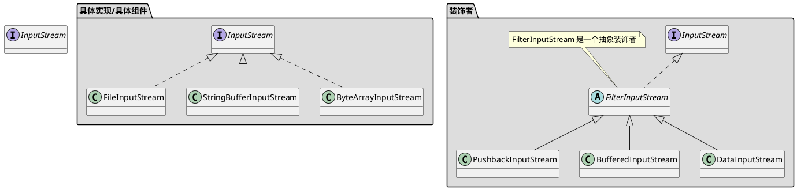

# 设计模式

## 资料
1. 官方代码: https://wickedlysmart.com/head-first-design-patterns/
2. github代码仓库: https://github.com/bethrobson/Head-First-Design-Patterns


## OO(面向对象)基础知识

### OO基础

- 抽象
- 封装
- 多态
- 继承

### OO原则/设计原则

- 封装变化: 识别应用中变化的方面,把它们和不变的方面分开
- 针对接口编程,而不是针对实现编程
    > 针对接口编程真正的意思是针对超类型编程.  
    > 接口一词在这里有多个含义.  接口是一个概念也是java的一个构造.  针对接口编程不必真的使用java的接口.  
    > 要点是通过针对超类型编程来利用多态,这样实际的运行时对象不会被锁定到代码  
- 优先使用组合而不是继承
    > 如果我们依靠继承,那么我们的行为只能在编译时静态地决定.  
    > 换句话说,我们只得到超类给我们的行为或者覆盖它们.  
    > 使用组合,我们可以用我们喜欢的方式在运行时混合与匹配
- 尽量做到交互对象之间的松耦合设计
- 开放-关闭原则: 类应该对扩展开放(继承,组合,委托等),但对修改关闭(无需修改已有的代码)
    > 我们的目标是允许类容易扩展以容纳新的行为,而不用修改已有的代码


## 策略模式
策略模式: 定义了一个算法族,分别封装起来,是的他们之间可以相互变换.策略让算法的变化独立使用它的客户

### 策略模式例子:鸭塘模拟游戏
下面例子中鸭子(客户)使用了算法(飞行行为,鸭子行为),不同实现用于替换

joe上班的公司做了一款相当成功的鸭塘模拟游戏SimUDuck.游戏中会出现各种鸭子,一边戏水,一边嘎嘎叫.


```java

// 叫声行为
public interface QuackBehavior {
    public void quack();
}
public class Quack implements QuackBehavior {
    public void quack() {
        System.out.println("Quack");
    }
}
public class MuteQuack implements QuackBehavior {
    public void quack() {
        System.out.println("<< Silence >>");
    }
}
public class Squack implements QuackBehavior {
    public void quack() {
        System.out.println("Squack");
    }
}

// 飞行行为
public interface FlyBehavior {
    public void fly();
}
public class FlyWithWings implements FlyBehavior {
    public void fly() {
        System.out.println("fly");
    }
}
public class FlyNoWay implements FlyBehavior {
    public void fly() {
        System.out.println("not fly");
    }
}


// 鸭子抽象类
public abstract class Duck {
    protected QuackBehavior quackBehavior;
    protected FlyBehavior flyBehavior;
    
    public void setFlyBehavior(FlyBehavior flyBehavior) {
        this.flyBehavior = flyBehavior;
    }
    public void setQuackBehavior(QuackBehavior quackBehavior) {
        this.quackBehavior = quackBehavior;
    }

    // 为了执行嘎嘎叫,Duck只要让quackBehavior所引用的对象为嘎嘎叫即可.
    // 在这部分代码中我们不关心具体Duck是那种对象
    // 只要它知道这么quack()就可以了
    public void performQuack() {
        quackBehavior.quack();
    }

    public void performFly() {
        flyBehavior.fly();
    }

    // 识别应用中变化的方面,把它们和不变的方面分开
    public abstract void swim() {
        System.out.println("所有的鸭子都会漂浮，甚至是游泳");
    }
    public abstract void display();

}

// 野鸭会嘎嘎叫也会飞行
public class MallardDuck extends Duck {
    // 实例化Duck的quackBehavior flyBehavior
    public MallardDuck() {
        // MallardDuck 使用Quack类来处理嘎嘎叫,因此 performQuack() 被调用时,嘎嘎叫的责任被委托给Quack对象我们得到了真正的嘎嘎叫
        this.quackBehavior = new Quack();
        this.flyBehavior = new FlyWithWings();
    }

    public void display() {
        System.out.println("我是一个红色的野鸭");
    }
}


// 测试类
public class MiniDuckSimulator {
    public static void main(String[] args) {
        Duck mallard = new MallardDuck();
        mallard.performQuack(); // 输出 Quack
        mallard.performFly(); // 输出 fly

        // 改变为不会飞行
        mallard.setFlyBehavior(new FlyNoWay());
        mallard.performFly(); // 输出 not fly
    }
}

```

## 观察者模式

### 观察者模式定义

定义对象之间的一对多依赖,这样一来,当一个对象改变状态时,它的所有依赖都会收到他嗯直并自动更新

#### 主题/观察者



主题和和观察者定义了一对多关系.当主题有变化时,会通知众多观察者.观察者是主题的依赖者,当主题的状态变化,观察者被通知.

观察者模式有几种不同的实现方式,但大多数围绕着包括主题和观察者接口的类设计

#### 观察者模式类图



### 观察者模式要点

1. 观察者模式定义对象之间的一对多关系
2. 主题使用通用接口更新观察者
3. 任何具体类型的观察者都可以参与该模式,只要它们实现观察者接口
4. 观察者是松耦合的,处理知道它们实现观察者接口之外,主题对它们的其他事情不知情.
5. 使用该模式时,你可以从主题推或拉数据(拉被认为更 "正确")
6. Swing 大量使用观察者模式,许多 GUI 框架也是这样
7. 你也会在其他很多地方发现该模式,包括 RxJava , JavaBeans 和 RMI , 以及其他语言的框架, 像 Cocoa , Swift 和 JavaScript 事件
8. 观察者模式和出版/订阅模式相关.出版/订阅模式用于更复杂得多主题和/或多消息类型的情形.
9. 观察者模式是一个常用的模式,当我们学习模型-视图-控制器(MVC)时,还会看到它

### 观察者模式探讨

1. 主题一有状态的变化就通知所有的观察者,但某个状态的变化只是部分观察者关心
2. 主题为啥不给特定的观察者状态变化而是把所有状态都给出去
3. 观察者为啥不主动拉取主题状态
4. 观察者不要依赖特的通知次序

### 观察者例子:气象观测站
有一个气象观测站需要追踪当前天气并且有个对象WeatherData追踪当前天气状况,WeatherData对象如下


```java

public interface Subject {
    // 这两个方法都用一个Observer作为参数,即要注册或被移除的Observer
    public void registerObserver(Observer o);
    public void removeObserver(Observer o);
    // 当Subject的状态改变时,这个方法会被调用,以通知所有的观察者
    public void notifyObservers();
}

public interface Observer {
    // 这些都是当气象测量数据变化时观察者从Subject获取的状态值
    public void update(float temp, float humidity, float pressure);
}

// DisplayElement 接口只包含一个方法 display(), 当显示元素需要显示时,调用此方法
public interface DisplayElement {
    public void display();     
}


import java.util.*;
// WeatherData 实现 Subject 接口
public class WeatherData implements Subject {
    // 我们添加一个 List 来持有 Observer
    private List<Observer> observers;
    private float temperature;
    private float humidity;
    private float pressure;

    public WeatherData() {
        observers = new ArrayList<Observer>();
    }

    public void registerObserver(Observer o) {
        observers.add(o);
    }

    public void removeObserver(Observer o) {
        observers.remove(o);
    }

    public void notifyObservers() {
        for (Observer observer : observers) {
            observer.update(temperature, humidity, pressure);
        }
    }
   public void measurementsChanged() {
        notifyObservers();
    }

   // 模拟气象站测量到气象数据变化时候嗲用
    public void setMeasurements(float temperature, float humidity, float pressure) {
        this.temperature = temperature;
        this.humidity = humidity;
        this.pressure = pressure;
        measurementsChanged();
    }

    public float getTemperature() {
        return temperature;
    }

    public float getHumidity() {
        return humidity;
    }

    public float getPressure() {
        return pressure;
    }

}

// 这个接口实现了 Observer 方法所以它可以从 WeatherData 对象中获取变化
// 它也实现了 DisplayElement 因为我们的 API 打算要求所有显示元素实现这个接口
public class CurrentConditionsDisplay implements Observer, DisplayElement { 
    private float temperature;
    private float humidity;
    private WeatherData weatherData;
      
    public CurrentConditionsDisplay(WeatherData weatherData) { 
        this.weatherData = weatherData;
        weatherData.registerObserver(this);
    } 
      
    public void update(float temperature, float humidity, float pressure) { 
        this.temperature = temperature;
        this.humidity = humidity;
        display();
    } 
      
    public void display() { 
        System.out.println("Current conditions: " + temperature 
            + "F degrees and " + humidity + "% humidity");
    } 
}

// 测试程序
public class WeatherStation {
      
    public static void main(String[] args) {
        WeatherData weatherData = new WeatherData();
    
        CurrentConditionsDisplay currentDisplay = 
            new CurrentConditionsDisplay(weatherData);
        // StatisticsDisplay statisticsDisplay = new StatisticsDisplay(weatherData); 
        // ForecastDisplay forecastDisplay = new ForecastDisplay(weatherData);

        weatherData.setMeasurements(80, 65, 30.4f);
        weatherData.setMeasurements(82, 70, 29.2f);
        weatherData.setMeasurements(78, 90, 29.2f);
        
        weatherData.removeObserver(forecastDisplay);
        weatherData.setMeasurements(62, 90, 28.1f);
    }
}

```

### Java 内置的观察者模式

#### ~~Java Observer Observable 类~~

在 java9 中已经废弃不讨论

#### JavaBean PropertyChangeEvent

```java
import java.beans.PropertyChangeEvent;
import java.beans.PropertyChangeListener;
import java.beans.PropertyChangeSupport;
import java.io.Serializable;

public class PropertyChangeEventMain {

    public static void main(String[] args) {
        JavaBean bean = new JavaBean();

        bean.setId(1L);
        bean.setName("java bean 1");
        bean.setName("java bean 2");

        // id未发生变化不发送事件
        bean.setId(1L);
    }

    static class JavaBean implements PropertyChangeListener, Serializable {

        private Long id;
        private String name;

        private PropertyChangeSupport pcs = new PropertyChangeSupport(this);

        public JavaBean() {
            // 监听所有变化
            pcs.addPropertyChangeListener(this);
            // 只是监听 id 的变化
            pcs.addPropertyChangeListener("id", this);
            // 只是监听 name 的变化
            pcs.addPropertyChangeListener("name", this);
        }

        @Override
        public void propertyChange(PropertyChangeEvent evt) {
            System.out.println("property name is : " + evt.getPropertyName());
            System.out.println("old value is : " + evt.getOldValue());
            System.out.println("new value is : " + evt.getNewValue());
            System.out.println("======================");
        }
        public Long getId() {

        }

        public void setId(Long id) {
            Long oldId = this.id;
            this.id = id;

            // 发送 id 已经变更事件
            pcs.firePropertyChange("id", oldId, id);
        }

        public String getName() {
            return this.name;
        }

        public void setName(String name) {
            String oldName = this.name;
            this.name = name;

            // 发送 name 已经变更事件
            pcs.firePropertyChange("name", oldName, name);
        }
    }
}

```

## 装饰者模式

### 装饰者模式定义

***装饰者模式*** 动态地将额外责任附加到对象上.对于扩展功能,装饰者提供子类化之外的弹性替代方案

### 装饰者模式要点

1. 继承是扩展形式之一,但未必是达到弹性设计的最佳方式
2. 在我们的设计中,允许行为可以被扩展,而无需修改已有代码
3. 组合和委托经常可以用来运行时添加新行为
4. 装饰者模式提供了子类化扩展行为的替代品
5. 装饰者模式涉及一群装饰者类,这些类用来包装具体组件
6. 装饰者类反映了它们所装饰组件类型(事实上,它们和所装饰的组件类型相同,都经过了继承或接口实现)
7. 装饰者通过对组件的方法调用之前(或/和之后,甚至在那一刻)添加功能改变其组件的行为
8. 你可以用任意数目装饰者来包裹一个组件
9. 装饰者一般对组件的客户是透明的,除非客户依赖于组件的具体类型
10. 装饰者会导致设计中出现许多小对象,过度使用会让代码变得复杂

### 装饰者模式探讨

- 装饰者有着和所装饰对象相同的超类型
- 你可以用一个或多个装饰者包裹一个对象
- 鉴于装饰者有着和所装饰对象相同的超类型,在需要原始对象的场合,我们可以传递一个被装饰的对象
- ***装饰者在委托给所装饰对象之前或之后添加自己的行为,来在做剩下的工作***
- 对象可以在任何时候被装饰,因此我们可以在运行时用任意数量的装饰者动态地装饰对象,只要我们乐意
- 被装饰的对象尽量使用组合而不是继承,这样我们可以用我们喜欢的方式在运行时混合与匹配装饰者,而不是在编译时静态地决定
- 装饰者模式容易造成大量的小类(参考 java.io 类)
- 装饰者模式有类型问题:如果代码中依赖特定类型,如果引入装饰者就会出问题
    > 比如在starbuzz咖啡中如果 HouseBlend 作了类似打折的事情,一旦我用装饰者包裹 HouseBlend , 代码就不工作了  
    > 只是知道最外层的装饰者,比如对于starbuzz咖啡中如果一个带 Mocha,Soy,Whip的DarkRoast,编码时荣誉引用到Soy而不是Whip,这意味者订单中不包含Whip  
    > 无法户欧链条上的其他装饰,比如对于starbuzz咖啡中如果一个带 Mocha,Soy,Whip的DarkRoast,只是知道最外层
- 装饰者模式会增加实例化组件所需代码的复杂度,一旦用了装饰者,你不只要实例化组件,还要把它包裹进装饰者中
- 组件: 查看 [starbuzz咖啡类图](#starbuzz咖啡类图) 的Beverage注释和package咖啡/具体组件

### 与代理模式区别

TODO 代补充

### 装饰者模式例子: starbuzz咖啡

#### starbuzz咖啡类图


#### 深度烘培摩卡奶泡 代码

```java

// 饮料
public abstract class Beverage {
    String description = "未知饮料";
  
    public String getDescription() {
        return description;
    }   
 
    public abstract double cost();
}

// 家常综合咖啡
public class HouseBlend extends Beverage {
    public HouseBlend() {
        description = "家常综合咖啡";
    }

    public double cost() {
        return .89;
    }
}

// 深度烘培咖啡
public class DarkRoast extends Beverage {
    public DarkRoast() {
        description = "深度烘培咖啡";
    }

    public double cost() {
        return .99;
    }
}

// 低咖啡因咖啡
public class Espresso extends Beverage {

    public Espresso() {
        description = "低咖啡因咖啡";
    }

    public double cost() {
        return 1.99;
    }
}

// 浓缩咖啡
public class Decaf extends Beverage {
    public Decaf() {
        description = "浓缩咖啡";
    }

    public double cost() {
        return 1.05;
    }
}

// 调料装饰者
public abstract class CondimentDecorator extends Beverage {
    Beverage beverage;

    // 我们打算要求所有调料装饰者都重新实现 getDescription() 方法
    // 我们希望描述不仅包含饮料也包含装饰饮料的每一样东西
    public abstract String getDescription();
}

// 热奶
public class Milk extends CondimentDecorator {
    public Milk(Beverage beverage) {
        this.beverage = beverage;
    }

    public String getDescription() {
        return beverage.getDescription() + ", 热奶";
    }

    public double cost() {
        return .10 + beverage.cost();
    }
}

// 摩卡
public class Mocha extends CondimentDecorator {
    public Mocha(Beverage beverage) {
        this.beverage = beverage;
    }

    public String getDescription() {
        return beverage.getDescription() + ", 摩卡";
    }

    public double cost() {
        return .20 + beverage.cost();
    }
}

// 豆奶
public class Soy extends CondimentDecorator {
    public Soy(Beverage beverage) {
        this.beverage = beverage;
    }

    public String getDescription() {
        return beverage.getDescription() + ", 豆奶";
    }

    public double cost() {
        return .15 + beverage.cost();
    }
}

// 奶泡
public class Whip extends CondimentDecorator {
    public Whip(Beverage beverage) {
        this.beverage = beverage;
    }

    public String getDescription() {
        return beverage.getDescription() + ", 奶泡";
    }

    public double cost() {
        return .10 + beverage.cost();
    }
}

// 下单测试代码
public class StarbuzzCoffee {

    public static void main(String args[]) {

        // 要一杯浓缩咖啡,不加调料,打印出他的描述和价格
        Beverage beverage = new Espresso();
        System.out.println(beverage.getDescription()
                + " $" + beverage.cost());

        // 做一个 深度烘培咖啡
        Beverage beverage2 = new DarkRoast();
        // 用一个摩卡包裹它
        beverage2 = new Mocha(beverage2);
        // 用第二个摩卡包裹它
        beverage2 = new Mocha(beverage2);
        // 用一个奶泡包裹它
        beverage2 = new Whip(beverage2);
        System.out.println(beverage2.getDescription()
                + " $" + beverage2.cost());

        // 给我们一份家常豆奶奶泡咖啡
        Beverage beverage3 = new HouseBlend();
        beverage3 = new Soy(beverage3);
        beverage3 = new Mocha(beverage3);
        beverage3 = new Whip(beverage3);
        System.out.println(beverage3.getDescription()
                + " $" + beverage3.cost());

        // 最后给我们一份 深度烘培摩卡奶泡卡咖啡
        Beverage beverage4 = new DarkRoast();
        beverage4 = new Mocha(beverage4);
        beverage4 = new Whip(beverage4);
        System.out.println(beverage4.getDescription()
                + " $" + beverage4.cost());


    }
}

```

#### 深度烘培摩卡奶泡咖啡 调用流程



### 装饰者模式在java的应用 java.io

以 InputStream 为例


```java
import java.io.*;              

// 把输入流中所有的大写字符转成小写
// 比如读入 "I know the Decorator Pattern therefore I RULE" -> "i know the decorator pattern therefore i rule" 
public class LowerCaseInputStream extends FilterInputStream {
  
    public LowerCaseInputStream(InputStream in) {
        super(in);             
    }
    
    public int read() throws IOException { 
        int c = in.read();
        return (c == -1 ? c : Character.toLowerCase((char)c));
    } 
        
    public int read(byte[] b, int offset, int len) throws IOException {
        int result = in.read(b, offset, len);
        for (int i = offset; i < offset+result; i++) {
            b[i] = (byte)Character.toLowerCase((char)b[i]);
        }
        return result;
    }
}

import java.io.*;

// 测试类
public class InputTest {
    public static void main(String[] args) throws IOException {
        int c;
        InputStream in = null;
        try {
            in =
                new LowerCaseInputStream(
                    new BufferedInputStream(
                        new FileInputStream("test.txt")));

            while((c = in.read()) >= 0) {
                System.out.print((char)c);
            }
        } catch (IOException e) {
            e.printStackTrace();
        } finally {
            if (in != null) { in.close(); }
        }
        System.out.println();
        try (InputStream in2 =
                new LowerCaseInputStream(
                    new BufferedInputStream(
                        new FileInputStream("test.txt"))))
        {
            while((c = in2.read()) >= 0) {
                System.out.print((char)c);
            }
        } catch (IOException e) {
            e.printStackTrace();
        }
    }
}

```
