# 设计模式

## 资料
1. 官方代码: https://wickedlysmart.com/head-first-design-patterns/
2. github代码仓库: https://github.com/bethrobson/Head-First-Design-Patterns


## OO(面向对象)基础知识

### OO基础

- 抽象
- 封装
- 多态
- 继承

### OO原则/设计原则

- 封装变化: 识别应用中变化的方面,把它们和不变的方面分开

- 针对接口编程,而不是针对实现编程
    > 针对接口编程真正的意思是针对超类型编程.  
    > 接口一词在这里有多个含义.  接口是一个概念也是java的一个构造.  针对接口编程不必真的使用java的接口.  
    > 要点是通过针对超类型编程来利用多态,这样实际的运行时对象不会被锁定到代码  

- 优先使用组合而不是继承(组合优于继承)
    > 如果我们依靠继承,那么我们的行为只能在编译时静态地决定.  
    > 换句话说,我们只得到超类给我们的行为或者覆盖它们.  
    > 使用组合,我们可以用我们喜欢的方式在运行时混合与匹配

- 尽量做到交互对象之间的松耦合设计

- 开放-关闭原则: 类应该对扩展开放(继承,组合,委托等),但对修改关闭(无需修改已有的代码)
    > 我们的目标是允许类容易扩展以容纳新的行为,而不用修改已有的代码

- 依赖倒置原则: 依赖抽象, 不依赖具体类, 对于实例化方面可以使用 [工厂方法](#工厂方法)
    > 这个原则很像 '针对接口编程,而不是针对实现编程' .  
    > 但该原则更强调抽象, 该原则说明, 高层组件不应该依赖于低层组件  
    > 而它们都依赖于抽象, 比如比萨店 PizzaStore 就是高层组件, 比萨 Pizza 实现就是低层组件  
    > 具体查看[工厂方法的依赖倒置](#工厂方法的依赖倒置)  
    > 依赖倒置原则指南  
    > 1. 变量不应该持有具体类的引用 : 如果使用new, 就会持有具体类, 通过使用工厂方法来绕开
    > 2. 类不应该派生自具体类 : 如果派生自具体类, 就会依赖具体类. 派生自一个抽象类/接口
    > 3. 方法不应该覆盖其任何基类的已实现的方法 : 如果覆盖已实现的方法, 那么基类就不是一个真正适合被继承的抽象, 基类中这些已实现的方法, 应该由所有子类共享

- 最少知识原则: 只和你的密友谈话
    > 当在你设计一个系统时, 对于任何对象, 豆芽注意它所交互类的数量, 以及它和这些类如何交互  
    > 这个原则防止我们创建有大量的类在一起的设计, 免得系统一部分的变化会连锁影响到其他部分  
    > 最少知识原则要求只调用以下范围的方法  
    > 1. 对象自身  
    > 2. 作为参数传给方法的对象  
    > 3. 该方法创建或实例化的任何对象  
    > 4. 对象的任何组件(成员变量)  
    >  
    > 比如 a.getB().getC() 该方式就违反了原则

- 好莱坞原则: 不要打电话给(调用)我们, 我们会打电话给(调用)你
    > 好莱坞原则给我们一种防止 "依赖腐烂" 的方法. "依赖腐烂"的例子如高层组件依赖于低层组件, 低层组件又依赖于高层组件, 而高层组件又依赖于横向组件. 当腐烂蔓延时, 没有人能轻易理解系统是这么设计的  
    > 有了好莱坞原则, 我们允许低层组件把自己挂钩进系统, 但由高层组件决定和三需要它们, 以及怎样需要它们. 换句话说高层组件对低层组件的态度是 "不要打电话给(调用)我们, 我们会打电话给(调用)你"  
    > 低层组件经常会最终调用在其继承层次之上定义的方法, 但我们要避免创建低层组件和高层组件之间显式的环状依赖  
    > 依赖倒置原则(避免使用具体类,尽可能利用抽象)和好莱坞原则(建造框架或组件技巧,以便低层组件可以挂钩进计算中,而不产生高层组件和低层组件的循环依赖)都有解耦的目的,但如何避免设计中的依赖上, 依赖倒置原则的陈诉要强烈和通用得多  
    > 好莱坞原则例子: [好莱坞原则于模板方法](#好莱坞原则于模板方法)  
    > 以下设计模式采用了好莱坞原则  
    > 1. 模板方法模式
    > 2. 工厂方法
    > 3. 观察者模式

- 单一责任原则: 一个类应该自由一个变化的原因
    > 类的每个责任都是一个潜在变化的区域. 超过一个责任,意味着超过一个变化的区域.  
    > 这个原则指导我们要让每个类保持单一责任  
    > `内聚`: 当一个模块或一个类围绕一组相关功能来设计时, 我们说它具有高内聚; 反之, 当它围绕一组相关不功能设计时, 我们说它具体有低内聚  


## 策略模式
策略模式: 定义了一个算法族,分别封装起来,是的他们之间可以相互变换.策略让算法的变化独立使用它的客户

### 策略模式类图

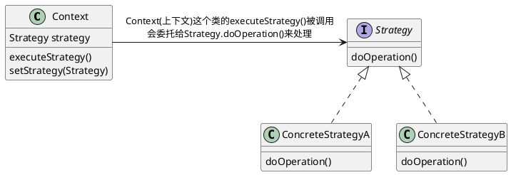

### 策略模式例子:鸭塘模拟游戏
下面例子中鸭子(客户)使用了算法(飞行行为,鸭子行为),不同实现用于替换

joe上班的公司做了一款相当成功的鸭塘模拟游戏SimUDuck.游戏中会出现各种鸭子,一边戏水,一边嘎嘎叫.
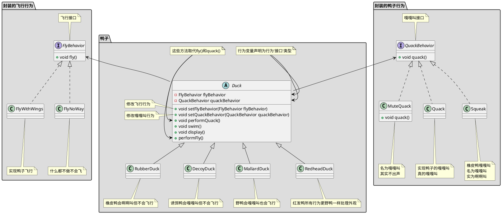

```java

// 叫声行为
public interface QuackBehavior {
    public void quack();
}

// 实现鸭子的嘎嘎叫真的嘎嘎叫
public class Quack implements QuackBehavior {
    public void quack() {
        System.out.println("Quack");
    }
}

// 橡皮鸭嘎嘎叫名为嘎嘎叫实为啊啊叫
public class MuteQuack implements QuackBehavior {
    public void quack() {
        System.out.println("<< Silence >>");
    }
}

// 名为嘎嘎叫其实不出声
public class Squack implements QuackBehavior {
    public void quack() {
        System.out.println("Squack");
    }
}

// 飞行行为
public interface FlyBehavior {
    public void fly();
}

// 实现鸭子飞行
public class FlyWithWings implements FlyBehavior {
    public void fly() {
        System.out.println("fly");
    }
}

// 什么都不做不会飞
public class FlyNoWay implements FlyBehavior {
    public void fly() {
        System.out.println("not fly");
    }
}


// 鸭子抽象类
public abstract class Duck {
    protected QuackBehavior quackBehavior;
    protected FlyBehavior flyBehavior;
    
    public void setFlyBehavior(FlyBehavior flyBehavior) {
        this.flyBehavior = flyBehavior;
    }
    public void setQuackBehavior(QuackBehavior quackBehavior) {
        this.quackBehavior = quackBehavior;
    }

    // 为了执行嘎嘎叫,Duck只要让quackBehavior所引用的对象为嘎嘎叫即可.
    // 在这部分代码中我们不关心具体Duck是那种对象
    // 只要它知道这么quack()就可以了
    public void performQuack() {
        quackBehavior.quack();
    }

    public void performFly() {
        flyBehavior.fly();
    }

    // 识别应用中变化的方面,把它们和不变的方面分开
    public abstract void swim() {
        System.out.println("所有的鸭子都会漂浮，甚至是游泳");
    }
    public abstract void display();

}

// 野鸭会嘎嘎叫也会飞行
public class MallardDuck extends Duck {
    // 实例化Duck的quackBehavior flyBehavior
    public MallardDuck() {
        // MallardDuck 使用Quack类来处理嘎嘎叫,因此 performQuack() 被调用时,嘎嘎叫的责任被委托给Quack对象我们得到了真正的嘎嘎叫
        this.quackBehavior = new Quack();
        this.flyBehavior = new FlyWithWings();
    }

    public void display() {
        System.out.println("我是一个红色的野鸭");
    }
}


// 测试类
public class MiniDuckSimulator {
    public static void main(String[] args) {
        Duck mallard = new MallardDuck();
        mallard.performQuack(); // 输出 Quack
        mallard.performFly(); // 输出 fly

        // 改变为不会飞行
        mallard.setFlyBehavior(new FlyNoWay());
        mallard.performFly(); // 输出 not fly
    }
}

```

## 观察者模式

### 观察者模式定义

定义对象之间的一对多依赖,这样一来,当一个对象改变状态时,它的所有依赖都会收到他嗯直并自动更新

#### 主题/观察者

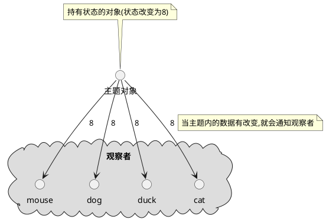

主题和和观察者定义了一对多关系.当主题有变化时,会通知众多观察者.观察者是主题的依赖者,当主题的状态变化,观察者被通知.

观察者模式有几种不同的实现方式,但大多数围绕着包括主题和观察者接口的类设计

#### 观察者模式类图

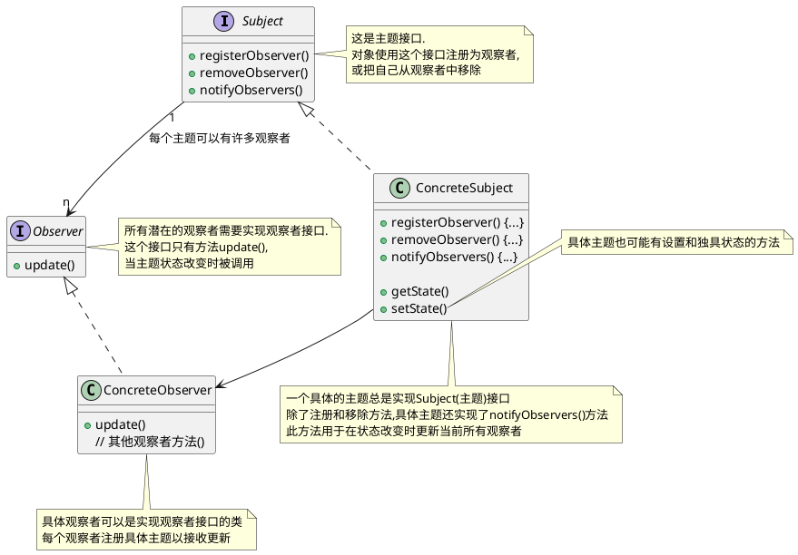

### 观察者模式要点

1. 观察者模式定义对象之间的一对多关系
2. 主题使用通用接口更新观察者
3. 任何具体类型的观察者都可以参与该模式,只要它们实现观察者接口
4. 观察者是松耦合的,处理知道它们实现观察者接口之外,主题对它们的其他事情不知情.
5. 使用该模式时,你可以从主题推或拉数据(拉被认为更 "正确")
6. Swing 大量使用观察者模式,许多 GUI 框架也是这样
7. 你也会在其他很多地方发现该模式,包括 RxJava , JavaBeans 和 RMI , 以及其他语言的框架, 像 Cocoa , Swift 和 JavaScript 事件
8. 观察者模式和出版/订阅模式相关.出版/订阅模式用于更复杂得多主题和/或多消息类型的情形.
9. 观察者模式是一个常用的模式,当我们学习模型-视图-控制器(MVC)时,还会看到它

### 观察者模式探讨

1. 主题一有状态的变化就通知所有的观察者,但某个状态的变化只是部分观察者关心
2. 主题为啥不给特定的观察者状态变化而是把所有状态都给出去
3. 观察者为啥不主动拉取主题状态
4. 观察者不要依赖特的通知次序

### 观察者例子:气象观测站
有一个气象观测站需要追踪当前天气并且有个对象WeatherData追踪当前天气状况,WeatherData对象如下
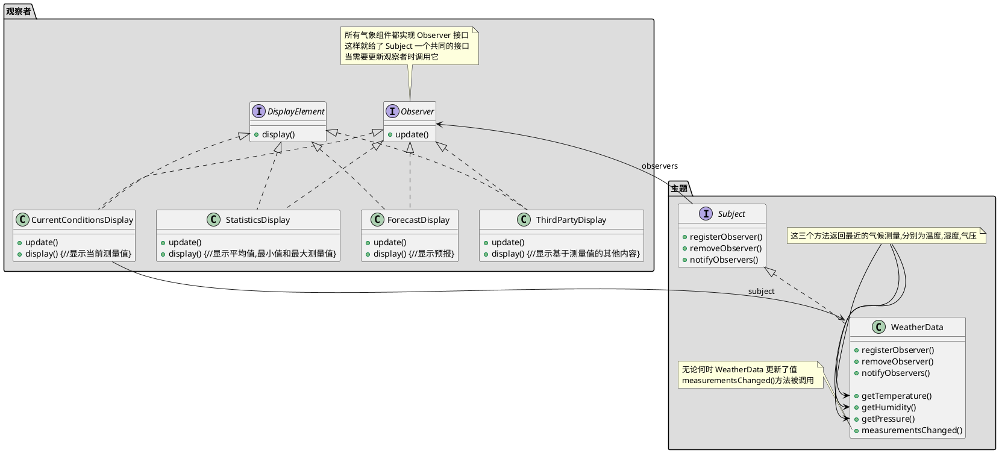

```java

public interface Subject {
    // 这两个方法都用一个Observer作为参数,即要注册或被移除的Observer
    public void registerObserver(Observer o);
    public void removeObserver(Observer o);
    // 当Subject的状态改变时,这个方法会被调用,以通知所有的观察者
    public void notifyObservers();
}

public interface Observer {
    // 这些都是当气象测量数据变化时观察者从Subject获取的状态值
    public void update(float temp, float humidity, float pressure);
}

// DisplayElement 接口只包含一个方法 display(), 当显示元素需要显示时,调用此方法
public interface DisplayElement {
    public void display();     
}


import java.util.*;
// WeatherData 实现 Subject 接口
public class WeatherData implements Subject {
    // 我们添加一个 List 来持有 Observer
    private List<Observer> observers;
    private float temperature;
    private float humidity;
    private float pressure;

    public WeatherData() {
        observers = new ArrayList<Observer>();
    }

    public void registerObserver(Observer o) {
        observers.add(o);
    }

    public void removeObserver(Observer o) {
        observers.remove(o);
    }

    public void notifyObservers() {
        for (Observer observer : observers) {
            observer.update(temperature, humidity, pressure);
        }
    }
   public void measurementsChanged() {
        notifyObservers();
    }

   // 模拟气象站测量到气象数据变化时候嗲用
    public void setMeasurements(float temperature, float humidity, float pressure) {
        this.temperature = temperature;
        this.humidity = humidity;
        this.pressure = pressure;
        measurementsChanged();
    }

    public float getTemperature() {
        return temperature;
    }

    public float getHumidity() {
        return humidity;
    }

    public float getPressure() {
        return pressure;
    }

}

// 这个接口实现了 Observer 方法所以它可以从 WeatherData 对象中获取变化
// 它也实现了 DisplayElement 因为我们的 API 打算要求所有显示元素实现这个接口
public class CurrentConditionsDisplay implements Observer, DisplayElement { 
    private float temperature;
    private float humidity;
    private WeatherData weatherData;
      
    public CurrentConditionsDisplay(WeatherData weatherData) { 
        this.weatherData = weatherData;
        weatherData.registerObserver(this);
    } 
      
    public void update(float temperature, float humidity, float pressure) { 
        this.temperature = temperature;
        this.humidity = humidity;
        display();
    } 
      
    public void display() { 
        System.out.println("Current conditions: " + temperature 
            + "F degrees and " + humidity + "% humidity");
    } 
}

// 测试程序
public class WeatherStation {
      
    public static void main(String[] args) {
        WeatherData weatherData = new WeatherData();
    
        CurrentConditionsDisplay currentDisplay = 
            new CurrentConditionsDisplay(weatherData);
        // StatisticsDisplay statisticsDisplay = new StatisticsDisplay(weatherData); 
        // ForecastDisplay forecastDisplay = new ForecastDisplay(weatherData);

        weatherData.setMeasurements(80, 65, 30.4f);
        weatherData.setMeasurements(82, 70, 29.2f);
        weatherData.setMeasurements(78, 90, 29.2f);
        
        weatherData.removeObserver(forecastDisplay);
        weatherData.setMeasurements(62, 90, 28.1f);
    }
}

```

### Java 内置的观察者模式

#### ~~Java Observer Observable 类~~

在 java9 中已经废弃不讨论

#### JavaBean PropertyChangeEvent

```java
import java.beans.PropertyChangeEvent;
import java.beans.PropertyChangeListener;
import java.beans.PropertyChangeSupport;
import java.io.Serializable;

public class PropertyChangeEventMain {

    public static void main(String[] args) {
        JavaBean bean = new JavaBean();

        bean.setId(1L);
        bean.setName("java bean 1");
        bean.setName("java bean 2");

        // id未发生变化不发送事件
        bean.setId(1L);
    }


    // 这个例子自身即是主题又是观察者
    static class JavaBean implements PropertyChangeListener, Serializable {

        private Long id;
        private String name;

        // 这个是一个主题
        private PropertyChangeSupport pcs = new PropertyChangeSupport(this);

        public JavaBean() {
            // 注册监听所有变化(所有变化观察者)
            pcs.addPropertyChangeListener(this);
            // 注册只是监听 id 的变化(id变化观察者)
            pcs.addPropertyChangeListener("id", this);
            // 注册只是监听 name 的变化(name变化观察者)
            pcs.addPropertyChangeListener("name", this);
        }

        /**
         * 观察者update(),即 Observer.update()
         *
         * @param evt 事件/消息
         */
        @Override
        public void propertyChange(PropertyChangeEvent evt) {
            System.out.println("property name is : " + evt.getPropertyName());
            System.out.println("old value is : " + evt.getOldValue());
            System.out.println("new value is : " + evt.getNewValue());
            System.out.println("======================");
        }
        public Long getId() {
            return this.id;
        }

        public void setId(Long id) {
            Long oldId = this.id;
            this.id = id;

            // 发送 id 已经变更事件, 类似于主题notifyObservers(),即Subject.notifyObservers()
            pcs.firePropertyChange("id", oldId, id);
        }

        public String getName() {
            return this.name;
        }

        public void setName(String name) {
            String oldName = this.name;
            this.name = name;

            // 发送 name 已经变更事件, 类似于主题notifyObservers(),即Subject.notifyObservers()
            pcs.firePropertyChange("name", oldName, name);
        }
    }
}

```

## 装饰者模式

### 装饰者模式定义

***装饰者模式*** 动态地将额外责任附加到对象上.对于扩展功能,装饰者提供子类化之外的弹性替代方案

### 装饰者模式要点

1. 继承是扩展形式之一,但未必是达到弹性设计的最佳方式
2. 在我们的设计中,允许行为可以被扩展,而无需修改已有代码
3. 组合和委托经常可以用来运行时添加新行为
4. 装饰者模式提供了子类化扩展行为的替代品
5. 装饰者模式涉及一群装饰者类,这些类用来包装具体组件
6. 装饰者类反映了它们所装饰组件类型(事实上,它们和所装饰的组件类型相同,都经过了继承或接口实现)
7. 装饰者通过对组件的方法调用之前(或/和之后,甚至在那一刻)添加功能改变其组件的行为
8. 你可以用任意数目装饰者来包裹一个组件
9. 装饰者一般对组件的客户是透明的,除非客户依赖于组件的具体类型
10. 装饰者会导致设计中出现许多小对象,过度使用会让代码变得复杂
11. 适配器包装一个对象以改变其接口, 装饰者包装一个对象以添加新的行为和责任, 而外观 "包装" 一群对象以简化其接口, 三者代码大体一致单意图不一样

### 装饰者模式探讨

- 装饰者有着和所装饰对象相同的超类型
- 你可以用一个或多个装饰者包裹一个对象
- 鉴于装饰者有着和所装饰对象相同的超类型,在需要原始对象的场合,我们可以传递一个被装饰的对象
- ***装饰者在委托给所装饰对象之前或之后添加自己的行为,来在做剩下的工作***
- 对象可以在任何时候被装饰,因此我们可以在运行时用任意数量的装饰者动态地装饰对象,只要我们乐意
- 被装饰的对象尽量使用组合而不是继承,这样我们可以用我们喜欢的方式在运行时混合与匹配装饰者,而不是在编译时静态地决定
- 装饰者模式容易造成大量的小类(参考 java.io 类)
- 装饰者模式有类型问题:如果代码中依赖特定类型,如果引入装饰者就会出问题
    > 比如在starbuzz咖啡中如果 HouseBlend 作了类似打折的事情,一旦我用装饰者包裹 HouseBlend , 代码就不工作了  
    > 只是知道最外层的装饰者,比如对于starbuzz咖啡中如果一个带 Mocha,Soy,Whip的DarkRoast,编码时荣誉引用到Soy而不是Whip,这意味者订单中不包含Whip  
    > 无法户欧链条上的其他装饰,比如对于starbuzz咖啡中如果一个带 Mocha,Soy,Whip的DarkRoast,只是知道最外层
- 装饰者模式会增加实例化组件所需代码的复杂度,一旦用了装饰者,你不只要实例化组件,还要把它包裹进装饰者中
- 组件: 查看 [starbuzz咖啡类图](#starbuzz咖啡类图) 的Beverage注释和package咖啡/具体组件

### 与代理模式区别

TODO 代补充

### 装饰者模式例子: starbuzz咖啡

starbuzz咖啡是以扩张速度最快闻名的咖啡连锁店. 如果你在街角看到它的店, 沿街望去, 还会看到另一家店  
因为扩张实在太快, 他们着急更新其下单系统, 以匹配他们的饮料供应需求

当他们第一次经如业务时, 类设计像这样, 除了咖啡本身, 你也可以要求各种调料, 如摩卡,奶泡...  
这样设计简直类爆炸
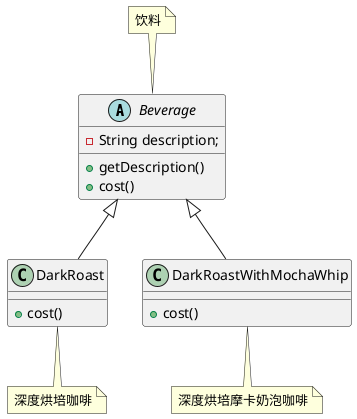

#### starbuzz咖啡类图

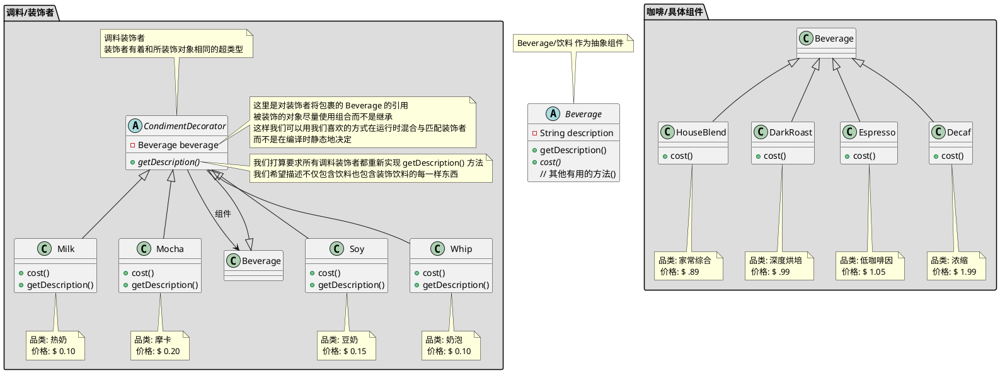
#### 深度烘培摩卡奶泡 代码

```java

// 饮料
public abstract class Beverage {
    String description = "未知饮料";
  
    public String getDescription() {
        return description;
    }   
 
    public abstract double cost();
}

// 家常综合咖啡
public class HouseBlend extends Beverage {
    public HouseBlend() {
        description = "家常综合咖啡";
    }

    public double cost() {
        return .89;
    }
}

// 深度烘培咖啡
public class DarkRoast extends Beverage {
    public DarkRoast() {
        description = "深度烘培咖啡";
    }

    public double cost() {
        return .99;
    }
}

// 低咖啡因咖啡
public class Espresso extends Beverage {

    public Espresso() {
        description = "低咖啡因咖啡";
    }

    public double cost() {
        return 1.99;
    }
}

// 浓缩咖啡
public class Decaf extends Beverage {
    public Decaf() {
        description = "浓缩咖啡";
    }

    public double cost() {
        return 1.05;
    }
}

// 调料装饰者
public abstract class CondimentDecorator extends Beverage {
    Beverage beverage;

    // 我们打算要求所有调料装饰者都重新实现 getDescription() 方法
    // 我们希望描述不仅包含饮料也包含装饰饮料的每一样东西
    public abstract String getDescription();
}

// 热奶
public class Milk extends CondimentDecorator {
    public Milk(Beverage beverage) {
        this.beverage = beverage;
    }

    public String getDescription() {
        return beverage.getDescription() + ", 热奶";
    }

    public double cost() {
        return .10 + beverage.cost();
    }
}

// 摩卡
public class Mocha extends CondimentDecorator {
    public Mocha(Beverage beverage) {
        this.beverage = beverage;
    }

    public String getDescription() {
        return beverage.getDescription() + ", 摩卡";
    }

    public double cost() {
        return .20 + beverage.cost();
    }
}

// 豆奶
public class Soy extends CondimentDecorator {
    public Soy(Beverage beverage) {
        this.beverage = beverage;
    }

    public String getDescription() {
        return beverage.getDescription() + ", 豆奶";
    }

    public double cost() {
        return .15 + beverage.cost();
    }
}

// 奶泡
public class Whip extends CondimentDecorator {
    public Whip(Beverage beverage) {
        this.beverage = beverage;
    }

    public String getDescription() {
        return beverage.getDescription() + ", 奶泡";
    }

    public double cost() {
        return .10 + beverage.cost();
    }
}

// 下单测试代码
public class StarbuzzCoffee {

    public static void main(String args[]) {

        // 要一杯浓缩咖啡,不加调料,打印出他的描述和价格
        Beverage beverage = new Espresso();
        System.out.println(beverage.getDescription()
                + " $" + beverage.cost());

        // 做一个 深度烘培咖啡
        Beverage beverage2 = new DarkRoast();
        // 用一个摩卡包裹它
        beverage2 = new Mocha(beverage2);
        // 用第二个摩卡包裹它
        beverage2 = new Mocha(beverage2);
        // 用一个奶泡包裹它
        beverage2 = new Whip(beverage2);
        System.out.println(beverage2.getDescription()
                + " $" + beverage2.cost());

        // 给我们一份家常豆奶奶泡咖啡
        Beverage beverage3 = new HouseBlend();
        beverage3 = new Soy(beverage3);
        beverage3 = new Mocha(beverage3);
        beverage3 = new Whip(beverage3);
        System.out.println(beverage3.getDescription()
                + " $" + beverage3.cost());

        // 最后给我们一份 深度烘培摩卡奶泡卡咖啡
        Beverage beverage4 = new DarkRoast();
        beverage4 = new Mocha(beverage4);
        beverage4 = new Whip(beverage4);
        System.out.println(beverage4.getDescription()
                + " $" + beverage4.cost());


    }
}

```

#### 深度烘培摩卡奶泡咖啡 调用流程

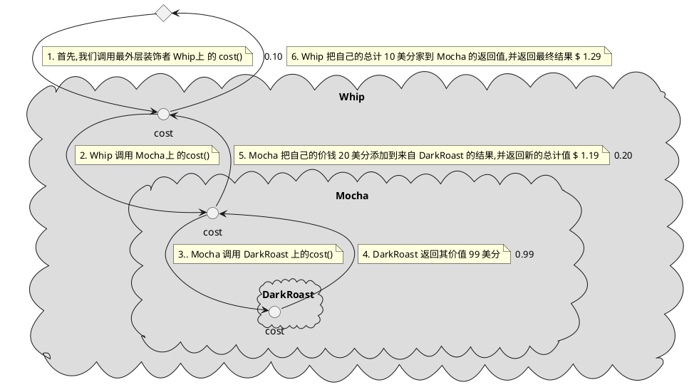

### 装饰者模式在java的应用 java.io

以 InputStream 为例
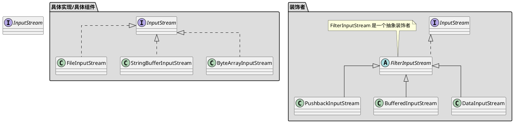

```java
import java.io.*;              

// 把输入流中所有的大写字符转成小写
// 比如读入 "I know the Decorator Pattern therefore I RULE" -> "i know the decorator pattern therefore i rule" 
public class LowerCaseInputStream extends FilterInputStream {
  
    public LowerCaseInputStream(InputStream in) {
        super(in);             
    }
    
    public int read() throws IOException { 
        int c = in.read();
        return (c == -1 ? c : Character.toLowerCase((char)c));
    } 
        
    public int read(byte[] b, int offset, int len) throws IOException {
        int result = in.read(b, offset, len);
        for (int i = offset; i < offset+result; i++) {
            b[i] = (byte)Character.toLowerCase((char)b[i]);
        }
        return result;
    }
}

import java.io.*;

// 测试类
public class InputTest {
    public static void main(String[] args) throws IOException {
        int c;
        InputStream in = null;
        try {
            in =
                new LowerCaseInputStream(
                    new BufferedInputStream(
                        new FileInputStream("test.txt")));

            while((c = in.read()) >= 0) {
                System.out.print((char)c);
            }
        } catch (IOException e) {
            e.printStackTrace();
        } finally {
            if (in != null) { in.close(); }
        }
        System.out.println();
        try (InputStream in2 =
                new LowerCaseInputStream(
                    new BufferedInputStream(
                        new FileInputStream("test.txt"))))
        {
            while((c = in2.read()) >= 0) {
                System.out.print((char)c);
            }
        } catch (IOException e) {
            e.printStackTrace();
        }
    }
}

```

## 工厂模式

### 背景

当你使用new操作符时, 你无疑是在实例化一个具体类,因此这肯定是一个实现而不是接口.  
在技术上,new操作符没有错,有问题的是"变化",以及它对使用new的影响.  
比如你的代码针对接口编写, 那么通过多态它可以和任何这个接口的实现类一起工作.  
但你的代码利用了大量的具体类时,一旦加入新的具体类, 就必须修改代码  
怎样把应用中所有实例化具体类的代码拿出来分离,或者封装起来,这样不会影响应用的其他部分  
> 工厂模式主要用来封装实例化行为, 这样客户在实例化对象时, 只依赖接口, 而不是具体类, 也可以避免代码中的重复

### 工厂模式讨论
1. 如果只有一个 ConcreteCreator (具体创建者) 工厂方法模式也可以将唱片的实现解耦,也不影响Creator(因为Creator没有和任何ConcreteCreator紧耦合)
2. 工厂方法模式的每个ConcreteCreator(具体创建者)都类似于简单工厂模式
3. 工厂方法的Creator类可以时具体的Creator这样就有一个缺省的实现

### 工厂方法要点
1. 所有工厂方法都封装对象的创建
2. 简单工厂不是一个真正的设计模式, 但依然可以作为一个简单的方法, 将客户从具体类解耦
3. 工厂方法靠继承: 对象创建被委托给子类, 子类实现工厂方法来创建对象
4. 抽象工厂靠对象组合: 对象创建在工厂接口暴露的方法中实现
5. 所欧工厂模式都通过减少应用对具体类的依赖, 促进了松耦合
6. 工厂方法的意图, 是允许一个类延迟实例化到其子类
7. 抽象工厂的意图, 是创建相关对象家族, 不必依赖于其具体类
8. 依赖倒置原则指导我们避免依赖具体类型, 尽量依赖抽象
9. 工厂是强有力的技巧, 让我们针对抽象编码, 而不是针对具体类

### 简单工厂

简单工厂不是一个真正的模式,更多是一种编程习惯

#### 简单工厂例子,比萨简单工厂

假设你有一家比萨店, 店里能制作多种比萨, 
有天你想要添加一些流行风味的比萨: 蛤蜊(Clam)比萨, 素食(Veggie)比萨 ,
并且希腊(Greek)比萨销售不佳,因此你决定将它从菜单中去除
所以初始代码如下
```java

public class PizzaStore {
    public Pizza orderPizze(String type) {
        Pizze pizza;
    
        if (type.equals("cheese")) {
            pizza = new CheesePizza();
        } 
        /* 希腊(Greek)比萨销售不佳,因此你决定将它从菜单中去除
        else if (type.equals("greek")) {
            pizza = new GreekPizza();
        }
        **/ 
        else if (type.equals("pepperoni")) {
            pizza = PepperoniPizza();
        } 
        //  有天你想要添加一些流行风味的比萨: 蛤蜊(Clam)比萨, 素食(Veggie)比萨
        else if (type.equals("clam")) {
            pizza = ClamPizza();
        } else if (type.equals("veggie")) {
            pizza = VeggiePizza();
        }
    
        // 准备比萨
        pizza.perpare();
        // 烘焙比萨
        pizza.bake();
        // 切割比萨
        pizza.cut();
        // 打包比萨
        pizza.box();
        
        return pizza;
    }
}
```

显然关于哪个具体类被实例化的代码才是真正搞乱 orderPizze() 方法的罪魁祸首  
如果你添加/减少了具体实现类在所有初始化的地方都需要修改  
所以需要把对象创建移到 orderPizze() 方法外

##### 比萨简单工厂类图

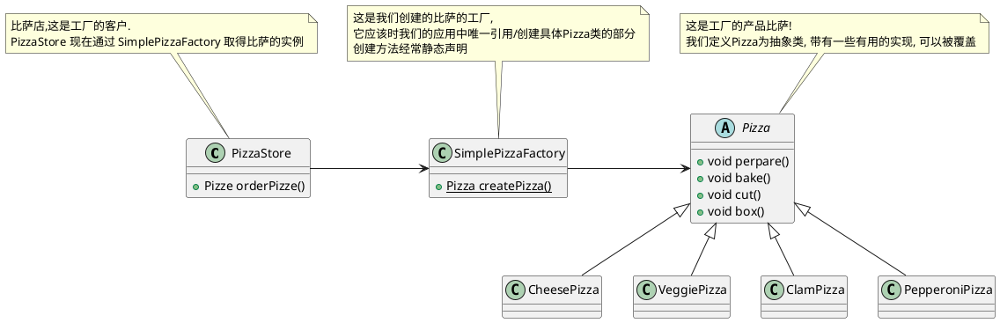

##### 比萨简单工厂代码
```java
public class PizzaStore {      
    SimplePizzaFactory factory;
  
    public PizzaStore(SimplePizzaFactory factory) { 
        this.factory = factory;
    }
  
    public Pizza orderPizza(String type) { 
        Pizza pizza;           
    
        pizza = factory.createPizza(type);
    
        pizza.prepare();
        pizza.bake();
        pizza.cut();
        pizza.box();           

        return pizza;
    }

}

public class SimplePizzaFactory {

    public Pizza createPizza(String type) {
        Pizza pizza = null;

        if (type.equals("cheese")) {
            pizza = new CheesePizza();
        } else if (type.equals("pepperoni")) {
            pizza = new PepperoniPizza();
        } else if (type.equals("clam")) {
            pizza = new ClamPizza();
        } else if (type.equals("veggie")) {
            pizza = new VeggiePizza();
        }
        return pizza;
    }
}

abstract public class Pizza {
    String name;
    
    // 面饼
    String dough;
    // 调味
    String sauce;
    // 陷料
    List<String> toppings = new ArrayList<String>();
  
    public String getName() {  
        return name;
    } 

    // 准备比萨 
    public void prepare() {    
        System.out.println("Preparing " + name);
    }

    // 烘焙比萨
    public void bake() {       
        System.out.println("Baking " + name);
    }

    // 切割比萨
    public void cut() {        
        System.out.println("Cutting " + name);
    }

    // 打包比萨
    public void box() {
        System.out.println("Boxing " + name);
    }

    public String toString() {
        // code to display pizza name and ingredients
        StringBuffer display = new StringBuffer();
        display.append("---- " + name + " ----\n");
        display.append(dough + "\n");
        display.append(sauce + "\n");
        for (String topping : toppings) {
            display.append(topping + "\n");
        }
        return display.toString();
    }

}

public class CheesePizza extends Pizza {
    public CheesePizza() {
        name = "Cheese Pizza";
        dough = "Regular Crust";
        sauce = "Marinara Pizza Sauce";
        toppings.add("Fresh Mozzarella");
        toppings.add("Parmesan");
    }
}


public class ClamPizza extends Pizza {
    public ClamPizza() {
        name = "Clam Pizza";
        dough = "Thin crust";
        sauce = "White garlic sauce";
        toppings.add("Clams");
        toppings.add("Grated parmesan cheese");
    }
}

public class PepperoniPizza extends Pizza {
    public PepperoniPizza() {
        name = "Pepperoni Pizza";
        dough = "Crust";
        sauce = "Marinara sauce";
        toppings.add("Sliced Pepperoni");
        toppings.add("Sliced Onion");
        toppings.add("Grated parmesan cheese");
    }
}

public class VeggiePizza extends Pizza {
    public VeggiePizza() {
        name = "Veggie Pizza";
        dough = "Crust";
        sauce = "Marinara sauce";
        toppings.add("Shredded mozzarella");
        toppings.add("Grated parmesan");
        toppings.add("Diced onion");
        toppings.add("Sliced mushrooms");
        toppings.add("Sliced red pepper");
        toppings.add("Sliced black olives");
    }
}
```


### 工厂方法

定义了一个创建对象的接口, 但由子类决定要实例化那个类. 工厂方法让类把实例化推迟到子类

#### 工厂方法模式类图

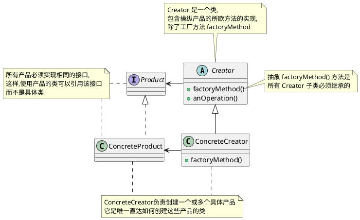

#### 工厂方法模式例子比萨工厂

如果比萨店生意很好, 需要开加盟店, 但是每个地区的人的口味不一样,  
所以需要根据加盟地区提供不同风味的比萨(比如纽约, 芝加哥, 加州)

##### 工厂方法模式例子比萨工厂类图

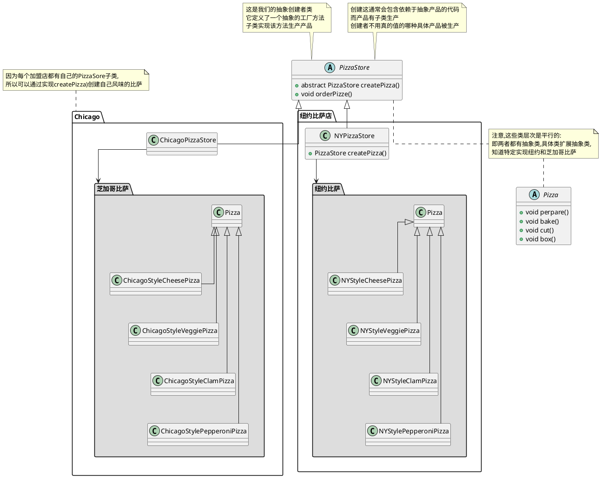

##### 工厂方法模式例子比萨工厂代码

```java
public abstract class PizzaStore {
  
    abstract Pizza createPizza(String item); 
    
    public Pizza orderPizza(String type) { 
        Pizza pizza = createPizza(type);
        System.out.println("--- Making a " + pizza.getName() + " ---");
        pizza.prepare();
        pizza.bake();
        pizza.cut();
        pizza.box();
        return pizza;
    }
}

public abstract class Pizza {
    String name;
    
    // 面饼
    String dough;
    // 调味
    String sauce;
    // 陷料
    List<String> toppings = new ArrayList<String>();
  
    public String getName() {  
        return name;
    } 

    // 准备比萨 
    public void prepare() {    
        System.out.println("Preparing " + name);
    }

    // 烘焙比萨
    public void bake() {       
        System.out.println("Baking " + name);
    }

    // 切割比萨
    public void cut() {        
        System.out.println("Cutting " + name);
    }

    // 打包比萨
    public void box() {
        System.out.println("Boxing " + name);
    }

    public String toString() {
        // code to display pizza name and ingredients
        StringBuffer display = new StringBuffer();
        display.append("---- " + name + " ----\n");
        display.append(dough + "\n");
        display.append(sauce + "\n");
        for (String topping : toppings) {
            display.append(topping + "\n");
        }
        return display.toString();
    }

}

public class NYPizzaStore extends PizzaStore {

    Pizza createPizza(String item) {
        if (item.equals("cheese")) {
            return new NYStyleCheesePizza();
        } else if (item.equals("veggie")) {
            return new NYStyleVeggiePizza();
        } else if (item.equals("clam")) {
            return new NYStyleClamPizza();
        } else if (item.equals("pepperoni")) {
            return new NYStylePepperoniPizza();
        } else return null;
    }
}

public class NYStyleCheesePizza extends Pizza {

    public NYStyleCheesePizza() {
        name = "NY Style Sauce and Cheese Pizza";
        dough = "Thin Crust Dough";
        sauce = "Marinara Sauce";

        toppings.add("Grated Reggiano Cheese");
    }
}

public class ChicagoPizzaStore extends PizzaStore {

    Pizza createPizza(String item) {
        if (item.equals("cheese")) {
            return new ChicagoStyleCheesePizza();
        } else if (item.equals("veggie")) {
            return new ChicagoStyleVeggiePizza();
        } else if (item.equals("clam")) {
            return new ChicagoStyleClamPizza();
        } else if (item.equals("pepperoni")) {
            return new ChicagoStylePepperoniPizza();
        } else return null;
    }
}


public class ChicagoStyleCheesePizza extends Pizza {

    public ChicagoStyleCheesePizza() {
        name = "Chicago Style Deep Dish Cheese Pizza";
        dough = "Extra Thick Crust Dough";
        sauce = "Plum Tomato Sauce";

        toppings.add("Shredded Mozzarella Cheese");
    }

    // 芝加哥比萨重新切割比萨
    void cut() {
        System.out.println("Cutting the pizza into square slices");
    }
}

public class PizzaTestDrive {

    public static void main(String[] args) {
        PizzaStore nyStore = new NYPizzaStore();
        PizzaStore chicagoStore = new ChicagoPizzaStore();

        Pizza pizza = nyStore.orderPizza("cheese");
        System.out.println("Ethan ordered a " + pizza.getName() + "\n");

        pizza = chicagoStore.orderPizza("cheese");
        System.out.println("Joel ordered a " + pizza.getName() + "\n");
    }
}
```

### 工厂方法的依赖倒置

对于使用简单工厂方法的类如下

```java
public class DependentPizzaStore {
  
    public Pizza createPizza(String style, String type) {
        Pizza pizza = null;    
        if (style.equals("NY")) {       
            if (type.equals("cheese")) {
                pizza = new NYStyleCheesePizza();
            } else if (type.equals("veggie")) {
                pizza = new NYStyleVeggiePizza();
            } else if (type.equals("clam")) { 
                pizza = new NYStyleClamPizza(); 
            } else if (type.equals("pepperoni")) { 
                pizza = new NYStylePepperoniPizza();
            }
        } else if (style.equals("Chicago")) {
            if (type.equals("cheese")) {    
                pizza = new ChicagoStyleCheesePizza();
            } else if (type.equals("veggie")) {
                pizza = new ChicagoStyleVeggiePizza();
            } else if (type.equals("clam")) { 
                pizza = new ChicagoStyleClamPizza();
            } else if (type.equals("pepperoni")) { 
                pizza = new ChicagoStylePepperoniPizza();
            }
        } else {               
            System.out.println("Error: invalid type of pizza");
            return null;
        }
        pizza.prepare();
        pizza.bake();
        pizza.cut();
        pizza.box();
        return pizza;
    }
}

```
对象依赖依赖如下

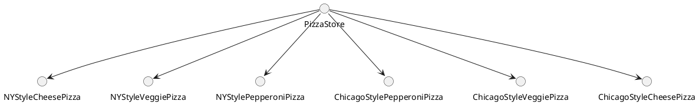

使用工厂方法模式后依赖图如下
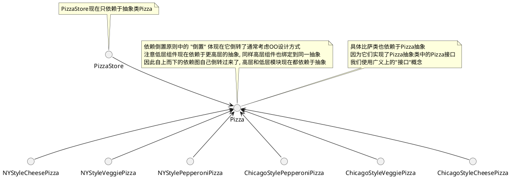

### 抽象工厂模式

`抽象工厂模式`: 提供一个接口来创建相关或依赖对象的家族, 而不需要指定具体类

#### 抽象工厂模式类图

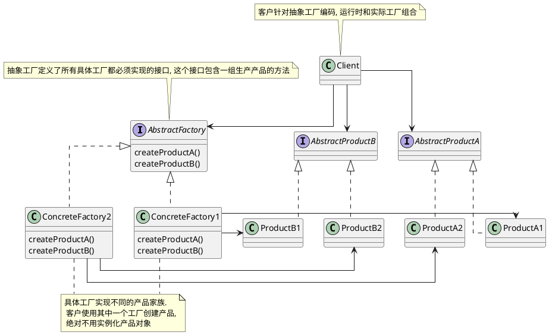

#### 抽象工厂模式例子比萨店的原料工厂

比萨店的成功在于新鲜,高质量的原料, 为了加盟店遵循你的流程, 规范原料, 你打算建立一个原料工厂(抽象工厂)

为了搞定原料工厂你不得不弄清楚如何处理原料家族

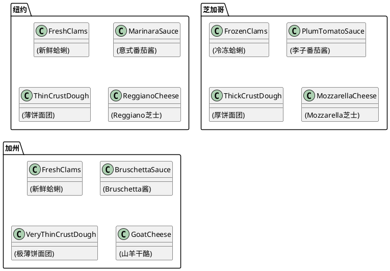

所以对于原料工厂来说, 可以创建所有的原料代码如下

```java
// 比萨原料工厂
public interface PizzaIngredientFactory {

    // 面团
    public Dough createDough();
    // 酱
    public Sauce createSauce();
    // 奶酪
    public Cheese createCheese();
    // 蔬菜
    public Veggies[] createVeggies();
    // 意大利辣香肠
    public Pepperoni createPepperoni();
    // 蛤蜊
    public Clams createClam();

}
```

全部代码如下

```java

// 比萨原料工厂
public interface PizzaIngredientFactory {

    // 面团
    public Dough createDough();
    // 酱
    public Sauce createSauce();
    // 奶酪
    public Cheese createCheese();
    // 蔬菜
    public Veggies[] createVeggies();
    // 意大利辣香肠
    public Pepperoni createPepperoni();
    // 蛤蜊
    public Clams createClam();

}

// 纽约原料工厂
public class NYPizzaIngredientFactory implements PizzaIngredientFactory {
 
    public Dough createDough() {
        return new ThinCrustDough();    
    }
 
    public Sauce createSauce() {    
        return new MarinaraSauce();     
    }
 
    public Cheese createCheese() {  
        return new ReggianoCheese();    
    }
 
    public Veggies[] createVeggies() {
        Veggies veggies[] = { new Garlic(), new Onion(), new Mushroom(), new RedPepper() };
        return veggies;
    }
 
    public Pepperoni createPepperoni() {
        return new SlicedPepperoni();   
    }

    public Clams createClam() {
        return new FreshClams();        
    }
}

// 芝加哥原料工厂
public class ChicagoPizzaIngredientFactory implements PizzaIngredientFactory {

    public Dough createDough() {
        return new ThickCrustDough();
    }

    public Sauce createSauce() {
        return new PlumTomatoSauce();
    }

    public Cheese createCheese() {
        return new MozzarellaCheese();
    }

    public Veggies[] createVeggies() {
        Veggies veggies[] = { new BlackOlives(),
                              new Spinach(),
                              new Eggplant() };
        return veggies;
    }

    public Pepperoni createPepperoni() {
        return new SlicedPepperoni();
    }
    public Clams createClam() {
        return new FrozenClams();
    }
}

// 面团
public interface Dough {
    public String toString();
}

// 酱
public interface Sauce {
    public String toString();
}

// 奶酪
public interface Cheese {
    public String toString();
}

// 蔬菜
public interface Veggies {
    public String toString();
}

// 意大利辣香肠
public interface Pepperoni {
    public String toString();
}

// 蛤蜊
public interface Clams {
    public String toString();
}

// 重做比萨, 主要是将 prepare() 声明未抽象的, 这个方法收集比萨所需的原料, 当然这些原料来自原料工厂
public abstract class Pizza {
    String name;

    // 比萨所需的原料如下
    Dough dough;
    Sauce sauce;
    Veggies veggies[];
    Cheese cheese;
    Pepperoni pepperoni;
    Clams clam;

    abstract void prepare();   

    void bake() {
        System.out.println("Bake for 25 minutes at 350");
    }

    void cut() {
        System.out.println("Cutting the pizza into diagonal slices");
    }

    void box() {
        System.out.println("Place pizza in official PizzaStore box");
    } 
    void setName(String name) {
        this.name = name;
    }

    String getName() {
        return name;
    }
    public String toString() {
        StringBuffer result = new StringBuffer();
        result.append("---- " + name + " ----\n");
        if (dough != null) {
            result.append(dough);
            result.append("\n");
        }
        if (sauce != null) {
            result.append(sauce);
            result.append("\n");
        }
        if (cheese != null) {
            result.append(cheese);
            result.append("\n");
        }
        if (veggies != null) {
            for (int i = 0; i < veggies.length; i++) {
                result.append(veggies[i]);
                if (i < veggies.length-1) {
                    result.append(", ");
                }
            }
            result.append("\n");
        }
        if (clam != null) {
            result.append(clam);
            result.append("\n");
        }
        if (pepperoni != null) {
            result.append(pepperoni);
            result.append("\n");
        }
        return result.toString();
    }
}

// 奶酪比萨如下
public class CheesePizza extends Pizza {
    PizzaIngredientFactory ingredientFactory;

    // 现在要制作比萨, 我们需要一个工厂提供原料
    public CheesePizza(PizzaIngredientFactory ingredientFactory) {
        this.ingredientFactory = ingredientFactory;
    }

    void prepare() {
        System.out.println("Preparing " + name);
        dough = ingredientFactory.createDough();
        sauce = ingredientFactory.createSauce();
        cheese = ingredientFactory.createCheese();
    }
}

public class ClamPizza extends Pizza {
    PizzaIngredientFactory ingredientFactory;

    public ClamPizza(PizzaIngredientFactory ingredientFactory) {
        this.ingredientFactory = ingredientFactory;
    }

    void prepare() {
        System.out.println("Preparing " + name);
        dough = ingredientFactory.createDough();
        sauce = ingredientFactory.createSauce();
        cheese = ingredientFactory.createCheese();
        // 蛤蜊比萨多了蛤蜊
        clam = ingredientFactory.createClam();
    }
}

// 纽约比萨店
public class NYPizzaStore extends PizzaStore {

    protected Pizza createPizza(String item) {
        Pizza pizza = null;
        PizzaIngredientFactory ingredientFactory =
            new NYPizzaIngredientFactory();

        if (item.equals("cheese")) {

            pizza = new CheesePizza(ingredientFactory);
            pizza.setName("New York Style Cheese Pizza");

        } else if (item.equals("veggie")) {

            pizza = new VeggiePizza(ingredientFactory);
            pizza.setName("New York Style Veggie Pizza");

        } else if (item.equals("clam")) {

            pizza = new ClamPizza(ingredientFactory);
            pizza.setName("New York Style Clam Pizza");

        } else if (item.equals("pepperoni")) {

            pizza = new PepperoniPizza(ingredientFactory);
            pizza.setName("New York Style Pepperoni Pizza");

        }
        return pizza;
    }
}


```

类图如下
```plantuml
@startuml
skinparam linetype ortho
package  "比萨原料工厂" as  PizzaIngredientFactory_together #DDDDDD {
    interface PizzaIngredientFactory {
        createDough()
        createSauce()
        createCheese()
        createVeggies()
        createPepperoni()
        createClam()
    }
    
    class NYPizzaIngredientFactory implements PizzaIngredientFactory {
    }
    
    class ChicagoPizzaIngredientFactory implements PizzaIngredientFactory {
    }

}
class NYPizzaStore {
    createPizza()
}

package 比萨原料 as PizzaIngredient_package #DDDDDD {
    together Dough_together {
        interface Dough {}
        class ThickCrustDough implements Dough {}
        class ThinCrustDough implements Dough {}
    }
    
    together Sauce_together {
        interface Sauce {}
        class PlumTomatoSauce implements Sauce {}
        class MarinaraSauce implements Sauce {}
    }
    
    together Cheese_together {
        interface Cheese {}
        class MozzarellaCheese implements Cheese {}
        class ReggianoCheese implements Cheese {}
    }
    
    together Clams_together {
        interface Clams {}
        class FrozenClams implements Clams {}
        class FreshClams implements Clams {}
    }
}

NYPizzaStore --> PizzaIngredientFactory
NYPizzaStore --> Dough
NYPizzaStore --> Sauce
NYPizzaStore --> Cheese
NYPizzaStore --> Clams
NYPizzaIngredientFactory -right-> ThinCrustDough
NYPizzaIngredientFactory -right-> MarinaraSauce
NYPizzaIngredientFactory -right-> ReggianoCheese
NYPizzaIngredientFactory -right-> FreshClams
ChicagoPizzaIngredientFactory -left-> ThickCrustDough
ChicagoPizzaIngredientFactory -left-> PlumTomatoSauce
ChicagoPizzaIngredientFactory -left-> MozzarellaCheese
ChicagoPizzaIngredientFactory -left-> FrozenClams

' 控制布局无意义


NYPizzaStore -down[hidden]--> Dough_together
Dough_together -down[hidden]---> Sauce_together
Sauce_together -down[hidden]---> Cheese_together
Cheese_together -down[hidden]---> Clams_together

PizzaIngredientFactory_together -right[hidden]-> Dough_together
PizzaIngredientFactory_together -right[hidden]-> Sauce_together
PizzaIngredientFactory_together -right[hidden]-> Cheese_together
PizzaIngredientFactory_together -right[hidden]-> Clams_together

@enduml
```

## 单例模式/单件模式

`单例模式`: 确保一个类只有一个实例, 并提供一个全局访问点

### 单例模式讨论

1. 如果有多个类加载器会导致, 多次家在同一个类, 就会产生多个单例
2. 反射和序列化/反序列化可有可能导致多个单例
3. 单例模式违反松耦合原则/单一责任原则
4. 单例模式对比全局变量来说可以做到延迟加载
5. 全局变量怂恿开发人员用大量对小对象的全局引用来污染命名空间

### 单列模式要点

1. 单列模式确保应用中一个类最多只有一个实例
2. 单例模式也是提供访问次实例的全局点
3. Java的单例实现用了一个私有构造器, 一个静态方法以及一个静态变量
4. 检查你的性能和资源, 为多线程应用小心选择一个适当的单例实现(我们英国把所有应用都考虑为时多线程的)
5. 提供双重检查加锁实现, Java5 之前的版本, 不是线程安全的
6. 如果你使用多个类加载器, 要小心, 可能倒置单例实现失效, 导致出现多个实例
7. 你可以使用Java的枚举来简化单列的实现

### 单例模式类图

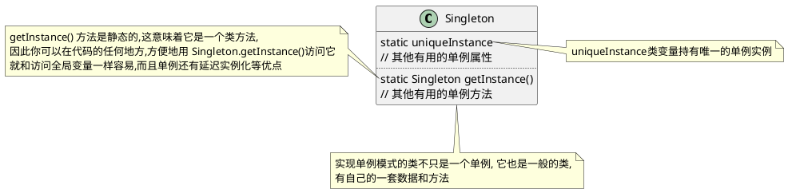

### 单例模式实现

```java
public class Singleton {
    private static Singleton uniqueInstance;
    // 其他有用的单例属性

    private Singleton() {}

    /**
     * <pre>
     * 该方式存在多线程问题, 可能会创建多个 Singleton
     * 但是如果调用 getInstance() 方法没有给你的应用增加很重的负担并且允许有多个实例, 可以使用该方法
     * </pre>
     */
    public static Singleton getInstance() {
        if (uniqueInstance == null) {
            uniqueInstance == new Singleton();
        }
        return uniqueInstance;
    }

    // 其他有用的单例方法
}

public class Singleton {
    private static Singleton uniqueInstance = new Singleton();
    // 其他有用的单例属性

    private Singleton() {}
    
    /**
     * 急切的创建实例, 而不用延迟创建
     */
    public static Singleton getInstance() {
        return uniqueInstance;
    }

    // 其他有用的单例方法
}


public class Singleton {
    // volatile 关键字确保: 当 uniqueInstance 变量被初始化未单例实例时, 多个线程正确处理 uniqueInstance 变量
    private volatile static Singleton uniqueInstance;
    // 其他有用的单例属性

    private Singleton() {}

    /**
     * <pre>
     * 双重检查加锁, 初始化实例, 在特定场景下有问题
     * 当 uniqueInstance 被分配地址但未执行 init 方法时可能会有问题
     * </pre>
     */
    public static Singleton getInstance() {
        // 检查实例, 如果没有, 进入同步区块
        if (uniqueInstance == null) {
            // 注意, 只有第一次才同步
            synchronized (Singleton.class) {
                if (uniqueInstance == null) {
                    // 进入区块后, 再检查一次. 如果依然是空的, 创建一个实例
                    uniqueInstance == new Singleton();
                }
            }
        }
        return uniqueInstance;
    }

    // 其他有用的单例方法
}
```

## 命令模式

`命令模式`: 把请求封装为对象, 以便用不同的请求/队列或者日志请求来参数化其它对象, 并支持可以撤销的操作

### 命令模式要点

1. 命令模式把做出请求的对象从知道如何执行请求的对象解耦
2. 命令对象处在解耦的中心, 封装接收者以及一个(或一组)动作(命令)
3. 调用者通过调用命令对象的execute()做出请求, 这会使得接收者的动作被调用
4. 调用者可以用命令参数化, 甚至可以在运行时动态地进行
5. 通过实现一个undo()方法来把对象重建到最后一次执行execute()前状态, 命令可以支持撤销
6. 宏命令是命令模式的一种简单延伸. 它允许调用多个命令. 同样, 宏命令很容易支持 undo()
7. 在实践中, "聪明" 命令对象并不少见. 这些对象自己实现请求, 而不是委托给接收者
8. 命令也可以用来实现日志和事务系统

### 命令模式类图

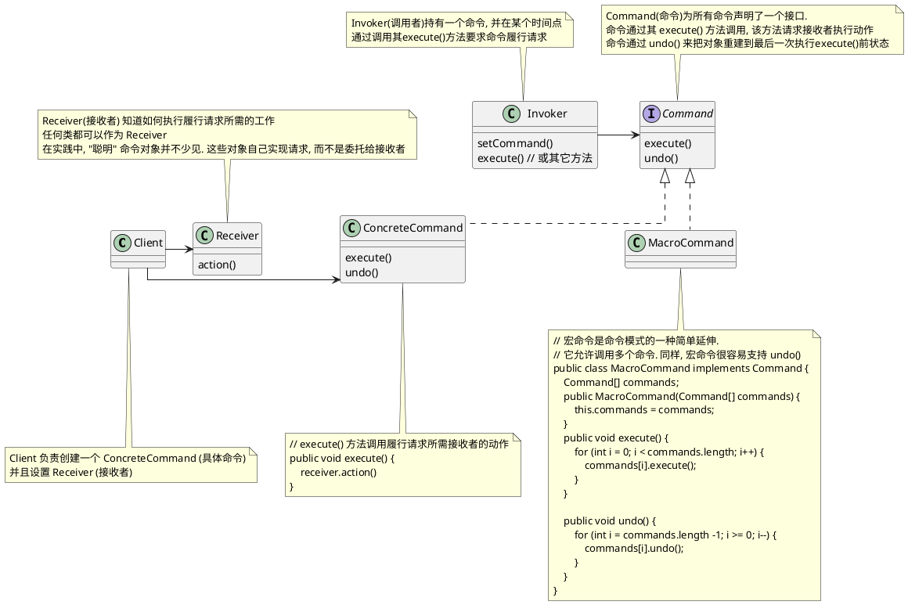
### 命令模式流程图

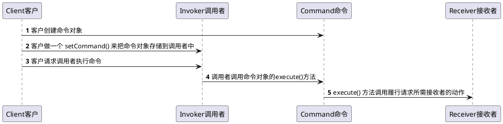

### 命令模式例子遥控器

我们要设计一个遥控器代码, 让每个槽可以被分配控制一个或一组设备  
请注意, 要能沟控制目前所有的设备以及厂商未来可以能提供的任何设备  

以下是我们需要从控制器控制对象的接口, 这些设备中有些接口差别很大

```plantuml
@startuml
' 电灯
class Light {
    on()
    off()
}
note top of Light : 电灯
' 吊扇
class CeilingFan {
    high()
    medium()
    low()
    off()
    getSpeed()
}
note top of CeilingFan : 吊扇
' 电视
class TV {
    on()
    off()
    setInputChannel()
}
note top of TV : 电视

@enduml
```

```plantuml
@startuml

package 遥控器 as remote_control {
    
    together together1 {
        () ON1
        () OFF1

        note right of ON1 : 电灯开
        note left of OFF1 : 电灯关
    }
    
    together together2 {
        () ON2
        () OFF2

        note right of ON2 : 吊扇开到高速\n(由于篇幅问题吊扇低速和中速不展示)
        note left of OFF2 : 吊扇关
    }
    
    together together3 {
        () ON3
        () OFF3

        note right of ON3 : 电视开
        note left of OFF3 : 电视关
    }
  
    together together4 {
        () ON4
        () OFF4

        note right of ON4 : 电灯,电视开,吊扇开到高速
        note left of OFF4 : 电灯,吊扇,电视关
    }
    
    together together_undo {
        () undo
        note right of undo : 对象重建到最后一次执行execute()前状态,\n但电视使用 lambda 无法撤销
    }

' 控制布局无意义

together1 -down[hidden]-> together2
together2 -down[hidden]-> together3
together3 -down[hidden]-> together4
together4 -down[hidden]-> together_undo
}

note top of remote_control
4个槽都有各自的开和关按钮
每组槽都需要编程. 我们可以在每个槽上放不同设备
然后通过按钮控制它
还有一个 undo 槽用来回到把对象重建到最后一次执行execute()前状态
end note

@enduml
```

遥控器类图如下

```plantuml
@startuml

skinparam linetype ortho

class RemoteLoader {

}

class RemoteControl {
    Command[] onCommands;
    Command[] offCommands;

    setCommand()
    onButtonWasPushed()
    offButtonWasPushed()
}

interface Command {
    execute()
}
' 电灯
class Light {
    on()
    off()
}
note top of Light : 电灯
class LightOnCommand implements Command {
    execute()
}
class LightOffCommand implements Command {
    execute()
}

' 吊扇
class CeilingFan {
    high()
    medium()
    low()
    off()
    getSpeed()
}
note top of CeilingFan : 吊扇
class CeilingFanHighCommand implements Command {
    execute()
}
class CeilingFanOffCommand implements Command {
    execute()
}

' 电视
class TV {
    on()
    off()
    setInputChannel()
}
note top of TV : 电视, 使用两个 lambda 表达式生成命令

class MacroCommand implements Command {
    execute()
}

RemoteLoader -> Light
RemoteLoader -> CeilingFan
RemoteLoader -> TV
RemoteLoader -> LightOnCommand
RemoteLoader -> LightOffCommand
RemoteLoader -> CeilingFanHighCommand
RemoteLoader -> CeilingFanOffCommand

RemoteControl -> Command


@enduml
```

代码如下
```java
// This is the invoker(调用者)
public class RemoteControl {
    Command[] onCommands;
    Command[] offCommands;     
    Command undoCommand;
 
    public RemoteControl() {   
        onCommands = new Command[4];
        offCommands = new Command[4];   
 
        Command noCommand = new NoCommand();
        for(int i=0;i<4;i++) { 
            onCommands[i] = noCommand;
            offCommands[i] = noCommand;
        }
        undoCommand = noCommand;        
    }
  
    public void setCommand(int slot, Command onCommand, Command offCommand) {
        onCommands[slot] = onCommand;   
        offCommands[slot] = offCommand; 
    }
    public void onButtonWasPushed(int slot) {
        onCommands[slot].execute();
        undoCommand = onCommands[slot];
    }

    public void offButtonWasPushed(int slot) {
        offCommands[slot].execute();
        undoCommand = offCommands[slot];
    }

    public void undoButtonWasPushed() {
        undoCommand.undo();
    }

    public String toString() {
        StringBuffer stringBuff = new StringBuffer();
        stringBuff.append("\n------ Remote Control -------\n");
        for (int i = 0; i < onCommands.length; i++) {
            stringBuff.append("[slot " + i + "] " + onCommands[i].getClass().getName()
                + "    " + offCommands[i].getClass().getName() + "\n");
        }
        stringBuff.append("[undo] " + undoCommand.getClass().getName() + "\n");
        return stringBuff.toString();
    }
}

// 命令接口
public interface Command {
    public void execute();
    public default void undo() {}

    // 每个命令被执行时, 会存储到磁盘中
    public default void store() {}
    // 系统失败后, 这些对象会被重新加载
    public default Command load() {return null;}
}

// 默认空实现, 防止空指针异常
public class NoCommand implements Command {
    public void execute() { }
    public void undo() { }
}

// 宏命令是命令模式的一种简单延伸
// 它允许调用多个命令. 同样, 宏命令很容易支持 undo()
public class MacroCommand implements Command {
    Command[] commands;

    public MacroCommand(Command[] commands) {
        this.commands = commands;
    }

    public void execute() {
        for (int i = 0; i < commands.length; i++) {
            commands[i].execute();
        }
    }

    /**
     * NOTE:  这些命令必须向后完成，以确保正确的撤消功能
     */
    public void undo() {
        for (int i = commands.length -1; i >= 0; i--) {
            commands[i].undo();
        }
    }
}

// 电灯
public class Light {
    String location = "";

    public Light(String location) {
        this.location = location;
    }

    public void on() {
        System.out.println(location + " light is on");
    }

    public void off() {
        System.out.println(location + " light is off");
    }
}


// 普通的电灯开关(最普通的命令模式)
public class LightOffCommand implements Command {
    Light light;

    public LightOffCommand(Light light) {
        this.light = light;
    }

    public void execute() {
        light.off();
    }

    public void undo() {
        light.on();
    }
}

// 普通的电灯开关(最普通的命令模式)
public class LightOnCommand implements Command {
    Light light;

    public LightOnCommand(Light light) {
        this.light = light;
    }

    public void execute() {
        light.on();
    }

    public void undo() {
        light.off();
    }
}

// 吊扇
public class CeilingFan {
    public static final int HIGH = 3;
    public static final int MEDIUM = 2;
    public static final int LOW = 1;
    public static final int OFF = 0;
    String location;
    int speed;

    public CeilingFan(String location) {
        this.location = location;
    }

    public void high() {
        // turns the ceiling fan on to high
        speed = HIGH;
        System.out.println(location + " ceiling fan is on high");
    }

    public void medium() {
        // turns the ceiling fan on to medium
        speed = MEDIUM;
        System.out.println(location + " ceiling fan is on medium");
    }

    public void low() {
        // turns the ceiling fan on to low
        speed = LOW;
        System.out.println(location + " ceiling fan is on low");
    }

    public void off() {
        // turns the ceiling fan off
        speed = OFF;
        System.out.println(location + " ceiling fan is off");
    }

    public int getSpeed() {
        return speed;
    }
}

// 用状态实现撤销, 吊扇允许有多种转速度, 按钮控制速度为高速
public class CeilingFanHighCommand implements Command {
    CeilingFan ceilingFan;
    // 添加局部变量来跟踪吊扇之前的转速
    int prevSpeed;

    public CeilingFanHighCommand(CeilingFan ceilingFan) {
        this.ceilingFan = ceilingFan;
    }
    public void execute() {
        // 在 execute() 中, 改变吊扇的转速之前, 需要先记录它之前的状态, 以便撤销功能时使用
        prevSpeed = ceilingFan.getSpeed();
        ceilingFan.high();
    }

    // 我们把吊扇的转速设置会之前的转速, 达到撤销的目的
    public void undo() {
        switch (prevSpeed) {
            case CeilingFan.HIGH:   ceilingFan.high(); break;
            case CeilingFan.MEDIUM: ceilingFan.medium(); break;
            case CeilingFan.LOW:    ceilingFan.low(); break;
            default:                ceilingFan.off(); break;
        }
    }
}

// 关闭吊扇
public class CeilingFanOffCommand implements Command {
    CeilingFan ceilingFan;     
    int prevSpeed;
    
    public CeilingFanOffCommand(CeilingFan ceilingFan) {
        this.ceilingFan = ceilingFan;   
    }   
    public void execute() {    
        prevSpeed = ceilingFan.getSpeed();
        ceilingFan.off();      
    } 
    public void undo() {       
        switch (prevSpeed) {
            case CeilingFan.HIGH:   ceilingFan.high(); break;
            case CeilingFan.MEDIUM: ceilingFan.medium(); break;
            case CeilingFan.LOW:    ceilingFan.low(); break;
            default:                ceilingFan.off(); break;
        }
    }
}

public class TV {
    String location;
    int channel;

    public TV(String location) {
        this.location = location;
    }

    public void on() {
        System.out.println(location + " TV is on");
    }

    public void off() {
        System.out.println(location + " TV is off");
    }

    public void setInputChannel() {
        this.channel = 3;
        System.out.println(location + " TV channel is set for DVD");
    }
}

public class RemoteLoader {

    public static void main(String[] args) {

        RemoteControl remoteControl = new RemoteControl();

        // 普通的电灯开关(最普通的命令模式)
        Light light = new Light("Living Room");
        LightOnCommand lightOn = new LightOnCommand(light);
        LightOffCommand lightOff = new LightOffCommand(light);
        remoteControl.setCommand(0, lightOn, lightOff);
        
        // 吊扇开关(用状态实现撤销)
        CeilingFan ceilingFan = new CeilingFan("Living Room");
        CeilingFanHighCommand ceilingFanHigh = new CeilingFanHighCommand(ceilingFan);
        CeilingFanOffCommand ceilingFanOff = new CeilingFanOffCommand(ceilingFan);
        remoteControl.setCommand(1, ceilingFanHigh, ceilingFanOff);
 
        // 电视开关, 使用 lambda 表达式, 不支持 undo()
        TV tv = new TV("Living Room");
        remoteControl.setCommand(2, () -> tv.on(), tv.off());
        
        // 宏命令模式, 同时开启电灯和吊扇高速和电视, 和同时关闭电灯和吊扇和电视
        Command[] partyOn = { lightOn, ceilingFanHigh};
        Command[] partyOff = { lightOff, ceilingFanOff};
        MacroCommand partyOnMacro = new MacroCommand(partyOn);
        MacroCommand partyOffMacro = new MacroCommand(partyOff);
        remoteControl.setCommand(3, partyOnMacro, partyOffMacro);

        System.out.println(remoteControl);
        System.out.println("--- Pushing Macro On---");
        remoteControl.onButtonWasPushed(0);
        System.out.println("--- Pushing Macro Off---");
        remoteControl.offButtonWasPushed(0);
    }
}

```

### 命令模式使用场景

#### 请求队列(如线程池)

命令把一小块计算打包(一个接收者和一组动作), 然后把它作为头筹对象传来传去.   
即使在一些客户应用创建命令对象很久之后, 计算自身依然可能被调用.  
事实上, 甚至可以被不用线程调用. 我们可以把这个场景应用到许多应用上  
比如: 日程安排, 线程池, 以及作业队列


想象一个作业队列: 你添加命令到队列的一端, 另一端有一组线程.  
线程运行以下脚本: 从队列移除命令, 调用其 execute() 方法,  
等待这个调用完成, 然后丢弃该命令对象, 检索新的命令对象......  
作业对象类完全从做计算的对象解耦. 这一分钟, 线程可能做财务计算,  
下一分钟可能从网络检索信息.  
作业队列对象不关心, 它们只检索命令并调用 exectue() 
同样, 只要你把对象放进去实现命令模式的队列, 当线程可用时, execute() 方法就会被调用


#### 日志请求

如果某些应用需要我们把所有动作都记录在日志中, 并能在系统崩溃后, 通过重新调用这些动作来恢复, 我们可以通过添加两个方法 store(), load(), 命令模式能够支持这一点. 在 JAVA 中我们可以使用对象序列化来实现这些方法

那么这样做呢? 单我们执行命令时, 把历史存储在磁盘中, 一旦出现崩溃, 就重新加载命令对象, 并成批地依次调用它们的 execute() 方法

```plantuml
@startuml

() 调用者 as invoker
() Command1 as command1
() Command2 as command2
() Command3 as command3

[持久化机器] as store

invoker ..> command1 : 1. execute()
invoker ..> command2 : 2. execute()
invoker ..> command3 : 3. execute()

command1 --> store : 存储
command2 --> store : 存储
command3 --> store : 存储

@enduml
```

崩溃后从持久化机器上重建

```plantuml
@startuml

() 调用者 as invoker
() Command1 as command1
() Command2 as command2
() Command3 as command3

[持久化机器] as store

invoker ..> command1 : 1. execute()
invoker ..> command2 : 2. execute()
invoker ..> command3 : 3. execute()

command1 <-- store : 加载
command2 <-- store : 加载
command3 <-- store : 加载

@enduml
```

## 适配器模式

`适配器模式`: 将一个类的接口(对象)转换成客户期望夫人另一个接口(对象). 适配器让原本不兼容的类可合作. 这使得客户从所实现的接口解耦

### 适配器模式要点

1. 适配器不一定只能包装一个类, 存在适配器持有两个或以上要实现不标接口的被适配者的情况
2. 当你需要使用一个已有的类, 而其接口不符合你的需要, 就用适配器
3. 适配器改变接口以符合客户的期望
4. 实现一个适配器可能不需要花什么功夫, 也可能花很多功夫, 视目标接口的大小与复杂度而定
5. 适配器模式有两种形式: 对象适配器和类适配器. 类适配器需要用到多重继承
6. 适配器包装一个对象以改变其接口, 装饰者包装一个对象以添加新的行为和责任, 而外观 "包装" 一群对象以简化其接口, 三者代码大体一致单意图不一样

### 适配器模式类图

#### 对象适配器类图

```plantuml
@startuml

class Client {
}

note bottom of Client : 客户只看到目标接口

interface Target {
    request()
}

class Adapter implements Target {
    request()
}

note "适配器实现目标接口" as Target_Adapter_note
Target_Adapter_note .. Target
Target_Adapter_note .. Adapter


Class Adaptee {
    speciffcRequest()
}

Client -> Target
Adapter -> Adaptee : 适配器和被适配者组合\n所有请求都被委托给被适配者

@enduml
```

#### 类适配器

```plantuml
@startuml

class Client {
}


class Target {
    request()
}

Class Adaptee {
    speciffcRequest()
}

class Adapter extends Target, Adaptee {
    request()
}

note bottom of Adapter
适配器现在继承被适配者和目标类(多重继承)
而不是用组合来适配被适配者(java无多重继承)
end note

Client -> Target

@enduml
```

### 适配器模式大体流程

```plantuml
@startuml

() 客户 as client
() 适配器 as adapter
() 被适配者 as adaptee

client -> adapter : request()
adapter -> adaptee : translatedRequest()

note top of client : 客户针对目标接口实现
note bottom of adapter : 适配器实现目标接口, 并持有被适配者的实例
note top of adapter : 目标接口
note top of adaptee : 被适配者接口

@enduml
```

```plantuml
@startuml
autonumber

participant 客户 as client
participant 适配器 as adapter
participant 被适配者 as adaptee

client -> adapter : 客户通过使用不标接口, 调用适配器的方法, 对适配器做出请求
adapter -> adaptee : 适配器使用被适配者接口, 把请求翻译成被适配者上的一个或多个调用
adapter --> client : 客户收到调用接口, 但根本不知道时适配器做翻译

note over of client : 注意, 客户和被适配者解耦了,\n 彼此不知道对方

@enduml
```


### 适配器模式例子

我们需要将火鸡伪装成一个鸭子

```java

// 鸭子接口
public interface Duck {        
    // 叫声
    public void quack();
    // 飞行
    public void fly();
}

// 绿头鸭
public class MallardDuck implements Duck {
    public void quack() {
        System.out.println("Quack");
    }

    public void fly() {
        System.out.println("I'm flying");
    }
}

// 火鸡
public interface Turkey {      
    public void gobble();
    public void fly();
} 

// 野生的火鸡
public class WildTurkey implements Turkey {
    public void gobble() {
        System.out.println("Gobble gobble");
    }

    // 火鸡只会短途飞行
    public void fly() {
        System.out.println("I'm flying a short distance");
    }
}

// 火鸡适配器, 把火鸡伪装成鸭子
// 首先需要实现适配类型的接口, 这是你的客户期望看到的接口
public class TurkeyAdapter implements Duck {
    // 接下来, 需要取得要适配的对象引用, 者可我们通过构造器得到
    Turkey turkey;

    public TurkeyAdapter(Turkey turkey) {
        this.turkey = turkey;
    }

    // 现在我们需要实现接口中的所有方法, quack() 在类之间的翻译很容易, 只要调用 gobble() 方法
    public void quack() {
        turkey.gobble();
    }

    // 即使两个接口都有 fly() 方法, 火鸡的分析只是短距离冲刺, 不能像鸭子那样长途飞行
    // 要在 Duck 的 fly() 方法和 Turkey 的 fly() 方法之间形成映射, 我们需要调用 Turkey 的 fly() 方法五次来补足
    public void fly() {
        for(int i=0; i < 5; i++) {
            turkey.fly();
        }
    }
}

// 测试
public class DuckTestDrive {
    public static void main(String[] args) {
        Duck duck = new MallardDuck();

        Turkey turkey = new WildTurkey();
        Duck turkeyAdapter = new TurkeyAdapter(turkey);

        System.out.println("The Turkey says...");
        turkey.gobble();
        turkey.fly();

        System.out.println("\nThe Duck says...");
        testDuck(duck);

        System.out.println("\nThe TurkeyAdapter says...");
        testDuck(turkeyAdapter);

    }

    static void testDuck(Duck duck) {
        duck.quack();
        duck.fly();
    }
}

```

## 外观模式

`外观模式`: 为子系统中的一组接口提供了一个统一的接口. 外观定义了一个更高级的接口, 使得子系统更容易使用.

### 外观模式类图

```plantuml
@startuml

class Client {}

class Facade {}

package 子系统的类 {
    class Service1 {}
    class Service2 {}
    class Service3 {}

    Service1 -> Service3
}

Client -right-> Facade
Facade -down-> Service1
Facade -down-> Service2
@enduml
```
### 外观模式例子

1. 当你需要简化并统一一个大接口, 或者一个复杂的接口集, 就用外观
2. 外观将客户从一个复杂子系统解耦
3. 实现外观需要把外观和子系统组合, 使用委托来执行外观的工作
4. 你可以为一个子系统实现多个外观
5. 适配器包装一个对象以改变其接口, 装饰者包装一个对象以添加新的行为和责任, 而外观 "包装" 一群对象以简化其接口, 三者代码大体一致单意图不一样

### 外观模式例子: 家庭影院

你在家里观赏一部电影, 你需要以下几个步骤

1. 打开爆米花机
2. 开始爆米花
3. 调暗灯光
4. 放下屏幕
5. 打开投影机
6. 设置投影机输入为流媒体播放器
7. 把投影机设置在宽屏模式
8. 打开功放
9. 设置功放为流媒体输入
10. 设置功放为环绕音响
11. 设置功放音量为中(5)
12. 打开流媒体播放器
13. 开始放电影

这些涉及到 6个类, 13个动作, 但还有更多,   
电影结束后, 把这些东西关掉, 你不得不反向地把这一切再过一遍  
听广播是不是也时这样复杂

```plantuml
@startuml
skinparam linetype ortho

class 遥控器  {
    watchMovie()
    endMovie()
}

遥控器 -down-> HomeTheaterFacade : 遥控器是子系统外观的客户

note right of 遥控器
你的客户代码现在调用家庭影院的外观方法, 而不是子系统的方法
因此现在我们只要调用一个方法 watchMovie() 
它会和灯,流媒体播放器,投影机,功放,屏幕,爆米花机等沟通
end note

class HomeTheaterFacade {
    watchMovie()
    endMovie()
    listenToRadio()
    endRadio()
}

package 设备子系统 as system {
    class Tuner {
        amplifier
        
        on()
        off()
        setAm()
        setFrequency()
        toString()
    }
    
    class Amplifier {
        Tuner tuner
        player

        on()
        off()
        ' 设置流媒体播放器
        setStreamingPlayer()
        ' 设置立体声
        setStereoSound()
        ' 设置环绕声
        setSurroundSoud()
        setTuner()
        setVolume()
        toString()
    }

    class StreamingPlayer {
        amplifier

        on()
        off()
        pause()
        play()
        setSurroundAudio()
        setTwoChannelAudio()
        stop()
        toString()
    }

    class Screen {
        on()
        off()
        toString()
    }

    class PopcornPopper {
        on()
        off()
        pop()
        toString()
    }

    class TheaterLights {
        on()
        off()
        dim()
        toString()
    }

    class Projector {
        player

        on()
        off()
        tvMode()
        WideScreenMode()
        toString()
    }

    Tuner -> Amplifier
    Amplifier -> Tuner
    Amplifier -> StreamingPlayer
    StreamingPlayer -> Amplifier
    Projector -> StreamingPlayer
}

note bottom of system
外观依然保持子系统可以访问,所以你可以直接使用
如果你需要子系统类的高阶功能, 它们还是可以使用
end note

HomeTheaterFacade -down-> Tuner
HomeTheaterFacade -down-> StreamingPlayer
HomeTheaterFacade -down-> Screen
HomeTheaterFacade -down-> PopcornPopper
HomeTheaterFacade -down-> TheaterLights
HomeTheaterFacade -down-> Projector

@enduml
```

```java
public class HomeTheaterFacade {
    Amplifier amp;             
    Tuner tuner;               
    StreamingPlayer player;    
    CdPlayer cd;               
    Projector projector;       
    TheaterLights lights;      
    Screen screen;             
    PopcornPopper popper;      
  
    public HomeTheaterFacade(Amplifier amp, 
                 Tuner tuner,  
                 StreamingPlayer player,
                 Projector projector,            
                 Screen screen,
                 TheaterLights lights,           
                 PopcornPopper popper) {         
 
        this.amp = amp;
        this.tuner = tuner;    
        this.player = player;  
        this.projector = projector;     
        this.screen = screen;  
        this.lights = lights;  
        this.popper = popper;  
    }
    public void watchMovie(String movie) {
        System.out.println("Get ready to watch a movie...");
        popper.on();
        popper.pop();
        lights.dim(10);
        screen.down();
        projector.on();
        projector.wideScreenMode();
        amp.on();
        amp.setStreamingPlayer(player);
        amp.setSurroundSound();
        amp.setVolume(5);
        player.on();
        player.play(movie);
    }

    public void endMovie() {
        System.out.println("Shutting movie theater down...");
        popper.off();
        lights.on();
        screen.up();
        projector.off();
        amp.off();
        player.stop();
        player.off();
    }

    public void listenToRadio(double frequency) {
        System.out.println("Tuning in the airwaves...");
        tuner.on();
        tuner.setFrequency(frequency);
        amp.on();
        amp.setVolume(5);
        amp.setTuner(tuner);
    }

    public void endRadio() {
        System.out.println("Shutting down the tuner...");
        tuner.off();
        amp.off();
    }
}

// 是时候观赏电影了(容易方式)
public class HomeTheaterTestDrive {
    public static void main(String[] args) {
        Amplifier amp = new Amplifier("Amplifier");
        Tuner tuner = new Tuner("AM/FM Tuner", amp);
        StreamingPlayer player = new StreamingPlayer("Streaming Player", amp);
        CdPlayer cd = new CdPlayer("CD Player", amp);
        Projector projector = new Projector("Projector", player);
        TheaterLights lights = new TheaterLights("Theater Ceiling Lights");
        Screen screen = new Screen("Theater Screen");
        PopcornPopper popper = new PopcornPopper("Popcorn Popper");

        HomeTheaterFacade homeTheater =
                new HomeTheaterFacade(amp, tuner, player,
                        projector, screen, lights, popper);

        homeTheater.watchMovie("Raiders of the Lost Ark");
        homeTheater.endMovie();
    }
}

```

## 模板方法模式

`模板方法模式`: 在一个方法中定义一个算法的骨架, 而把一些步骤延迟到子类. 莫把方法使得子类可以在不改变算法结构的情况下, 重新定义算法的某些步骤.

它是一个把算法算法定义为一组步骤的方法. 这些步骤中的一个或多个被定义为抽象的, 由子类实现

### 模板方法模式要点

1. 模板方法定义了算法的步骤把这些步骤的实现延迟到子类
2. 模板方法模式为我们提供了一种代码复用的重要技巧
3. 模板方法的抽象类可以定义具体方法,抽象方法和钩子
4. 抽象方法由子类实现
5. 钩子是一种方法, 它在抽象类中不做事或者只做缺省的事情, 但子类可以覆盖它
6. 为防止子类改变模板方法中的算法, 可以把模板方法声明为 `final`
7. [好莱坞原则](#好莱坞原则于模板方法)告诉我们, 把决策权放在高层模块中(调用者), 以便决定如何以及和是调用低层模块
8. 你会在现实世界代码中看到模板方法模式大量使用, 但(任何模式都是)不奥期待它们全都是 "按书本" 设计的
9. 策略模式和模板方法模式都封装算法, 前者通过组合, 后者通过继承
10. 工厂方法是模板方法的一个特例

### 模板方法模式类图

```plantuml
@startuml

abstract AbstractClass {
    + templateMethod()
    # {abstract} abstract primitiveOperation1()
    # {abstract} abstract primitiveOperation2()
    # hook()
}

note left of AbstractClass::templateMethod
AbstractClass (抽象类) 包含模板方法

模板方法用原语操作来实现算法
它从这些操作的实际实现解耦
primitiveOperation1();
primitiveOperation12
end note
note "以及模板方法所用到的操作的抽象方法\nprimitiveOperation1\nprimitiveOperation2" as primitiveOperation_note
primitiveOperation_note .left. AbstractClass::primitiveOperation1
primitiveOperation_note .left. AbstractClass::primitiveOperation2

note left of AbstractClass::hook
钩子时一个声明在抽象类中的方法, 但它只给出空的或缺省的实现.
这个给了子类在变化店 "挂钩进" 算法的能力, 
如果需要子类也有权忽略钩子
end note

class ConcreteClass extends AbstractClass {
    # primitiveOperation1()
    # primitiveOperation2()
}

note left of ConcreteClass
可能由很多 ConcreteClass (忽略钩子的具体类)
每一个都实现模板方法所需的全部操作
end note

note right of ConcreteClass
ConcreteClass实现抽象操作
当 templateMethod() 需要它们时, 就被调用
end note


class ConcreteWithHookClass extends AbstractClass {
    # primitiveOperation1()
    # primitiveOperation2()
    # hook()
}

note bottom of ConcreteWithHookClass
实现钩子的具体类
end note

@enduml
```

### 模板方法模式例子: 星巴克煮茶和煮咖啡

在星巴克中煮茶和煮咖啡遵循一以下冲泡法

星巴克咖啡冲泡法
1. 把水煮沸腾
2. 用沸水冲泡咖啡
3. 把咖啡倒进杯子
4. 加糖和奶

星巴克茶冲泡法
1. 把水煮沸腾
2. 用沸水冲浸泡茶叶
3. 把茶倒进杯子
4. 加柠檬

我们来扮演 "代码师傅", 编写一些创建咖啡和茶的代码

```java
// 咖啡
public class Coffee {
 
    void prepareRecipe() {
        // 1. 把水煮沸腾
        boilWater();
        // 2. 用沸水冲泡咖啡
        brewCoffeeGrinds();
        // 3. 把咖啡倒进杯子
        pourInCup();
        // 4. 加糖和奶
        addSugarAndMilk();
    }   
 
    public void boilWater() {
        System.out.println("Boiling water");
    }   
 
    public void brewCoffeeGrinds() {
        System.out.println("Dripping Coffee through filter");
    }   
 
    public void pourInCup() {
        System.out.println("Pouring into cup");
    }   
 
    public void addSugarAndMilk() {
        System.out.println("Adding Sugar and Milk");
    }   
}

// 茶叶
public class Tea {

    void prepareRecipe() {
        // 1. 把水煮沸腾
        boilWater();
        // 2. 用沸水冲浸泡茶叶
        steepTeaBag();
        // 3. 把茶倒进杯子
        pourInCup();
        // 4. 加柠檬
        addLemon();
    }

    public void boilWater() {
        System.out.println("Boiling water");
    }

    public void steepTeaBag() {
        System.out.println("Steeping the tea");
    }

    public void addLemon() {
        System.out.println("Adding Lemon");
    }

    public void pourInCup() {
        System.out.println("Pouring into cup");
    }
}
```

比较代码发现步骤1,3 一致, 2, 4 不一样所以抽象为模板方法类图如下

请注意我们
1. 步骤2 用沸水冲泡咖啡 和 把咖啡倒进杯子 我们统称为酿造(brew)
2. 步骤4 加柠檬 和 加糖和奶 我们统一称为添加调味(addCondiments)
3. 添加调味我们添加钩子函数 customerWantsCondiments (消费者想要调料) 来判断是否需要调料


```plantuml
@startuml

abstract CaffeineBeverage {
    + prepareRecipe()
    - boilWater()
    # {abstract} abstract brew()
    - pourInCup()
    # {abstract} abstract addCondiments()
    # customerWantsCondiments()
}

note top of CaffeineBeverage : 咖啡因饮料抽象类
note left of CaffeineBeverage::prepareRecipe
咖啡因饮料冲泡模板方法固定流程为
1. 把水煮沸腾 boilWater()
2. 酿造饮料 brew()
3. 把饮料倒进杯子 pourInCup()
4. 如果消费者想要调料 customerWantsCondiments(为钩子函数默认为需要) 则 添加调味 addCondiments()
end note

class Coffee extends CaffeineBeverage {
    # brew()
    # addCondiments()
}

class TeaWithHook extends CaffeineBeverage {
    # brew()
    # addCondiments()
    # customerWantsCondiments()
}

note left of TeaWithHook::customerWantsCondiments
茶叶重载钩子函数customerWantsCondiments(消费者想要调料)
去询问消费者是否需要
如果不重载比如咖啡则默认需要
end note

note "咖啡和茶叶特定方法留在子类中\n酿造饮料 brew()\n添加调味 addCondiments()" as CaffeineBeverage_note
CaffeineBeverage_note .up. TeaWithHook
CaffeineBeverage_note .up. Coffee

' 控制布局无意义
TeaWithHook .right[hidden]. Coffee

@enduml
```

代码如下

```java
public abstract class CaffeineBeverage {
 
    final void prepareRecipe() {
        // 1. 把水煮沸腾
        boilWater();
        // 2. 酿造饮料
        brew();
        // 3. 把饮料倒进杯子
        pourInCup();
        // 4.  如果消费者想要调料 customerWantsCondiments(为钩子函数默认为需要) 则 添加调味 addCondiments()
        if (customerWantsCondiments()) {
            addCondiments();
        }   
    }   
 
    abstract void brew();
 
    abstract void addCondiments();
 
    void boilWater() {
        System.out.println("Boiling water");
    }   
 
    void pourInCup() {
        System.out.println("Pouring into cup");
    }   
 
    boolean customerWantsCondiments() {
        return true;
    }   
}

public class Coffee extends CaffeineBeverage {
    public void brew() {
        System.out.println("Dripping Coffee through filter");
    }
    public void addCondiments() {
        System.out.println("Adding Sugar and Milk");
    }
}

import java.io.*;

public class TeaWithHook extends CaffeineBeverage {

    public void brew() {
        System.out.println("Steeping the tea");
    }

    public void addCondiments() {
        System.out.println("Adding Lemon");
    }

    public boolean customerWantsCondiments() {

        String answer = getUserInput();

        if (answer.toLowerCase().startsWith("y")) {
            return true;
        } else {
            return false;
        }
    }

    private String getUserInput() {
        // get the user's response
        String answer = null;

        System.out.print("Would you like lemon with your tea (y/n)? ");

        BufferedReader in = new BufferedReader(new InputStreamReader(System.in));
        try {
            answer = in.readLine();
        } catch (IOException ioe) {
            System.err.println("IO error trying to read your answer");
        }
        if (answer == null) {
            return "no";
        }
        return answer;
    }
}

```

### 好莱坞原则于模板方法

模板方法模式符合好莱坞原则, 以 茶叶,咖啡冲泡法为例

```plantuml
@startuml


abstract CaffeineBeverage {
    + prepareRecipe()
    - boilWater()
    # {abstract} abstract brew()
    - pourInCup()
    # {abstract} abstract addCondiments()
    # customerWantsCondiments()
}
note left of CaffeineBeverage
CaffeineBeverage 是我们的高层组件. 它控制冲泡的算法
只有在需要子类实现某个方法时, 才调用子类
end note

note right of CaffeineBeverage
饮料的客户依赖 CaffeineBeverage 抽象
而不依赖具体的 Tea 或 Coffee
这减少了整个系统中的依赖
end note

class Coffee extends CaffeineBeverage {
    # brew()
    # addCondiments()
}

class TeaWithHook extends CaffeineBeverage {
    # brew()
    # addCondiments()
    # customerWantsCondiments()
}

note "子类只简单用来提供实现细节\n如果没先被'调用'Tea和Coffee绝不会直接调用抽象类" as CaffeineBeverage_note
CaffeineBeverage_note .up. Coffee
CaffeineBeverage_note .up. TeaWithHook


@enduml
```

### 模板方法模式例子: JAVA排序

java  Arrays排序数组,虽然没按照要求实现一个算法并让子类通过步骤的实现,但正如我们知道的, 真实情况中的模式不可能和教科书中的一致

这个排序实现看起来更像策略模式, 但 Arrays 为 sort 实现的算法并不完整, 所以它更像模板方法

```java
class Arrays {
    public static void sort(Object[] a) {
        Object[] aux = (Object[])a.clone();
        mergeSort(aux, a, 0, a.length, 0);
    }

    public void static mergeSort(Object[] src, Object[] dest[] int low, int high, int off) {
        for (int i = low; i < high; i++) {
            // 我们需要实现compareTo()方法, 以 "填充" 模板方法
            for (int j = i; j < low && ((Comparable)desc[j-1]).compareTo(((Comparable)desc[j])) > 0; j--) {
                // 具体方法, 已经在数组类中定义
                swap(dest, j, j-1);
            }
        }
    }
}

public class Duck implements Comparable<Duck> {
    String name;
    int weight;

    public Duck(String name, int weight) {
        this.name = name;
        this.weight = weight;
    }

    public String toString() {
        return name + " weighs " + weight;
    }

    public int compareTo(Duck otherDuck) {


        if (this.weight < otherDuck.weight) {
            return -1;
        } else if (this.weight == otherDuck.weight) {
            return 0;
        } else { // this.weight > otherDuck.weight
            return 1;
        }
    }
} 

public class DuckSortTestDrive {

    public static void main(String[] args) {
        Duck[] ducks = {
                        new Duck("Daffy", 8),
                        new Duck("Dewey", 2),
                        new Duck("Howard", 7),
                        new Duck("Louie", 2),
                        new Duck("Donald", 10),
                        new Duck("Huey", 2)
         };

        System.out.println("Before sorting:");
        display(ducks);

        Arrays.sort(ducks);

        System.out.println("\nAfter sorting:");
        display(ducks);
    }

    public static void display(Duck[] ducks) {
        for (Duck d : ducks) {
            System.out.println(d);
        }
    }
}

```


## 迭代器模式

`迭代器模式`: 提供一种方式, 可以访问一个聚合对象中的元素而又不暴露其潜在的表示  
`外部迭代器`: 客户通过调用next()取得下一个元素, 以此控制遍历  
`内部迭代器`: 内部迭代器由迭代器自己控制, 在这种情况下, 因为迭代器在元素之间游走, 你不得不告诉迭代器在游走时对这些元素做什么时期, 也就是说,你要有办法把操作传递给迭代器


这个模式给你了一种遍历聚合元素而又不必知道事物在底层如何表达的方式.

迭代器模式拿走了遍历元素的责任, 把它交给迭代器对象, 而不是聚合对象


### 迭代器模式类图

```plantuml
@startuml

interface Aggregate<T> {
    Iterator createIterator()
}

note top of Aggregate
聚合由一个共同的接口, 这对客户来说是很方便
它把客户从集合对象的实现解耦
end note

class ConcreteAggregate<T> implements Aggregate {
    Iterator createIterator()
}

note bottom of ConcreteAggregate
ConcreteAggregate 有一个对象的集合,
并实现一个方法, 该方法返回集合的迭代器
每一个 ConcreteAggregate 负责实例化一个能够遍历其对象集合的 ConcreteIterator
end note

ConcreteAggregate -right--> ConcreteIterator


class Clinet {

}

Clinet -left----> Aggregate
Clinet -right----> Iterator

interface Iterator<T> {
    boolean hasNext()
    T next()
    boolean remove()
}

note top of Iterator
Iterator接口提供了所有迭代器都必须实现的接口
它提供了一个遍历集合元素的方法集
在这里, 我们用的是java.util.Iterator
如果你不想用Java的迭代器接口可以创建自己的接口
end note

class ConcreteIterator<T> implements Iterator {
    boolean hasNext()
    T next()
    boolean remove()
}

note bottom of ConcreteIterator
ConcreteIterator 负责管理当前遍历的位置
end note

note "迭代器模式的类图于工厂模式的类图相似" as all_note

@enduml
```

### 迭代器模式要点

1. 迭代器允许访问聚合的元素, 而不暴露其内部结构
2. 迭代器将遍历聚合的工作取出并封装进一个对象
3. 当使用迭代器时, 在支持遍历数据的操作方面,我们减轻了聚合的责任
4. 迭代器提供了一个遍历聚合项的共同接口, 当我们编码使用聚项时,就可以使用多态
5. Iterable接口让我们能够获取迭代器和时哦嗯Java的 enchaced for loop
6. 我们应该致力于只为一个类分配一个责任

### 迭代器模式例子:餐厅菜单

对象村餐厅和对象村煎饼屋合并, 现在我们可以在同一个地方, 享用煎饼屋美味的煎饼早餐, 以及好吃的餐厅午餐.  
虽然煎饼屋和餐厅都同意使用MenuItem(菜单项),但是煎饼屋使用 ArrayList<MenuItem> 实现菜单, 餐厅使用 MenuItem[] 实现菜单  
在遍历打印煎饼屋和餐厅的菜单时候就需要实现两个不同的循环

我们可以封装遍历吗?
1. 要遍历早餐项, 我们用ArrayList的size()和get()方法
    > for (intt i = 0; i < breakfastItems.size(); i++) {  
    >     MenuItem menuItem = breakfastItems.get(i);  
    > }  

2. 要遍历无餐项, 我们用数组的length字段以及数组下标标记
    > for (intt i = 0; i < lunchItems.size(); i++) {  
    >     MenuItem menuItem = lunchItems[]i];  
    > }  

3. 现在我们创建一个对象, 我们称为迭代器(Iterator), 它封装遍历对象集合的方式, 我们在 ArrayList 上试试
    > Iterator iterator = breakfastMenu.createIterator();  
    > while(iterator.hasNext()) {  
    >    MenuItem menuItem = iterator.next();  
    > }  

4. 在数组上也试试
    > Iterator iterator = lunchMenu.createIterator();  
    > while(iterator.hasNext()) {  
    >    MenuItem menuItem = iterator.next();  
    > }  

代码如下:

```java

// 菜单项
public class MenuItem {
    String name;
    String description;
    boolean vegetarian;
    double price;
 
    public MenuItem(String name,    
                    String description,             
                    boolean vegetarian,             
                    double price)                   
    {
        this.name = name;      
        this.description = description; 
        this.vegetarian = vegetarian;   
        this.price = price;    
    }
  
    public String getName() {
        return name;
    }
  
    public String getDescription() {
        return description;    
    }
    public double getPrice() {
        return price;
    }

    public boolean isVegetarian() {
        return vegetarian;
    }
}

// 菜单
public interface Menu {
    public Iterator<MenuItem> createIterator();
}


import java.util.ArrayList;    
import java.util.Iterator;     
    
// 煎饼屋菜单实现
public class PancakeHouseMenu implements Menu {
    ArrayList<MenuItem> menuItems;  
 
    public PancakeHouseMenu() {
        menuItems = new ArrayList<MenuItem>();
        addItem("K&B's Pancake Breakfast", "Pancakes with scrambled eggs, and toast", true, 2.99);
        addItem("Regular Pancake Breakfast", "Pancakes with fried eggs, sausage", false,2.99);
        addItem("Blueberry Pancakes", "Pancakes made with fresh blueberries, and blueberry syrup", true, 3.49);\
        addItem("Waffles", "Waffles, with your choice of blueberries or strawberries", true, 3.59);
    }

    public void addItem(String name, String description, boolean vegetarian, double price) {
        MenuItem menuItem = new MenuItem(name, description, vegetarian, price);
        menuItems.add(menuItem);
    }

    public ArrayList<MenuItem> getMenuItems() {
        return menuItems;
    }

    public Iterator<MenuItem> createIterator() {
        return menuItems.iterator();
    }

}

import java.util.Iterator;

// 餐厅菜单
public class DinerMenu implements Menu {
    static final int MAX_ITEMS = 6;
    int numberOfItems = 0;
    MenuItem[] menuItems;

    public DinerMenu() {
        menuItems = new MenuItem[MAX_ITEMS];

        addItem("Vegetarian BLT", "(Fakin') Bacon with lettuce & tomato on whole wheat", true, 2.99);
        addItem("BLT", "Bacon with lettuce & tomato on whole wheat", false, 2.99);
        addItem("Soup of the day", "Soup of the day, with a side of potato salad", false, 3.29);
        addItem("Hotdog", "A hot dog, with saurkraut, relish, onions, topped with cheese", false, 3.05);
        addItem("Steamed Veggies and Brown Rice", "Steamed vegetables over brown rice", true, 3.99);
        addItem("Pasta", "Spaghetti with Marinara Sauce, and a slice of sourdough bread", true, 3.89);
    }

    public void addItem(String name, String description, boolean vegetarian, double price) {
        MenuItem menuItem = new MenuItem(name, description, vegetarian, price);
        if (numberOfItems >= MAX_ITEMS) {
            System.err.println("Sorry, menu is full!  Can't add item to menu");
        } else {
            menuItems[numberOfItems] = menuItem;
            numberOfItems = numberOfItems + 1;
        }
    }

    public MenuItem[] getMenuItems() {
        return menuItems;
    }

    public Iterator<MenuItem> createIterator() {
        // 返回餐厅菜单迭代器
        return new DinerMenuIterator(menuItems);
        //return new AlternatingDinerMenuIterator(menuItems);
    }

    // other menu methods here
}

import java.util.Iterator;

// 餐厅菜单迭代器
public class DinerMenuIterator implements Iterator<MenuItem> {
    MenuItem[] list;
    int position = 0;

    public DinerMenuIterator(MenuItem[] list) {
        this.list = list;
    }

    public MenuItem next() {
        MenuItem menuItem = list[position];
        position = position + 1;
        return menuItem;
    }

    public boolean hasNext() {
        if (position >= list.length || list[position] == null) {
            return false;
        } else {
            return true;
        }
    }

    public void remove() {
        if (position <= 0) {
            throw new IllegalStateException
                ("You can't remove an item until you've done at least one next()");
        }
        if (list[position-1] != null) {
            for (int i = position-1; i < (list.length-1); i++) {
                list[i] = list[i+1];
            }
            list[list.length-1] = null;
        }
    }

}

import java.util.List;
 
public class Waitress { 
    Menu pancakeHouseMenu;
    Menu dinerMenu;
 
    public Waitress(Menu pancakeHouseMenu, Menu dinerMenu) { 
        this.pancakeHouseMenu = pancakeHouseMenu;
        this.dinerMenu = dinerMenu;
    } 
      
    // implicit iteration
    // 打印合并后的餐厅菜单项目
    public void printMenu() { 
        // 未使用迭代器时候需要分别打印
        List<MenuItem> breakfastItems = ((PancakeHouseMenu) pancakeHouseMenu).getMenuItems();
        for (int i = 0; i < breakfastItems.size(); i++) { 
            printMenuItem(breakfastItems.get(i));
        } 
          
        MenuItem[] lunchItems = ((DinerMenu) dinerMenu).getMenuItems();
        for (int i = 0; lunchItems.length; i++) { 
            printMenuItem(lunchItems[i]);
        } 

        // 使用迭代器后统一打印
        Iterator<MenuItem> pancakeIterator = pancakeHouseMenu.createIterator();
        Iterator<MenuItem> dinerIterator = dinerMenu.createIterator();

        System.out.println("MENU\n----\nBREAKFAST");
        printMenu(pancakeIterator);
        System.out.println("\nLUNCH");
        printMenu(dinerIterator);
    }

      
    public void printMenuItem(MenuItem menuItem) { 
        System.out.print(menuItem.getName() + ", ");
        System.out.print(menuItem.getPrice() + " -- ");
        System.out.println(menuItem.getDescription());
    }

    private void printMenu(Iterator<MenuItem> iterator) {
        while (iterator.hasNext()) {
            MenuItem menuItem = iterator.next();
            System.out.print(menuItem.getName() + ", ");
            System.out.print(menuItem.getPrice() + " -- ");
            System.out.println(menuItem.getDescription());
        }
    }


}
```

```plantuml
@startuml

interface Menu {
    createIterator()
}

class PancakeHouseMenu implements Menu {
    List<MenuItem> menuItems

    createIterator()
}

note bottom of PancakeHouseMenu
煎饼屋菜单
end note

class DinerMenu implements Menu {
    MenuItem[] menuItems

    createIterator()
}

note bottom of DinerMenu
餐厅菜单
end note

class Waitress {
    printMenu()
}

note top of Waitress : 招待员只关心 Menu和Iterator


interface Iterator {
    hasNext()
    next()
    remove()
}

class PancakeHouseMenuIterator implements Iterator {
    hasNext()
    next()
    remove()
}

note bottom of PancakeHouseMenuIterator
煎饼屋菜单的迭代器使用java.util提供的 ArrayList 迭代器
不再使用这个类
end note

class DinerMenuIterator implements Iterator {
    hasNext()
    next()
    remove()
}

note bottom of DinerMenuIterator
餐厅菜单迭代器
end note

Waitress -left--> Menu
Waitress -right--> Iterator

@enduml
```

## 组合模式

`组合模式`: 允许你将对象组合成树形结构来表现 部分-整体 层次结构. 组合让客户可以统一处理 个别对象(叶子节点) 和 对象组合 (非叶子节点)

组合模式允许我们以树的形式创建对象结构, 树的节点包含对象组合和个别对象

使用组合结构, 我们可以对组合和个个别对象应用同样的操作. 换句话说, 在大多数情况下我们可以忽略对象组合和个别对象之间的差别


### 组合模式类图

```plantuml
@startuml


class Client {

}

note top of Client
Client 使用 Component 接口来奥在组合中的对象
end note

abstract class Component {
    operation()
    add(Component component)
    remove(Component component)
    getChild(int i)
}

note top of Component
Component 为组合中的所有对象定义一个接口, 包括 组合 和 叶子
Component 可能为 add(), remove(), getChild() 以及它的操作实现缺省行为(比如抛出异常)
end note

class Left extends Component {
    operation()
}

note bottom of Left
1. 叶子节点也继承像add(),remove(),getChild()这样的方法,这些方法对叶子节点不一定有意义
2. 叶子节点没有孩子节点
3. 通过实现 Composite 支持的操作, 叶子为 Composite 内的元素定义行为
end note

class Composite extends Component {
    List<Component> childs

    operation()
    add(Component component)
    remove(Component component)
    getChild(int i)
}

note bottom of Composite
Composite的角色是定义有孩子的组件的行为
Composite也实现叶子相关的操作. 主要其中一些操作可能对 Composite没有意义,因此这个情况下可能会产生异常
end note

Client -right--> Component

Composite --> Component

@enduml
```

### 组合模式要点

1. 组合模式违反了单一责任原则, 它是用单一责任原则来换取透明性,即通过允许组件接口包含孩子的管理操作和叶子操作,使得客户可以统一地对待组合和叶子,因此客户来说一个元素是组合还是叶子节点,对于客户来说是透明的
2. 组合模式允许客户统一地处理组合和个别对象
3. 组合结构内的任意对象称为组件. 组件可以是其他组合或者叶子
4. 实现组合模式有许多设计上的折衷. 你要根据需要平衡透明和安全

### 组合模式例子: 餐厅菜单

一家餐厅的菜单中存在子菜单(为一颗树), 大概结构如下

意思时如果我们有了树形结构的菜单,子菜单可能还有子子菜单以及菜单项, 那么任何菜单都是一个 '组合' , 因为它可以包含其他菜单和菜单项. 个别对象就是菜单项, 它们不持有其他对象


```plantuml
@startuml

() 所有菜单
() 煎饼屋菜单
() 餐厅菜单

() 煎饼屋菜单1
() 煎饼屋菜单2
() 煎饼屋菜单3

() 餐厅菜单1
() 餐厅菜单2
() 餐厅菜单3

() 甜点菜单
() 甜点菜单1
() 甜点菜单2
() 甜点菜单3

所有菜单 --> 煎饼屋菜单
所有菜单 --> 餐厅菜单

煎饼屋菜单 --> 煎饼屋菜单1
煎饼屋菜单 --> 煎饼屋菜单2
煎饼屋菜单 --> 煎饼屋菜单3

餐厅菜单 --> 餐厅菜单1
餐厅菜单 --> 餐厅菜单2
餐厅菜单 --> 餐厅菜单3
餐厅菜单 --> 甜点菜单

甜点菜单 --> 甜点菜单1
甜点菜单 --> 甜点菜单2
甜点菜单 --> 甜点菜单3
@enduml
```
类图如下

```plantuml
@startuml

class Waitress {

}

note top of Waitress : 服务员

abstract class MenuComponent {
    getName()
    getDescription()
    getPrice()
    isVegetarian()
    print()
    add(MenuComponent component)
    remove(MenuComponent component)
    getChild(int i)
}

note top of MenuComponent : 菜单组件

class MenuItem extends MenuComponent {
    getName()
    getDescription()
    getPrice()
    isVegetarian()
    print()
}

note bottom of MenuItem : 菜单项(具体的菜名)

class Menu extends MenuComponent {
    getName()
    getDescription()
    print()
    add(MenuComponent component)
    remove(MenuComponent component)
    getChild(int i)
}

note bottom of Menu : 菜单包含一系列菜


Waitress -right--> MenuComponent

@enduml
```

代码如下

```java
import java.util.*;
  
public class CompositeIterator implements Iterator<MenuComponent> {
    Stack<Iterator<MenuComponent>> stack = new Stack<Iterator<MenuComponent>>();
   
    public CompositeIterator(Iterator<MenuComponent> iterator) {
        stack.push(iterator);
    }   
   
    public MenuComponent next() {
        if (hasNext()) {
            Iterator<MenuComponent> iterator = stack.peek();
            MenuComponent component = iterator.next();
            stack.push(component.createIterator());
            return component;
        } else {
            return null;
        }
    }   
  
    public boolean hasNext() {
        if (stack.empty()) {
            return false;
        } else {
            Iterator<MenuComponent> iterator = stack.peek();
            if (!iterator.hasNext()) {
                stack.pop();
                return hasNext();
            } else {
                return true;
            }
        }
    }

    /*
     * No longer needed as of Java 8
     * 
     * (non-Javadoc)
     * @see java.util.Iterator#remove()
     *
    public void remove() {
        throw new UnsupportedOperationException();
    }
    */
}

import java.util.Iterator;

public class NullIterator implements Iterator<MenuComponent> {

    public MenuComponent next() {
        return null;
    }

    public boolean hasNext() {
        return false;
    }

    /*
     * No longer needed as of Java 8
     *
     * (non-Javadoc)
     * @see java.util.Iterator#remove()
     *
    public void remove() {
        throw new UnsupportedOperationException();
    }
    */
}

import java.util.*;

public abstract class MenuComponent {

    public void add(MenuComponent menuComponent) {
        throw new UnsupportedOperationException();
    }
    public void remove(MenuComponent menuComponent) {
        throw new UnsupportedOperationException();
    }
    public MenuComponent getChild(int i) {
        throw new UnsupportedOperationException();
    }

    public String getName() {
        throw new UnsupportedOperationException();
    }
    public String getDescription() {
        throw new UnsupportedOperationException();
    }
    public double getPrice() {
        throw new UnsupportedOperationException();
    }
    public boolean isVegetarian() {
        throw new UnsupportedOperationException();
    }

    public abstract Iterator<MenuComponent> createIterator();

    public void print() {
        throw new UnsupportedOperationException();
    }
}


import java.util.Iterator;

public class MenuItem extends MenuComponent {

    String name;
    String description;
    boolean vegetarian;
    double price;

    public MenuItem(String name,
                    String description,
                    boolean vegetarian,
                    double price)
    {
        this.name = name;
        this.description = description;
        this.vegetarian = vegetarian;
        this.price = price;
    }

    public String getName() {
        return name;
    }

    public String getDescription() {
        return description;
    }

    public double getPrice() {
        return price;
    }

    public boolean isVegetarian() {
        return vegetarian;
    }

    public Iterator<MenuComponent> createIterator() {
        return new NullIterator();
    }

    public void print() {
        System.out.print("  " + getName());
        if (isVegetarian()) {
            System.out.print("(v)");
        }
        System.out.println(", " + getPrice());
        System.out.println("     -- " + getDescription());
    }

}


import java.util.Iterator;
import java.util.ArrayList;

public class Menu extends MenuComponent {
    Iterator<MenuComponent> iterator = null;
    ArrayList<MenuComponent> menuComponents = new ArrayList<MenuComponent>();
    String name;
    String description;

    public Menu(String name, String description) {
        this.name = name;
        this.description = description;
    }

    public void add(MenuComponent menuComponent) {
        menuComponents.add(menuComponent);
    }

    public void remove(MenuComponent menuComponent) {
        menuComponents.remove(menuComponent);
    }

    public MenuComponent getChild(int i) {
        return menuComponents.get(i);
    }

        public String getName() {
        return name;
    }

    public String getDescription() {
        return description;
    }


    public Iterator<MenuComponent> createIterator() {
        if (iterator == null) {
            iterator = new CompositeIterator(menuComponents.iterator());
        }
        return iterator;
    }

    public void print() {
        System.out.print("\n" + getName());
        System.out.println(", " + getDescription());
        System.out.println("---------------------");

        Iterator<MenuComponent> iterator = menuComponents.iterator();
        while (iterator.hasNext()) {
            MenuComponent menuComponent = iterator.next();
            menuComponent.print();
        }
    }
}


import java.util.Iterator;

public class Waitress {
    MenuComponent allMenus;

    public Waitress(MenuComponent allMenus) {
        this.allMenus = allMenus;
    }

    public void printMenu() {
        allMenus.print();
    }

    public void printVegetarianMenu() {
        Iterator<MenuComponent> iterator = allMenus.createIterator();

        System.out.println("\nVEGETARIAN MENU\n----");
        while (iterator.hasNext()) {
            MenuComponent menuComponent = iterator.next();
            try {
                if (menuComponent.isVegetarian()) {
                    menuComponent.print();
                }
            } catch (UnsupportedOperationException e) {}
        }
    }
}


public class MenuTestDrive {
    public static void main(String args[]) {

        MenuComponent pancakeHouseMenu =
            new Menu("PANCAKE HOUSE MENU", "Breakfast");
        MenuComponent dinerMenu =
            new Menu("DINER MENU", "Lunch");
        MenuComponent cafeMenu =
            new Menu("CAFE MENU", "Dinner");
        MenuComponent dessertMenu =
            new Menu("DESSERT MENU", "Dessert of course!");

        MenuComponent allMenus = new Menu("ALL MENUS", "All menus combined");

        allMenus.add(pancakeHouseMenu);
        allMenus.add(dinerMenu);
        allMenus.add(cafeMenu);

        pancakeHouseMenu.add(new MenuItem(
            "K&B's Pancake Breakfast",
            "Pancakes with scrambled eggs and toast",
            true,
            2.99));
        pancakeHouseMenu.add(new MenuItem(
            "Regular Pancake Breakfast",
            "Pancakes with fried eggs, sausage",
            false,
            2.99));
        pancakeHouseMenu.add(new MenuItem(
            "Blueberry Pancakes",
            "Pancakes made with fresh blueberries and blueberry syrup",
            true,
            3.49));
        pancakeHouseMenu.add(new MenuItem(
            "Waffles",
            "Waffles with your choice of blueberries or strawberries",
            true,
            3.59));

        dinerMenu.add(new MenuItem(
            "Vegetarian BLT",
            "(Fakin') Bacon with lettuce & tomato on whole wheat",
            true,
            2.99));
                dinerMenu.add(new MenuItem(
            "BLT",
            "Bacon with lettuce & tomato on whole wheat",
            false,
            2.99));
        dinerMenu.add(new MenuItem(
            "Soup of the day",
            "A bowl of the soup of the day, with a side of potato salad",
            false,
            3.29));
        dinerMenu.add(new MenuItem(
            "Hot Dog",
            "A hot dog, with saurkraut, relish, onions, topped with cheese",
            false,
            3.05));
        dinerMenu.add(new MenuItem(
            "Steamed Veggies and Brown Rice",
            "A medly of steamed vegetables over brown rice",
            true,
            3.99));

        dinerMenu.add(new MenuItem(
            "Pasta",
            "Spaghetti with marinara sauce, and a slice of sourdough bread",
            true,
            3.89));

        dinerMenu.add(dessertMenu);
       dessertMenu.add(new MenuItem(
            "Apple Pie",
            "Apple pie with a flakey crust, topped with vanilla icecream",
            true,
            1.59));
        dessertMenu.add(new MenuItem(
            "Cheesecake",
            "Creamy New York cheesecake, with a chocolate graham crust",
            true,
            1.99));
        dessertMenu.add(new MenuItem(
            "Sorbet",
            "A scoop of raspberry and a scoop of lime",
            true,
            1.89));

        cafeMenu.add(new MenuItem(
            "Veggie Burger and Air Fries",
            "Veggie burger on a whole wheat bun, lettuce, tomato, and fries",
            true,
            3.99));
        cafeMenu.add(new MenuItem(
            "Soup of the day",
            "A cup of the soup of the day, with a side salad",
            false,
            3.69));
        cafeMenu.add(new MenuItem(
            "Burrito",
            "A large burrito, with whole pinto beans, salsa, guacamole",
            true,
            4.29));

        Waitress waitress = new Waitress(allMenus);

        waitress.printVegetarianMenu();
        waitress.printMenu();

    }
}

```

## 状态模式

`状态模式`: 允许对象(Context)在内部状态改变时改变其行为. 对象(Context)看起来好像改变了它的类

### 状态模式类图

```plantuml
@startuml

class Context {
    State currentState
    State state1
    State state2
    request()
}

note left of Context::currentState
当前状态,无论和时Context上的request()被调用,
就会被委托给状态(当前状态)来处理
end note
note left of Context::state1
Context(上下文)这个类有很多内部状态.
end note


abstract class State {
    handle()
}

note top of State
State接口定义了一个所有具体状态的共同接口
所有状态都实现了这个相同的接口, 这一就可以互换
end note


class ConcreteStateA extends State {
    handle()
}
class ConcreteStateB extends State {
    handle()
}

note "ConcreteState(具体状态)处理来自Context的请求.\n每一个ConcreteState都提供它自己对于请求的实现.\n这样,当Context改变状态时,行为也跟着改变" as ConcreteState_note
ConcreteState_note .left. ConcreteStateA
ConcreteState_note .left. ConcreteStateB


Context -right-> State

@enduml
```

### 状态模式讨论

1. 状态和策略模式有相同的类图, 但它们的意图不同
    > 对于状态模式, 我们把一组行为封装进状态对象, context 随时(把责任)委托给这些状态之一. 随着时间的推移, 当前状态不断在各个状态对象之间改变, 以反映context的内部状态, 因此, context 的行为也随着时间的推移而改变. 客户通常对状态对象知道得很少, 甚至不知道  
    > 对于策略模式, 客户通常指定context要组合的策略对象. 现在, 虽然模式提供了弹性, 可以在运行时改变策略对象, 但对于一个context对象来说, 经常有一个最合适的策略对象  
    > 一般来说, 把策略模式想成子类化的一个弹性替代方案; 如何你使用继承定义了一个类的行为, 那么你就和这个行为粘在一起了, 很难改变  
    > 把状态模式想成在context中放进于多条件的一个替代方案, 通过把行为封装进状态对象, 你可以简单地在context中改变状态对象来改变其行为  

2. 状态迁移可以由State类或Context类控制: 一般状态迁移固定时适合由Context控制, 动态时由State控制, 但由State控制会造成状态类之间的依赖
3. 状态由Context使用,代表其内部状态和行为, 客户不直接跟状态交互

### 状态模式要点

1. 状态模式允许一个对象基于内部状态拥有许多不同的行为
2. 和过程式状态机不同, 状态模式用真正的类代表每个状态
3. Context把行为委托给所组合的当前状态对象
4. 通过把每个状态封装进一个类, 我们把以后需要做的任何变化局部化了.
5. 状态和策略模式有相同的类图, 但它们的意图不同
6. 策略模式通常会用行为或算法来配置Context类
7. 状态模式允许Context随这状态改变而改变行为
8. 状态迁移可以由State类或Context类控制.
9. 状态类可以在多个Context实例之间共享

### 状态模式例子: 糖果机

糖果机有以下几个状态

1. 没有25分钱
2. 有25分钱
3. 赢家
4. 糖果已售出
5. 糖果已售馨

操作如下

1. 投入25分钱: insertQuarter()
2. 吐25分钱: ejectQuarter()
3. 转动曲柄: turnCrank()
4. 发放糖果(发放更多时候时糖果机自己调用自己的内部方法) : dispense()
5. 补充糖果 : refill()

其中状态机如下

```plantuml
@startuml


[*] -> 没有25分钱
没有25分钱 --> 有25分钱 : 投入25分钱 \n insertQuarter()
有25分钱 --> 没有25分钱 : 吐25分钱 \n ejectQuarter()

state 是否有赢家 <<choice>>
有25分钱 --> 是否有赢家 : 转动曲柄 \n turnCrank()
是否有赢家 --> 赢家 : [我们有一个赢家]
是否有赢家 --> 糖果已售出 : [我们没有一个赢家]

state 是否糖果已售馨 <<choice>>
糖果已售出 --> 是否糖果已售馨 : 发放糖果 \n dispense()
是否糖果已售馨 --> 没有25分钱 : [糖果数目>0]
是否糖果已售馨 --> 糖果已售馨 : [糖果数目=0]

state 赢家是否糖果已售馨 <<choice>>
赢家 --> 赢家是否糖果已售馨 : 赢家发放2颗糖果 \n dispense()
赢家是否糖果已售馨 --> 没有25分钱 : [糖果数目>0]
赢家是否糖果已售馨 --> 糖果已售馨 : [糖果数目=0]
糖果已售馨 --> 没有25分钱 : 补充糖果 \n refill()

@enduml
```

代码如下

```java

// 糖果机
public class GumballMachine {
 
    // 转态: 售罄
    State soldOutState;
    // 转态: 没有25分钱
    State noQuarterState;
    // 转态: 有25分钱
    State hasQuarterState;
    // 转态: 售出
    State soldState;
    // 转态: 赢家
    State winnerState;
 
    // 当前状态
    State state = soldOutState;
    int count = 0;
 
    public GumballMachine(int numberGumballs) {
        // 将上下文(GumballMachine/糖果机)存储到, 状态机上以便后续处理
        soldOutState = new SoldOutState(this);
        noQuarterState = new NoQuarterState(this);
        hasQuarterState = new HasQuarterState(this);
        soldState = new SoldState(this);
        winnerState = new WinnerState(this);

        this.count = numberGumballs;
        if (numberGumballs > 0) {
            state = noQuarterState;
        }   
    }   
 
    // 投入25分钱
   public void insertQuarter() {
        state.insertQuarter();
    }

    // 吐25分钱
    public void ejectQuarter() {
        state.ejectQuarter();
    }

    // 转动曲柄
    public void turnCrank() {
        state.turnCrank();
        // 发放糖果(发放更多时候时糖果机自己调用自己的内部方法)
        state.dispense();
    }

    void setState(State state) {
        this.state = state;
    }

    // 这个机器支持一个releaseBall()的helper方法, 该方法放出糖果, 并将 count 实例变量的值减1
    void releaseBall() {
        System.out.println("A gumball comes rolling out the slot...");
        if (count > 0) {
            count = count - 1;
        }
    }

    int getCount() {
        return count;
    }

    // 补充糖果
    void refill(int count) {
        this.count += count;
        System.out.println("The gumball machine was just refilled; its new count is: " + this.count);
        state.refill();
    }

    public State getState() {
        return state;
    }

    public State getSoldOutState() {
        return soldOutState;
    }

    public State getNoQuarterState() {
        return noQuarterState;
    }

    public State getHasQuarterState() {
        return hasQuarterState;
    }

        public State getSoldState() {
        return soldState;
    }

    public State getWinnerState() {
        return winnerState;
    }

    public String toString() {
        StringBuffer result = new StringBuffer();
        result.append("\nMighty Gumball, Inc.");
        result.append("\nJava-enabled Standing Gumball Model #2004");
        result.append("\nInventory: " + count + " gumball");
        if (count != 1) {
            result.append("s");
        }
        result.append("\n");
        result.append("Machine is " + state + "\n");
        return result.toString();
    }
}

// 状态
public interface State {

    // 投入25分钱
    public void insertQuarter();
    // 吐25分钱
    public void ejectQuarter();
    // 转动曲柄
    public void turnCrank();
    // 发放糖果
    public void dispense();
    // 补充糖果
    public void refill();
}

// 没有25分钱状态
public class NoQuarterState implements State {
    GumballMachine gumballMachine;

    public NoQuarterState(GumballMachine gumballMachine) {
        this.gumballMachine = gumballMachine;
    }

    public void insertQuarter() {
        System.out.println("You inserted a quarter");
        gumballMachine.setState(gumballMachine.getHasQuarterState());
    }

    public void ejectQuarter() {
        System.out.println("You haven't inserted a quarter");
    }

    public void turnCrank() {
        System.out.println("You turned, but there's no quarter");
     }

    public void dispense() {
        System.out.println("You need to pay first");
    }

        public void refill() { }

    public String toString() {
        return "waiting for quarter";
    }
}

// 有25分钱状态
public class HasQuarterState implements State {
    Random randomWinner = new Random(System.currentTimeMillis());
    GumballMachine gumballMachine;

    public HasQuarterState(GumballMachine gumballMachine) {
        this.gumballMachine = gumballMachine;
    }

    public void insertQuarter() {
        System.out.println("You can't insert another quarter");
    }

    public void ejectQuarter() {
        System.out.println("Quarter returned");
        gumballMachine.setState(gumballMachine.getNoQuarterState());
    }
    public void turnCrank() {
        System.out.println("You turned...");
        int winner = randomWinner.nextInt(10);
        if ((winner == 0) && (gumballMachine.getCount() > 1)) {
            gumballMachine.setState(gumballMachine.getWinnerState());
        } else {
            gumballMachine.setState(gumballMachine.getSoldState());
        }
    }

    public void dispense() {
        System.out.println("No gumball dispensed");
    }

    public void refill() { }

    public String toString() {
        return "waiting for turn of crank";
    }
}

// 赢家状态
public class WinnerState implements State {
    GumballMachine gumballMachine;

    public WinnerState(GumballMachine gumballMachine) {
        this.gumballMachine = gumballMachine;
    }

    public void insertQuarter() {
        System.out.println("Please wait, we're already giving you a Gumball");
    }

    public void ejectQuarter() {
        System.out.println("Please wait, we're already giving you a Gumball");
    }

    public void turnCrank() {
        System.out.println("Turning again doesn't get you another gumball!");
    }

        public void dispense() {
        gumballMachine.releaseBall();
        if (gumballMachine.getCount() == 0) {
            gumballMachine.setState(gumballMachine.getSoldOutState());
        } else {
            gumballMachine.releaseBall();
            System.out.println("YOU'RE A WINNER! You got two gumballs for your quarter");
            if (gumballMachine.getCount() > 0) {
                gumballMachine.setState(gumballMachine.getNoQuarterState());
            } else {
                System.out.println("Oops, out of gumballs!");
                gumballMachine.setState(gumballMachine.getSoldOutState());
            }
        }
    }

    public void refill() { }

    public String toString() {
        return "despensing two gumballs for your quarter, because YOU'RE A WINNER!";
    }
}


// 售出状态
public class SoldState implements State {
    GumballMachine gumballMachine;

    public SoldState(GumballMachine gumballMachine) {
        this.gumballMachine = gumballMachine;
    }

    public void insertQuarter() {
        System.out.println("Please wait, we're already giving you a gumball");
    }

    public void ejectQuarter() {
        System.out.println("Sorry, you already turned the crank");
    }

    public void turnCrank() {
        System.out.println("Turning twice doesn't get you another gumball!");
    }

        public void dispense() {
        gumballMachine.releaseBall();
        if (gumballMachine.getCount() > 0) {
            gumballMachine.setState(gumballMachine.getNoQuarterState());
        } else {
            System.out.println("Oops, out of gumballs!");
            gumballMachine.setState(gumballMachine.getSoldOutState());
        }
    }

    public void refill() { }

    public String toString() {
        return "dispensing a gumball";
    }
}

// 售罄状态
public class SoldOutState implements State {
    GumballMachine gumballMachine;

    public SoldOutState(GumballMachine gumballMachine) {
        this.gumballMachine = gumballMachine;
    }

    public void insertQuarter() {
        System.out.println("You can't insert a quarter, the machine is sold out");
    }

    public void ejectQuarter() {
        System.out.println("You can't eject, you haven't inserted a quarter yet");
    }

    public void turnCrank() {
        System.out.println("You turned, but there are no gumballs");
    }

    public void dispense() {
        System.out.println("No gumball dispensed");
    }

    public void refill() {
        gumballMachine.setState(gumballMachine.getNoQuarterState());
    }

    public String toString() {
        return "sold out";
    }
}

// 测试
public class GumballMachineTestDrive {

    public static void main(String[] args) {
        GumballMachine gumballMachine =
            new GumballMachine(10);

        System.out.println(gumballMachine);

        gumballMachine.insertQuarter();
        gumballMachine.turnCrank();
        gumballMachine.insertQuarter();
        gumballMachine.turnCrank();

        System.out.println(gumballMachine);

        gumballMachine.insertQuarter();
        gumballMachine.turnCrank();
        gumballMachine.insertQuarter();
        gumballMachine.turnCrank();

        System.out.println(gumballMachine);

        gumballMachine.insertQuarter();
        gumballMachine.turnCrank();
        gumballMachine.insertQuarter();
        gumballMachine.turnCrank();

        System.out.println(gumballMachine);

        gumballMachine.insertQuarter();
        gumballMachine.turnCrank();
        gumballMachine.insertQuarter();
        gumballMachine.turnCrank();

        System.out.println(gumballMachine);

        gumballMachine.insertQuarter();
        gumballMachine.turnCrank();
        gumballMachine.insertQuarter();
        gumballMachine.turnCrank();

        System.out.println(gumballMachine);
    }
}

```

## 代理模式

`代理模式`: 为另一个对象提供一个替身或占位符来控制对这个对象的访问

使用代理模式创建代表对象. 代表对象控制对另一个对象的访问, 被代表对象的对象可以是远程对象,创建开销大的对象和需要安全控制的对象

### 代理模式类型

1. `远程代理`: 作为另一个JVM上对象的本地代理. 调用代理的方法, 会通过网络转发到远程来调用, 结果返回i给代理, 再欧代理将结果转给客户
2. `虚拟代理`: 控制对创建开销大的资源的访问, 作为创建开销大的对象的代表. 虚拟代理经常延迟对象的创建知道真正需要. 在对象创建前和创建是, 虚拟带来也会扮演对象的替身. 对象创建后, 带来就会将请求委托给RealSubject
3. `保护代理`: 基于权限控制对象资源的访问
4. `防火墙代理(Firewall Proxy)`: 控制网络资源的访问, 保护主题免于 "坏" 客户的侵害
5. `智能引用代理(Smart Reference Proxy)`: 当主题被引用是, 提供额外的动作, 例如计算一个对象被引用的次数
6. `缓存代理(caching Proxy)`: 为开销大的操作结果提供暂时存储: 它也允许多个客户共享结果, 以减少计算或网络延迟
7. `同步代理(Synchronization Proxy)`: 在多线程的情况下为主题提供安全访问
8. `复杂隐藏代理(Complexity Hiding Proxy)`: 用来隐藏一个类的复杂集合的复杂度, 并控制访问. 有时候也称为外观代理(Facade Proxy), 这不难理解. 复杂代理和外观模式的区别是: 代理控制访问, 而外观模式只是提供了另外的一组接口
9. `写入时复制代理(Complexityopy-On-Write Proxy)`: 控制对象的复制, 做法是延迟对象的复制, 直到客户需要为止. 这是 虚拟代理 的变体

### 代理模式类图

```plantuml
@startuml

interface Subject {
    request()
}

note top of Subject
Proxy和RealSubject都实现了Subject接口
这允许任何客户都可以像RealSubject对象一样对待代理
end note

class RealSubject implements Subject {
    request()
}

note bottom of RealSubject
RealSubject通常是真正做事的对象
Proxy 控制对它的访问
end note

class Proxy implements Subject {
    Subject subject
    request()
}

note bottom of Proxy
Proxy持有Subject的引用, 应此必要是它可以将请求转发给Subjects
Proxy通常实例化或处理RealSubject对象的创建和销毁
end note

Proxy -left--> RealSubject : subject

@enduml
```


### 代理模式讨论

1. 代理模式和装饰者模式, 区别为目的不一样
    > 装饰者模式: 为对象添加行为  
    > 代理模式: 控制对象的访问

### 代理模式要点

1. 代理模式为另一个对象提供代表, 以便控制客户对对象的的访问, 管理访问的方式有许多种
2. 远程代理管理客户和远程对象之间的交互
3. 虚拟带来控制访问实例化开销大的对象
4. 包含代理基于调用者控制对对象方法的访问
5. 代理模式有许多其他变体, 例如 缓存带来, 同步代理, 防火墙带来, 写入时复制代理等
6. 代理在结构上类似于装饰者, 但是目的不同
7. 装饰者模式为对象加上行为, 而代理则是控制访问
8. JAVA内建的代理支持, 可以根据需要建立动态代理类, 并将所有调用分配到所选的处理器
9. 和其他的包装者一样, 代理会造成你的设计中类和对象的数目增加


### 远程代理

`远程代理`: 作为另一个JVM上对象的本地代理. 调用代理的方法, 会通过网络转发到远程来调用, 结果返回i给代理, 再欧代理将结果转给客户

#### 远程代理概念图

```plantuml
@startuml


cloud 本地JVM堆 {
    () 客户对象
    () 客户辅助对象
    note bottom of 客户辅助对象 : RMI桩
}

cloud 远程JVM堆 {
    () 服务辅助对象
    () 服务对象
    note bottom of 服务辅助对象 : RMI骨架
}

客户对象 -right--> 客户辅助对象 : 1.request()
客户辅助对象 -right--> 服务辅助对象 : 2. 打包调用信息并通过网络运送给服务辅助对象
服务辅助对象 -right--> 服务对象 : 3. 解包来自客户辅助对象信息调用真正的服务对象上的真正方法


@enduml
```

```plantuml
@startuml

autonumber

客户对象 -> 客户辅助对象 : request()
客户辅助对象 -> 服务辅助对象 : 打包调用信息(参量,方法签名等)并通过网络运送给服务辅助对象
服务辅助对象 -> 服务对象 : 服务辅助对象解包来自客户辅助对象信息 \n 并找出被调用的方法,并调用真正的服务对象上的真正方法
服务对象 --> 服务辅助对象 : 结果
服务辅助对象 --> 客户辅助对象 : 打包后的结果
客户辅助对象 --> 客户对象 : 拆包结果

@enduml
```

#### 远程代理例子: JAVA RMI

```java
import java.rmi.Remote;
import java.rmi.RemoteException;

/**
 * <pre>
 * Remote 时一个 '记号' 接口, 意思是它没有方法
 * </pre>
 */
public interface MyRemote extends Remote {


    /** 
     * <pre>
     * 远程方法的参量和返回值都必须时原语(primitive)类型或Serializable类型
     * 因为远程方法的任何参量和返回值都必须打包并通过网络传输
     * <pre>
     * @throws RemoteException : 每次远程方法调用都必须考虑成有风险的, 
     *                           在每个方法中声明 RemoteException 强制客户注意并承认可能会出错
     *
     * @return 远程方法的参量和返回值都必须时原语(primitive)类型或Serializable类型
     */
    public String sayHello(String hello) throws RemoteException;
}


import java.net.MalformedURLException;
import java.rmi.AlreadyBoundException;
import java.rmi.Naming;
import java.rmi.RemoteException;
import java.rmi.server.UnicastRemoteObject;

import com.ldz.demo.service.MyRemote;

/**
 * 为了成为远程服务对象, 你的对象需要某些和 "远程" 有关的功能, 最简单的法方式是扩展 {@link UnicastRemoteObject}
 */
public class MyRemoteServiceImpl extends UnicastRemoteObject implements MyRemote {

    // UnicastRemoteObject实现 Serializable, 所以我们需要 serialVersionUID 字段
    private static final long serialVersionUID = 1L;

    /**
     * <pre>
     * 你的新超类, {@link UnicastRemoteObject} , 有个小问题, 它的构造器会抛出 {@link RemoteException}
     * 解决这个问题的为一方法是为你的远程实现声明一个构造器, 这一就有了一个地方来声明 {@link RemoteException}
     * </pre>
     */
    protected MyRemoteServiceImpl() throws RemoteException {
        // 初始化的是把自己注册到RMI Registry
        // registry();
    }

    /**
     * <pre>
     * 将自己注册到 RMI Registry 上(RMI Registry 必须正在运行, 在命令行执行 `rmiregistry -J-Djava.class.path=./target/rmi-demo-1.0-SNAPSHOT.jar` 即
可)
     * 当注册这个实现对象时, RMI 系统器是注册的是RMI桩(客户辅助对象),因为这是客户真正需要的.
     * 注册服务是用 {@link java.rmi.Naming}类的静态rebing()方法
     * </pre>
     * @throws RemoteException
     */
    private void registry() throws RemoteException {
        try {
            Naming.rebind("RemoteHello", this);
        } catch (MalformedURLException e) {
            e.printStackTrace();
        } catch (RemoteException e) {
            throw e;
        }
    }


    public String sayHello(String hello) throws RemoteException {
        return "Server says : " + hello;
    }

    public static void main(String[] args) throws MalformedURLException, AlreadyBoundException, RemoteException {
        MyRemote service = new MyRemoteServiceImpl();
        Naming.rebind("RemoteHello", service);
        // 客户端调用代码
        // MyRemote service = (MyRemote)Naming.lookup("rmi://localhost/RemoteHello");
        // System.out.println(service.sayHello("rmi"));

    }

}

import java.net.MalformedURLException;
import java.rmi.Naming;
import java.rmi.NotBoundException;
import java.rmi.RemoteException;

import com.ldz.demo.service.MyRemote;

public class MyRemoteClientMain {
    public static void main(String[] args) throws MalformedURLException, RemoteException, NotBoundException {
        MyRemote service = (MyRemote)Naming.lookup("rmi://localhost/RemoteHello");

        System.out.println(service.sayHello("rmi"));
    }
}

```


### 虚拟代理例子: 显示音乐专辑封面

`虚拟代理`: 作为创建开销大的对象的代表. 虚拟代理经常延迟对象的创建知道真正需要. 在对象创建前和创建是, 虚拟带来也会扮演对象的替身. 对象创建后, 带来就会将请求委托给RealSubject

我们要编写一个应用, 来展示你喜爱的音乐专辑封面, 你可以建立一个专辑标题菜单, 然后从 Amazon.com 等网站的在先服务中取得音乐专辑封面的图. 如果你使用Swing, 可以创建一个 Icon , 让它从网络取得图像. 唯一的问题是, 限于万历副在和连续带宽, 取得一张专辑封面可能需要一些时间, 因此在等待图像加载时, 你的应用应该显示一些冬歇. 我们也不希望在等待图像时整个应用被挂在一起. 一旦图像被加载, 刚才显示的东西应该消失, 图像显示出来

类图如下

```plantuml
@startuml

interface Icon {
    getIconWidth()
    getIconHeight()
    paintIcon()
}

note top of Icon : 这是Swing的Icon接口, 在用户界面上显示图像

class ImageIcon implements Icon {
    getIconWidth()
    getIconHeight()
    paintIcon()
}

note bottom of Icon : 这是 javax.swing.ImageIcon 一个显示图像的类

class ImageProxy implements Icon {
    getIconWidth()
    getIconHeight()
    paintIcon()
}

note bottom of ImageProxy : 这时我们的带来, 首先显示小学, 图像加载后, 委托 ImageIcon 显示图像

ImageProxy -right-> ImageIcon : subject

@enduml
```

代码如下

```java
import java.awt.*;             
import javax.swing.*;          
  
class ImageComponent extends JComponent {
    private static final long serialVersionUID = 1L;
    private Icon icon;         
  
    public ImageComponent(Icon icon) {
        this.icon = icon;      
    }
  
    public void setIcon(Icon icon) {
        this.icon = icon;      
    } 
    
    public void paintComponent(Graphics g) {
        super.paintComponent(g);        
        int w = icon.getIconWidth();    
        int h = icon.getIconHeight();   
        int x = (800 - w)/2;   
        int y = (600 - h)/2;   
        icon.paintIcon(this, g, x, y);  
    }
} 

import java.net.*;
import java.awt.*;
import javax.swing.*;

class ImageProxy implements Icon {
    volatile ImageIcon imageIcon;
    final URL imageURL;
    Thread retrievalThread;
    boolean retrieving = false;

    public ImageProxy(URL url) { imageURL = url; }

    public int getIconWidth() {
        if (imageIcon != null) {
            return imageIcon.getIconWidth();
        } else {
            return 800;
        }
    }

    public int getIconHeight() {
        if (imageIcon != null) {
            return imageIcon.getIconHeight();
        } else {
            return 600;
        }
    }

    synchronized void setImageIcon(ImageIcon imageIcon) {
        this.imageIcon = imageIcon;
    }
    public void paintIcon(final Component c, Graphics  g, int x,  int y) {
        if (imageIcon != null) {
            // 当图像加载完毕, 把所有方法委托给 ImageIcon
            imageIcon.paintIcon(c, g, x, y);
        } else {

            // 在加载过程中, 显示 "专辑封面加载中, 请稍后" 
            g.drawString("Loading album cover, please wait...", x+300, y+190);
            if (!retrieving) {
                retrieving = true;

                retrievalThread = new Thread(new Runnable() {
                    public void run() {
                        try {
                            // 异步加载图片, 防止应用卡顿
                            setImageIcon(new ImageIcon(imageURL, "Album Cover"));
                            c.repaint();
                        } catch (Exception e) {
                            e.printStackTrace();
                        }
                    }
                });

                retrievalThread = new Thread(() -> {
                        try {
                            setImageIcon(new ImageIcon(imageURL, "Album Cover"));
                            c.repaint();
                        } catch (Exception e) {
                            e.printStackTrace();
                        }
                });
                retrievalThread.start();
  
            } 
        } 
    } 
}


import java.net.*;
import javax.swing.*;
import java.util.*;

public class ImageProxyTestDrive {
    ImageComponent imageComponent;
    JFrame frame = new JFrame("Album Cover Viewer");
    JMenuBar menuBar;
    JMenu menu;
    Hashtable<String, String> albums = new Hashtable<String, String>();

    public static void main (String[] args) throws Exception {
        ImageProxyTestDrive testDrive = new ImageProxyTestDrive();
        System.out.println(testDrive);
    }


    public ImageProxyTestDrive() throws Exception {
        albums.put("Buddha Bar","http://images.amazon.com/images/P/B00009XBYK.01.LZZZZZZZ.jpg");
        albums.put("Ima","http://images.amazon.com/images/P/B000005IRM.01.LZZZZZZZ.jpg");
        albums.put("Karma","http://images.amazon.com/images/P/B000005DCB.01.LZZZZZZZ.gif");
        albums.put("MCMXC a.D.","http://images.amazon.com/images/P/B000002URV.01.LZZZZZZZ.jpg");
        albums.put("Northern Exposure","http://images.amazon.com/images/P/B000003SFN.01.LZZZZZZZ.jpg");
        albums.put("Selected Ambient Works, Vol. 2","http://images.amazon.com/images/P/B000002MNZ.01.LZZZZZZZ.jpg");

        URL initialURL = new URL((String)albums.get("Selected Ambient Works, Vol. 2"));
        menuBar = new JMenuBar();
        menu = new JMenu("Favorite Albums");
        menuBar.add(menu);
        frame.setJMenuBar(menuBar);

        for (Enumeration<String> e = albums.keys(); e.hasMoreElements();) {
            String name = (String)e.nextElement();
            JMenuItem menuItem = new JMenuItem(name);
            menu.add(menuItem);
            menuItem.addActionListener(event -> {
                imageComponent.setIcon(new ImageProxy(getAlbumUrl(event.getActionCommand())));
                frame.repaint();
            });
        }


        // set up frame and menus

        Icon icon = new ImageProxy(initialURL);
        imageComponent = new ImageComponent(icon);
        frame.getContentPane().add(imageComponent);
        frame.setDefaultCloseOperation(JFrame.EXIT_ON_CLOSE);
        frame.setSize(800,600);
        frame.setVisible(true);

    }

    URL getAlbumUrl(String name) {
        try {
            return new URL((String)albums.get(name));
        } catch (MalformedURLException e) {
            e.printStackTrace();
            return null;
        }
    }
}
```

### 用动态代理来创建一个保护代理

#### 动态代理类图

```plantuml
@startuml

skinparam linetype ortho

interface Subject {
    request()
}

class RealSubject implements Subject {
    request()
}

interface InvocationHandler {
    invoke()
}

package JAVA动态代理 #DDDDDD {
    class Proxy implements Subject {
        Subject subject
        request()
    }

    class ConcreteInvocationHandler implements InvocationHandler {
        invoke()
    }
}

note bottom of JAVA动态代理
你提供的ConcreteInvocationHandler, Proxy上的任何方法调用都会被传到这个类
Proxy由java生成的, 实现完整的 Subject接口
end note

ConcreteInvocationHandler -right--> RealSubject
Proxy -right-> ConcreteInvocationHandler


@enduml
```

#### 用动态代理来创建一个保护代理代码

每个城镇都需要配对服务, 不是吗? 你负责帮对象村实现月会服务系统, 你尝试高个创新, 在服务中加入 "极客评分" 特性. 参加这可以给对方的极客程度打分.你希望这可以让顾客积极参与并找到可能的对象, 你的服务涉及到一个Person接口, 该接口允许设置并取得一个人的信息

```java
public interface Person {      
  
    String getName();          
    String getGender();
    String getInterests();
    int getGeekRating();
  
    void setName(String name);
    void setGender(String gender);  
    void setInterests(String interests); 
    void setGeekRating(int rating); 
  
} 

public class PersonImpl implements Person {
    String name;
    String gender;
    String interests;
    int rating;
    int ratingCount = 0;

    public String getName() {
        return name;
    }

    public String getGender() {
        return gender;
    }

    public String getInterests() {
        return interests;
    }

    public int getGeekRating() {
        if (ratingCount == 0) return 0;
        return (rating/ratingCount);
    }

    public void setName(String name) {
        this.name = name;
    }

    public void setGender(String gender) {
        this.gender = gender;
    }

    public void setInterests(String interests) {
        this.interests = interests;
    }

    public void setGeekRating(int rating) {
        this.rating += rating;
        ratingCount++;
    }

}

public class OwnerInvocationHandler implements InvocationHandler {
    Person person;

    public OwnerInvocationHandler(Person person) {
        this.person = person;
    }

    public Object invoke(Object proxy, Method method, Object[] args)
            throws IllegalAccessException {

        try {
            if (method.getName().startsWith("get")) {
                return method.invoke(person, args);
            } else if (method.getName().equals("setGeekRating")) {
                throw new IllegalAccessException();
            } else if (method.getName().startsWith("set")) {
                return method.invoke(person, args);
            }
        } catch (InvocationTargetException e) {
            e.printStackTrace();
        }
        return null;
    }
}


import java.lang.reflect.*;

public class NonOwnerInvocationHandler implements InvocationHandler {
    Person person;

    public NonOwnerInvocationHandler(Person person) {
        this.person = person;
    }

    public Object invoke(Object proxy, Method method, Object[] args)
            throws IllegalAccessException {

        try {
            if (method.getName().startsWith("get")) {
                return method.invoke(person, args);
            } else if (method.getName().equals("setGeekRating")) {
                return method.invoke(person, args);
            } else if (method.getName().startsWith("set")) {
                throw new IllegalAccessException();
            }
        } catch (InvocationTargetException e) {
            e.printStackTrace();
        }
        return null;
    }
}


import java.lang.reflect.*;
import java.util.*;

public class MatchMakingTestDrive {
    HashMap<String, Person> datingDB = new HashMap<String, Person>();

    public static void main(String[] args) {
        MatchMakingTestDrive test = new MatchMakingTestDrive();
        test.drive();
    }

    public MatchMakingTestDrive() {
        initializeDatabase();
    }
    public void drive() {
        Person joe = getPersonFromDatabase("Joe Javabean"); 
        Person ownerProxy = getOwnerProxy(joe);
        System.out.println("Name is " + ownerProxy.getName());
        ownerProxy.setInterests("bowling, Go");
        System.out.println("Interests set from owner proxy");
        try {
            ownerProxy.setGeekRating(10);   
        } catch (Exception e) {
            System.out.println("Can't set rating from owner proxy");
        }
        System.out.println("Rating is " + ownerProxy.getGeekRating());

        Person nonOwnerProxy = getNonOwnerProxy(joe);
        System.out.println("Name is " + nonOwnerProxy.getName());
        try {
            nonOwnerProxy.setInterests("bowling, Go");
        } catch (Exception e) {
            System.out.println("Can't set interests from non owner proxy");
        }
        nonOwnerProxy.setGeekRating(3);
        System.out.println("Rating set from non owner proxy");
        System.out.println("Rating is " + nonOwnerProxy.getGeekRating());
    }

    Person getOwnerProxy(Person person) {

        return (Person) Proxy.newProxyInstance(
                person.getClass().getClassLoader(),
                person.getClass().getInterfaces(),
                new OwnerInvocationHandler(person));
    }

    Person getNonOwnerProxy(Person person) {

        return (Person) Proxy.newProxyInstance(
                person.getClass().getClassLoader(),
                person.getClass().getInterfaces(),
                new NonOwnerInvocationHandler(person));
    }

    Person getPersonFromDatabase(String name) {
        return (Person)datingDB.get(name);
    }

    void initializeDatabase() {
        Person joe = new PersonImpl();
        joe.setName("Joe Javabean");
        joe.setInterests("cars, computers, music");
        joe.setGeekRating(7);
        datingDB.put(joe.getName(), joe);

        Person kelly = new PersonImpl();
        kelly.setName("Kelly Klosure");
        kelly.setInterests("ebay, movies, music");
        kelly.setGeekRating(6);
        datingDB.put(kelly.getName(), kelly);
    }
}

```

## 复合模式

`复合模式`: 模式通常被在一起使用, 并结合在通一个设计解决方案中. `复合模式`在一个解决方案中结合两个或多个模式, 以解决一般或重复发生的问题

### 模式合作(非符合模式)例子: 鸭子模拟器

```java

// 1. 首先我们创建一个Quackable(嘎嘎叫接口)
public interface Quackable extends QuackObservable {
    // Quackable只需要做好一件事嘎嘎叫
    public void quack();
}

// 2. 绿头鸭实现Quackable(嘎嘎叫接口)
public class MallardDuck implements Quackable {
    // 16. 整合Observable辅助类和Quackable类
    Observable observable;

    public MallardDuck() {
        // 16. 整合Observable辅助类和Quackable类
        observable = new Observable(this);
    }

    // 2. 绿头鸭实现Quackable(嘎嘎叫接口)
    public void quack() {
        System.out.println("Quack");
        // 16. 整合Observable辅助类和Quackable类
        notifyObservers();
    }


    // 16. 整合Observable辅助类和Quackable类
    public void registerObserver(Observer observer) {
        observable.registerObserver(observer);
    }

    // 16. 整合Observable辅助类和Quackable类
    public void notifyObservers() {
        observable.notifyObservers();
    }

    public String toString() {
        return "Mallard Duck";
    }
}

// 2. 鸭鸣器(猎人用来吸引猎物的工具)实现Quackable(嘎嘎叫接口)
public class DuckCall implements Quackable {
    Observable observable;

    public DuckCall() {
        observable = new Observable(this);
    }

    public void quack() {
        System.out.println("Kwak");
        notifyObservers();
    }

    public void registerObserver(Observer observer) {
        observable.registerObserver(observer);
    }

    public void notifyObservers() {
        observable.notifyObservers();
    }

    public String toString() {
        return "Duck Call";
    }
}


// 2. 橡皮鸭实现实现Quackable(嘎嘎叫接口)
public class RubberDuck implements Quackable {
    Observable observable;

    public RubberDuck() {
        observable = new Observable(this);
    }

    public void quack() {
        System.out.println("Squeak");
        notifyObservers();
    }

    public void registerObserver(Observer observer) {
        observable.registerObserver(observer);
    }

    public void notifyObservers() {
        observable.notifyObservers();
    }

    public String toString() {
        return "Rubber Duck";
    }
}

// 4. 当鸭子出现这里时, 鹅也离得不远
public class Goose {

    // 鹅的叫声是咯咯, 而不是嘎嘎
    public void honk() {
        System.out.println("Honk");
    }

    public String toString() {
        return "Goose";
    }
}

// 5. 我们需要一个鹅适配器
public class GooseAdapter implements Quackable {
    Goose goose;
    Observable observable;

    public GooseAdapter(Goose goose) {
        this.goose = goose;
        observable = new Observable(this);
    }

    public void quack() {
        goose.honk();
        notifyObservers();
    }

    public void registerObserver(Observer observer) {
        observable.registerObserver(observer);
    }

    public void notifyObservers() {
        observable.notifyObservers();
    }

    public String toString() {
        return "Goose pretending to be a Duck";
    }
}


// 8. 然后, 嘎嘎叫学家要计算嘎嘎叫次数, 让我们创建一个装饰者, 通过把鸭子包装进装饰者对象, 给鸭子一些新行为(计算次数的行为)
public class QuackCounter implements Quackable {
    // 我们用一个实例变量来记录被装饰的嘎嘎叫者
    Quackable duck;
    // 要统计所有嘎嘎叫, 我们用静态变量追踪
    static int numberOfQuacks;

    public QuackCounter(Quackable duck) {
        this.duck = duck;
    }

    public void quack() {
        // 当quack()被调用时, 我们把调用委托给正在装饰的Quackable对象
        duck.quack();
        // 然后把叫声的数量加1
        numberOfQuacks++;
    }

    // 给装饰者添加一个静态方法, 这个方法返回在所有Quackable中发生的叫声次数
    public static int getQuacks() {
        return numberOfQuacks;
    }

    public void registerObserver(Observer observer) {
        duck.registerObserver(observer);
    }

    public void notifyObservers() {
        duck.notifyObservers();
    }


    public String toString() {
        return duck.toString();
    }
}

// 10. 但嘎嘎叫学家担心忘了加上 QuackCounter 装饰者,所以我们用抽象工厂模式创建鸭子
// 我们定义一个抽象工厂, 它的子类会实现不同的家族
public abstract class AbstractDuckFactory {
    
    public abstract Quackable createMallardDuck();
    public abstract Quackable createRedheadDuck();
    public abstract Quackable createDuckCall();
    public abstract Quackable createRubberDuck();
}

// 普通鸭子工厂
public class DuckFactory extends AbstractDuckFactory {

    public Quackable createMallardDuck() {
        return new MallardDuck();
    }

    public Quackable createRedheadDuck() {
        return new RedheadDuck();
    }

    public Quackable createDuckCall() {
        return new DuckCall();
    }

    public Quackable createRubberDuck() {
        return new RubberDuck();
    }
}

// 带计数的鸭子工厂, 所有的鸭子嘎嘎叫后都会统计叫的次数
public class CountingDuckFactory extends AbstractDuckFactory {

    public Quackable createMallardDuck() {
        return new QuackCounter(new MallardDuck());
    }

    public Quackable createRedheadDuck() {
        return new QuackCounter(new RedheadDuck());
    }

    public Quackable createDuckCall() {
        return new QuackCounter(new DuckCall());
    }

    public Quackable createRubberDuck() {
        return new QuackCounter(new RubberDuck());
    }
}

// 12. 我们来创建一群鸭子
import java.util.Iterator;
import java.util.ArrayList;

public class Flock implements Quackable {
    ArrayList<Quackable> quackers = new ArrayList<Quackable>();

    public void add(Quackable quacker) {
        quackers.add(quacker);
    }

    public void quack() {
        Iterator<Quackable> iterator = quackers.iterator();
        while (iterator.hasNext()) {
            Quackable quacker = iterator.next();
            quacker.quack();
        }
    }

    public String toString() {
        return "Flock of Quackers";
    }
}

// 14. 每次Quackable嘎嘎叫时, 嘎嘎叫学家希望能被通知, 首先我们的主题(Subject)需要一个接口
public interface QuackObservable {
    public void registerObserver(Observer observer);
    public void notifyObservers();
}  

// 需要将所有的Quackable都实现此接口
// public interface Quackable extends QuackObservable {
//     // Quackable只需要做好一件事嘎嘎叫
//     public void quack();
// }


// 15. 现在, 我们需要确定所有实现 Quackable 的具体类, 都能够扮演 QuackObservable
// 为了达到这个目的, 可以通过在每一个类中实现组合和通知(像观察者模式中做的一样)
// 但是这次我们的做法稍微不同: 我们要在另一个类封装组合和通知代码, 这个类称为 Observable,
// 然后把它和 QuackObservable 组合. 这一, 我们只写一次真实代码, QuackObservable 只需要调用委托给辅助类 Observable
import java.util.Iterator;
import java.util.List;
import java.util.ArrayList;

public class Observable implements QuackObservable {
    List<Observer> observers = new ArrayList<Observer>();
    QuackObservable duck;

    public Observable(QuackObservable duck) {
        this.duck = duck;
    }

    public void registerObserver(Observer observer) {
        observers.add(observer);
    }

    public void notifyObservers() {
        Iterator<Observer> iterator = observers.iterator();
        while (iterator.hasNext()) {
            Observer observer = iterator.next();
            observer.update(duck);
        }
    }

    public Iterator<Observer> getObservers() {
        return observers.iterator();
    }
}

// 17. 几乎大功告成! 我们只需要把莫斯的Observer端实现
public interface Observer {
    public void update(QuackObservable duck);
}

public class Quackologist implements Observer {

    public void update(QuackObservable duck) {
        System.out.println("Quackologist: " + duck + " just quacked.");
    }

    public String toString() {
        return "Quackologist";
    }
}


public class DuckSimulator {
    public static void main(String[] args) {
        // 3. 好了, 我们有了鸭子, 还需要一个模拟器
        // 最简单的鸭子模拟器, 不涉及任何设计模式
        simulator_01();
        
        // 6. 现在模拟器也应该可以使用鹅了
        // 7. 现在我们来快速运行一下
        // 有一只鹅出现, 希望自己也像一个Quackable(嘎嘎叫接口)
        // 因此我们用适配器模式把鹅适配成Quackable, 就可以调用适配器的quack()方法, 让鹅嘎嘎叫
        simulator_02();

        // 9. 我们需要更新模拟器, 以创建被装饰的鸭子
        // 然后, 嘎嘎叫学家要计算嘎嘎叫次数
        // 因此我们用装饰者模式, 添加了一个 QuackCounter 装饰者, 用来追踪quack()被调用的次数
        // 并将调用委托给它所包装的 Quackable
        simulator_03();

        // 11. 设置模拟器来时使用工厂
        // 但嘎嘎叫学家担心忘了加上 QuackCounter 装饰者
        // 所以我们用抽象工厂模式创建鸭子. 从此, 无论和是需要鸭子, 就找工厂要, 工厂会交回装饰过的鸭子
        // 别忘了要没被装饰的鸭子, 也可以用另一个鸭子工厂
        simulator_04();

        // 13. 跟踪所有这些鸭子,鹅和Quackable(嘎嘎叫接口), 我们面临麻烦的管理问题
        // 因此我们用组合模式来把 Quackable 分组成群, 这个模式也允许嘎嘎叫学家创建子群, 以便管理鸭子家族
        // 通过使用java的迭代器, 我们在实现中使用了迭代器
        simulator_05();

        // 18. 每次Quackable嘎嘎叫时, 嘎嘎叫学家希望能被通知
        // 因此我们使用观察者模式, 让嘎嘎叫学家注册成为 Quackable 观察者. 现在每次 Quackable 嘎嘎叫时, 嘎嘎叫学家就会被通知
        // 在这个实现中, 我们再次用到迭代器. 嘎嘎叫学家甚至可以在组合中使用观察者模式
        simulator_06();
    }

    // 3. 好了, 我们有了鸭子, 还需要一个模拟器
    // 最简单的鸭子模拟器, 不涉及任何设计模式
    public static void simulator_01() {

        Quackable mallardDuck = new MallardDuck();
        Quackable redheadDuck = new RedheadDuck();
        Quackable duckCall = new DuckCall();
        Quackable rubberDuck = new RubberDuck();

        System.out.println("\nDuck Simulator");

        simulate(mallardDuck);
        simulate(redheadDuck);
        simulate(duckCall);
        simulate(rubberDuck);
    }
    
    // 6. 现在模拟器也应该可以使用鹅了
    // 7. 现在我们来快速运行一下
    // 有一只鹅出现, 希望自己也像一个Quackable(嘎嘎叫接口)
    // 因此我们用适配器模式把鹅适配成Quackable, 就可以调用适配器的quack()方法, 让鹅嘎嘎叫
    public static void simulator_02() {
        Quackable mallardDuck = new MallardDuck();
        Quackable redheadDuck = new RedheadDuck();
        Quackable duckCall = new DuckCall();
        Quackable rubberDuck = new RubberDuck();
        Quackable gooseDuck = new GooseAdapter(new Goose());
    
        System.out.println("\nDuck Simulator: With Goose Adapter");
    
        simulate(mallardDuck); 
        simulate(redheadDuck); 
        simulate(duckCall);    
        simulate(rubberDuck);  
        simulate(gooseDuck); 
    }
    
    // 9. 我们需要更新模拟器, 以创建被装饰的鸭子
    // 然后, 嘎嘎叫学家要计算嘎嘎叫次数
    // 因此我们用装饰者模式, 添加了一个 QuackCounter 装饰者, 用来追踪quack()被调用的次数
    // 并将调用委托给它所包装的 Quackable
    public static void simulator_03() {
        Quackable mallardDuck = new QuackCounter(new MallardDuck());
        Quackable redheadDuck = new QuackCounter(new RedheadDuck());
        Quackable duckCall = new QuackCounter(new DuckCall());
        Quackable rubberDuck = new QuackCounter(new RubberDuck()); 
        Quackable gooseDuck = new GooseAdapter(new Goose());
    
        System.out.println("\nDuck Simulator: With Decorator");

        simulate(mallardDuck); 
        simulate(redheadDuck);
        simulate(duckCall);    
        simulate(rubberDuck);  
        simulate(gooseDuck);   

        System.out.println("The ducks quacked " + 
                           QuackCounter.getQuacks() + " times");
    }


    // 11. 设置模拟器来时使用工厂
    // 但嘎嘎叫学家担心忘了加上 QuackCounter 装饰者
    // 所以我们用抽象工厂模式创建鸭子. 从此, 无论和是需要鸭子, 就找工厂要, 工厂会交回装饰过的鸭子
    // 别忘了要没被装饰的鸭子, 也可以用另一个鸭子工厂
    public static void simulator_04() {
        AbstractDuckFactory duckFactory = new CountingDuckFactory();

        simulator.simulate(duckFactory);

    }

    // 13. 跟踪所有这些鸭子,鹅和Quackable(嘎嘎叫接口), 我们面临麻烦的管理问题
    // 因此我们用组合模式来把 Quackable 分组成群, 这个模式也允许嘎嘎叫学家创建子群, 以便管理鸭子家族
    // 通过使用java的迭代器, 我们在实现中使用了迭代器
    public static void simulator_05() {
        AbstractDuckFactory duckFactory = new CountingDuckFactory();

        Quackable redheadDuck = duckFactory.createRedheadDuck();
        Quackable duckCall = duckFactory.createDuckCall();
        Quackable rubberDuck = duckFactory.createRubberDuck();
        Quackable gooseDuck = new GooseAdapter(new Goose());

        System.out.println("\nDuck Simulator: With Composite - Flocks");

        Flock flockOfDucks = new Flock();

        flockOfDucks.add(redheadDuck);
        flockOfDucks.add(duckCall);
        flockOfDucks.add(rubberDuck);
        flockOfDucks.add(gooseDuck);

        Flock flockOfMallards = new Flock();

        Quackable mallardOne = duckFactory.createMallardDuck();
        Quackable mallardTwo = duckFactory.createMallardDuck();
        Quackable mallardThree = duckFactory.createMallardDuck();
        Quackable mallardFour = duckFactory.createMallardDuck();

        flockOfMallards.add(mallardOne);
        flockOfMallards.add(mallardTwo);
        flockOfMallards.add(mallardThree);
        flockOfMallards.add(mallardFour);

        flockOfDucks.add(flockOfMallards);

        System.out.println("\nDuck Simulator: Whole Flock Simulation");
        simulate(flockOfDucks);

        System.out.println("\nDuck Simulator: Mallard Flock Simulation");
        simulate(flockOfMallards);

        System.out.println("\nThe ducks quacked " +
                           QuackCounter.getQuacks() +
                           " times");


    }

    // 18. 每次Quackable嘎嘎叫时, 嘎嘎叫学家希望能被通知
    // 因此我们使用观察者模式, 让嘎嘎叫学家注册成为 Quackable 观察者. 现在每次 Quackable 嘎嘎叫时, 嘎嘎叫学家就会被通知
    // 在这个实现中, 我们再次用到迭代器. 嘎嘎叫学家甚至可以在组合中使用观察者模式
    public static void simulator_06() {
        DuckSimulator simulator = new DuckSimulator();
        AbstractDuckFactory duckFactory = new CountingDuckFactory();
        
        Quackable redheadDuck = duckFactory.createRedheadDuck();
        Quackable duckCall = duckFactory.createDuckCall();
        Quackable rubberDuck = duckFactory.createRubberDuck();
        Quackable gooseDuck = new GooseAdapter(new Goose());

        Flock flockOfDucks = new Flock();

        flockOfDucks.add(redheadDuck);
        flockOfDucks.add(duckCall);
        flockOfDucks.add(rubberDuck);
        flockOfDucks.add(gooseDuck);

        Flock flockOfMallards = new Flock();

        Quackable mallardOne = duckFactory.createMallardDuck();
        Quackable mallardTwo = duckFactory.createMallardDuck();
        Quackable mallardThree = duckFactory.createMallardDuck();
        Quackable mallardFour = duckFactory.createMallardDuck();

        flockOfMallards.add(mallardOne);
        flockOfMallards.add(mallardTwo);
        flockOfMallards.add(mallardThree);
        flockOfMallards.add(mallardFour);

        flockOfDucks.add(flockOfMallards);

        System.out.println("\nDuck Simulator: With Observer");

        Quackologist quackologist = new Quackologist();
        flockOfDucks.registerObserver(quackologist);

        simulate(flockOfDucks);

        System.out.println("\nThe ducks quacked " +
                           QuackCounter.getQuacks() +
                           " times");


    }


    pubilc static void simulate(AbstractDuckFactory duckFactory) {
        Quackable mallardDuck = duckFactory.createMallardDuck();
        Quackable redheadDuck = duckFactory.createRedheadDuck();
        Quackable duckCall = duckFactory.createDuckCall();
        Quackable rubberDuck = duckFactory.createRubberDuck();
        Quackable gooseDuck = new GooseAdapter(new Goose());

        System.out.println("\nDuck Simulator: With Abstract Factory");

        simulate(mallardDuck);
        simulate(redheadDuck);
        simulate(duckCall);
        simulate(rubberDuck);
        simulate(gooseDuck);

        System.out.println("The ducks quacked " +
                           QuackCounter.getQuacks() +
                           " times");
    }

    public static void simulate(Quackable duck) {
        duck.quack();
    }


}


```

### MVC模式

#### MVC模式概念

1. 模型(Model): 模型持有所有数据,状态和应用逻辑. 模型对视图和控制器是无视的, 虽然它提供了操纵和检索其状态的接口, 并发送状态改变通知给观察者
2. 视图(View): 呈现模型, 视图通常直接从模型中取得显示所需的状态和数据
3. 控制器(Controller): 取得用户输入并解读其对模型的含义

#### MVC模式流程图

```plantuml
@startuml

!include <cloudinsight/desktop>

rectangle "控制器" as controller
rectangle "<$desktop>\n视图" as view
rectangle "class Player\n  play(){}\n  rip(){}\n  burn(){}\n}\n模型" as model

view -left--> controller : 1.用户做了某件事
controller --> model : 2.改变状态
controller --> view : 3.改变显示
model -left-> view : 4.我变了
view -right-> model : 5.我需要你的状态信息

@enduml
```

1. 你是用户, 你和视图交互
    > 视图是你看模型的窗口, 当你对视图做一些事(例如点击播放按钮), 视图就告诉控制器你做了声明, 控制器的工作是负责处理

2. 控制器要求模型改变状态
    > 控制器接受并解读你的动作, 如果你点击某个按钮, 控制器的任务就是理解这个动作的含义, 以及如何基于此动作操纵模型

3. 控制器也可能要求视图做改变
    > 作为控制器从视图接收到动作的结果, 控制器可能需要告诉三视图改变. 例如, 控制器可以使得界面上的某些按钮或菜单有效或无效

4. 当模型状态改变时, 模型通知视图
    > 不管是基于一些你所做的动作(例如点击按钮),还是其他内部改变(例如播放列表的下一首歌开始),当模型中某些东西改变时, 模型通知视图它的状态已改变

5. 视图向模型询问状态
    > 视图直接从模型取得要显示的状态. 例如, 但模型通知视图新个开始播放, 视图向模型询问歌名并显示. 当控制器请求视图做某些改变时,视图也可能向模型询问状态

#### MVC模式中的设计模式

##### 观察者模式

```plantuml
@startuml
!include <cloudinsight/desktop>

rectangle "class Foo\n  bar(){\n    doBar();\n  }\n}\n模型" as model
note top of model : 可观察者/主题

cloud "观察者" as observer  {
    rectangle "控制器" as controller
    rectangle "<$desktop>\n视图" as view1
    rectangle "<$desktop>\n视图" as view2

    controller <-down- view1
    controller <-down- view2
}

note top of observer : 无论何时模型的状态变化, 所有这些观察者都会被通知

model -right-> observer : 我的状态改变了

observer -left-> model : 对于模型状态变化感兴趣的对象, 向模型注册为观察者

@enduml
```

##### 策略模式

```plantuml
@startuml
!include <cloudinsight/desktop>

rectangle "<$desktop>\n视图" as view

rectangle "控制器" as controller1
rectangle "控制器" as controller2

view -down-> controller1
view -down-> controller2

note bottom of controller1
对于视图来说, 控制器时策略
它值的如何处理用户动作
end note

note bottom of controller2
通过改变控制器, 我们可以切换到另一种行为
end note

@enduml
```

##### 组合模式

```plantuml
@startuml
!include <cloudinsight/desktop>

rectangle "<$desktop>\n视图" as view_root
rectangle "<$desktop>\n视图" as view_1
rectangle "<$desktop>\n视图" as view_2

view_root -down-> view_1
view_root -down-> view_2

note top of view_root
视图时GUI组件(标签,窗口, 文本输入等)的组合,
顶层组件包含其他组件,其他组件又包含其他组件
以此类推,直到叶节点
end note

@enduml
```

## 桥接模式

`桥接模式`: 将抽象和实现解耦，使得两者可以独立地变化

桥梁模式是一个非常简单的模式，它只是使用了类间的聚合关系、继承、覆写等常用功能，但是它却提供了一个非常清晰、稳定的架构。

桥梁模式是非常简单的，使用该模式时主要考虑如何拆分抽象和实现，并不是一涉及继承就要考虑使用该模式，那还要继承干什么呢？桥梁模式的意图还是对变化的封装，尽量把可能变化的因素封装到最细、最小的逻辑单元中，避免风险扩散。因此读者在进行系统设计时，发现类的继承有N层时，可以考虑使用桥梁模式。

### 桥接模式类图

```plantuml
@startuml
abstract class Abstraction {
    operation()
}

note top of Abstraction
Abstraction(抽象化角色)
它的主要职责是定义出该角色的行为，
同时保存一个对实现化角色的引用，
该角色一般是抽象类。
end note

interface Implementor {
    operationImpl()
}

note top of Implementor
Implementor(实现化角色)
它是接口或者抽象类，定义角色必需的行为和属性
end note

class RefinedAbstraction extends Abstraction {

}

note bottom of RefinedAbstraction
RefinedAbstraction(修正抽象化角色)
它引用实现化角色对抽象化角色进行修正。
end note

class ConcreteImplementor implements Implementor {

}

note bottom of ConcreteImplementor
ConcreteImplementor(具体实现化角色)
它实现接口或抽象类定义的方法和属性。
end note
Abstraction -right-> Implementor
@enduml
```

桥梁模式中的几个名词比较拗口，大家只要记住一句话就成：抽象角色引用实现角色，或者说抽象角色的部分实现是由实现角色完成的。我们来看其通用源码，先看实现化角色

```java
public interface Implementor {
    //基本方法
    public void doSomething();
    public void doAnything();
}

public class ConcreteImplementor1 implements Implementor{
    public void doSomething(){
        //业务逻辑处理
    }
    public void doAnything(){
        //业务逻辑处理
    }
}

public class ConcreteImplementor2 implements Implementor{
    public void doSomething(){
        //业务逻辑处理
    }
    public void doAnything(){
        //业务逻辑处理
    }
}

public abstract class Abstraction {
    //定义对实现化角色的引用
    private Implementor imp;
    //约束子类必须实现该构造函数
    public Abstraction(Implementor imp){
        this.imp = imp;
    }
    //自身的行为和属性
    public void request(){
        this.imp.doSomething();
    }
    //获得实现化角色
    public Implementor getImp(){
        return imp;
    }
}

public class RefinedAbstraction extends Abstraction {
    //覆写构造函数
    public RefinedAbstraction(Implementor imp){
        super(imp);
    }
    //修正父类的行为
    @Override
    public void request(){
        // 业务处理...
        super.request();
        super.getImp().doAnything();
    }
}

public class Client {
    public static void main(String[] args) {
        //定义一个实现化角色
        Implementor imp = new ConcreteImplementor1();
        //定义一个抽象化角色
        Abstraction abs = new RefinedAbstraction(imp);
        //执行行文
        abs.request();
    }
}
```


### 桥接模式优点

1. 抽象和实现分离: 这也是桥梁模式的主要特点，它完全是为了解决继承的缺点而提出的设计模式。在该模式下，实现可以不受抽象的约束，不用再绑定在一个固定的抽象层次上。
2. 优秀的扩充能力: 想增加实现？没问题！想增加抽象，也没有问题！只要对外暴露的接口层允许这样的变化，我们已经把变化的可能性减到最小。
3. 实现细节对客户透明: 客户不用关心细节的实现，它已经由抽象层通过聚合关系完成了封装。

### 桥接模式使用场景

1. 不希望或不适用使用继承的场景: 例如继承层次过渡、无法更细化设计颗粒等场景，需要考虑使用桥梁模式
2. 接口或抽象类不稳定的场景: 明知道接口不稳定还想通过实现或继承来实现业务需求，那是得不偿失的，也是比较失败的做法。
3. 重用性要求较高的场景: 设计的颗粒度越细，则被重用的可能性就越大，而采用继承则受父类的限制，不可能出现太细的颗粒度。


### 桥接模式例子: 公司生产

我们每个人都有理想，但不要只是空想，理想是要靠今天的拼搏来实现的。今天咱们就来谈谈自己的理想，如希望成为一个富翁，身价过亿，有两家大公司，一家是房地产公司，另一家是服装制造公司。这两家公司都很赚钱，天天帮你累积财富。其实你并不关心公司的类型，你关心的是它们是不是在赚钱，赚了多少，这才是你关注的。商人嘛，唯利是图是其本性，偷税漏税是方法，欺上瞒下、压榨员工血汗是常用的手段，先用类图表示一下这两个公司

```plantuml
@startuml
class Client {

}

abstract class Corp {
    void makeMoney()
    void produce()
    void sell()
}

class HouseCorp extends Corp {}
class ClothesCorp extends Corp {}

Client -right-> Corp
@enduml
```

类图很简单，声明了一个Corp抽象类，定义一个公司的抽象模型，公司首要是赚钱的，做义务或善举那也是有背后利益支撑的，还是赞成这句话“天下熙熙，皆为利来；天下攘攘，皆为利往”。我们先看Corp类的源代码

```java
// 怎么这是模板方法模式啊？是的，这是个引子，请继续往下看。合适的方法存在合适的类中，这个基本上是每本Java基础书上都会讲的，但是到实际的项目中应用的时候就不是这么回事儿了。我们继续看两个实现类是如何实现的
// 抽象公司
public abstract class Corp {
    /*
    * 如果是公司就应该有生产，不管是软件公司还是制造业公司
    * 每家公司生产的东西都不一样，所以由实现类来完成
    */
    protected abstract void produce();
    /*
    * 有产品了，那肯定要销售啊，不销售公司怎么生存
    */
    protected abstract void sell();
        //公司是干什么的？赚钱的
        public void makeMoney(){
        //每个公司都是一样，先生产
        this.produce();
        //然后销售
    this.sell();
    }
}

// 房地产公司
public class HouseCorp extends Corp {
    //房地产公司盖房子
    protected void produce() {
        System.out.println("房地产公司盖房子...");
    }
    //房地产公司卖房子，自己住那可不赚钱
    protected void sell() {
        System.out.println("房地产公司出售房子...");
    }
    //房地产公司很High了，赚钱，计算利润
    public void makeMoney(){
        super.makeMoney();
        System.out.println("房地产公司赚大钱了...");
    }
}

// 服装公司
public class ClothesCorp extends Corp {
    //服装公司生产的就是衣服了
    protected void produce() {
        System.out.println("服装公司生产衣服...");
    }
    //服装公司卖服装，可只卖服装，不卖穿衣服的模特
    protected void sell() {
        System.out.println("服装公司出售衣服...");
    }
    //服装公司不景气，但怎么说也是赚钱行业
    public void makeMoney(){
        super.makeMoney();
        System.out.println("服装公司赚小钱...");
    }
}

public class Client {
    public static void main(String[] args) {
        System.out.println("-------房地产公司是这样运行的-------");
        //先找到我的公司
        HouseCorp houseCorp =new HouseCorp();
        //看我怎么挣钱
        houseCorp.makeMoney();
        System.out.println("\n");
        System.out.println("-------服装公司是这样运行的-------");
        ClothesCorp clothesCorp = new ClothesCorp();
        clothesCorp.makeMoney();
    }
}
```


上述代码完全可以描述我现在的公司，但是你要知道万物都是运动的，你要用运动的眼光看问题，公司才会发展……终于有一天你觉得赚钱速度太慢，于是你上下疏通，左右打关系，终于开辟了一条赚钱的“康庄大道”：生产山寨产品！什么产品呢？即市场上什么牌子的东西火爆我生产什么牌子的东西，不管是打火机还是电脑，只要它火爆，我就生产，赚过了高峰期就换个产品，打一枪换一个牌子，不承担售后成本、也不担心销路问题，我只要正品的十分之一的价格，你买不买？哈哈，赚钱啊！

企业的方向定下来了，通过调查，苹果公司的iPod系列产品比较火爆，那咱就生产这个，把服装厂改成iPod生产厂，看类图的变化

```plantuml
@startuml
class Client {

}

abstract class Corp {
    void makeMoney()
    void produce()
    void sell()
}

class HouseCorp extends Corp {}
class IPodCorp extends Corp {}

Client -right-> Corp
@enduml
```

好，我的企业改头换面了，开始生产iPod产品了，看我IPodCorp类的实现

```java
public class IPodCorp extends Corp {
    //我开始生产iPod了
    protected void produce() {
        System.out.println("我生产iPod...");
    }
    //山寨的iPod很畅销，便宜嘛
    protected void sell() {
        System.out.println("iPod畅销...");
    }
    //狂赚钱
    public void makeMoney(){
        super.makeMoney();
        System.out.println("我赚钱呀...");
    }
}
```

服装工厂改成了电子工厂，你这个董事长还是要去看看到底生产什么的，场景类如代码

```java
public class Client {
    public static void main(String[] args) {
        System.out.println("-------房地产公司是按这样运行的-------");
        //先找到我的公司
        HouseCorp houseCorp =new HouseCorp();
        //看我怎么挣钱
        houseCorp.makeMoney();
        System.out.println("\n");
        System.out.println("-------山寨公司是按这样运行的-------");
        IPodCorp iPodCorp = new IPodCorp();
        iPodCorp.makeMoney();
    }
}
```

确实，只用修改了黑色字体这几句话，服装厂就开始变成山寨iPod生产车间，然后你就看着你的财富在积累。山寨的东西不需要特别的销售渠道（正品到哪里我就到哪里），不需要维修成本（大不了给你换个，你还想怎么样，过了高峰期我就改头换面了，你找谁维修去？投诉？投诉谁呢？），不承担广告成本（正品在打广告，我还需要吗？需要吗？），但是也有犯愁的时候，这是一个山寨工厂，要及时地生产出市场上流行的产品，转型要快，要灵活，今天从生产iPod转为生产MP4,明天再转为生产上网本，这都需要灵活的变化，不要限制得太死！那问题来了，每次我的厂房，我的工人，我的设备都在，不可能每次我换个山寨产品厂子就彻底不要了。这不行，成本忒高了点，那怎么办, 既然产品和工厂绑得太死，那我就给你来松松，改变设计, 类图如下

```plantuml
@startuml
class Client {

}

abstract class Corp {
    Product product

    Corp(Product product)
    void makeMoney()
}
note top of Corp : 公司

class HouseCorp extends Corp {}
class SanZhaiCorp extends Corp {}

interface Product {
    void beProducted()
    void beSelled()
}
note top of Product : 产品

class House implements Product {}
class IPod implements Product {}

Client -right-> Corp
Corp -right-> Product

@enduml
```

公司和产品之间建立关联关系，可以彻底解决以后山寨公司生产产品的问题，工厂想换产品？太容易了！看程序说话，先看Product抽象类，如代码

```java
// 抽象产品类
public abstract class Product {
    //甭管是什么产品它总要能被生产出来
    public abstract void beProducted();
    //生产出来的东西，一定要销售出去，否则亏本
    public abstract void beSelled();
}

// 房子
public class House extends Product {
    //豆腐渣就豆腐渣呗，好歹也是房子
    public void beProducted() {
        System.out.println("生产出的房子是这样的...");
    }
    //虽然是豆腐渣，也是能够销售出去的
    public void beSelled() {
        System.out.println("生产出的房子卖出去了...");
    }
}

// iPod产品
public class IPod extends Product {
    public void beProducted() {
        System.out.println("生产出的iPod是这样的...");
    }
    public void beSelled() {
        System.out.println("生产出的iPod卖出去了...");
    }
}

// 抽象公司类
public abstract class Corp {
    //定义一个抽象的产品对象，不知道具体是什么产品
    private Product product;
    //构造函数，由子类定义传递具体的产品进来
    public Corp(Product product){
        this.product = product;
    }
    //公司是干什么的？赚钱的！
    public void makeMoney(){
        //每家公司都是一样，先生产
        this.product.beProducted();
        //然后销售
        this.product.beSelled();
    }
}

// 房地产公司
public class HouseCorp extends Corp {
    //定义传递一个House产品进来
    public HouseCorp(House house){
        super(house);
    }
    //房地产公司很High了，赚钱，计算利润
    public void makeMoney(){
        super.makeMoney();
        // 修正抽象化角色
        System.out.println("房地产公司赚大钱了...");
    }
}

// 山寨公司
public class ShanZhaiCorp extends Corp {
    //产什么产品，不知道，等被调用的才知道
    public ShanZhaiCorp(Product product){
        super(product);
    }
    //狂赚钱
    public void makeMoney(){
        super.makeMoney();
        System.out.println("我赚钱呀...");
    }
}

// HouseCorp类和ShanZhaiCorp类的区别是在有参构造的参数类型上，HouseCorp类比较明确，我就是只要House类，
// 所以直接定义传递进来的必须是House类， 一个类尽可能少地承担职责，那方法也一样，
// 既然HouseCorp类已经非常明确地只生产House产品，那为什么不定义成House类型呢？
// ShanZhaiCorp就不同了，它确定不了生产什么类型。

public class Client {
    public static void main(String[] args) {
        House house = new House();
        System.out.println("-------房地产公司是这样运行的-------");
        //先找到房地产公司
        HouseCorp houseCorp =new HouseCorp(house);
        //看我怎么挣钱
        houseCorp.makeMoney();
        System.out.println("\n");
        //山寨公司生产的产品很多，不过我只要指定产品就成了
        System.out.println("-------山寨公司是这样运行的-------");
        ShanZhaiCorp shanZhaiCorp = new ShanZhaiCorp(new IPod());
        shanZhaiCorp.makeMoney();
        // 突然有一天，老板良心发现了，不准备生产这种“三无”产品了，那我们程序该怎么修改呢？
        // 如果仍重操旧业，生产衣服，那该如何处理呢？很容易处理，增加一个产品类，
        // 然后稍稍修改一下场景就可以了，我们来看衣服产品类
        // System.out.println("-------山寨公司是这样运行的-------");
        // ShanZhaiCorp shanZhaiCorp = new ShanZhaiCorp(new Clothes());
        // shanZhaiCorp.makeMoney();
    }
}
```

## 生成器模式

`生成器模式`: 将一个复杂对象的构建与它的表示分离，使得同样的构建过程可以创建不同的表示

建造者模式关注的是零件类型和装配工艺（顺序），这是它与工厂方法模式最大不同的地方，虽然同为创建类模式，但是注重点不同

### 生成器模式类图

```plantuml
@startuml

class Director {
    Construct()
}
note top of Director
Director导演类
负责安排已有模块的顺序
然后告诉Builder开始建造
end note

abstract class Builder {
    BuildPart()
}
note top of Builder
Builder抽象建造者
规范产品的组建，一般是由子类实现
end note

class ConcreteBuilder extends Builder {

}
note bottom of ConcreteBuilder
ConcreteBuilder具体建造者
实现抽象类定义的所有方法
并且返回一个组建好的对象
end note

class Product {

}
note bottom of Product
Product产品类
通常是实现了模板方法模式
也就是有模板方法和基本方法
end note

Director -right-> Builder
ConcreteBuilder -right-> Product

@enduml
```

代码示例

```java
// 产评类通常是一个组合或继承（如模板方法模式）产生的类
public class Product {
    public void doSomething(){
        //独立业务处理
    }
}

// 抽象建造者
public abstract class Builder {
    // setPart方法是零件的配置，什么是零件？其他的对象，获得一个不同零件，或者
    // 不同的装配顺序就可能产生不同的产品
    //设置产品的不同部分，以获得不同的产品
    public abstract void setPart();
    //建造产品
    public abstract Product buildProduct();
}

// 需要注意的是，如果有多个产品类就有几个具体的建造者，而且这多个产品类具有相同接口或抽象类
// 具体建造者
public class ConcreteProduct extends Builder {
    private Product product = new Product();
    //设置产品零件public void setPart(){
        //产品类内的逻辑处理
    }
    //组建一个产品
    public Product buildProduct() {
        return product;
    }
}

// 导演类起到封装的作用，避免高层模块深入到建造者内部的实现类。
// 当然，在建造者模式比较庞大时，导演类可以有多个。
// 导演类
public class Director {
    private Builder builder = new ConcreteProduct();
        //构建不同的产品
        public Product getAProduct(){
        builder.setPart();
        /*
        * 设置不同的零件，产生不同的产品
        */
        return builder.buildProduct();
    }
}


```

### 生成器模式的优点

1. 封装性: 使用建造者模式可以使客户端不必知道产品内部组成的细节，如例子中我们就不需要关心每一个具体的模型内部是如何实现的
2. 建造者独立，容易扩展: BenzBuilder和BMWBuilder是相互独立的，对系统的扩展非常有利。
3. 便于控制细节风险: 由于具体的建造者是独立的，因此可以对建造过程逐步细化，而不对其他的模块产生任何影响。

### 建造者模式的使用场景

1. 相同的方法，不同的执行顺序，产生不同的事件结果时，可以采用建造者模式
2. 多个部件或零件，都可以装配到一个对象中，但是产生的运行结果又不相同时，则可以使用该模式。
3. 产品类非常复杂，或者产品类中的调用顺序不同产生了不同的效能，这个时候使用建造者模式非常合适。
4. 在对象创建过程中会使用到系统中的一些其他对象，这些对象在产品对象的创建过程中不易得到时，也可以采用建造者模式封装该对象的创建过程。该种场景只能是一个补偿方法，因为一个对象不容易获得，而在设计阶段竟然没有发觉，而要通过创建者模式柔化创建
过程，本身已经违反设计的最初目标。

### 生成器模式例子: 汽车厂

又是一个周三，快要下班了，老大突然拉住我，喜滋滋地告诉我：“××公司很满意我们做的模型，又签订了一个合同，把奔驰、宝马的车辆模型都交给我们公司制作了，不过这次又额外增加了一个新需求：汽车的启动、停止、喇叭声音、引擎声音都由客户自己控制，他想什么顺序就什么顺序，这个没问题吧？”

那任务又是一个时间紧、工程量大的项目，为什么是“又”呢？因为基本上每个项目都是如此，我该怎么来完成这个任务呢？

首先，我们分析一下需求，奔驰、宝马都是一个产品，它们有共有的属性，××公司关心的是单个模型的运行过程：奔驰模型A是先有引擎声音，然后再响喇叭；奔驰模型B是先启动起来，然后再有引擎声音，这才是××公司要关心的。那到我们老大这边呢，就是满足人家的要求，要什么顺序就立马能产生什么顺序的模型出来。我就负责把老大的要求实现出来，而且还要是批量的，也就是说××公司下单订购宝马A车模，我们老大马上就找我“生产一个这样的车模，启动完毕后，喇叭响一下”，然后我们就准备开始批量生产这些模型。由我生产出N多个奔驰和宝马车辆模型，这些车辆模型都有run()方法，但是具体到每一个模型的run()方法中间的执行任务的顺序是不同的，老大说要啥顺序，我就给啥顺序，最终客户买走后只能是既定的模型。好，需求还是比较复杂，我们先一个一个地解决，先从找一个最简单的切入点——产品类，每个车都是一个产品, 类图如下

```plantuml
@startuml

abstract class CarModel {
    start()
    stop()
    alarm()
    engineBoom()
    run()
    setSequence()
}

class BenzModel extends CarModel {}
note bottom of BenzModel : 奔驰实现类

class BMWModel extends CarModel {}
note bottom of BMWModel : 宝马实现类

@enduml
```

类图比较简单，在CarModel中我们定义了一个setSequence方法，车辆模型的这几个动作要如何排布，是在这个ArrayList中定义的。然后run()方法根据sequence定义的顺序完成指定的顺序动作，与第10章介绍的模板方法模式是不是非常类似？好，我们先看CarModel源代码，代码清单如下

```java
// 车辆模型的抽象类
// CarModel的设计原理是这样的，setSequence方法是允许客户自己设置一个顺序，
// 是要先启动响一下喇叭再跑起来，还是要先响一下喇叭再启动。对于一个具体的模型永远都固定的，
// 但是对N多个模型就是动态的了。在子类中实现父类的基本方法，run()方法读取
sequence，然后遍历sequence中的字符串，哪个字符串在先，就先执行哪个方法
public abstract class CarModel {
    //这个参数是各个基本方法执行的顺序
    private ArrayList<String> sequence = new ArrayList<String>();
    //模型是启动开始跑了
    protected abstract void start();
    //能发动，还要能停下来，那才是真本事
    protected abstract void stop();
    //喇叭会出声音，是滴滴叫，还是哔哔叫
    protected abstract void alarm();
    //引擎会轰隆隆地响，不响那是假的
    protected abstract void engineBoom();
    //那模型应该会跑吧，别管是人推的，还是电力驱动，总之要会跑
    final public void run() {
        //循环一边，谁在前，就先执行谁
        for(int i=0;i<this.sequence.size();i++){
            String actionName = this.sequence.get(i);

            if(actionName.equalsIgnoreCase("start")){
                this.start(); //启动汽车
            } else if(actionName.equalsIgnoreCase("stop")){
                this.stop(); //停止汽车
            } else if(actionName.equalsIgnoreCase("alarm")){
                this.alarm(); //喇叭开始叫了
            } else if(actionName.equalsIgnoreCase("engine boom")){
                //如果是engine boom关键
                this.engineBoom(); //引擎开始轰鸣
            }
        }
    }
    //把传递过来的值传递到类内
    final public void setSequence(ArrayList sequence){
        this.sequence = sequence;
    }
}

// 奔驰模型代码
public class BenzModel extends CarModel {
    protected void alarm() {
        System.out.println("奔驰车的喇叭声音是这个样子的...");
    }
    protected void engineBoom() {
        System.out.println("奔驰车的引擎是这个声音的...");
    }
    protected void start() {
        System.out.println("奔驰车跑起来是这个样子的...");
    }
    protected void stop() {
        System.out.println("奔驰车应该这样停车...");
    }
}

// 宝马模型代码
public class BMWModel extends CarModel {
    protected void alarm() {
        System.out.println("宝马车的喇叭声音是这个样子的...");
    }
    protected void engineBoom() {
        System.out.println("宝马车的引擎是这个声音的...");
    }
    protected void start() {
        System.out.println("宝马车跑起来是这个样子的...");
    }
    protected void stop() {
        System.out.println("宝马车应该这样停车...");
    }
}

// 奔驰模型代码
public class Client {
    public static void main(String[] args) {
        /*
        * 客户告诉XX公司，我要这样一个模型，然后XX公司就告诉我老大
        * 说要这样一个模型，这样一个顺序，然后我就来制造
        */
        BenzModel benz = new BenzModel();
        //存放run的顺序
        ArrayList<String> sequence = new ArrayList<String>();
        sequence.add("engine boom"); //客户要求，run的时候先发动引擎
        sequence.add("start"); //启动起来
        sequence.add("stop");
        //开了一段就停下来
        //我们把这个顺序赋予奔驰车
        benz.setSequence(sequence);
        benz.run();
    }
}

```

看，我们组装了这样的一辆汽车，满足了××公司的需求。但是想想我们的需求，汽车的动作执行顺序是要能够随意调整的。我们只满足了一个需求，还有下一个需求呀，然后是第二个宝马模型，只要启动、停止，其他的什么都不要；第三个模型，先喇叭，然后启动，然后停止；第四个……直到把你逼疯为止，那怎么办？我们就一个一个地来写场景类满足吗？不可能了，那我们要想办法来解决这个问题，有了！我们为每种模型产品模型定义一个建造者，你要啥顺序直接告诉建造者，由建造者来建造，于是乎我们就有了如下类图。

```plantuml
@startuml

abstract class CarBuilder {
    setSequence()
    CarModel getCarModel()
}

note top of CarBuilder
增加了一个CarBuilder抽象类，由它来组装各个车模，
要什么类型什么顺序的车辆模型，都由相关的子类完成
end note

class BenzCarBuilder extends CarBuilder {}
note bottom of BenzCarBuilder : 奔驰车组装

class BMWCarBuilder extends CarBuilder {}
note bottom of BMWCarBuilder : 宝马车组装

abstract class CarModel {
    start()
    stop()
    alarm()
    engineBoom()
    run()
    setSequence()
}

class BenzModel extends CarModel {}
note bottom of BenzModel : 奔驰实现类

class BMWModel extends CarModel {}
note bottom of BMWModel : 宝马实现类

CarBuilder -right-> CarModel

@enduml
```

代码清单如下

```java
// 抽象汽车组装者
public abstract class CarBuilder {
    //建造一个模型，你要给我一个顺序要求，就是组装顺序
    public abstract void setSequence(ArrayList<String> sequence);
    //设置完毕顺序后，就可以直接拿到这个车辆模型
    public abstract CarModel getCarModel();
}

// 很简单，每个车辆模型都要有确定的运行顺序，然后才能返回一个车辆模型
// 奔驰车组装者
public class BenzBuilder extends CarBuilder {
    private BenzModel benz = new BenzModel();
        public CarModel getCarModel() {
        return this.benz;
    }
    public void setSequence(ArrayList<String> sequence) {
        this.benz.setSequence(sequence);
    }
}

// 宝马车组装者
public class BMWBuilder extends CarBuilder {
    private BMWModel bmw = new BMWModel();
        public CarModel getCarModel() {
        return this.bmw;
    }
    public void setSequence(ArrayList<String> sequence) {
        this.bmw.setSequence(sequence);
    }
}

// 我们再来看看××公司的需求如何满足
public class Client {
    public static void main(String[] args) {
        /*
        * 客户告诉XX公司，我要这样一个模型，然后XX公司就告诉我老大
        * 说要这样一个模型，这样一个顺序，然后我就来制造
        */
        //存放run的顺序
        ArrayList<String> sequence = new ArrayList<String>();
        sequence.add("engine boom"); //客户要求，run时候时候先发动引擎
        sequence.add("start"); //启动起来
        sequence.add("stop");
        //开了一段就停下来
        //要一个奔驰车：
        BenzBuilder benzBuilder = new BenzBuilder();//把顺序给这个builder类，制造出这样一个车出来
        benzBuilder.setSequence(sequence);
        //制造出一个奔驰车
        BenzModel benz = (BenzModel)benzBuilder.getCarModel();
        //奔驰车跑一下看看
        benz.run();
    }
}

// 那如果我再想要个同样顺序的宝马车呢
public class Client {
    public static void main(String[] args) {
        //存放run的顺序
        ArrayList<String> sequence = new ArrayList<String>();
        sequence.add("engine boom"); //客户要求，run的时候先发动引擎
        sequence.add("start"); //启动起来
        sequence.add("stop"); //开了一段就停下来
        //要一个奔驰车：
        BenzBuilder benzBuilder = new BenzBuilder();
        //把顺序给这个builder类，制造出这样一个车出来
        benzBuilder.setSequence(sequence);
        //制造出一个奔驰车
        BenzModel benz = (BenzModel)benzBuilder.getCarModel();
        //奔驰车跑一下看看
        benz.run();
        //按照同样的顺序，我再要一个宝马
        BMWBuilder bmwBuilder = new BMWBuilder();
        bmwBuilder.setSequence(sequence);
        BMWModel bmw = (BMWModel)bmwBuilder.getCarModel();
        bmw.run();
    }
}
```

看，同样运行顺序的宝马车也生产出来了，而且代码是不是比刚开始直接访问产品类（Procuct）简单了很多。我们在做项目时，经常会有一个共识：需求是无底洞，是无理性的，不可能你告诉它不增加需求就不增加，这4个过程（start、stop、alarm、engine boom）按照排列组合有很多种，××公司可以随意组合，它要什么顺序的车模我就必须生成什么顺序的车模，客户可是上帝！那我们不可能预知他们要什么顺序的模型呀，怎么办？封装一下，找一个导演，指挥各个事件的先后顺序，然后为每种顺序指定一个代码，你说一种我们立刻就给你生产处理，好方法，厉害！我们先修改一下类图，类图如下

```plantuml
@startuml

class Client {}

class Director {
    CarModel getABenzModel()
    CarModel getBBenzModel()
    CarModel getCBMWModel()
    CarModel getDBMWModel()
}

abstract class CarBuilder {
    setSequence()
    CarModel getCarModel()
}

note top of CarBuilder
增加了一个CarBuilder抽象类，由它来组装各个车模，
要什么类型什么顺序的车辆模型，都由相关的子类完成
end note

class BenzCarBuilder extends CarBuilder {}
note bottom of BenzCarBuilder : 奔驰车组装

class BMWCarBuilder extends CarBuilder {}
note bottom of BMWCarBuilder : 宝马车组装

abstract class CarModel {
    start()
    stop()
    alarm()
    engineBoom()
    run()
    setSequence()
}

class BenzModel extends CarModel {}
note bottom of BenzModel : 奔驰实现类

class BMWModel extends CarModel {}
note bottom of BMWModel : 宝马实现类

CarBuilder -right-> CarModel
Client --> Director
Director --o CarBuilder
Director ..> CarModel

@enduml
```

导演类代码清单如下

```java
public class Director {
    private ArrayList<String> sequence = new ArrayList();
    private BenzBuilder benzBuilder = new BenzBuilder();
    private BMWBuilder bmwBuilder = new BMWBuilder();
    /*
    * A类型的奔驰车模型，先start，然后stop，其他什么引擎、喇叭一概没有
    */
    public BenzModel getABenzModel(){
        //清理场景，这里是一些初级程序员不注意的地方
        this.sequence.clear();
        //ABenzModel的执行顺序
        this.sequence.add("start");
        this.sequence.add("stop");
        //按照顺序返回一个奔驰车
        this.benzBuilder.setSequence(this.sequence);
        return (BenzModel)this.benzBuilder.getCarModel();
    }
    
    /*
    * B型号的奔驰车模型，是先发动引擎，然后启动，然后停止，没有喇叭
    */
    public BenzModel getBBenzModel(){
        this.sequence.clear();
        this.sequence.add("engine boom");
        this.sequence.add("start");
        this.sequence.add("stop");this.benzBuilder.setSequence(this.sequence);
        return (BenzModel)this.benzBuilder.getCarModel();
    }
    
    /*
    * C型号的宝马车是先按下喇叭（炫耀嘛），然后启动，然后停止
    */
    public BMWModel getCBMWModel(){
        this.sequence.clear();
        this.sequence.add("alarm");
        this.sequence.add("start");
        this.sequence.add("stop");
        this.bmwBuilder.setSequence(this.sequence);
        return (BMWModel)this.bmwBuilder.getCarModel();
    }
    
    /*
    * D类型的宝马车只有一个功能，就是跑，启动起来就跑，永远不停止
    */
    public BMWModel getDBMWModel(){
        this.sequence.clear();
        this.sequence.add("start");
        this.bmwBuilder.setSequence(this.sequence);
        return (BMWModel)this.benzBuilder.getCarModel();
    }
    /*
    * 这里还可以有很多方法，你可以先停止，然后再启动，或者一直停着不动，静态的嘛
    * 导演类嘛，按照什么顺序是导演说了算
    */
}

public class Client {
    public static void main(String[] args) {
        Director director = new Director();
        //1万辆A类型的奔驰车
        for(int i=0;i<10000;i++){
            director.getABenzModel().run();
        }
        //100万辆B类型的奔驰车
        for(int i=0;i<1000000;i++){
            director.getBBenzModel().run();
        }
        //1000万辆C类型的宝马车
        for(int i=0;i<10000000;i++){
            director.getCBMWModel().run();
        }
    }
}
```

## 责任链模式

`责任链模式`: 使多个对象都有机会处理请求，从而避免了请求的发送者和接受者之间的耦合关系。将这些对象连成一条链，并沿着这条链传递该请求，直到有对象处理它为止。


### 责任链模式类图

```plantuml
@startuml

class Client {}

note right of Client
客户端, 可根据程序逻辑一次性或者动态地生成链。
值得注意的是， 请求可发送给链上的任意一个处理者， 
而非必须是第一个处理者。
end note

interface Handler {
    + setNext(Handler handler)
    + handle(request)
}

note right of Handler
处理者（Handler） 声明了所有具体处理者的通用接口。 
该接口通常仅包含单个方法用于请求处理， 
但有时其还会包含一个设置链上下个处理者的方法。
end note

abstract class AbstractHandler implements Handler {
    - Handler next
    + setNext(Handler handler)
    + handle(request)
}

note right of AbstractHandler
抽象处理者 （Abstract Handler） 是一个可选的类， 
你可以将所有处理者共用的样本代码放置在其中。
通常情况下， 该类中定义了一个保存对于下个处理者引用的成员变量。 
客户端可通过将处理者传递给上个处理者的构造函数或设定方法来创建链。
该类还可以实现默认的处理行为： 确定下个处理者存在后再将请求传递给它。
end note

class ConcreteHandler extends AbstractHandler {
    + handle(request)
}

note right of ConcreteHandler
具体处理者 （Concrete Handlers） 包含处理请求的实际代码。 
每个处理者接收到请求后， 都必须决定是否进行处理， 以及是否沿着链传递请求。
处理者通常是独立且不可变的， 需要通过构造函数一次性地获得所有必要地数据。
end note

Client --> Handler

@enduml
```

```plantuml
@startuml

[Request] -> [HandlerA]
[HandlerA] -> [HandlerB]
[HandlerB] -> [HandlerC]
[HandlerC] -> [Respon]


@enduml
```

### 责任链模式要点

1. 有一些责任链模式，每个Handler都有机会处理Request，通常这种责任链被称为拦截器（Interceptor）或者过滤器（Filter）
2. 处理者可以决定不再沿着链传递请求， 这可高效地取消所有后续处理步骤。
3. 责任链模式优点
    > - 简化你的对象, 因为它不需要知道链的结构以及保持器成员的直接引用
    > - 允许你通过改变链的成员或次序, 动态地添加或移除责任
4. 责任链模式缺点
    > - 并不保证请求一定会被执行, 如果没有对象处理它, 可能会掉到链的末尾(这个可以时优点或缺点)
    > - 运行时可能会难以观察和调试

### 责任链模式例子: 三从四德

中国古代对妇女制定了“三从四德”的道德规范，“三从”是指“未嫁从父、既嫁从夫、夫死从子”。也就是说，一位女性在结婚之前要听从于父亲，结婚之后要听从于丈夫，如果丈夫死了还要听从于儿子。举例来说，如果一位女性要出去逛街，在她出嫁前必须征得父亲的同意，出嫁之后必须获得丈夫的许可，那丈夫死了怎么办？那就得问问儿子是否允许自己出去逛街。估计你接下来马上要问：“要是没有儿子怎么办？”那就请示小叔子、侄子等。在父系社会中，妇女只占从属地位，现在想想中国古代的妇女还是挺悲惨的，连逛街都要多番请示。作为父亲、丈夫或儿子，只有两种选择：要不承担起责任来，允许她或不允许她逛街；要不就让她请示下一个人，这是整个社会体系的约束，应用到我们项目中就是业务规则。下面来看如何通过程序来实现“三从”，需求很简单：通过程序描述一下古代妇女的“三从”制度。好，我们先来看类图，如下所示

```plantuml
@startuml

interface IWomen {
    + int getType()
    + String getRequest()
}

class Women implements IWomen {

}

interface IHandler {
    + void HandlerMessage(IWomen women)
}

note top of IHandler : 控制权的抽象

class Father implements IHandler {}
class Husband implements IHandler {}
class Son implements IHandler {}

IHandler -left--> IWomen
@enduml
```

类图非常简单，IHandler是三个有决策权对象的接口，IWomen是女性的代码，其实现也非常简单，代码清单如下

```java
// 女性接口
public interface IWomen {
    //获得个人状况: 一个是取得当前的个人状况getType，通过返回值决定是结婚了还是没结婚、丈夫是否在世等
    public int getType();
    //获得个人请示，你要干什么？出去逛街？约会?还是看电影？
    public String getRequest();
}

// 古代妇女
public class Women implements IWomen{
    /*
    * 通过一个int类型的参数来描述妇女的个人状况
    * 1--未出嫁
    * 2--出嫁
    * 3--夫死
    */
    private int type=0;
    //妇女的请示
    private String request = "";
    //构造函数传递过来请求
    public Women(int _type,String _request){
        this.type = _type;
        this.request = _request;
    }
    //获得自己的状况
    public int getType(){
        return this.type;
    }
    //获得妇女的请求
    public String getRequest(){
        return this.request;
    }
}

// 有处理权的人员接口
public interface IHandler {
    //一个女性（女儿、妻子或者母亲）要求逛街，你要处理这个请求
    public void HandleMessage(IWomen women);
}

// 父亲类: 在女儿没有出嫁之前父亲是有决定权的
public class Father implements IHandler {
    //未出嫁的女儿来请示父亲
    public void HandleMessage(IWomen women) {
        System.out.println("女儿的请示是："+women.getRequest());
        System.out.println("父亲的答复是:同意");
    }
}

// 丈夫类: 在女性出嫁后，丈夫有决定权
public class Husband implements IHandler {
    //妻子向丈夫请示
    public void HandleMessage(IWomen women) {
        System.out.println("妻子的请示是："+women.getRequest());
        System.out.println("丈夫的答复是：同意");
    }
}

// 儿子类: 在女性丧偶后，对母亲提出的请求儿子有决定权
public class Son implements IHandler {
    //母亲向儿子请示
    public void HandleMessage(IWomen women) {
        System.out.println("母亲的请示是："+women.getRequest());
        System.out.println("儿子的答复是：同意");
    }
}

// 场景类: 处理女儿、妻子、母亲提出的请求，我们来模拟一下一个古代妇女出去逛街是如何请示的
// 首先是通过随机方法产生了5个古代妇女的对象，然后看她们是如何就逛街这件事去请示的
public class Client {
    public static void main(String[] args) {
        //随机挑选几个女性
        Random rand = new Random();
        ArrayList<IWomen> arrayList = new ArrayList();
        for(int i=0;i<5;i++){
            arrayList.add(new Women(rand.nextInt(4),"我要出去逛街"));
        }
        //定义三个请示对象
        IHandler father = new Father();
        IHandler husband = new Husband();
        IHandler son = new Son();
        for(IWomen women:arrayList){
            if(women.getType() ==1){ //未结婚少女，请示父亲
                System.out.println("\n--------女儿向父亲请示-------");
                father.HandleMessage(women);
            } else if(women.getType() ==2){ //已婚少妇，请示丈夫
                System.out.println("\n--------妻子向丈夫请示-------");
                husband.HandleMessage(women);
            } else if(women.getType() == 3){ //母亲请示儿子
                System.out.println("\n--------母亲向儿子请示-------");
                son.HandleMessage(women);
            }else{
                //暂时什么也不做
            }
        }
    }
}

```
“三从四德”的旧社会规范已经完整地表现出来了，你看谁向谁请示都定义出来了，但是你是不是发现这个程序写得有点不舒服？有点别扭？有点想重构它的感觉？那就对了！这段代码有以下几个问题：

- 职责界定不清晰: 对女儿提出的请示，应该在父亲类中做出决定，父亲有责任、有义务处理女儿的请示，因此Father类应该是知道女儿的请求自己处理，而不是在Client类中进行组装出来，也就是说原本应该是父亲这个类做的事情抛给了其他类进行处理，不应该是这样的。
- 代码臃肿: 我们在Client类中写了if...else的判断条件，而且能随着能处理该类型的请示人员越多，if...else的判断就越多，想想看，臃肿的条件判断还怎么有可读性？
- 耦合过重: 这是什么意思呢，我们要根据Women的type来决定使用IHandler的那个实现类来处理请求。有一个问题是：如果IHandler的实现类继续扩展怎么办？修改Client类？与开闭原则违背了！
- 异常情况欠考虑: 妻子只能向丈夫请示吗？如果妻子（比如一个现代女性穿越到古代了，不懂什么“三从四德”）向自己的父亲请示了，父亲应该做何处理？我们的程序上可没有体现出来，逻辑失败了！

既然有这么多的问题，那我们要想办法来解决这些问题，我们先来分析一下需求，女性提出一个请示，必然要获得一个答复，甭管是同意还是不同意，总之是要一个答复的，而且这个答复是唯一的，不能说是父亲作出一个决断，而丈夫也作出了一个决断，也即是请示传递出去，必然有一个唯一的处理人给出唯一的答复，OK，分析完毕，收工，重新设计，我们可以抽象成这样一个结构，女性的请求先发送到父亲类，父亲类一看是自己要处理的，就作出回应处理，如果女儿已经出嫁了，那就要把这个请求转发到女婿来处理，那女婿一旦去天国报道了，那就由儿子来处理这个请求，类似于如图

```plantuml
@startuml

autonumber

女性请示 -> 父亲
父亲 --> 女性请示 : 父亲做出回应
父亲 -> 丈夫 : 父亲不回应转发请示
丈夫 --> 女性请示 : 丈夫做出回应
丈夫 -> 儿子 : 丈夫不回应转发请示
儿子 --> 女性请示 : 儿子做出回应

@enduml
```

父亲、丈夫、儿子每个节点有两个选择：要么承担责任，做出回应；要么把请求转发到后序环节。结构分析得已经很清楚了，那我们看怎么来实现这个功能，类图重新修正，如图

```plantuml
@startuml

interface IWomen {
    + int getType()
    + String getRequest()
}

note top of IWomen : 古代妇女的代表

class Women implements IWomen {

}

interface IHandler {
    + void handlerMessage(IWomen women)
    + void setNext(Handler h)
    # void response(IWomen wome)
}

note top of IHandler
控制权的抽象
handlerMessage() : 处理请求
setNext() : 设置下一个处理环节时谁
response() : 回应, 各个实现类实现
end note

class Father implements IHandler {}
class Husband implements IHandler {}
class Son implements IHandler {}

IHandler -left--> IWomen
@enduml
```

从类图上看，三个实现类Father、Husband、Son只要实现构造函数和父类中的抽象方法response就可以了，具体由谁处理女性提出的请求，都已经转移到了Handler抽象类中，我们来看Handler怎么实现，如代码清单

```java

// 方法比较长，但是还是比较简单的，读者有没有看到，其实在这里也用到模板方法模式，在模板方法中判断请求的级别和当前能够处理的级别，
// 如果相同则调用基本方法，做出反馈；如果不相等，则传递到下一个环节，由下一环节做出回应，如果已经达到环节结尾，
// 则直接做不同意处理。基本方法response需要各个实现类实现，每个实现类只要实现两个职责：一是定义自己能够处理的等级级别；二是对请求做出回应
public abstract class Handler {
    public final static int FATHER_LEVEL_REQUEST = 1;
    public final static int HUSBAND_LEVEL_REQUEST = 2;
    public final static int SON_LEVEL_REQUEST = 3;
    //能处理的级别
    private int level =0;
    //责任传递，下一个人责任人是谁
    private Handler nextHandler;
    //每个类都要说明一下自己能处理哪些请求
    public Handler(int _level){
        this.level = _level;
    }
    //一个女性（女儿、妻子或者是母亲）要求逛街，你要处理这个请求
    public final void HandleMessage(IWomen women){
        if(women.getType() == this.level){
            this.response(women);
        }else{
            if(this.nextHandler != null){ //有后续环节，才把请求往后递送
                this.nextHandler.HandleMessage(women);
            }else{ //已经没有后续处理人了，不用处理了
                System.out.println("---没地方请示了，按不同意处理---\n");
            }
        }
    }
    /*
    * 如果不属于你处理的请求，你应该让她找下一个环节的人，如女儿出嫁了，
    * 还向父亲请示是否可以逛街，那父亲就应该告诉女儿，应该找丈夫请示
    */
    public void setNext(Handler _handler){
        this.nextHandler = _handler;
    }
    //有请示那当然要回应
    protected abstract void response(IWomen women);
}

// 父亲类
public class Father extends Handler {
    //父亲只处理女儿的请求
    public Father(){
        super(Handler.FATHER_LEVEL_REQUEST);
    }
    //父亲的答复
    protected void response(IWomen women) {
        System.out.println("--------女儿向父亲请示-------");
        System.out.println(women.getRequest());
        System.out.println("父亲的答复是:同意\n");
    }
}
// 丈夫类
public class Husband extends Handler {
    //丈夫只处理妻子的请求
    public Husband(){
        super(Handler.HUSBAND_LEVEL_REQUEST);
    }
    //丈夫请示的答复
    protected void response(IWomen women) {
        System.out.println("--------妻子向丈夫请示-------");
        System.out.println(women.getRequest());
        System.out.println("丈夫的答复是：同意\n");
    }
}
// 儿子类
public class Son extends Handler {
    //儿子只处理母亲的请求
    public Son(){
        super(Handler.SON_LEVEL_REQUEST);
    }
    //儿子的答复
    protected void response(IWomen women) {
        System.out.println("--------母亲向儿子请示-------");
        System.out.println(women.getRequest());
        System.out.println("儿子的答复是：同意\n");
    }
}

// 女性类
public class Women implements IWomen{
    /*
    * 通过一个int类型的参数来描述妇女的个人状况* 1--未出嫁
    * 2--出嫁
    * 3--夫死
    */
    private int type=0;
    //妇女的请示
    private String request = "";
    //构造函数传递过来请求
    public Women(int _type,String _request){
        this.type = _type;
        //为了便于显示，在这里做了点处理
        switch(this.type){
            case 1:
            this.request = "女儿的请求是：" + _request;
            break;
        case 2:
            this.request = "妻子的请求是：" + _request;
            break;
            case 3:
            this.request = "母亲的请求是：" + _request;
        }
    }
    //获得自己的状况
    public int getType(){
        return this.type;
    }
    //获得妇女的请求
    public String getRequest(){
        return this.request;
    }
}

// 场景类: 业务调用类Client也不用去做判断到底是需要谁去处理，而且Handler抽象类的子类可以继续增加下去，只需要扩展传递链而已，
// 调用类可以不用了解变化过程，甚至是谁在处理这个请求都不用知道。在这种模式下，即使现代社会的一个小太妹穿越到古代
// （例如掉入时空隧道，或者时空突然扭转，甚至是突然魔法显灵），对“三从四德”没有任何 了解也可以自由地应付，
// 反正只要请示父亲就可以了，该父亲处理就父亲处理，不该父亲处理就往下传递。这就是责任链模式
public class Client {
    public static void main(String[] args) {
        //随机挑选几个女性
        Random rand = new Random();
        ArrayList<IWomen> arrayList = new ArrayList();
        for(int i=0;i<5;i++){
            arrayList.add(new Women(rand.nextInt(4),"我要出去逛街"));
        }
        //定义三个请示对象
        Handler father = new Father();
        Handler husband = new Husband();
        Handler son = new Son();
        //设置请示顺序
        father.setNext(husband);
        husband.setNext(son);
        for(IWomen women:arrayList){
            father.HandleMessage(women);
        }
    }
}
```

## 享元模式

`享元模式`: 使用共享对象可有效地支持大量的细粒度的对象

`内部状态(intrinsic)` : 内部状态是对象可共享出来的信息，存储在享元对象内部并且不会随环境改变而改变

`外部状态(extrinsic)` 外部状态是对象得以依赖的一个标记，是随环境改变而改变的、不可以共享的状态

是一种结构型设计模式， 它摒弃了在每个对象中保存所有数据的方式， 通过共享多个对象所共有的相同状态， 让你能在有限的内存容量中载入更多对象。

池技术的重要实现方式

### 享元模式类图

```plantuml
@startuml

note "享元模式只是一种优化。\n在应用该模式之前，\n你要确定程序中存在与大量类似对象同时占用内存相关的内存消耗问题，\n并且确保该问题无法使用其他更好的方式来解决。" as flyweight_note


class Client {}

note top of Client
客户端 （Client） 负责计算或存储享元的外在状态。 
在客户端看来， 享元是一种可在运行时进行配置的模板对象， 
具体的配置方式为向其方法中传入一些情景数据参数。
end note

class Context {
    - Object uniqueState
    - Flyweight flyweight

    + Context(reparationState, uniqueState)
    + operation()
}

note right of Context
情景 （Context） 类包含原始对象中各不相同的外在状态。 
情景与享元对象组合在一起就能表示原始对象的全部状态。
通常情况下， 原始对象的行为会保留在享元类中。 
因此调用享元方法必须提供部分外在状态作为参数。 
但你也可将行为移动到情景类中， 然后将连入的享元作为单纯的数据对象。
end note

note left of Context::uniqueState
外部状态: 外部状态是对象得以依赖的一个标记
是随环境改变而改变的、不可以共享的状态
end note

note left of Context::flyweight
内部状态: 内部状态是对象可共享出来的信息
存储在享元对象内部并且不会随环境改变而改变
end note

note left of Context::Context
this.uniqueState = uniqueState
this.flyweight = FlyweightFactory.getFlyweight(reparationState)
end note

note left of Context::operation
flyweight.operation(uniqueState)
end note

class FlyweightFactory {
    - Map<reparationState, Flyweight> cache

    + getFlyweight(reparationState)
}

note bottom of FlyweightFactory
享元工厂 （Flyweight Factory） 会对已有享元的缓存池进行管理。 
有了工厂后， 客户端就无需直接创建享元， 
它们只需调用工厂并向其传递目标享元的一些内在状态(reparationState)即可。 
工厂会根据参数在之前已创建的享元中进行查找， 
如果找到满足条件的享元就将其返回； 如果没有找到就根据参数新建享元。
end note

class Flyweight {
    - reparationState
    + operation(uniqueState)
}

note right of Flyweight::reparationState
内在状态(reparationState) 用于映射内部状态的key可以的和多个字段
end note

note bottom of Flyweight
享元 （Flyweight） 类包含原始对象中部分能在多个对象中共享的状态。 
同一享元对象可在许多不同情景中使用。 
享元中存储的状态被称为 “内在状态(Flyweight内部字段)”。 
传递给享元方法的状态被称为 “外在状态(uniqueState)”
end note

Client -down-> Context
Context --> FlyweightFactory
Context --> Flyweight
FlyweightFactory -right-> Flyweight

@enduml
```

### 享元模式要点

1. 享元与不可变性: 由于享元对象可在不同的情景中使用， 你必须确保其状态不能被修改。 享元类的状态只能由构造函数的参数进行一次性初始化， 它不能对其他对象公开其设置器或公有成员变量。
2. 享元工厂
    > 为了能更方便地访问各种享元， 你可以创建一个工厂方法来管理已有享元对象的缓存池。 工厂方法从客户端处接收目标享元对象的内在状态作为参数， 如果它能在缓存池中找到所需享元， 则将其返回给客户端； 如果没有找到， 它就会新建一个享元， 并将其添加到缓存池中
    > 你可以选择在程序的不同地方放入该函数。 最简单的选择就是将其放置在享元容器中。 除此之外， 你还可以新建一个工厂类， 或者创建一个静态的工厂方法并将其放入实际的享元类中。
3. 享元模式适合应用场景
    > - 程序需要生成数量巨大的相似对象
    > - 这将耗尽目标设备的所有内存
    > - 对象中包含可抽取且能在多个对象间共享的重复状态。
4. 实现方式
    > 1. 将需要改写为享元的类成员变量拆分为两个部分
    >   - 内在状态： 包含不变的、 可在许多对象中重复使用的数据的成员变量。
    >   - 外在状态： 包含每个对象各自不同的情景数据的成员变量
    > 2. 保留类中表示内在状态的成员变量， 并将其属性设置为不可修改。 这些变量仅可在构造函数中获得初始数值。
    > 3. 找到所有使用外在状态成员变量的方法， 为在方法中所用的每个成员变量新建一个参数， 并使用该参数代替成员变量。
    > 4. 你可以有选择地创建工厂类来管理享元缓存池， 它负责在新建享元时检查已有的享元。 如果选择使用工厂， 客户端就只能通过工厂来请求享元， 它们需要将享元的内在状态作为参数传递给工厂。
    > 5. 客户端必须存储和计算外在状态 （情景） 的数值， 因为只有这样才能调用享元对象的方法。 为了使用方便， 外在状态和引用享元的成员变量可以移动到单独的情景类中。
5. 享元模式优点:  如果程序中有很多相似对象， 那么你将可以节省大量内存。
6. 享元模式缺点
    > - 你可能需要牺牲执行速度来换取内存， 因为他人每次调用享元方法时都需要重新计算部分情景数据。
    > - 代码会变得更加复杂。 团队中的新成员总是会问： “为什么要像这样拆分一个实体的状态？”。

### 享元模式例子: 渲染一片森林

本例中， 我们将渲染一片森林 （1,000,000 棵树）！ 每棵树都由包含一些状态的对象来表示 （坐标和纹理等）。 尽管程序能够完成其主要工作， 但很显然它需要消耗大量内存。

原因很简单： 太多树对象包含重复数据 （名称、 纹理和颜色）。 因此我们可用享元模式来将这些数值存储在单独的享元对象中 （ Tree­Type类）。 现在我们不再将相同数据存储在数千个 Tree对象中， 而是使用一组特殊的数值来引用其中一个享元对象。

客户端代码不会知道任何事情， 因为重用享元对象的复杂机制隐藏在了享元工厂中。

```java
//  包含每棵树的独特状态
import java.awt.*;

public class Tree {
    private int x;
    private int y;
    private TreeType type;

    public Tree(int x, int y, TreeType type) {
        this.x = x;
        this.y = y;
        this.type = type;
    }

    public void draw(Graphics g) {
        type.draw(g, x, y);
    }
}

// 包含多棵树共享的状态
import java.awt.*;

public class TreeType {
    private String name;
    private Color color;
    private String otherTreeData;

    public TreeType(String name, Color color, String otherTreeData) {
        this.name = name;
        this.color = color;
        this.otherTreeData = otherTreeData;
    }

    public void draw(Graphics g, int x, int y) {
        g.setColor(Color.BLACK);
        g.fillRect(x - 1, y, 3, 5);
        g.setColor(color);
        g.fillOval(x - 5, y - 10, 10, 10);
    }
}

// 封装创建享元的复杂机制
import java.awt.*;
import java.util.HashMap;
import java.util.Map;

public class TreeFactory {
    static Map<String, TreeType> treeTypes = new HashMap<>();

    public static TreeType getTreeType(String name, Color color, String otherTreeData) {
        TreeType result = treeTypes.get(name);
        if (result == null) {
            result = new TreeType(name, color, otherTreeData);
            treeTypes.put(name, result);
        }
        return result;
    }
}

//  我们绘制的森林
import refactoring_guru.flyweight.example.trees.Tree;
import refactoring_guru.flyweight.example.trees.TreeFactory;
import refactoring_guru.flyweight.example.trees.TreeType;

import javax.swing.*;
import java.awt.*;
import java.util.ArrayList;
import java.util.List;

public class Forest extends JFrame {
    private List<Tree> trees = new ArrayList<>();

    public void plantTree(int x, int y, String name, Color color, String otherTreeData) {
        TreeType type = TreeFactory.getTreeType(name, color, otherTreeData);
        Tree tree = new Tree(x, y, type);
        trees.add(tree);
    }

    @Override
    public void paint(Graphics graphics) {
        for (Tree tree : trees) {
            tree.draw(graphics);
        }
    }
}

// 客户端代码
import refactoring_guru.flyweight.example.forest.Forest;

import java.awt.*;

public class Demo {
    static int CANVAS_SIZE = 500;
    static int TREES_TO_DRAW = 1000000;
    static int TREE_TYPES = 2;

    public static void main(String[] args) {
        Forest forest = new Forest();
        for (int i = 0; i < Math.floor(TREES_TO_DRAW / TREE_TYPES); i++) {
            forest.plantTree(random(0, CANVAS_SIZE), random(0, CANVAS_SIZE),
                    "Summer Oak", Color.GREEN, "Oak texture stub");
            forest.plantTree(random(0, CANVAS_SIZE), random(0, CANVAS_SIZE),
                    "Autumn Oak", Color.ORANGE, "Autumn Oak texture stub");
        }
        forest.setSize(CANVAS_SIZE, CANVAS_SIZE);
        forest.setVisible(true);

        System.out.println(TREES_TO_DRAW + " trees drawn");
        System.out.println("---------------------");
        System.out.println("Memory usage:");
        System.out.println("Tree size (8 bytes) * " + TREES_TO_DRAW);
        System.out.println("+ TreeTypes size (~30 bytes) * " + TREE_TYPES + "");
        System.out.println("---------------------");
        System.out.println("Total: " + ((TREES_TO_DRAW * 8 + TREE_TYPES * 30) / 1024 / 1024) +
                "MB (instead of " + ((TREES_TO_DRAW * 38) / 1024 / 1024) + "MB)");
    }

    private static int random(int min, int max) {
        return min + (int) (Math.random() * ((max - min) + 1));
    }
}
```

## 解释器模式

`解释器模式(Interpreter Pattern)`: 给定一门语言，定义它的文法的一种表示，并定义一个解释器，该解释器使用该表示来解释语言中的句子

### 解释器模式类图

```plantuml
@startuml

class Client {}
note top of Client
通常Client是一个封装类，
封装的结果就是传递进来一个规范语法文件，
解析器分析后产生结果并返回，
避免了调用者与语法解析器的耦合关系
end note

class Context {}

note right of Context
环境角色
end note

abstract class AbstractExpression {
    + interpret()
}

note left of AbstractExpression
抽象解释器(AbstractExpression)
具体的解释任务由各个实现类完成，
具体的解释器分别由TerminalExpression和Non-terminalExpression完成。
end note

class TerminalExpression extends AbstractExpression {
}

note bottom of TerminalExpression
终结符表达式(TerminalExpression)
实现与文法中的元素相关联的解释操作，
通常一个解释器模式中只有一个终结符表达
式，但有多个实例，对应不同的终结符。
具体到我们例子就是VarExpression类
表达式中的每个终结符都在栈中产生了一个VarExpression对象。
end note

class NonTerminalExpression extends AbstractExpression {
}

note bottom of NonTerminalExpression
非终结符表达式(NonTerminalExpression)
文法中的每条规则对应于一个非终结表达式，
具体到我们的例子就是加减法规则分别对
应到AddExpression和SubExpression两个类。
非终结符表达式根据逻辑的复杂程度而增加，
原则上每个文法规则都对应一个非终结符表达式。
end note

Client --> Context
Client --> AbstractExpression
@enduml
```

示例代码如下
```java
// 抽象表达式
// 抽象表达式是生成语法集合（也叫做语法树）的关键，
// 每个语法集合完成指定语法解析任务，
// 它是通过递归调用的方式，最终由最小的语法单元进行解析完成
public abstract class Expression {
    //每个表达式必须有一个解析任务
    public abstract Object interpreter(Context
}

// 终结符表达式
// 通常，终结符表达式比较简单，主要是处理场景元素和数据的转
public class TerminalExpression extends Expression {
    //通常终结符表达式只有一个，但是有多个对象
    public Object interpreter(Context ctx) {
        return null;
    }
}

// 非终结符表达式
// 每个非终结符表达式都代表了一个文法规则，并且每个文法规则都只关心自己周边的文法规则的结果（注意是结果），
// 因此这就产生了每个非终结符表达式调用自己周边的非终结符表达式，然后最终、最小的文法规则就是终结符表达式，
// 终结符表达式的概念就是如此，不能够再参与比自己更小的文法运算了
public class NonTerminalExpression extends Expression {
    //每个非终结符表达式都会对其他表达式产生依赖
    public NonterminalExpression(Expression... expression){
    }
    public Object interpreter(Context ctx) {
        //进行文法处理
        return null;
    }
}

// 客户类
// 通常Client是一个封装类，封装的结果就是传递进来一个规范语法文件，
// 解析器分析后产生结果并返回，避免了调用者与语法解析器的耦合关系
public class Client {
    public static void main(String[] args) {
        Context ctx = new Context();
        //通常定一个语法容器，容纳一个具体的表达式，通常为ListArray、LinkedList、Stack等类型
        Stack&Expression> stack = null;
        for(;;){
            //进行语法判断，并产生递归调用
        }
        //产生一个完整的语法树，由各个具体的语法分析进行解析
        Expression exp = stack.pop();
        //具体元素进入场景
        exp.interpreter(ctx);
    }
}

```

### 解析器模式要点

1. 解析器模式优点: 解释器是一个简单语法分析工具，它最显著的优点就是扩展性，修改语法规则只要修改相应的非终结符表达式就可以了，若扩展语法，则只要增加非终结符类就可以了
2. 解析器模式缺点
    > - 解释器模式会引起类膨胀: 每个语法都要产生一个非终结符表达式，语法规则比较复杂时，就可能产生大量的类文件，为维护带来了非常多的麻烦。
    > - 解释器模式采用递归调用方法: 每个非终结符表达式只关心与自己有关的表达式，每个表达式需要知道最终的结果，必须一层一层地剥茧，无论是面向过程的语言还是面向对象的语言，递归都是在必要条件下使用的，它导致调试非常复杂。想想看，如果要排查一个语法错误，我们是不是要一个断点一个断点地调试下去，直到最小的语法单元。
    > - 效率问题: 解释器模式由于使用了大量的循环和递归，效率是一个不容忽视的问题，特别是一用于解析复杂、冗长的语法时，效率是难以忍受的。
3. 解释器模式使用的场景
    > - 重复发生的问题可以使用解释器模式
    > - 一个简单语法需要解释的场景

### 解析器模式例子: 计算器

在银行、证券类项目中，经常会有一些模型运算，通过对现有数据的统计、分析而预测不可知或未来可能发生的商业行为。模型运算大部分是针对海量数据的，例如建立一个模型公式，分析一个城市的消费倾向，进而影响银行的营销和业务扩张方向。一般的模型运算都有一个或多个运算公式，通常是加、减、乘、除四则运算，偶尔也有指数、开方等复杂运算。具体到一个金融业务中，模型公式是非常复杂的，虽然只有加、减、乘、除四则运算，但是公式有可能有十多个参数，而且上百个业务品各有不同的取参路径，同时相关表的数据量都在百万级。呵呵，复杂了吧，不复杂那就不叫金融业务，我们来讲讲运算的核心——模型公式及其如何实现。

业务需求：输入一个模型公式（加、减运算），然后输入模型中的参数，运算出结果。

设计要求：

- 公式可以运行时编辑，并且符合正常算术书写方式，例如a+b-c
- 高扩展性，未来增加指数、开方、极限、求导等运算符号时较少改动。
- 效率可以不用考虑，晚间批量运算。
- 业务种类的公式：a+b+c-d, a+b+e-d, a-f ... 

想想公式中有什么？仅有两类元素：运算元素和运算符号，运算元素就是指a、b、c等符号，需要具体赋值的对象，也叫做终结符号，为什么叫终结符号呢？因为这些元素除了需要赋值外，不需要做任何处理，所有运算元素都对应一个具体的业务参数，这是语法中最小的单元逻辑，不可再拆分；运算符号就是加减符号，需要我们编写算法进行处理，每个运算符号都要对应处理单元，否则公式无法运行，运算符号也叫做非终结符号。两类元素的共同点是都要被解析，不同点是所有的运算元素具有相同的功能，可以用一个类表示，而运算符号则是需要分别进行解释，加法需要加法解析器，减法需要减法解析器。分析到这里，我们就可以先画一个简单的类图

```plantuml
@startuml

class Client {}

class Calculator {
    Calculator(String expStr)
}
note top of Calculator
Calculator的作用是封装，
根据迪米特法则，Client只与直接的朋友Calculator交流，
与其他类没关系
end note

abstract class Expression {
    + int interpreter(Map<String, Integer> var)
}
note top of Expression : 解释器

class VarExpression extends Expression {

    + int interpreter(Map<String, Integer> var)
}
note bottom of VarExpression : 运算元素解析

abstract class SymbolExpression extends Expression {
    # Expression left
    # Expression right

    + SymbolExpression(Expression left, Expression right)
}
note top of SymbolExpression : 运算符号解析

class AddExpression extends SymbolExpression {
    + int interpreter(Map<String, Integer> var)
}
note bottom of AddExpression : 加法解析

class SubExpression extends SymbolExpression {
    + int interpreter(Map<String, Integer> var)
}
note bottom of SubExpression : 减法解析

Client -> Calculator
Calculator -> Expression

@enduml
```

代码清单如下

```java

// 抽象表达式类
// 抽象类非常简单，仅一个方法interpreter负责对传递进来的参数和值进行解析和匹配，
// 其中输入参数为HashMap类型，key值为模型中的参数，如a、b、c等，value为运算时取得的具体数字
public abstract class Expression {
    //解析公式和数值，其中var中的key值是公式中的参数，value值是具体的数字
    public abstract int interpreter(HashMap<String,Integer> var);
}

// 变量解析器
public class VarExpression extends Expression {
    private String key;
    public VarExpression(String _key){
        this.key = _key;
    }
    //从map中取之
    public int interpreter(HashMap<String, Integer> var) {
        return var.get(this.key);
    }
}

// 抽象运算符号解析器
// 这个解析过程还是比较有意思的，每个运算符号都只和自己左右两个数字有关系，但左右两个数字有可能也是一个解析的结果，
// 无论何种类型，都是Expression的实现类，于是在对运算符解析的子类中增加了一个构造函数，传递左右两个表达式
public abstract class SymbolExpression extends Expression {
    protected Expression left;
    protected Expression right;
    //所有的解析公式都应只关心自己左右两个表达式的结果
    public SymbolExpression(Expression _left,Expression _right){
        this.left = _left;
        this.right = _right;
    }
}

// 加法解析器
public class AddExpression extends SymbolExpression {
    public AddExpression(Expression _left,Expression _right){
        super(_left,_right);
    }
    //把左右两个表达式运算的结果加起来
    public int interpreter(HashMap<String, Integer> var) {
        return super.left.interpreter(var) + super.right.interpreter(var);
    }
}

// 减法解析器
public class SubExpression extends SymbolExpression {
    public SubExpression(Expression _left,Expression _right){
        super(_left,_right);
    }
    //左右两个表达式相减
    public int interpreter(HashMap<String, Integer> var) {
        return super.left.interpreter(var) - super.right.interpreter(var);
    }
}

// 解析器封装类
public class Calculator {
    //定义表达式
    private Expression expression;
    //构造函数传参，并解析
    public Calculator(String expStr){
        //定义一个栈，安排运算的先后顺序
        Stack<Expression> stack = new Stack<Expression>();
        //表达式拆分为字符数组
        char[] charArray = expStr.toCharArray();
        //运算
        Expression left = null;
        Expression right = null;
        for(int i=0;i<charArray.length;i++){
            switch(charArray[i]) {
            case '+': //加法
                //加法结果放到栈中
                left = stack.pop();
                right=new VarExpression(String.valueOf(charArray[++i]))
                stack.push(new AddExpression(left,right));
                break;
            case '-':
                left = stack.pop();
                right=new VarExpression(String.valueOf(charArray[++i]))
                stack.push(new SubExpression(left,right));
                break;
            default: //公式中的变量
                stack.push(new VarExpression(String.valueOf(charArray[i
            }
        }
        //把运算结果抛出来
        this.expression = stack.pop();
    }
    //开始运算
    public int run(HashMap<String,Integer> var){
    return this.expression.interpreter(var);
    }
}

// 客户模拟类
// getExpStr是从键盘事件中获得的表达式，getValue方法是从键盘事件中获得表达式中的元素映射值，运行过程如下
// 1. 请输入表达式：a+b-c
// 2. 请输入a的值：100
// 3. 请输入b的值：20
// 4. 请输入c的值:40
// 5. 运算结果为：a+b-c=80
public class Client {
    //运行四则运算
    public static void main(String[] args) throws IOException{
        String expStr = getExpStr();
        //赋值
        HashMap<String,Integer> var = getValue(expStr);
        Calculator cal = new Calculator(expStr);
        System.out.println("运算结果为："+expStr +"="+cal.run(var));
    }
    //获得表达式
    public static String getExpStr() throws IOException{
        System.out.print("请输入表达式：");
        return (new BufferedReader(new InputStreamReader(System.in))).readLine();
    }
    //获得值映射
    public static HashMap<String,Integer> getValue(String exprStr) throws IOException
        HashMap<String,Integer> map = new HashMap<String,Integer>();
        //解析有几个参数要传递
        for(char ch:exprStr.toCharArray()){
            if(ch != '+' && ch != '-'){
                //解决重复参数的问题
                if(!map.containsKey(String.valueOf(ch))){
                    String in = (new BufferedReader(new InputStreamReader(System.in))).readLine();
                    map.put(String.valueOf(ch),Integer.valueOf(in));
                }
            }
        }
        return map;
    }
}

```

## 中介者模式

`中介者模式`: 用一个中介对象封装一系列的对象交互，中介者使各对象不需要显示地相互作用，从而使其耦合松散，而且可以独立地改变它们之间的交互(该模式会限制对象之间的直接交互， 迫使它们通过一个中介者对象进行合作。)

### 中介者模式类图

```plantuml
@startuml

left to right direction

interface Mediator {
    + notice(sender)
}

note top of Mediator
中介者 （Mediator） 接口声明了与组件交流的方法， 
但通常仅包括一个通知方法。 
组件可将任意上下文 （包括自己的对象） 
作为该方法的参数， 只有这样接收组件和发送者类之间才不会耦合。
end note

class ConcreteMediator {
    - ComponentA componentA
    - ComponentB componentB
    - ComponentC componentC
    - ComponentD componentD

    + notice(sender)
    + reactorOnA()
    + reactorOnB()
    + reactorOnC()
    + reactorOnD()
}

note bottom of ConcreteMediator
具体中介者 （Concrete Mediator） 封装了多种组件间的关系。 
具体中介者通常会保存所有组件的引用并对其进行管理， 
甚至有时会对其生命周期进行管理。

notice() 方法如下
if (sender == componentA)
    reactorOnA()
end note

class ComponentA {
    - Mediator m
    + operationA()
}
class ComponentB {
    - Mediator m
    + operationB()
}
class ComponentC {
    - Mediator m
    + operationC()
}
note right of ComponentC
组件（Component） 是各种包含业务逻辑的类。 
每个组件都有一个指向中介者的引用， 
该引用被声明为中介者接口类型。 
组件不知道中介者实际所属的类， 
因此你可通过将其连接到不同的中介者以使其能在其他程序中复用。
end note


class ComponentD {
    - Mediator m
    + operationD()
}
note right of ComponentD
组件并不知道其他组件的情况。 
如果组件内发生了重要事件， 它只能通知中介者。 
中介者收到通知后能轻易地确定发送者， 
这或许已足以判断接下来需要触发的组件了。

对于组件来说， 中介者看上去完全就是一个黑箱。 
发送者不知道最终会由谁来处理自己的请求， 
接收者也不知道最初是谁发出了请求。
end note


ComponentA -down-> Mediator
ComponentB -down-> Mediator
ComponentC -up-> Mediator
ComponentD -up-> Mediator

ConcreteMediator .left.|> Mediator
ConcreteMediator -up-o ComponentA
ConcreteMediator -up-o ComponentB
ConcreteMediator -down-o ComponentC
ConcreteMediator -down-o ComponentD

@enduml
```

### 中介者模式要点

1. 与其他模式的关系
    > - 责任链模式、 命令模式、 中介者模式和观察者模式用于处理请求发送者和接收者之间的不同连接方式：  
    >   - 责任链按照顺序将请求动态传递给一系列的潜在接收者， 直至其中一名接收者对请求进行处理。
    >   - 命令在发送者和请求者之间建立单向连接。
    >   - 中介者清除了发送者和请求者之间的直接连接， 强制它们通过一个中介对象进行间接沟通。
    >   - 观察者允许接收者动态地订阅或取消接收请求。
    > - 外观模式和中介者的职责类似： 它们都尝试在大量紧密耦合的类中组织起合作。
    >   - 外观为子系统中的所有对象定义了一个简单接口， 但是它不提供任何新功能。 子系统本身不会意识到外观的存在。 子系统中的对象可以直接进行交流。
    >   - 中介者将系统中组件的沟通行为中心化。 各组件只知道中介者对象， 无法直接相互交流。
    > - 中介者和观察者之间的区别往往很难记住。 在大部分情况下， 你可以使用其中一种模式， 而有时可以同时使用。 让我们来看看如何做到这一点。
    >   - 中介者的主要目标是消除一系列系统组件之间的相互依赖。 这些组件将依赖于同一个中介者对象。 观察者的目标是在对象之间建立动态的单向连接， 使得部分对象可作为其他对象的附属发挥作用。
    >   - 有一种流行的中介者模式实现方式依赖于观察者。 中介者对象担当发布者的角色， 其他组件则作为订阅者， 可以订阅中介者的事件或取消订阅。 当中介者以这种方式实现时， 它可能看上去与观察者非常相似。
    >   - 当你感到疑惑时， 记住可以采用其他方式来实现中介者。 例如， 你可永久性地将所有组件链接到同一个中介者对象。 这种实现方式和观察者并不相同， 但这仍是一种中介者模式。
    >   - 假设有一个程序， 其所有的组件都变成了发布者， 它们之间可以相互建立动态连接。 这样程序中就没有中心化的中介者对象， 而只有一些分布式的观察者。

2. 中介者模式的优点 中介者模式的优点就是减少类间的依赖，把原有的一对多的依赖变成了一对一的依赖，同事类只依赖中介者，减少了依赖，当然同时也降低了类间的耦合
3. 中介者模式的缺点: 中介者模式的缺点就是中介者会膨胀得很大，而且逻辑复杂，原本N个对象直接的相互依赖关系转换为中介者和同事类的依赖关系，同事类越多，中介者的逻辑就越复杂。

### 中介者模式例子: 进销存系统

大家都来自五湖四海，都要生存，于是都找了个靠山——公司，就是给你发薪水的地方。公司要想尽办法赢利赚钱，赢利方法则不尽相同，但是各个公司都有相同的三个环节：采购、销售和库存。这个怎么说呢？比如一个软件公司，要开发软件，就需要购买开发环境，如Windows操作系统、数据库产品等，这就是采购；开发完产品还要把产品推销出去；有产品就必然有库存，软件产品也有库存，虽然不需要占用库房空间，但也要占用光盘或硬盘，这也是库存。再比如做咨询服务的公司，它要采购什么？采购知识，采购经验，这是这类企业的生存之本，销售的也是知识和经验，库存同样是知识和经验。既然进销存是如此重要，我们今天就来讲讲它的原理和设计，我相信很多人都已经开发过这种类型的软件，基本上都形成了固定套路，不管是单机版还是网络版，一般的做法都是通过数据库来完成相关产品的管理，相对来说这还是比较简单的项目，三个模块的示意图如图

```plantuml
@startuml

[采购管理] <-right-> [销售管理]
[采购管理] <--> [存货管理]
[销售管理] <--> [存货管理]
@enduml
```

我们从这个示意图上可以看出，三个模块是相互依赖的。我们就以一个终端销售商（以服务最终客户为目标的企业，比如某某超市、某某商店等）为例，采购部门要采购IBM的电脑，它根据以下两个要素来决定采购数量


- 销售情况
> 销售部门要反馈销售情况，畅销就多采购，滞销就不采购。
- 库存情况
> 即使是畅销产品，库存都有1000台了，每天才卖出去10台，也就不需要再采购了！销售模块是企业的赢利核心，对其他两个模块也有影响：
- 库存情况
> 库房有货，才能销售，空手套白狼是不行的。
- 督促采购
> 在特殊情况下，比如一个企业客户要一次性购买100台电脑，库存只有80台，这时需要催促采购部门赶快采购！

同样地，库存管理也对其他两个模块有影响。库房是有容积限制的，不可能无限大，所以就有了清仓处理，那就要求采购部门停止采购，同时销售部门进行打折销售

从以上分析来看，这三个模块都有自己的行为，并且与其他模块之间的行为产生关联，类似于我们办公室的同事，大家各干各的活，但是彼此之间还是有交叉的，于是彼此之间就产生紧耦合，也就是一个团队。我们先来实现这个进销存，类图如图

```plantuml
@startuml

class Purchase {
    + void buyIBMComputer(int number)
    + void refuseBuyIBM()
}

note top of Purchase : 采购管理

class Sale {
    + void sellIBMComputer(int number)
    + int getSaleStatus()
    + void offSale()
}

note top of Sale : 销售管理

class Stock {
    - static int COMPUTER_NUMBER = 100

    + void increase(int number)
    + void decrease(int number)
    + int getStockNumber()
    + void clearStock()
}

note bottom of Stock : 存货管理

Purchase <-right-> Sale
Purchase <--> Stock
Sale <--> Stock

@enduml
```

代码清单如下

```java
// 采购管理
public class Purchase {
    //采购IBM电脑
    public void buyIBMcomputer(int number){
        //访问库存
        Stock stock = new Stock();
        //访问销售
        Sale sale = new Sale();
        //电脑的销售情况
        int saleStatus = sale.getSaleStatus();
        if(saleStatus>80){ //销售情况良好
            System.out.println("采购IBM电脑:"+number + "台");
            stock.increase(number);
        }else{ //销售情况不好
            int buyNumber = number/2; //折半采购
            System.out.println("采购IBM电脑："+buyNumber+ "台");
        }
    }
    //不再采购IBM电脑
    public void refuseBuyIBM(){
        System.out.println("不再采购IBM电脑");
    }
}

// 库存管理
public class Stock {
    //刚开始有100台电脑
    private static int COMPUTER_NUMBER =100;
    //库存增加
    public void increase(int number){
        COMPUTER_NUMBER = COMPUTER_NUMBER + number;
        System.out.println("库存数量为："+COMPUTER_NUMBER);
    }
    //库存降低
    public void decrease(int number){
        COMPUTER_NUMBER = COMPUTER_NUMBER - number;
        System.out.println("库存数量为："+COMPUTER_NUMBER);
    }
    //获得库存数量
    public int getStockNumber(){
        return COMPUTER_NUMBER;
    }
    //存货压力大了，就要通知采购人员不要采购，销售人员要尽快销售
    public void clearStock(){
        Purchase purchase = new Purchase();
        Sale sale = new Sale();
        System.out.println("清理存货数量为："+COMPUTER_NUMBER);
        //要求折价销售
        sale.offSale();
        //要求采购人员不要采购
        purchase.refuseBuyIBM();
    }
}

// 销售管理
public class Sale {
    //销售IBM电脑
    public void sellIBMComputer(int number){
        //访问库存
        Stock stock = new Stock();
        //访问采购
        Purchase purchase = new Purchase();
        if(stock.getStockNumber()<number){ //库存数量不够销售
            purchase.buyIBMcomputer(number);
        }
        System.out.println("销售IBM电脑"+number+"台");
        stock.decrease(number);
    }
    //反馈销售情况，0～100之间变化，0代表根本就没人卖，100代表非常畅销，出一个卖一个
    public int getSaleStatus(){
        Random rand = new Random(System.currentTimeMillis());
        int saleStatus = rand.nextInt(100);
        System.out.println("IBM电脑的销售情况为："+saleStatus);
        return saleStatus;
    }
    //折价处理
    public void offSale(){
        //库房有多少卖多少
        Stock stock = new Stock();
        System.out.println("折价销售IBM电脑"+stock.getStockNumber()+"台");
    }
}

// 场景类
public class Client {
    public static void main(String[] args) {
        //采购人员采购电脑
        System.out.println("------采购人员采购电脑--------");
        Purchase purchase = new Purchase();
        purchase.buyIBMcomputer(100);
        //销售人员销售电脑
        System.out.println("\n------销售人员销售电脑--------");
        Sale sale = new Sale();
        sale.sellIBMComputer(1);
        //库房管理人员管理库存
        System.out.println("\n------库房管理人员清库处理--------");
        Stock stock = new Stock();
        stock.clearStock();
    }
}
```

三个不同类型的参与者完成了各自的活动。你有没有发现这三个类是彼此关联的？每个类都与其他两个类产生了关联关系。迪米特法则认为“每个类只和朋友类交流”，这个朋友类并非越多越好，朋友类越多，耦合性越大，要想修改一个就得修改一片，这不是面向对象设计所期望的，况且这还是仅三个模块的情况，属于比较简单的一个小项目。我们把进销存扩展一下，如图

```plantuml
@startuml

[采购管理] <--> [销售管理]
[销售管理] <--> [物流管理]
[采购管理] <--> [物流管理]
[供应商管理] <--> [存货管理]
[存货管理] <--> [资产管理]
[供应商管理] <--> [资产管理]
[采购管理] <--> [供应商管理]
[采购管理] <--> [存货管理]
[采购管理] <--> [资产管理]
@enduml
```

这是一个蜘蛛网的结构，别说是编写程序了，就是给人看估计也能让一大批人昏倒！每个对象都需要和其他几个对象交流，对象越多，每个对象要交流的成本也就越大了，只是维护这些对象的交流就能让一大批程序员望而却步！从这方面来说，我们已经发现设计的缺陷了，作为一个架构师，发现缺陷就要想办法修改。


大家都学过网络的基本知识，网络拓扑有三种类型：总线型、环型、星型。星型网络拓扑如图所示

在星型网络拓扑中，每个计算机通过交换机和其他计算机进行数据交换，各个计算机之间并没有直接出现交互的情况。这种结构简单，而且稳定，只要中间那个交换机不瘫痪，整个网络就不会发生大的故障。公司和网吧一般都采用星型网络。我们是不是可以把这种星型结构引入到我们的设计中呢？我们先画一个示意图

```plantuml
@startuml

[中介者] <--> [采购管理]
[中介者] <--> [销售管理]
[中介者] <-up-> [存货管理]

@enduml
```

加入了一个中介者作为三个模块的交流核心，每个模块之间不再相互交流，要交流就通过中介者进行。每个模块只负责自己的业务逻辑，不属于自己的则丢给中介者来处理，简化了各模块之间的耦合关系，类图如图

```plantuml
@startuml

class Purchase extends AbstractColleague {
    + void buyIBMComputer(int number)
    + void refuseBuyIBM()
}

note top of Purchase : 采购管理

class Sale extends AbstractColleague {
    + void sellIBMComputer(int number)
    + int getSaleStatus()
    + void offSale()
}

note top of Sale : 销售管理

class Stock extends AbstractColleague {
    - static int COMPUTER_NUMBER = 100

    + void increase(int number)
    + void decrease(int number)
    + int getStockNumber()
    + void clearStock()
}

note top of Stock : 存货管理

abstract class AbstractMediator {
    # Purchase purchase
    # Sale sale
    # Stock stock

    + AbstractMediator()
    + void execute(String str, Object... objects)
}

class Mediator {
    + void execute(String str, Object... objects)
}

abstract class AbstractColleague {
    # AbstractMediator mediator
    + AbstractMediator(AbstractMediator mediator)
}

Purchase -down-> Mediator
Sale -down-> Mediator
Stock -down-> Mediator

Mediator --|> AbstractMediator

@enduml
```

建立了两个抽象类AbstractMediator和AbstractColeague，每个对象只是与中介者Mediator之间产生依赖，与其他对象之间没有直接关系，AbstractMediator的作用是实现中介者的抽象定义，定义了一个抽象方法execute

```java
// 抽象中介者
public abstract class AbstractMediator {
    protected Purchase purchase;
    protected Sale sale;
    protected Stock stock;
    //构造函数
    public AbstractMediator(){
        purchase = new Purchase(this);
        sale = new Sale(this);
        stock = new Stock(this);
    }
    //中介者最重要的方法叫做事件方法，处理多个对象之间的关系
    public abstract void execute(String str,Object...objects);
}

// 具体中介者
// 中介者Mediator定义了多个private方法，其目的是处理各个对象之间的依赖关系，
// 就是说把原有一个对象要依赖多个对象的情况移到中介者的private方法中实现。
// 在实际项目中，一般的做法是中介者按照职责进行划分，每个中介者处理一个或多个类似的关联请求
public class Mediator extends AbstractMediator {
    //中介者最重要的方法
    public void execute(String str,Object...objects){
        if(str.equals("purchase.buy")){ //采购电脑
            this.buyComputer((Integer)objects[0]);
        }else if(str.equals("sale.sell")){ //销售电脑
            this.sellComputer((Integer)objects[0]);
        }else if(str.equals("sale.offsell")){ //折价销售
            this.offSell();
        }else if(str.equals("stock.clear")){ //清仓处理
            this.clearStock();
        }
    }
    //采购电脑
    private void buyComputer(int number){
        int saleStatus = super.sale.getSaleStatus();
        if(saleStatus>80){ 
            //销售情况良好
            System.out.println("采购IBM电脑:"+number + "台");
            super.stock.increase(number);
        }else{ //销售情况不好
            int buyNumber = number/2; //折半采购
            System.out.println("采购IBM电脑："+buyNumber+ "台");
        }
    }
    //销售电脑
    private void sellComputer(int number){
        if(super.stock.getStockNumber()<number){ //库存数量不够销售
            super.purchase.buyIBMcomputer(number);
        }
        super.stock.decrease(number);
    }
    //折价销售电脑
    private void offSell(){
        System.out.println("折价销售IBM电脑"+stock.getStockNumber()+"台");
    }
    //清仓处理
    private void clearStock(){
        //要求清仓销售
        super.sale.offSale();
        //要求采购人员不要采购
        super.purchase.refuseBuyIBM();
    }
}

// 抽象同事类
public abstract class AbstractColleague {
    protected AbstractMediator mediator;
    public AbstractColleague(AbstractMediator _mediator){
        this.mediator = _mediator;
    }
}

// 修改后的采购管理
// 上述Purchase类简化了很多，也清晰了很多，处理自己的职责，与外界有关系的事件处理则交给了中介者来完成
public class Purchase extends AbstractColleague{
    public Purchase(AbstractMediator _mediator){
        super(_mediator);
    }
    //采购IBM电脑
    public void buyIBMcomputer(int number){
        super.mediator.execute("purchase.buy", number);
    }
    //不再采购IBM电脑
    public void refuseBuyIBM(){
        System.out.println("不再采购IBM电脑");
    }
}

// 库存管理
public class Stock extends AbstractColleague {
    public Stock(AbstractMediator _mediator){
        super(_mediator);
    }//刚开始有100台电脑
    private static int COMPUTER_NUMBER =100;
    //库存增加
    public void increase(int number){
        COMPUTER_NUMBER = COMPUTER_NUMBER + number;
        System.out.println("库存数量为："+COMPUTER_NUMBER);
    }
    //库存降低
    public void decrease(int number){
        COMPUTER_NUMBER = COMPUTER_NUMBER - number;
        System.out.println("库存数量为："+COMPUTER_NUMBER);
    }
    //获得库存数量
    public int getStockNumber(){
        return COMPUTER_NUMBER;
    }//存货压力大了，就要通知采购人员不要采购，销售人员要尽快销售
    public void clearStock(){
        System.out.println("清理存货数量为："+COMPUTER_NUMBER);
        super.mediator.execute("stock.clear");
    }
}

// 销售管理
public class Sale extends AbstractColleague {
    public Sale(AbstractMediator _mediator){
        super(_mediator);
    }
    //销售IBM电脑
    public void sellIBMComputer(int number){
        super.mediator.execute("sale.sell", number);
        System.out.println("销售IBM电脑"+number+"台");
    }
    //反馈销售情况，0～100变化，0代表根本就没人买，100代表非常畅销，出一个卖一个
    public int getSaleStatus(){
        Random rand = new Random(System.currentTimeMillis());
        int saleStatus = rand.nextInt(100);
        System.out.println("IBM电脑的销售情况为："+saleStatus);
        return saleStatus;
    }
    //折价处理
    public void offSale(){
        super.mediator.execute("sale.offsell");
    }
}

// 场景类
public class Client {
    public static void main(String[] args) {
        AbstractMediator mediator = new Mediator();
        //采购人员采购电脑
        System.out.println("------采购人员采购电脑--------");
        Purchase purchase = new Purchase(mediator);
        purchase.buyIBMcomputer(100);
        //销售人员销售电脑
        System.out.println("\n------销售人员销售电脑--------");
        Sale sale = new Sale(mediator);
        sale.sellIBMComputer(1);
        //库房管理人员管理库存
        System.out.println("\n------库房管理人员清库处理--------");
        Stock stock = new Stock(mediator);
        stock.clearStock();
    }
}

```

## 备忘录模式

`备忘录模式`: 在不破坏封装性的前提下，捕获一个对象的内部状态，并在该对象之外保存这个状态。这样以后就可将该对象恢复到原先保存的状态。

### 备忘录模式类图

1. 基于嵌套类的实现
```plantuml
@startuml

title 备忘录模式类图:基于嵌套类的实现

class Originator {
    - state
    
    + Memento save()
    + restore(Memento m)
}

note bottom of Originator
原发器 （Originator）类可以生成自身状态的快照， 
也可以在需要时通过快照恢复自身状态。
end note

class Memento {
    - state

    - Memento(state)
    - getState()
}

note bottom of Memento
备忘录 （Memento） 是原发器状态快照的值对象 （value object）。
通常做法是将备忘录设为不可变的， 并通过构造函数一次性传递数据。
end note

class Caretaker {
    - Originator originator
    - Memento[]     history

    + doSomething()
    + undo()
}

note left of Caretaker::doSomething
m = originator.save()
history.push(m)
// originator.change()
end note

note left of Caretaker::undo
m = history.pop()
originator.restore(m)
end note

note top of Caretaker
负责人 （Caretaker） 仅知道 “何时” 和 “为何” 捕捉原发器的状态， 以及何时恢复状态。

负责人通过保存备忘录栈来记录原发器的历史状态。 
当原发器需要回溯历史状态时， 负责人将从栈中获取最顶部的备忘录， 
并将其传递给原发器的恢复 （restoration） 方法。

end note

note "在该实现方法中， 备忘录类将被嵌套在原发器中。\n 这样原发器就可访问备忘录的成员变量和方法， \n 即使这些方法被声明为私有。\n  另一方面， 负责人对于备忘录的成员变量和方法的访问权限非常有限：\n  它们只能在栈中保存备忘录， 而不能修改其状态。" as memento


Originator .right.> Memento
Caretaker --o Originator
Caretaker --o Memento

@enduml
```

2. 基于中间接口的实现

```plantuml
@startuml

title 备忘录模式类图:基于中间接口的实现

class Originator {
    - state
    
    + Memento save()
    + restore(Memento m)
}

note left of Originator::restore
cm = (ConcreteMemento)m
state = cm.getState()
end note

interface Memento {}

class ConcreteMemento implements Memento {
    - state

    + Memento(state)
    + getState()

}

class Caretaker {
    - Originator originator
    - Memento[]     history

    + undo()
}

Originator .right.> ConcreteMemento
Caretaker -left-o Memento

note top of Caretaker
在没有嵌套类的情况下，
你可以规定负责人仅可通过明确声明的中间接口与备忘录互动， 
该接口仅声明与备忘录元数据相关的方法，
限制其对备忘录成员变量的直接访问权限。

另一方面， 原发器可以直接与备忘录对象进行交互， 
访问备忘录类中声明的成员变量和方法。 
这种方式的缺点在于你需要将备忘录的所有成员变量声明为公有。
end note


note "另外一种实现方法适用于不支持嵌套类的编程语言 \n （没错， 我说的就是 PHP）。" as note

@enduml
```

3. 封装更加严格的实现: 如果你不想让其他类有任何机会通过备忘录来访问原发器的状态， 那么还有另一种可用的实现方式。

```plantuml
@startuml

title 备忘录模式类图:封装更加严格的实现


note "这种实现方式允许存在多种不同类型的原发器和备忘录。\n 每种原发器都和其相应的备忘录类进行交互。\n 原发器和备忘录都不会将其状态暴露给其他类。" as note_1

note "负责人此时被明确禁止修改存储在备忘录中的状态。\n  但负责人类将独立于原发器， \n 因为此时恢复方法被定义在了备忘录类中。" as note_2

note "每个备忘录将与创建了自身的原发器连接。 \n 原发器会将自己及状态传递给备忘录的构造函数。\n 由于这些类之间的紧密联系， 只要原发器定义了合适的设置器 （setter），\n  备忘录就能恢复其状态。" as note_3


interface Originator {
    + Memento save()
}

interface Memento {
    + void restore()
}

class Caretaker {
    - Memento[] history
    
    + undo()
}

class ConcreteOriginator implements Originator {
    - state

    + Memento save()
    + setState(state)
}

class ConcreteMemento implements Memento {
    - originator
    - state

    + ConcreteMemento(originator, state)

    + restore()
}

note bottom of ConcreteMemento
ConcreteMemento 为 ConcreteOriginator 的内部类
end note

Originator .right.> Memento
Caretaker -left-o Memento

ConcreteOriginator <-right-> ConcreteMemento

@enduml
```

### 备忘录模式要点

1.  备忘录模式适合应用场景
    > - 当你需要创建对象状态快照来恢复其之前的状态时， 可以使用备忘录模式。
    >   >  备忘录模式允许你复制对象中的全部状态 （包括私有成员变量）， 并将其独立于对象进行保存。 尽管大部分人因为 “撤销” 这个用例才记得该模式， 但其实它在处理事务 （比如需要在出现错误时回滚一个操作） 的过程中也必不可少。
    > -  当直接访问对象的成员变量、 获取器或设置器将导致封装被突破时， 可以使用该模式。
    >   >  备忘录让对象自行负责创建其状态的快照。 任何其他对象都不能读取快照， 这有效地保障了数据的安全性。
2. 实现方式
    > 1. 确定担任原发器角色的类。 重要的是明确程序使用的一个原发器中心对象， 还是多个较小的对象。
    > 2. 创建备忘录类。 逐一声明对应每个原发器成员变量的备忘录成员变量。
    > 3. 将备忘录类设为不可变。 备忘录只能通过构造函数一次性接收数据。 该类中不能包含设置器。
    > 4. 如果你所使用的编程语言支持嵌套类， 则可将备忘录嵌套在原发器中； 如果不支持， 那么你可从备忘录类中抽取一个空接口， 然后让其他所有对象通过接口来引用备忘录。 你可在该接口中添加一些元数据操作， 但不能暴露原发器的状态。
    > 5. 在原发器中添加一个创建备忘录的方法。 原发器必须通过备忘录构造函数的一个或多个实际参数来将自身状态传递给备忘录: 该方法返回结果的类型必须是你在上一步中抽取的接口 （如果你已经抽取了）。 实际上， 创建备忘录的方法必须直接与备忘录类进行交互。
    > 6. 在原发器类中添加一个用于恢复自身状态的方法。 该方法接受备忘录对象作为参数。 如果你在之前的步骤中抽取了接口， 那么可将接口作为参数的类型。 在这种情况下， 你需要将输入对象强制转换为备忘录， 因为原发器需要拥有对该对象的完全访问权限。
    > 7. 无论负责人是命令对象、 历史记录或其他完全不同的东西， 它都必须要知道何时向原发器请求新的备忘录、 如何存储备忘录以及何时使用特定备忘录来对原发器进行恢复。
    > 8. 负责人与原发器之间的连接可以移动到备忘录类中。 在本例中， 每个备忘录都必须与创建自己的原发器相连接。 恢复方法也可以移动到备忘录类中， 但只有当备忘录类嵌套在原发器中， 或者原发器类提供了足够多的设置器并可对其状态进行重写时， 这种方式才能实现。
3. 备忘录模式优点
    > - 你可以在不破坏对象封装情况的前提下创建对象状态快照。
    > - 你可以通过让负责人维护原发器状态历史记录来简化原发器代码。
4. 备忘录模式缺点
    > -  如果客户端过于频繁地创建备忘录， 程序将消耗大量内存。
    > - 负责人必须完整跟踪原发器的生命周期， 这样才能销毁弃用的备忘录。
    > - 绝大部分动态编程语言 （例如 PHP、 Python 和 JavaScript） 不能确保备忘录中的状态不被修改。
5. 备忘录模式的使用场景
    > - 需要保存和恢复数据的相关状态场景。
    > - 提供一个可回滚（rollback）的操作；比如Word中的CTRL+Z组合键，IE浏览器中的后退按钮，文件管理器上的backspace键等。
    > - 需要监控的副本场景中。例如要监控一个对象的属性，但是监控又不应该作为系统的主业务来调用，它只是边缘应用，即使出现监控不准、错误报警也影响不大，因此一般的做法是备份一个主线程中的对象，然后由分析程序来分析。
    > - 数据库连接的事务管理就是用的备忘录模式，想想看，如果你要实现一个JDBC驱动，你怎么来实现事务？还不是用备忘录模式嘛！

### 备忘录模式例子: 预见未来追女孩

大家有没有看过尼古拉斯·凯奇主演的《Next》（中文译名为《预见未来》）？尼古拉斯·凯奇饰演一个可以预视并且扭转未来的人，其中有一个情节很是让人心动——男女主角见面的那段情节：Cris Johnson（尼古拉斯·凯奇饰演）坐在咖啡吧台前，看着离自己近在咫尺的Callie Ferris（朱莉安·摩尔饰演），计划着怎么认识这个命中注定的女人，看Cris Johnson如何利用自己的特异功能：

- Cris Johnson端着一杯咖啡走过去，说“你好，可以认识你吗？”被拒绝，恢复到坐在咖啡吧台前的状态。
- 走过去询问是否可以搭车，被拒绝，恢复原状。
- 帮助解决困境，被拒绝，恢复原状。
- 采用嬉皮士的方式解决困境，被拒绝，恢复原状。
- 帮助解决困境，被打伤，装可怜，Callie Ferris怜惜，于是乎相识了。

看看这是一件多么幸福的事情，追求一个女生可以多次反复地实验，直到找到好的方法和途径为止，这估计是大多数男生都希望获得的特异功能。想想看，看到一个心仪的女生，我们若反复尝试，总会有一个方法打动她的，多美好的一件事。现在我们还得回到现实生活，我们来分析一下类似事情的经过：

- 复制一个当前状态，保留下来，这个状态就是等会儿搭讪女孩子失败后要恢复的状态，你不恢复原始状态，这不就露馅儿了吗？
- 每次试探性尝试失败后，都必须恢复到这个原始状态。
- N次试探总有一次成功吧，成功以后即可走成功路线。

想想看，我们这里的场景中最重要的是哪一块？对的，是原始状态的保留和恢复这块，如何保留一个原始，如何恢复一个原始状态才是最重要的，那想想看，我们应该怎么实现呢？很简单呀，我们可以定义一个中间变量，保留这个原始状态。我们先看看类图，如图

```plantuml
@startuml

title 男孩状态类图

class Client {}

class Boy {
    - String state

    + void changeState()
    + String getState()
    + void setState(String state)
}

note bottom of Boy
男孩的状态
end note

Client -right-> Boy


@enduml
```

太简单的类图了，我们来解释一下图中的状态state是什么意思，在某一时间点的所有位置信息、心理信息、环境信息都属于状态，我们这里用了一个标识性的名词state代表所有状态，比如在追女孩子前心情是期待、心理是焦躁不安等。每一次去认识女孩子都是会发生状态变化的，我们使用changeState方法来代替，由于程序比较简单，就没有编写接口，我们来看实现，如代码清单

```java
// 男孩状态类
public class Boy {
    //男孩的状态
    private String state = "";
    //认识女孩子后状态肯定改变，比如心情、手中的花等
    public void changeState(){
        this.state = "心情可能很不好";
    }
    public String getState() {
        return state;
    }
    public void setState(String state) {
        this.state = state;
    }
}

// 场景类
public class Client {
    public static void main(String[] args) {
        //声明出主角
        Boy boy = new Boy();
        //初始化当前状态
        boy.setState("心情很棒！");
        System.out.println("=====男孩现在的状态======");
        System.out.println(boy.getState());
        //需要记录下当前状态呀
        Boy backup = new Boy();
        backup.setState(boy.getState());
        //男孩去追女孩，状态改变
        boy.changeState();
        System.out.println("\n=====男孩追女孩子后的状态======");
        System.out.println(boy.getState());
        //追女孩失败，恢复原状
        boy.setState(backup.getState());
        System.out.println("\n=====男孩恢复后的状态======");
        System.out.println(boy.getState());
    }
}

```

程序运行正确，输出结果也是我们期望的，但是结果正确并不表示程序是最优的，我们来看看场景类Client，它代表的是高层模块，或者说是非“近亲”模块的调用者，注意看backup变量的使用，它对于高层模块完全是多余的，为什么一个状态的保存和恢复要让高层模块来负责呢？这应该是Boy类的职责，而不应该让高层模块来完成，也就是破坏了Boy类的封装，或者说Boy类没有封装好，它应该是把backup的定义容纳进来，而不应该让高层模块来定义。

问题我们已经知道了，就是Boy类封装不够，那我们应该如何修改呢？如果在Boy类中再增加一个方法或者其他的内部类来保存这个状态，则对单一职责原则是一种破坏，想想看单一职责原则是怎么说的？一个类的职责应该是单一的，Boy类本身的职责是追求女孩子，而保留和恢复原始状态则应该由另外一个类来承担，那我们把这个类取名就叫做备忘录，这和大家经常在桌面上贴的那个便签是一个概念，分析到这里我们的思路已经非常清楚了，我们来修改一下类图，如图

```plantuml
@startuml

title 完善后男孩状态类图

class Client {}

class Boy {
    - String state

    + void changeState()
    + String getState()
    + void setState(String state)
    + Memento createMemento()
    + void restoreMemento(Memento _memento)
}

class Memento {
    - String state
    + String getState()
    + void setState(String state)
}
note bottom of Memento : 备忘录

note bottom of Boy
男孩的状态
end note

Client -up-> Boy
Client -up-> Memento

Boy .right.> Memento


@enduml
```

改动很小，增加了一个新的类Memento，负责状态的保存和备份；同时，在Boy类中增加了创建一份备忘录createMemento和恢复一个备忘录resotreMemento，我们先来看Boy类的变化，如代码清单

```java
// 男孩状态类
// 确实只增加了两个方法创建备份和恢复备份，至于在什么时候创建备份和恢复备份则是由高层模块决定的
public class Boy {
    //男孩的状态
    private String state = "";
    //认识女孩子后状态肯定改变，比如心情、手中的花等
    public void changeState(){
        this.state = "心情可能很不好";
    }
    public String getState() {
        return state;
    }
    public void setState(String state) {
        this.state = state;
    }
    //保留一个备份
    public Memento createMemento(){
        return new Memento(this.state);
    }
    //恢复一个备份
    public void restoreMemento(Memento _memento){
        this.setState(_memento.getState());
    }
}

// 备忘录
public class Memento {
    //男孩的状态
    private String state = "";
    //通过构造函数传递状态信息
    public Memento(String _state){
        this.state = _state;
    }
    public String getState() {
        return state;
    }
    public void setState(String state) {
        this.state = state;
    }
}

// 改进后的场景类
public class Client {
    public static void main(String[] args) {
        //声明出主角
        Boy boy = new Boy();
        //初始化当前状态
        boy.setState("心情很棒！");
        System.out.println("=====男孩现在的状态======");
        System.out.println(boy.getState());
        //需要记录下当前状态呀
        Memento mem = boy.createMemento();
        //男孩去追女孩，状态改变
        boy.changeState();
        System.out.println("\n=====男孩追女孩子后的状态======");
        System.out.println(boy.getState());
        //追女孩失败，恢复原状
        boy.restoreMemento(mem);
        System.out.println("\n=====男孩恢复后的状态======");
        System.out.println(boy.getState());
    }
}
```

运行结果保持相同，虽然程序中不再重复定义Boy类的对象了，但是我们还是要关心备忘录，这对迪米特法则是一个亵渎，它告诉我们只和朋友类通信，那这个备忘录对象是我们必须要通信的朋友类吗？对高层模块来说，它最希望要做的就是创建一个备份点，然后在需要的时候再恢复到这个备份点就成了，它不用关心到底有没有备忘录这个类。那根据这一指导思想，我们就需要把备忘录类再包装一下，怎么包装呢？建立一个管理类，就是管理这个备忘录，如图

```plantuml
@startuml

title 完善后男孩状态类图


class Client {}

class Boy {
    - String state

    + void changeState()
    + String getState()
    + void setState(String state)
    + Memento createMemento()
    + void restoreMemento(Memento _memento)
}

class Memento {
    - String state
    + String getState()
    + void setState(String state)
}
note top of Memento : 备忘录

note top of Boy
男孩的状态
end note

class Caretaker {
    - Memento memento
    + Memento getMemento()
    + void setMemento(Memento memento)
}

Client -up-> Boy
Client -up-> Caretaker

Boy .right.> Memento
Caretaker -left-o Memento


@enduml
```

又增加了一个JavaBean，Boy类和Memento没有任何改变，不再赘述。我们来看增加的备忘录管理类，如代码清单

```java
// 备忘录管理者
public class Caretaker {
    //备忘录对象
    private Memento memento;
    public Memento getMemento() {
        return memento;
    }
    public void setMemento(Memento memento) {
        this.memento = memento;
    }
}

// 进一步改进后的场景类
public class Client {
    public static void main(String[] args) {
        //声明出主角
        Boy boy = new Boy();
        //声明出备忘录的管理者
        Caretaker caretaker = new Caretaker();
        //初始化当前状态
        boy.setState("心情很棒！");
        System.out.println("=====男孩现在的状态======");
        System.out.println(boy.getState());
        //需要记录下当前状态呀caretaker.setMemento(boy.createMemento());
        //男孩去追女孩，状态改变
        boy.changeState();
        System.out.println("\n=====男孩追女孩子后的状态======");
        System.out.println(boy.getState());
        //追女孩失败，恢复原状
        boy.restoreMemento(caretaker.getMemento());
        System.out.println("\n=====男孩恢复后的状态======");
        System.out.println(boy.getState());
    }
}
```

### clone方式的备忘录

大家还记得在第13章中讲的原型模式吗？我们可以通过复制的方式产生一个对象的内部状态，这是一个很好的办法，发起人角色只要实现Cloneable就成，比较简单，我们来看类图，如图

```plantuml
@startuml

title Clone方式的备忘录

interface Cloneable {
    Object clone()
}

class Originator implements Cloneable {
    + Originator createMemento()
    + restoreMemento(Originator _originator)
    + Originator clone()
}

class Caretaker {
    - Originator originator
    + Originator getOriginator()
    + void setOriginator(Originator originator)
}

Originator ..> Originator
Caretaker -right-o Originator

@enduml
```

从类图上看，发起人角色融合了发起人角色和备忘录角色，具有双重功效，如代码清单

```java
// 融合备忘录的发起人角色
public class Originator implements Cloneable{
    //内部状态
    private String state = "";
    public String getState() {
        return state;
    }
    public void setState(String state) {
        this.state = state;
    }
    //创建一个备忘录
    public Originator createMemento(){
        return this.clone();
    }
    //恢复一个备忘录
    public void restoreMemento(Originator _originator){
        this.setState(_originator.getState());
    }
    //克隆当前对象
    @Override
    protected Originator clone(){
        try {
            return (Originator)super.clone();
        } catch (CloneNotSupportedException e) {
            e.printStackTrace();
        }
        return null;
    }
}

// 备忘录管理员角色
public class Caretaker {
    //发起人对象
    private Originator originator;
    public Originator getOriginator() {
        return originator;
    }
    public void setOriginator(Originator originator) {
        this.originator = originator;
    }
}

// 没什么太大变化，只是备忘录角色转换成了发起人角色，还是一个简单的JavaBean。
// 我们来想想这种模式是不是还可以简化？要管理员角色干什么？就是为了管理备忘录角色，
// 现在连备忘录角色都被合并了，还留着它干吗？我们想办法把它也精简掉，
// 发起人自主备份和恢复
public class Originator implements Cloneable{
    private Originator backup;
    //内部状态
    private String state = "";
    public String getState() {
        return state;
    }
    public void setState(String state) {
        this.state = state;
    }
    //创建一个备忘录
    public void createMemento(){
        this.backup = this.clone();
    }
    //恢复一个备忘录
    public void restoreMemento(){
        //在进行恢复前应该进行断言，防止空指针
        this.setState(this.backup.getState());
    }
    //克隆当前对象
    @Override
    protected Originator clone(){
        try {
            return (Originator)super.clone();
        } catch (CloneNotSupportedException e) {
            e.printStackTrace();
        }
        return null;
    }
}
// 可能你要发问了，这和备忘录模式的定义不相符，它定义是“在该对象之外保存这个状态”，
// 而你却把这个状态保存在了发起人内部。是的，设计模式定义的诞生比Java的出世略早，
// 它没有想到Java程序是这么有活力，有远见，而且在面向对象的设计中，
// 即使把一个类封装在另一个类中也是可以做到的，何况一个小小的对象复制，
// 这是它的设计模式完全没有预见到的，我们把它弥补回来

// 场景类
public class Client {
    public static void main(String[] args) {
        //定义发起人
        Originator originator = new Originator();
        //建立初始状态
        originator.setState("初始状态...");
        System.out.println("初始状态是："+originator.getState());
        //建立备份
        originator.createMemento();
        //修改状态
        originator.setState("修改后的状态...");
        System.out.println("修改后状态是："+originator.getState());
        //恢复原有状态
        originator.restoreMemento();
        System.out.println("恢复后状态是："+originator.getState());
    }
}
```

### 多备份的备忘录

不知道你有没有做过系统级别的维护？比如Backup Administrator（备份管理员），每天负责查看系统的备份情况，所有的备份都是由自动化脚本产生的。有一天，突然有一个重要的系统说我数据库有点问题，请把上一个月末的数据拉出来恢复，那怎么办？对备份管理员来说，这很好办，直接根据时间戳找到这个备份，还原回去就成了，但是对于我们刚刚学习的备忘录模式却行不通，为什么呢？它对于一个确定的发起人，永远只有一份备份，在这种情况下，单一的备份就不能满足要求了，我们需要设计一套多备份的架构。

我们先来说一个名词，检查点（Check Point），也就是你在备份的时候做的戳记，系统级的备份一般是时间戳，那我们程序的检查点该怎么设计呢？一般是一个有意义的字符串。

我们只要把通用代码中的Caretaker管理员稍做修改就可以了，如代码清单

```java
// 把容纳备忘录的容器修改为Map类型就可以了
// 备忘录管理员
public class Caretaker {
    // 内存溢出问题，该备份一旦产生就装入内存，没有任何销毁的意向，这是非常危险的。
    // 因此，在系统设计时，要严格限定备忘录的创建，建议增加Map的上限
    //容纳备忘录的容器
    private HashMap<String,Memento> memMap = new HashMap<String,Memento>();
    public Memento getMemento(String idx) {
        return memMap.get(idx);
    }
    public void setMemento(String idx,Memento memento) {
        this.memMap.put(idx, memento);
    }
}

// 场景类
public class Client {
    public static void main(String[] args) {
        //定义出发起人
        Originator originator = new Originator();
        //定义出备忘录管理员
        Caretaker caretaker = new Caretaker();
        //创建两个备忘录
        caretaker.setMemento("001",originator.createMemento());
        caretaker.setMemento("002",originator.createMemento());
        //恢复一个指定标记的备忘录
        originator.restoreMemento(caretaker.getMemento("001"));
    }
}
```

### 封装得更好一点

在系统管理上，一个备份的数据是完全、绝对不能修改的，它保证数据的洁净，避免数据污染而使备份失去意义。在我们的设计领域中，也存在着同样的问题，备份是不能被篡改的，也就是说需要缩小备份出的备忘录的阅读权限，保证只能是发起人可读就成了，那怎么才能做到这一点呢？使用内置类，如图


