# 设计模式

## 资料
1. 官方代码: https://wickedlysmart.com/head-first-design-patterns/
2. github代码仓库: https://github.com/bethrobson/Head-First-Design-Patterns


## OO(面向对象)基础知识

### OO基础

- 抽象
- 封装
- 多态
- 继承

### OO原则/设计原则

- 封装变化: 识别应用中变化的方面,把它们和不变的方面分开

- 针对接口编程,而不是针对实现编程
    > 针对接口编程真正的意思是针对超类型编程.  
    > 接口一词在这里有多个含义.  接口是一个概念也是java的一个构造.  针对接口编程不必真的使用java的接口.  
    > 要点是通过针对超类型编程来利用多态,这样实际的运行时对象不会被锁定到代码  

- 优先使用组合而不是继承(组合优于继承)
    > 如果我们依靠继承,那么我们的行为只能在编译时静态地决定.  
    > 换句话说,我们只得到超类给我们的行为或者覆盖它们.  
    > 使用组合,我们可以用我们喜欢的方式在运行时混合与匹配

- 尽量做到交互对象之间的松耦合设计

- 开放-关闭原则: 类应该对扩展开放(继承,组合,委托等),但对修改关闭(无需修改已有的代码)
    > 我们的目标是允许类容易扩展以容纳新的行为,而不用修改已有的代码

- 依赖倒置原则: 依赖抽象, 不依赖具体类, 对于实例化方面可以使用 [工厂方法](#工厂方法)
    > 这个原则很像 '针对接口编程,而不是针对实现编程' .  
    > 但该原则更强调抽象, 该原则说明, 高层组件不应该依赖于低层组件  
    > 而它们都依赖于抽象, 比如比萨店 PizzaStore 就是高层组件, 比萨 Pizza 实现就是低层组件  
    > 具体查看[工厂方法的依赖倒置](#工厂方法的依赖倒置)  
    > 依赖倒置原则指南  
    > 1. 变量不应该持有具体类的引用 : 如果使用new, 就会持有具体类, 通过使用工厂方法来绕开
    > 2. 类不应该派生自具体类 : 如果派生自具体类, 就会依赖具体类. 派生自一个抽象类/接口
    > 3. 方法不应该覆盖其任何基类的已实现的方法 : 如果覆盖已实现的方法, 那么基类就不是一个真正适合被继承的抽象, 基类中这些已实现的方法, 应该由所有子类共享

- 最少知识原则: 只和你的密友谈话
    > 当在你设计一个系统时, 对于任何对象, 豆芽注意它所交互类的数量, 以及它和这些类如何交互  
    > 这个原则防止我们创建有大量的类在一起的设计, 免得系统一部分的变化会连锁影响到其他部分  
    > 最少知识原则要求只调用以下范围的方法  
    > 1. 对象自身  
    > 2. 作为参数传给方法的对象  
    > 3. 该方法创建或实例化的任何对象  
    > 4. 对象的任何组件(成员变量)  
    >  
    > 比如 a.getB().getC() 该方式就违反了原则

- 好莱坞原则: 不要打电话给(调用)我们, 我们会打电话给(调用)你
    > 好莱坞原则给我们一种防止 "依赖腐烂" 的方法. "依赖腐烂"的例子如高层组件依赖于低层组件, 低层组件又依赖于高层组件, 而高层组件又依赖于横向组件. 当腐烂蔓延时, 没有人能轻易理解系统是这么设计的  
    > 有了好莱坞原则, 我们允许低层组件把自己挂钩进系统, 但由高层组件决定和三需要它们, 以及怎样需要它们. 换句话说高层组件对低层组件的态度是 "不要打电话给(调用)我们, 我们会打电话给(调用)你"  
    > 低层组件经常会最终调用在其继承层次之上定义的方法, 但我们要避免创建低层组件和高层组件之间显式的环状依赖  
    > 依赖倒置原则(避免使用具体类,尽可能利用抽象)和好莱坞原则(建造框架或组件技巧,以便低层组件可以挂钩进计算中,而不产生高层组件和低层组件的循环依赖)都有解耦的目的,但如何避免设计中的依赖上, 依赖倒置原则的陈诉要强烈和通用得多  
    > 好莱坞原则例子: [好莱坞原则于模板方法](#好莱坞原则于模板方法)  
    > 以下设计模式采用了好莱坞原则  
    > 1. 模板方法模式
    > 2. 工厂方法
    > 3. 观察者模式

- 单一责任原则: 一个类应该自由一个变化的原因
    > 类的每个责任都是一个潜在变化的区域. 超过一个责任,意味着超过一个变化的区域.  
    > 这个原则指导我们要让每个类保持单一责任  
    > `内聚`: 当一个模块或一个类围绕一组相关功能来设计时, 我们说它具有高内聚; 反之, 当它围绕一组相关不功能设计时, 我们说它具体有低内聚  


## 策略模式
策略模式: 定义了一个算法族,分别封装起来,是的他们之间可以相互变换.策略让算法的变化独立使用它的客户

### 策略模式类图

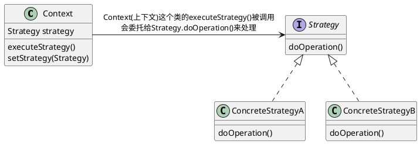

### 策略模式例子:鸭塘模拟游戏
下面例子中鸭子(客户)使用了算法(飞行行为,鸭子行为),不同实现用于替换

joe上班的公司做了一款相当成功的鸭塘模拟游戏SimUDuck.游戏中会出现各种鸭子,一边戏水,一边嘎嘎叫.
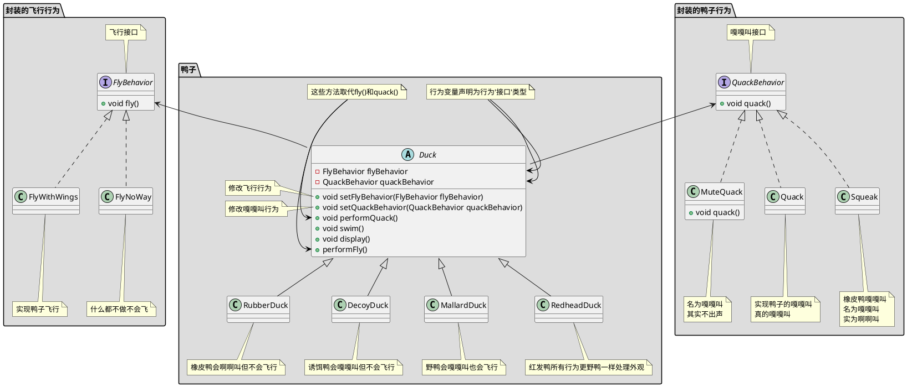

```java

// 叫声行为
public interface QuackBehavior {
    public void quack();
}

// 实现鸭子的嘎嘎叫真的嘎嘎叫
public class Quack implements QuackBehavior {
    public void quack() {
        System.out.println("Quack");
    }
}

// 橡皮鸭嘎嘎叫名为嘎嘎叫实为啊啊叫
public class MuteQuack implements QuackBehavior {
    public void quack() {
        System.out.println("<< Silence >>");
    }
}

// 名为嘎嘎叫其实不出声
public class Squack implements QuackBehavior {
    public void quack() {
        System.out.println("Squack");
    }
}

// 飞行行为
public interface FlyBehavior {
    public void fly();
}

// 实现鸭子飞行
public class FlyWithWings implements FlyBehavior {
    public void fly() {
        System.out.println("fly");
    }
}

// 什么都不做不会飞
public class FlyNoWay implements FlyBehavior {
    public void fly() {
        System.out.println("not fly");
    }
}


// 鸭子抽象类
public abstract class Duck {
    protected QuackBehavior quackBehavior;
    protected FlyBehavior flyBehavior;
    
    public void setFlyBehavior(FlyBehavior flyBehavior) {
        this.flyBehavior = flyBehavior;
    }
    public void setQuackBehavior(QuackBehavior quackBehavior) {
        this.quackBehavior = quackBehavior;
    }

    // 为了执行嘎嘎叫,Duck只要让quackBehavior所引用的对象为嘎嘎叫即可.
    // 在这部分代码中我们不关心具体Duck是那种对象
    // 只要它知道这么quack()就可以了
    public void performQuack() {
        quackBehavior.quack();
    }

    public void performFly() {
        flyBehavior.fly();
    }

    // 识别应用中变化的方面,把它们和不变的方面分开
    public abstract void swim() {
        System.out.println("所有的鸭子都会漂浮，甚至是游泳");
    }
    public abstract void display();

}

// 野鸭会嘎嘎叫也会飞行
public class MallardDuck extends Duck {
    // 实例化Duck的quackBehavior flyBehavior
    public MallardDuck() {
        // MallardDuck 使用Quack类来处理嘎嘎叫,因此 performQuack() 被调用时,嘎嘎叫的责任被委托给Quack对象我们得到了真正的嘎嘎叫
        this.quackBehavior = new Quack();
        this.flyBehavior = new FlyWithWings();
    }

    public void display() {
        System.out.println("我是一个红色的野鸭");
    }
}


// 测试类
public class MiniDuckSimulator {
    public static void main(String[] args) {
        Duck mallard = new MallardDuck();
        mallard.performQuack(); // 输出 Quack
        mallard.performFly(); // 输出 fly

        // 改变为不会飞行
        mallard.setFlyBehavior(new FlyNoWay());
        mallard.performFly(); // 输出 not fly
    }
}

```

## 观察者模式

### 观察者模式定义

定义对象之间的一对多依赖,这样一来,当一个对象改变状态时,它的所有依赖都会收到他嗯直并自动更新

#### 主题/观察者

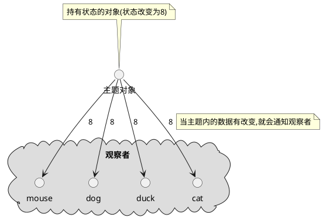

主题和和观察者定义了一对多关系.当主题有变化时,会通知众多观察者.观察者是主题的依赖者,当主题的状态变化,观察者被通知.

观察者模式有几种不同的实现方式,但大多数围绕着包括主题和观察者接口的类设计

#### 观察者模式类图

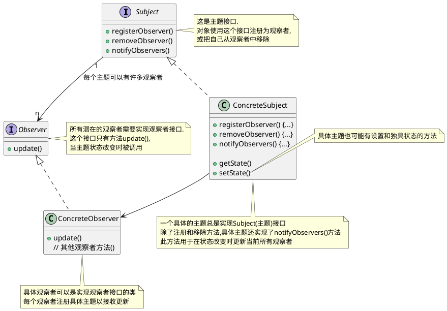

### 观察者模式要点

1. 观察者模式定义对象之间的一对多关系
2. 主题使用通用接口更新观察者
3. 任何具体类型的观察者都可以参与该模式,只要它们实现观察者接口
4. 观察者是松耦合的,处理知道它们实现观察者接口之外,主题对它们的其他事情不知情.
5. 使用该模式时,你可以从主题推或拉数据(拉被认为更 "正确")
6. Swing 大量使用观察者模式,许多 GUI 框架也是这样
7. 你也会在其他很多地方发现该模式,包括 RxJava , JavaBeans 和 RMI , 以及其他语言的框架, 像 Cocoa , Swift 和 JavaScript 事件
8. 观察者模式和出版/订阅模式相关.出版/订阅模式用于更复杂得多主题和/或多消息类型的情形.
9. 观察者模式是一个常用的模式,当我们学习模型-视图-控制器(MVC)时,还会看到它

### 观察者模式探讨

1. 主题一有状态的变化就通知所有的观察者,但某个状态的变化只是部分观察者关心
2. 主题为啥不给特定的观察者状态变化而是把所有状态都给出去
3. 观察者为啥不主动拉取主题状态
4. 观察者不要依赖特的通知次序

### 观察者例子:气象观测站
有一个气象观测站需要追踪当前天气并且有个对象WeatherData追踪当前天气状况,WeatherData对象如下
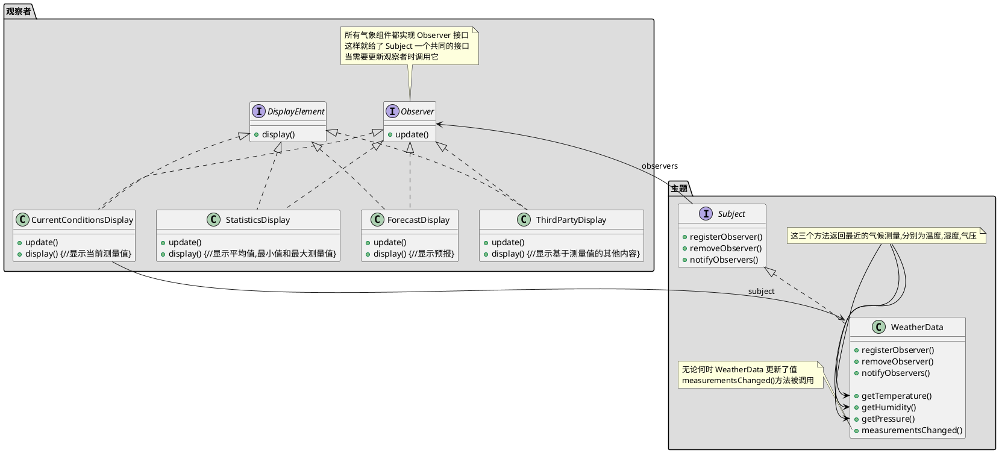

```java

public interface Subject {
    // 这两个方法都用一个Observer作为参数,即要注册或被移除的Observer
    public void registerObserver(Observer o);
    public void removeObserver(Observer o);
    // 当Subject的状态改变时,这个方法会被调用,以通知所有的观察者
    public void notifyObservers();
}

public interface Observer {
    // 这些都是当气象测量数据变化时观察者从Subject获取的状态值
    public void update(float temp, float humidity, float pressure);
}

// DisplayElement 接口只包含一个方法 display(), 当显示元素需要显示时,调用此方法
public interface DisplayElement {
    public void display();     
}


import java.util.*;
// WeatherData 实现 Subject 接口
public class WeatherData implements Subject {
    // 我们添加一个 List 来持有 Observer
    private List<Observer> observers;
    private float temperature;
    private float humidity;
    private float pressure;

    public WeatherData() {
        observers = new ArrayList<Observer>();
    }

    public void registerObserver(Observer o) {
        observers.add(o);
    }

    public void removeObserver(Observer o) {
        observers.remove(o);
    }

    public void notifyObservers() {
        for (Observer observer : observers) {
            observer.update(temperature, humidity, pressure);
        }
    }
   public void measurementsChanged() {
        notifyObservers();
    }

   // 模拟气象站测量到气象数据变化时候嗲用
    public void setMeasurements(float temperature, float humidity, float pressure) {
        this.temperature = temperature;
        this.humidity = humidity;
        this.pressure = pressure;
        measurementsChanged();
    }

    public float getTemperature() {
        return temperature;
    }

    public float getHumidity() {
        return humidity;
    }

    public float getPressure() {
        return pressure;
    }

}

// 这个接口实现了 Observer 方法所以它可以从 WeatherData 对象中获取变化
// 它也实现了 DisplayElement 因为我们的 API 打算要求所有显示元素实现这个接口
public class CurrentConditionsDisplay implements Observer, DisplayElement { 
    private float temperature;
    private float humidity;
    private WeatherData weatherData;
      
    public CurrentConditionsDisplay(WeatherData weatherData) { 
        this.weatherData = weatherData;
        weatherData.registerObserver(this);
    } 
      
    public void update(float temperature, float humidity, float pressure) { 
        this.temperature = temperature;
        this.humidity = humidity;
        display();
    } 
      
    public void display() { 
        System.out.println("Current conditions: " + temperature 
            + "F degrees and " + humidity + "% humidity");
    } 
}

// 测试程序
public class WeatherStation {
      
    public static void main(String[] args) {
        WeatherData weatherData = new WeatherData();
    
        CurrentConditionsDisplay currentDisplay = 
            new CurrentConditionsDisplay(weatherData);
        // StatisticsDisplay statisticsDisplay = new StatisticsDisplay(weatherData); 
        // ForecastDisplay forecastDisplay = new ForecastDisplay(weatherData);

        weatherData.setMeasurements(80, 65, 30.4f);
        weatherData.setMeasurements(82, 70, 29.2f);
        weatherData.setMeasurements(78, 90, 29.2f);
        
        weatherData.removeObserver(forecastDisplay);
        weatherData.setMeasurements(62, 90, 28.1f);
    }
}

```

### Java 内置的观察者模式

#### ~~Java Observer Observable 类~~

在 java9 中已经废弃不讨论

#### JavaBean PropertyChangeEvent

```java
import java.beans.PropertyChangeEvent;
import java.beans.PropertyChangeListener;
import java.beans.PropertyChangeSupport;
import java.io.Serializable;

public class PropertyChangeEventMain {

    public static void main(String[] args) {
        JavaBean bean = new JavaBean();

        bean.setId(1L);
        bean.setName("java bean 1");
        bean.setName("java bean 2");

        // id未发生变化不发送事件
        bean.setId(1L);
    }


    // 这个例子自身即是主题又是观察者
    static class JavaBean implements PropertyChangeListener, Serializable {

        private Long id;
        private String name;

        // 这个是一个主题
        private PropertyChangeSupport pcs = new PropertyChangeSupport(this);

        public JavaBean() {
            // 注册监听所有变化(所有变化观察者)
            pcs.addPropertyChangeListener(this);
            // 注册只是监听 id 的变化(id变化观察者)
            pcs.addPropertyChangeListener("id", this);
            // 注册只是监听 name 的变化(name变化观察者)
            pcs.addPropertyChangeListener("name", this);
        }

        /**
         * 观察者update(),即 Observer.update()
         *
         * @param evt 事件/消息
         */
        @Override
        public void propertyChange(PropertyChangeEvent evt) {
            System.out.println("property name is : " + evt.getPropertyName());
            System.out.println("old value is : " + evt.getOldValue());
            System.out.println("new value is : " + evt.getNewValue());
            System.out.println("======================");
        }
        public Long getId() {
            return this.id;
        }

        public void setId(Long id) {
            Long oldId = this.id;
            this.id = id;

            // 发送 id 已经变更事件, 类似于主题notifyObservers(),即Subject.notifyObservers()
            pcs.firePropertyChange("id", oldId, id);
        }

        public String getName() {
            return this.name;
        }

        public void setName(String name) {
            String oldName = this.name;
            this.name = name;

            // 发送 name 已经变更事件, 类似于主题notifyObservers(),即Subject.notifyObservers()
            pcs.firePropertyChange("name", oldName, name);
        }
    }
}

```

## 装饰者模式

### 装饰者模式定义

***装饰者模式*** 动态地将额外责任附加到对象上.对于扩展功能,装饰者提供子类化之外的弹性替代方案

### 装饰者模式要点

1. 继承是扩展形式之一,但未必是达到弹性设计的最佳方式
2. 在我们的设计中,允许行为可以被扩展,而无需修改已有代码
3. 组合和委托经常可以用来运行时添加新行为
4. 装饰者模式提供了子类化扩展行为的替代品
5. 装饰者模式涉及一群装饰者类,这些类用来包装具体组件
6. 装饰者类反映了它们所装饰组件类型(事实上,它们和所装饰的组件类型相同,都经过了继承或接口实现)
7. 装饰者通过对组件的方法调用之前(或/和之后,甚至在那一刻)添加功能改变其组件的行为
8. 你可以用任意数目装饰者来包裹一个组件
9. 装饰者一般对组件的客户是透明的,除非客户依赖于组件的具体类型
10. 装饰者会导致设计中出现许多小对象,过度使用会让代码变得复杂
11. 适配器包装一个对象以改变其接口, 装饰者包装一个对象以添加新的行为和责任, 而外观 "包装" 一群对象以简化其接口, 三者代码大体一致单意图不一样

### 装饰者模式探讨

- 装饰者有着和所装饰对象相同的超类型
- 你可以用一个或多个装饰者包裹一个对象
- 鉴于装饰者有着和所装饰对象相同的超类型,在需要原始对象的场合,我们可以传递一个被装饰的对象
- ***装饰者在委托给所装饰对象之前或之后添加自己的行为,来在做剩下的工作***
- 对象可以在任何时候被装饰,因此我们可以在运行时用任意数量的装饰者动态地装饰对象,只要我们乐意
- 被装饰的对象尽量使用组合而不是继承,这样我们可以用我们喜欢的方式在运行时混合与匹配装饰者,而不是在编译时静态地决定
- 装饰者模式容易造成大量的小类(参考 java.io 类)
- 装饰者模式有类型问题:如果代码中依赖特定类型,如果引入装饰者就会出问题
    > 比如在starbuzz咖啡中如果 HouseBlend 作了类似打折的事情,一旦我用装饰者包裹 HouseBlend , 代码就不工作了  
    > 只是知道最外层的装饰者,比如对于starbuzz咖啡中如果一个带 Mocha,Soy,Whip的DarkRoast,编码时荣誉引用到Soy而不是Whip,这意味者订单中不包含Whip  
    > 无法户欧链条上的其他装饰,比如对于starbuzz咖啡中如果一个带 Mocha,Soy,Whip的DarkRoast,只是知道最外层
- 装饰者模式会增加实例化组件所需代码的复杂度,一旦用了装饰者,你不只要实例化组件,还要把它包裹进装饰者中
- 组件: 查看 [starbuzz咖啡类图](#starbuzz咖啡类图) 的Beverage注释和package咖啡/具体组件

### 与代理模式区别

TODO 代补充

### 装饰者模式例子: starbuzz咖啡

starbuzz咖啡是以扩张速度最快闻名的咖啡连锁店. 如果你在街角看到它的店, 沿街望去, 还会看到另一家店  
因为扩张实在太快, 他们着急更新其下单系统, 以匹配他们的饮料供应需求

当他们第一次经如业务时, 类设计像这样, 除了咖啡本身, 你也可以要求各种调料, 如摩卡,奶泡...  
这样设计简直类爆炸
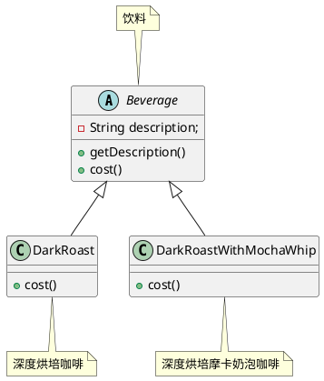

#### starbuzz咖啡类图

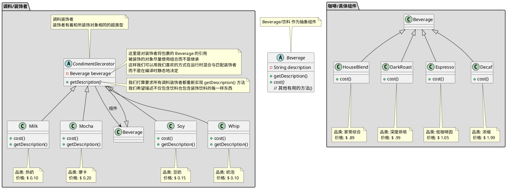
#### 深度烘培摩卡奶泡 代码

```java

// 饮料
public abstract class Beverage {
    String description = "未知饮料";
  
    public String getDescription() {
        return description;
    }   
 
    public abstract double cost();
}

// 家常综合咖啡
public class HouseBlend extends Beverage {
    public HouseBlend() {
        description = "家常综合咖啡";
    }

    public double cost() {
        return .89;
    }
}

// 深度烘培咖啡
public class DarkRoast extends Beverage {
    public DarkRoast() {
        description = "深度烘培咖啡";
    }

    public double cost() {
        return .99;
    }
}

// 低咖啡因咖啡
public class Espresso extends Beverage {

    public Espresso() {
        description = "低咖啡因咖啡";
    }

    public double cost() {
        return 1.99;
    }
}

// 浓缩咖啡
public class Decaf extends Beverage {
    public Decaf() {
        description = "浓缩咖啡";
    }

    public double cost() {
        return 1.05;
    }
}

// 调料装饰者
public abstract class CondimentDecorator extends Beverage {
    Beverage beverage;

    // 我们打算要求所有调料装饰者都重新实现 getDescription() 方法
    // 我们希望描述不仅包含饮料也包含装饰饮料的每一样东西
    public abstract String getDescription();
}

// 热奶
public class Milk extends CondimentDecorator {
    public Milk(Beverage beverage) {
        this.beverage = beverage;
    }

    public String getDescription() {
        return beverage.getDescription() + ", 热奶";
    }

    public double cost() {
        return .10 + beverage.cost();
    }
}

// 摩卡
public class Mocha extends CondimentDecorator {
    public Mocha(Beverage beverage) {
        this.beverage = beverage;
    }

    public String getDescription() {
        return beverage.getDescription() + ", 摩卡";
    }

    public double cost() {
        return .20 + beverage.cost();
    }
}

// 豆奶
public class Soy extends CondimentDecorator {
    public Soy(Beverage beverage) {
        this.beverage = beverage;
    }

    public String getDescription() {
        return beverage.getDescription() + ", 豆奶";
    }

    public double cost() {
        return .15 + beverage.cost();
    }
}

// 奶泡
public class Whip extends CondimentDecorator {
    public Whip(Beverage beverage) {
        this.beverage = beverage;
    }

    public String getDescription() {
        return beverage.getDescription() + ", 奶泡";
    }

    public double cost() {
        return .10 + beverage.cost();
    }
}

// 下单测试代码
public class StarbuzzCoffee {

    public static void main(String args[]) {

        // 要一杯浓缩咖啡,不加调料,打印出他的描述和价格
        Beverage beverage = new Espresso();
        System.out.println(beverage.getDescription()
                + " $" + beverage.cost());

        // 做一个 深度烘培咖啡
        Beverage beverage2 = new DarkRoast();
        // 用一个摩卡包裹它
        beverage2 = new Mocha(beverage2);
        // 用第二个摩卡包裹它
        beverage2 = new Mocha(beverage2);
        // 用一个奶泡包裹它
        beverage2 = new Whip(beverage2);
        System.out.println(beverage2.getDescription()
                + " $" + beverage2.cost());

        // 给我们一份家常豆奶奶泡咖啡
        Beverage beverage3 = new HouseBlend();
        beverage3 = new Soy(beverage3);
        beverage3 = new Mocha(beverage3);
        beverage3 = new Whip(beverage3);
        System.out.println(beverage3.getDescription()
                + " $" + beverage3.cost());

        // 最后给我们一份 深度烘培摩卡奶泡卡咖啡
        Beverage beverage4 = new DarkRoast();
        beverage4 = new Mocha(beverage4);
        beverage4 = new Whip(beverage4);
        System.out.println(beverage4.getDescription()
                + " $" + beverage4.cost());


    }
}

```

#### 深度烘培摩卡奶泡咖啡 调用流程

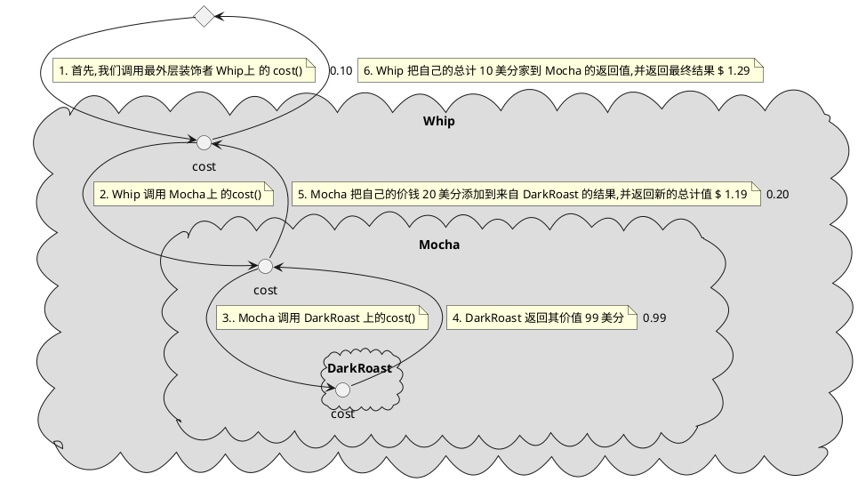

### 装饰者模式在java的应用 java.io

以 InputStream 为例
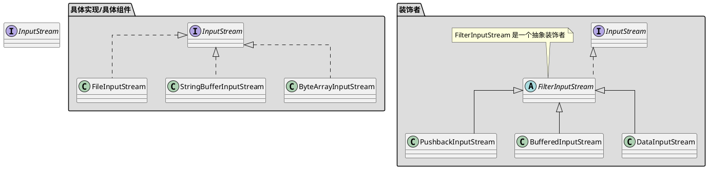

```java
import java.io.*;              

// 把输入流中所有的大写字符转成小写
// 比如读入 "I know the Decorator Pattern therefore I RULE" -> "i know the decorator pattern therefore i rule" 
public class LowerCaseInputStream extends FilterInputStream {
  
    public LowerCaseInputStream(InputStream in) {
        super(in);             
    }
    
    public int read() throws IOException { 
        int c = in.read();
        return (c == -1 ? c : Character.toLowerCase((char)c));
    } 
        
    public int read(byte[] b, int offset, int len) throws IOException {
        int result = in.read(b, offset, len);
        for (int i = offset; i < offset+result; i++) {
            b[i] = (byte)Character.toLowerCase((char)b[i]);
        }
        return result;
    }
}

import java.io.*;

// 测试类
public class InputTest {
    public static void main(String[] args) throws IOException {
        int c;
        InputStream in = null;
        try {
            in =
                new LowerCaseInputStream(
                    new BufferedInputStream(
                        new FileInputStream("test.txt")));

            while((c = in.read()) >= 0) {
                System.out.print((char)c);
            }
        } catch (IOException e) {
            e.printStackTrace();
        } finally {
            if (in != null) { in.close(); }
        }
        System.out.println();
        try (InputStream in2 =
                new LowerCaseInputStream(
                    new BufferedInputStream(
                        new FileInputStream("test.txt"))))
        {
            while((c = in2.read()) >= 0) {
                System.out.print((char)c);
            }
        } catch (IOException e) {
            e.printStackTrace();
        }
    }
}

```

## 工厂模式

### 背景

当你使用new操作符时, 你无疑是在实例化一个具体类,因此这肯定是一个实现而不是接口.  
在技术上,new操作符没有错,有问题的是"变化",以及它对使用new的影响.  
比如你的代码针对接口编写, 那么通过多态它可以和任何这个接口的实现类一起工作.  
但你的代码利用了大量的具体类时,一旦加入新的具体类, 就必须修改代码  
怎样把应用中所有实例化具体类的代码拿出来分离,或者封装起来,这样不会影响应用的其他部分  
> 工厂模式主要用来封装实例化行为, 这样客户在实例化对象时, 只依赖接口, 而不是具体类, 也可以避免代码中的重复

### 工厂模式讨论
1. 如果只有一个 ConcreteCreator (具体创建者) 工厂方法模式也可以将唱片的实现解耦,也不影响Creator(因为Creator没有和任何ConcreteCreator紧耦合)
2. 工厂方法模式的每个ConcreteCreator(具体创建者)都类似于简单工厂模式
3. 工厂方法的Creator类可以时具体的Creator这样就有一个缺省的实现

### 工厂方法要点
1. 所有工厂方法都封装对象的创建
2. 简单工厂不是一个真正的设计模式, 但依然可以作为一个简单的方法, 将客户从具体类解耦
3. 工厂方法靠继承: 对象创建被委托给子类, 子类实现工厂方法来创建对象
4. 抽象工厂靠对象组合: 对象创建在工厂接口暴露的方法中实现
5. 所欧工厂模式都通过减少应用对具体类的依赖, 促进了松耦合
6. 工厂方法的意图, 是允许一个类延迟实例化到其子类
7. 抽象工厂的意图, 是创建相关对象家族, 不必依赖于其具体类
8. 依赖倒置原则指导我们避免依赖具体类型, 尽量依赖抽象
9. 工厂是强有力的技巧, 让我们针对抽象编码, 而不是针对具体类

### 简单工厂

简单工厂不是一个真正的模式,更多是一种编程习惯

#### 简单工厂例子,比萨简单工厂

假设你有一家比萨店, 店里能制作多种比萨, 
有天你想要添加一些流行风味的比萨: 蛤蜊(Clam)比萨, 素食(Veggie)比萨 ,
并且希腊(Greek)比萨销售不佳,因此你决定将它从菜单中去除
所以初始代码如下
```java

public class PizzaStore {
    public Pizza orderPizze(String type) {
        Pizze pizza;
    
        if (type.equals("cheese")) {
            pizza = new CheesePizza();
        } 
        /* 希腊(Greek)比萨销售不佳,因此你决定将它从菜单中去除
        else if (type.equals("greek")) {
            pizza = new GreekPizza();
        }
        **/ 
        else if (type.equals("pepperoni")) {
            pizza = PepperoniPizza();
        } 
        //  有天你想要添加一些流行风味的比萨: 蛤蜊(Clam)比萨, 素食(Veggie)比萨
        else if (type.equals("clam")) {
            pizza = ClamPizza();
        } else if (type.equals("veggie")) {
            pizza = VeggiePizza();
        }
    
        // 准备比萨
        pizza.perpare();
        // 烘焙比萨
        pizza.bake();
        // 切割比萨
        pizza.cut();
        // 打包比萨
        pizza.box();
        
        return pizza;
    }
}
```

显然关于哪个具体类被实例化的代码才是真正搞乱 orderPizze() 方法的罪魁祸首  
如果你添加/减少了具体实现类在所有初始化的地方都需要修改  
所以需要把对象创建移到 orderPizze() 方法外

##### 比萨简单工厂类图

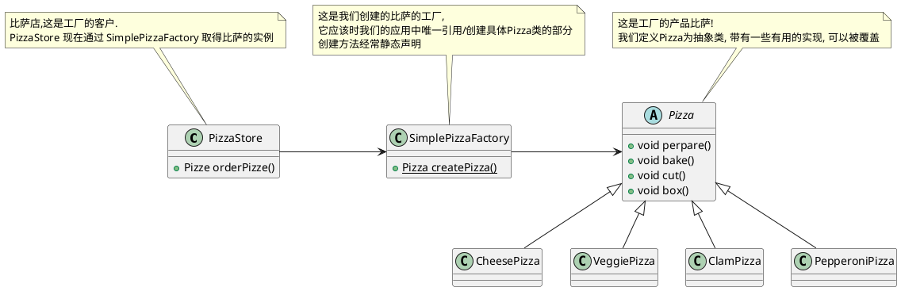

##### 比萨简单工厂代码
```java
public class PizzaStore {      
    SimplePizzaFactory factory;
  
    public PizzaStore(SimplePizzaFactory factory) { 
        this.factory = factory;
    }
  
    public Pizza orderPizza(String type) { 
        Pizza pizza;           
    
        pizza = factory.createPizza(type);
    
        pizza.prepare();
        pizza.bake();
        pizza.cut();
        pizza.box();           

        return pizza;
    }

}

public class SimplePizzaFactory {

    public Pizza createPizza(String type) {
        Pizza pizza = null;

        if (type.equals("cheese")) {
            pizza = new CheesePizza();
        } else if (type.equals("pepperoni")) {
            pizza = new PepperoniPizza();
        } else if (type.equals("clam")) {
            pizza = new ClamPizza();
        } else if (type.equals("veggie")) {
            pizza = new VeggiePizza();
        }
        return pizza;
    }
}

abstract public class Pizza {
    String name;
    
    // 面饼
    String dough;
    // 调味
    String sauce;
    // 陷料
    List<String> toppings = new ArrayList<String>();
  
    public String getName() {  
        return name;
    } 

    // 准备比萨 
    public void prepare() {    
        System.out.println("Preparing " + name);
    }

    // 烘焙比萨
    public void bake() {       
        System.out.println("Baking " + name);
    }

    // 切割比萨
    public void cut() {        
        System.out.println("Cutting " + name);
    }

    // 打包比萨
    public void box() {
        System.out.println("Boxing " + name);
    }

    public String toString() {
        // code to display pizza name and ingredients
        StringBuffer display = new StringBuffer();
        display.append("---- " + name + " ----\n");
        display.append(dough + "\n");
        display.append(sauce + "\n");
        for (String topping : toppings) {
            display.append(topping + "\n");
        }
        return display.toString();
    }

}

public class CheesePizza extends Pizza {
    public CheesePizza() {
        name = "Cheese Pizza";
        dough = "Regular Crust";
        sauce = "Marinara Pizza Sauce";
        toppings.add("Fresh Mozzarella");
        toppings.add("Parmesan");
    }
}


public class ClamPizza extends Pizza {
    public ClamPizza() {
        name = "Clam Pizza";
        dough = "Thin crust";
        sauce = "White garlic sauce";
        toppings.add("Clams");
        toppings.add("Grated parmesan cheese");
    }
}

public class PepperoniPizza extends Pizza {
    public PepperoniPizza() {
        name = "Pepperoni Pizza";
        dough = "Crust";
        sauce = "Marinara sauce";
        toppings.add("Sliced Pepperoni");
        toppings.add("Sliced Onion");
        toppings.add("Grated parmesan cheese");
    }
}

public class VeggiePizza extends Pizza {
    public VeggiePizza() {
        name = "Veggie Pizza";
        dough = "Crust";
        sauce = "Marinara sauce";
        toppings.add("Shredded mozzarella");
        toppings.add("Grated parmesan");
        toppings.add("Diced onion");
        toppings.add("Sliced mushrooms");
        toppings.add("Sliced red pepper");
        toppings.add("Sliced black olives");
    }
}
```


### 工厂方法

定义了一个创建对象的接口, 但由子类决定要实例化那个类. 工厂方法让类把实例化推迟到子类

#### 工厂方法模式类图

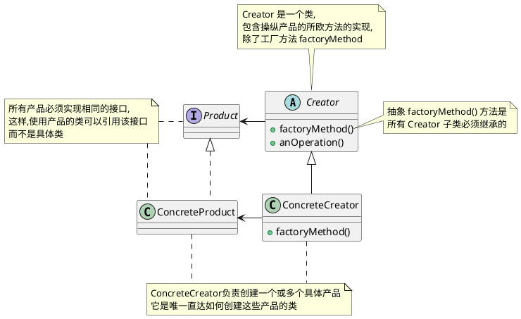

#### 工厂方法模式例子比萨工厂

如果比萨店生意很好, 需要开加盟店, 但是每个地区的人的口味不一样,  
所以需要根据加盟地区提供不同风味的比萨(比如纽约, 芝加哥, 加州)

##### 工厂方法模式例子比萨工厂类图

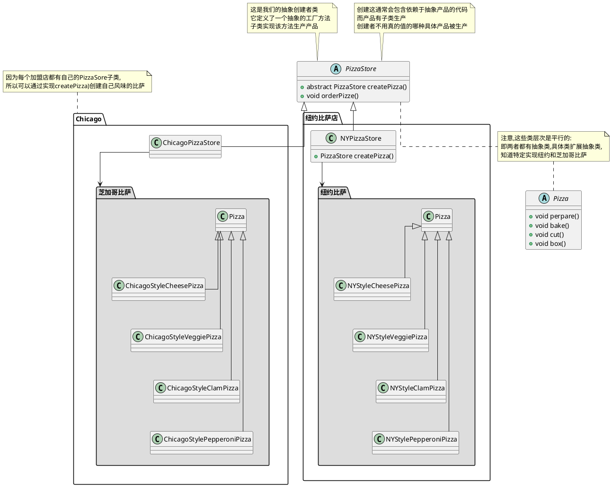

##### 工厂方法模式例子比萨工厂代码

```java
public abstract class PizzaStore {
  
    abstract Pizza createPizza(String item); 
    
    public Pizza orderPizza(String type) { 
        Pizza pizza = createPizza(type);
        System.out.println("--- Making a " + pizza.getName() + " ---");
        pizza.prepare();
        pizza.bake();
        pizza.cut();
        pizza.box();
        return pizza;
    }
}

public abstract class Pizza {
    String name;
    
    // 面饼
    String dough;
    // 调味
    String sauce;
    // 陷料
    List<String> toppings = new ArrayList<String>();
  
    public String getName() {  
        return name;
    } 

    // 准备比萨 
    public void prepare() {    
        System.out.println("Preparing " + name);
    }

    // 烘焙比萨
    public void bake() {       
        System.out.println("Baking " + name);
    }

    // 切割比萨
    public void cut() {        
        System.out.println("Cutting " + name);
    }

    // 打包比萨
    public void box() {
        System.out.println("Boxing " + name);
    }

    public String toString() {
        // code to display pizza name and ingredients
        StringBuffer display = new StringBuffer();
        display.append("---- " + name + " ----\n");
        display.append(dough + "\n");
        display.append(sauce + "\n");
        for (String topping : toppings) {
            display.append(topping + "\n");
        }
        return display.toString();
    }

}

public class NYPizzaStore extends PizzaStore {

    Pizza createPizza(String item) {
        if (item.equals("cheese")) {
            return new NYStyleCheesePizza();
        } else if (item.equals("veggie")) {
            return new NYStyleVeggiePizza();
        } else if (item.equals("clam")) {
            return new NYStyleClamPizza();
        } else if (item.equals("pepperoni")) {
            return new NYStylePepperoniPizza();
        } else return null;
    }
}

public class NYStyleCheesePizza extends Pizza {

    public NYStyleCheesePizza() {
        name = "NY Style Sauce and Cheese Pizza";
        dough = "Thin Crust Dough";
        sauce = "Marinara Sauce";

        toppings.add("Grated Reggiano Cheese");
    }
}

public class ChicagoPizzaStore extends PizzaStore {

    Pizza createPizza(String item) {
        if (item.equals("cheese")) {
            return new ChicagoStyleCheesePizza();
        } else if (item.equals("veggie")) {
            return new ChicagoStyleVeggiePizza();
        } else if (item.equals("clam")) {
            return new ChicagoStyleClamPizza();
        } else if (item.equals("pepperoni")) {
            return new ChicagoStylePepperoniPizza();
        } else return null;
    }
}


public class ChicagoStyleCheesePizza extends Pizza {

    public ChicagoStyleCheesePizza() {
        name = "Chicago Style Deep Dish Cheese Pizza";
        dough = "Extra Thick Crust Dough";
        sauce = "Plum Tomato Sauce";

        toppings.add("Shredded Mozzarella Cheese");
    }

    // 芝加哥比萨重新切割比萨
    void cut() {
        System.out.println("Cutting the pizza into square slices");
    }
}

public class PizzaTestDrive {

    public static void main(String[] args) {
        PizzaStore nyStore = new NYPizzaStore();
        PizzaStore chicagoStore = new ChicagoPizzaStore();

        Pizza pizza = nyStore.orderPizza("cheese");
        System.out.println("Ethan ordered a " + pizza.getName() + "\n");

        pizza = chicagoStore.orderPizza("cheese");
        System.out.println("Joel ordered a " + pizza.getName() + "\n");
    }
}
```

### 工厂方法的依赖倒置

对于使用简单工厂方法的类如下

```java
public class DependentPizzaStore {
  
    public Pizza createPizza(String style, String type) {
        Pizza pizza = null;    
        if (style.equals("NY")) {       
            if (type.equals("cheese")) {
                pizza = new NYStyleCheesePizza();
            } else if (type.equals("veggie")) {
                pizza = new NYStyleVeggiePizza();
            } else if (type.equals("clam")) { 
                pizza = new NYStyleClamPizza(); 
            } else if (type.equals("pepperoni")) { 
                pizza = new NYStylePepperoniPizza();
            }
        } else if (style.equals("Chicago")) {
            if (type.equals("cheese")) {    
                pizza = new ChicagoStyleCheesePizza();
            } else if (type.equals("veggie")) {
                pizza = new ChicagoStyleVeggiePizza();
            } else if (type.equals("clam")) { 
                pizza = new ChicagoStyleClamPizza();
            } else if (type.equals("pepperoni")) { 
                pizza = new ChicagoStylePepperoniPizza();
            }
        } else {               
            System.out.println("Error: invalid type of pizza");
            return null;
        }
        pizza.prepare();
        pizza.bake();
        pizza.cut();
        pizza.box();
        return pizza;
    }
}

```
对象依赖依赖如下

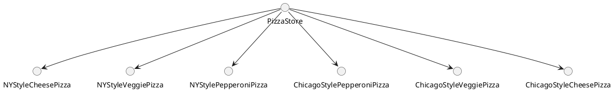

使用工厂方法模式后依赖图如下
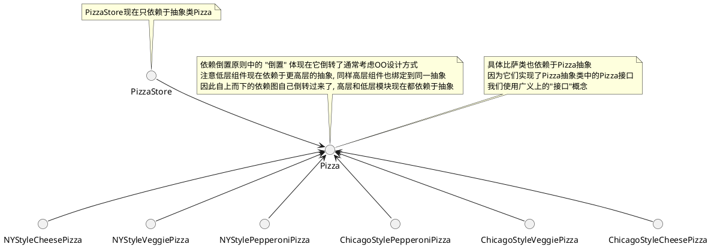

### 抽象工厂模式

`抽象工厂模式`: 提供一个接口来创建相关或依赖对象的家族, 而不需要指定具体类

#### 抽象工厂模式类图

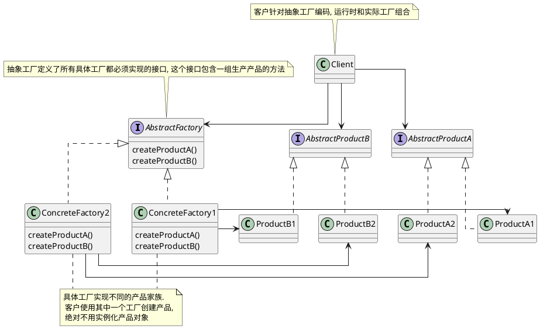

#### 抽象工厂模式例子比萨店的原料工厂

比萨店的成功在于新鲜,高质量的原料, 为了加盟店遵循你的流程, 规范原料, 你打算建立一个原料工厂(抽象工厂)

为了搞定原料工厂你不得不弄清楚如何处理原料家族

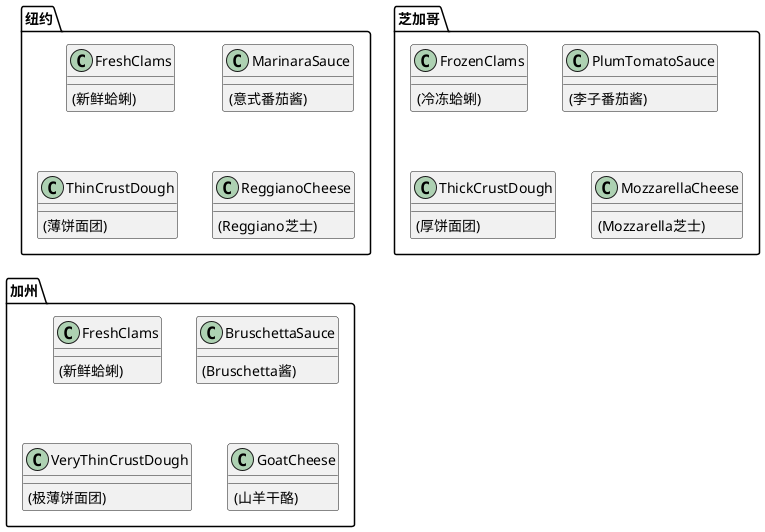

所以对于原料工厂来说, 可以创建所有的原料代码如下

```java
// 比萨原料工厂
public interface PizzaIngredientFactory {

    // 面团
    public Dough createDough();
    // 酱
    public Sauce createSauce();
    // 奶酪
    public Cheese createCheese();
    // 蔬菜
    public Veggies[] createVeggies();
    // 意大利辣香肠
    public Pepperoni createPepperoni();
    // 蛤蜊
    public Clams createClam();

}
```

全部代码如下

```java

// 比萨原料工厂
public interface PizzaIngredientFactory {

    // 面团
    public Dough createDough();
    // 酱
    public Sauce createSauce();
    // 奶酪
    public Cheese createCheese();
    // 蔬菜
    public Veggies[] createVeggies();
    // 意大利辣香肠
    public Pepperoni createPepperoni();
    // 蛤蜊
    public Clams createClam();

}

// 纽约原料工厂
public class NYPizzaIngredientFactory implements PizzaIngredientFactory {
 
    public Dough createDough() {
        return new ThinCrustDough();    
    }
 
    public Sauce createSauce() {    
        return new MarinaraSauce();     
    }
 
    public Cheese createCheese() {  
        return new ReggianoCheese();    
    }
 
    public Veggies[] createVeggies() {
        Veggies veggies[] = { new Garlic(), new Onion(), new Mushroom(), new RedPepper() };
        return veggies;
    }
 
    public Pepperoni createPepperoni() {
        return new SlicedPepperoni();   
    }

    public Clams createClam() {
        return new FreshClams();        
    }
}

// 芝加哥原料工厂
public class ChicagoPizzaIngredientFactory implements PizzaIngredientFactory {

    public Dough createDough() {
        return new ThickCrustDough();
    }

    public Sauce createSauce() {
        return new PlumTomatoSauce();
    }

    public Cheese createCheese() {
        return new MozzarellaCheese();
    }

    public Veggies[] createVeggies() {
        Veggies veggies[] = { new BlackOlives(),
                              new Spinach(),
                              new Eggplant() };
        return veggies;
    }

    public Pepperoni createPepperoni() {
        return new SlicedPepperoni();
    }
    public Clams createClam() {
        return new FrozenClams();
    }
}

// 面团
public interface Dough {
    public String toString();
}

// 酱
public interface Sauce {
    public String toString();
}

// 奶酪
public interface Cheese {
    public String toString();
}

// 蔬菜
public interface Veggies {
    public String toString();
}

// 意大利辣香肠
public interface Pepperoni {
    public String toString();
}

// 蛤蜊
public interface Clams {
    public String toString();
}

// 重做比萨, 主要是将 prepare() 声明未抽象的, 这个方法收集比萨所需的原料, 当然这些原料来自原料工厂
public abstract class Pizza {
    String name;

    // 比萨所需的原料如下
    Dough dough;
    Sauce sauce;
    Veggies veggies[];
    Cheese cheese;
    Pepperoni pepperoni;
    Clams clam;

    abstract void prepare();   

    void bake() {
        System.out.println("Bake for 25 minutes at 350");
    }

    void cut() {
        System.out.println("Cutting the pizza into diagonal slices");
    }

    void box() {
        System.out.println("Place pizza in official PizzaStore box");
    } 
    void setName(String name) {
        this.name = name;
    }

    String getName() {
        return name;
    }
    public String toString() {
        StringBuffer result = new StringBuffer();
        result.append("---- " + name + " ----\n");
        if (dough != null) {
            result.append(dough);
            result.append("\n");
        }
        if (sauce != null) {
            result.append(sauce);
            result.append("\n");
        }
        if (cheese != null) {
            result.append(cheese);
            result.append("\n");
        }
        if (veggies != null) {
            for (int i = 0; i < veggies.length; i++) {
                result.append(veggies[i]);
                if (i < veggies.length-1) {
                    result.append(", ");
                }
            }
            result.append("\n");
        }
        if (clam != null) {
            result.append(clam);
            result.append("\n");
        }
        if (pepperoni != null) {
            result.append(pepperoni);
            result.append("\n");
        }
        return result.toString();
    }
}

// 奶酪比萨如下
public class CheesePizza extends Pizza {
    PizzaIngredientFactory ingredientFactory;

    // 现在要制作比萨, 我们需要一个工厂提供原料
    public CheesePizza(PizzaIngredientFactory ingredientFactory) {
        this.ingredientFactory = ingredientFactory;
    }

    void prepare() {
        System.out.println("Preparing " + name);
        dough = ingredientFactory.createDough();
        sauce = ingredientFactory.createSauce();
        cheese = ingredientFactory.createCheese();
    }
}

public class ClamPizza extends Pizza {
    PizzaIngredientFactory ingredientFactory;

    public ClamPizza(PizzaIngredientFactory ingredientFactory) {
        this.ingredientFactory = ingredientFactory;
    }

    void prepare() {
        System.out.println("Preparing " + name);
        dough = ingredientFactory.createDough();
        sauce = ingredientFactory.createSauce();
        cheese = ingredientFactory.createCheese();
        // 蛤蜊比萨多了蛤蜊
        clam = ingredientFactory.createClam();
    }
}

// 纽约比萨店
public class NYPizzaStore extends PizzaStore {

    protected Pizza createPizza(String item) {
        Pizza pizza = null;
        PizzaIngredientFactory ingredientFactory =
            new NYPizzaIngredientFactory();

        if (item.equals("cheese")) {

            pizza = new CheesePizza(ingredientFactory);
            pizza.setName("New York Style Cheese Pizza");

        } else if (item.equals("veggie")) {

            pizza = new VeggiePizza(ingredientFactory);
            pizza.setName("New York Style Veggie Pizza");

        } else if (item.equals("clam")) {

            pizza = new ClamPizza(ingredientFactory);
            pizza.setName("New York Style Clam Pizza");

        } else if (item.equals("pepperoni")) {

            pizza = new PepperoniPizza(ingredientFactory);
            pizza.setName("New York Style Pepperoni Pizza");

        }
        return pizza;
    }
}


```

类图如下
```plantuml
@startuml
skinparam linetype ortho
package  "比萨原料工厂" as  PizzaIngredientFactory_together #DDDDDD {
    interface PizzaIngredientFactory {
        createDough()
        createSauce()
        createCheese()
        createVeggies()
        createPepperoni()
        createClam()
    }
    
    class NYPizzaIngredientFactory implements PizzaIngredientFactory {
    }
    
    class ChicagoPizzaIngredientFactory implements PizzaIngredientFactory {
    }

}
class NYPizzaStore {
    createPizza()
}

package 比萨原料 as PizzaIngredient_package #DDDDDD {
    together Dough_together {
        interface Dough {}
        class ThickCrustDough implements Dough {}
        class ThinCrustDough implements Dough {}
    }
    
    together Sauce_together {
        interface Sauce {}
        class PlumTomatoSauce implements Sauce {}
        class MarinaraSauce implements Sauce {}
    }
    
    together Cheese_together {
        interface Cheese {}
        class MozzarellaCheese implements Cheese {}
        class ReggianoCheese implements Cheese {}
    }
    
    together Clams_together {
        interface Clams {}
        class FrozenClams implements Clams {}
        class FreshClams implements Clams {}
    }
}

NYPizzaStore --> PizzaIngredientFactory
NYPizzaStore --> Dough
NYPizzaStore --> Sauce
NYPizzaStore --> Cheese
NYPizzaStore --> Clams
NYPizzaIngredientFactory -right-> ThinCrustDough
NYPizzaIngredientFactory -right-> MarinaraSauce
NYPizzaIngredientFactory -right-> ReggianoCheese
NYPizzaIngredientFactory -right-> FreshClams
ChicagoPizzaIngredientFactory -left-> ThickCrustDough
ChicagoPizzaIngredientFactory -left-> PlumTomatoSauce
ChicagoPizzaIngredientFactory -left-> MozzarellaCheese
ChicagoPizzaIngredientFactory -left-> FrozenClams

' 控制布局无意义


NYPizzaStore -down[hidden]--> Dough_together
Dough_together -down[hidden]---> Sauce_together
Sauce_together -down[hidden]---> Cheese_together
Cheese_together -down[hidden]---> Clams_together

PizzaIngredientFactory_together -right[hidden]-> Dough_together
PizzaIngredientFactory_together -right[hidden]-> Sauce_together
PizzaIngredientFactory_together -right[hidden]-> Cheese_together
PizzaIngredientFactory_together -right[hidden]-> Clams_together

@enduml
```

## 单例模式/单件模式

`单例模式`: 确保一个类只有一个实例, 并提供一个全局访问点

### 单例模式讨论

1. 如果有多个类加载器会导致, 多次家在同一个类, 就会产生多个单例
2. 反射和序列化/反序列化可有可能导致多个单例
3. 单例模式违反松耦合原则/单一责任原则
4. 单例模式对比全局变量来说可以做到延迟加载
5. 全局变量怂恿开发人员用大量对小对象的全局引用来污染命名空间

### 单列模式要点

1. 单列模式确保应用中一个类最多只有一个实例
2. 单例模式也是提供访问次实例的全局点
3. Java的单例实现用了一个私有构造器, 一个静态方法以及一个静态变量
4. 检查你的性能和资源, 为多线程应用小心选择一个适当的单例实现(我们英国把所有应用都考虑为时多线程的)
5. 提供双重检查加锁实现, Java5 之前的版本, 不是线程安全的
6. 如果你使用多个类加载器, 要小心, 可能倒置单例实现失效, 导致出现多个实例
7. 你可以使用Java的枚举来简化单列的实现

### 单例模式类图

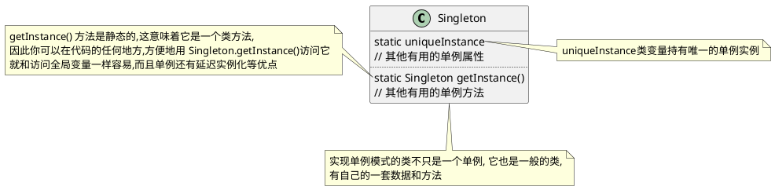

### 单例模式实现

```java
public class Singleton {
    private static Singleton uniqueInstance;
    // 其他有用的单例属性

    private Singleton() {}

    /**
     * <pre>
     * 该方式存在多线程问题, 可能会创建多个 Singleton
     * 但是如果调用 getInstance() 方法没有给你的应用增加很重的负担并且允许有多个实例, 可以使用该方法
     * </pre>
     */
    public static Singleton getInstance() {
        if (uniqueInstance == null) {
            uniqueInstance == new Singleton();
        }
        return uniqueInstance;
    }

    // 其他有用的单例方法
}

public class Singleton {
    private static Singleton uniqueInstance = new Singleton();
    // 其他有用的单例属性

    private Singleton() {}
    
    /**
     * 急切的创建实例, 而不用延迟创建
     */
    public static Singleton getInstance() {
        return uniqueInstance;
    }

    // 其他有用的单例方法
}


public class Singleton {
    // volatile 关键字确保: 当 uniqueInstance 变量被初始化未单例实例时, 多个线程正确处理 uniqueInstance 变量
    private volatile static Singleton uniqueInstance;
    // 其他有用的单例属性

    private Singleton() {}

    /**
     * <pre>
     * 双重检查加锁, 初始化实例, 在特定场景下有问题
     * 当 uniqueInstance 被分配地址但未执行 init 方法时可能会有问题
     * </pre>
     */
    public static Singleton getInstance() {
        // 检查实例, 如果没有, 进入同步区块
        if (uniqueInstance == null) {
            // 注意, 只有第一次才同步
            synchronized (Singleton.class) {
                if (uniqueInstance == null) {
                    // 进入区块后, 再检查一次. 如果依然是空的, 创建一个实例
                    uniqueInstance == new Singleton();
                }
            }
        }
        return uniqueInstance;
    }

    // 其他有用的单例方法
}
```

## 命令模式

`命令模式`: 把请求封装为对象, 以便用不同的请求/队列或者日志请求来参数化其它对象, 并支持可以撤销的操作

### 命令模式要点

1. 命令模式把做出请求的对象从知道如何执行请求的对象解耦
2. 命令对象处在解耦的中心, 封装接收者以及一个(或一组)动作(命令)
3. 调用者通过调用命令对象的execute()做出请求, 这会使得接收者的动作被调用
4. 调用者可以用命令参数化, 甚至可以在运行时动态地进行
5. 通过实现一个undo()方法来把对象重建到最后一次执行execute()前状态, 命令可以支持撤销
6. 宏命令是命令模式的一种简单延伸. 它允许调用多个命令. 同样, 宏命令很容易支持 undo()
7. 在实践中, "聪明" 命令对象并不少见. 这些对象自己实现请求, 而不是委托给接收者
8. 命令也可以用来实现日志和事务系统

### 命令模式类图

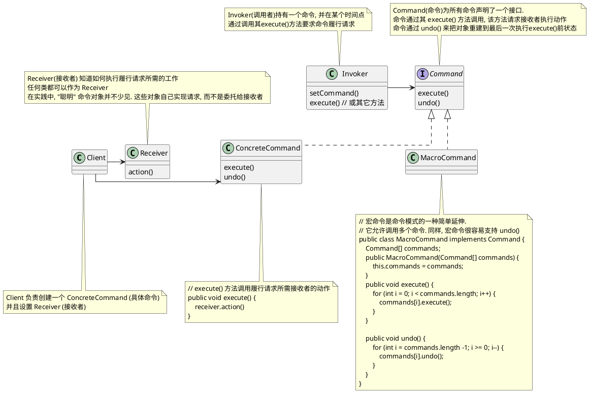
### 命令模式流程图

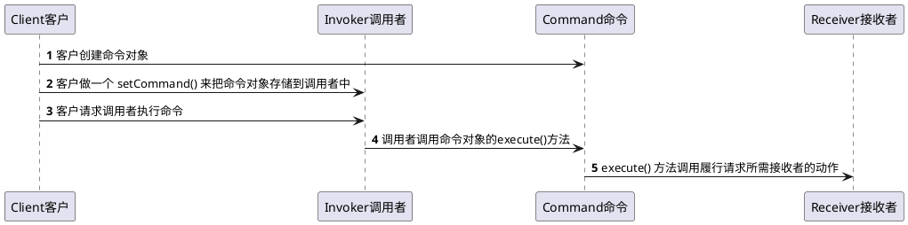

### 命令模式例子遥控器

我们要设计一个遥控器代码, 让每个槽可以被分配控制一个或一组设备  
请注意, 要能沟控制目前所有的设备以及厂商未来可以能提供的任何设备  

以下是我们需要从控制器控制对象的接口, 这些设备中有些接口差别很大

```plantuml
@startuml
' 电灯
class Light {
    on()
    off()
}
note top of Light : 电灯
' 吊扇
class CeilingFan {
    high()
    medium()
    low()
    off()
    getSpeed()
}
note top of CeilingFan : 吊扇
' 电视
class TV {
    on()
    off()
    setInputChannel()
}
note top of TV : 电视

@enduml
```

```plantuml
@startuml

package 遥控器 as remote_control {
    
    together together1 {
        () ON1
        () OFF1

        note right of ON1 : 电灯开
        note left of OFF1 : 电灯关
    }
    
    together together2 {
        () ON2
        () OFF2

        note right of ON2 : 吊扇开到高速\n(由于篇幅问题吊扇低速和中速不展示)
        note left of OFF2 : 吊扇关
    }
    
    together together3 {
        () ON3
        () OFF3

        note right of ON3 : 电视开
        note left of OFF3 : 电视关
    }
  
    together together4 {
        () ON4
        () OFF4

        note right of ON4 : 电灯,电视开,吊扇开到高速
        note left of OFF4 : 电灯,吊扇,电视关
    }
    
    together together_undo {
        () undo
        note right of undo : 对象重建到最后一次执行execute()前状态,\n但电视使用 lambda 无法撤销
    }

' 控制布局无意义

together1 -down[hidden]-> together2
together2 -down[hidden]-> together3
together3 -down[hidden]-> together4
together4 -down[hidden]-> together_undo
}

note top of remote_control
4个槽都有各自的开和关按钮
每组槽都需要编程. 我们可以在每个槽上放不同设备
然后通过按钮控制它
还有一个 undo 槽用来回到把对象重建到最后一次执行execute()前状态
end note

@enduml
```

遥控器类图如下

```plantuml
@startuml

skinparam linetype ortho

class RemoteLoader {

}

class RemoteControl {
    Command[] onCommands;
    Command[] offCommands;

    setCommand()
    onButtonWasPushed()
    offButtonWasPushed()
}

interface Command {
    execute()
}
' 电灯
class Light {
    on()
    off()
}
note top of Light : 电灯
class LightOnCommand implements Command {
    execute()
}
class LightOffCommand implements Command {
    execute()
}

' 吊扇
class CeilingFan {
    high()
    medium()
    low()
    off()
    getSpeed()
}
note top of CeilingFan : 吊扇
class CeilingFanHighCommand implements Command {
    execute()
}
class CeilingFanOffCommand implements Command {
    execute()
}

' 电视
class TV {
    on()
    off()
    setInputChannel()
}
note top of TV : 电视, 使用两个 lambda 表达式生成命令

class MacroCommand implements Command {
    execute()
}

RemoteLoader -> Light
RemoteLoader -> CeilingFan
RemoteLoader -> TV
RemoteLoader -> LightOnCommand
RemoteLoader -> LightOffCommand
RemoteLoader -> CeilingFanHighCommand
RemoteLoader -> CeilingFanOffCommand

RemoteControl -> Command


@enduml
```

代码如下
```java
// This is the invoker(调用者)
public class RemoteControl {
    Command[] onCommands;
    Command[] offCommands;     
    Command undoCommand;
 
    public RemoteControl() {   
        onCommands = new Command[4];
        offCommands = new Command[4];   
 
        Command noCommand = new NoCommand();
        for(int i=0;i<4;i++) { 
            onCommands[i] = noCommand;
            offCommands[i] = noCommand;
        }
        undoCommand = noCommand;        
    }
  
    public void setCommand(int slot, Command onCommand, Command offCommand) {
        onCommands[slot] = onCommand;   
        offCommands[slot] = offCommand; 
    }
    public void onButtonWasPushed(int slot) {
        onCommands[slot].execute();
        undoCommand = onCommands[slot];
    }

    public void offButtonWasPushed(int slot) {
        offCommands[slot].execute();
        undoCommand = offCommands[slot];
    }

    public void undoButtonWasPushed() {
        undoCommand.undo();
    }

    public String toString() {
        StringBuffer stringBuff = new StringBuffer();
        stringBuff.append("\n------ Remote Control -------\n");
        for (int i = 0; i < onCommands.length; i++) {
            stringBuff.append("[slot " + i + "] " + onCommands[i].getClass().getName()
                + "    " + offCommands[i].getClass().getName() + "\n");
        }
        stringBuff.append("[undo] " + undoCommand.getClass().getName() + "\n");
        return stringBuff.toString();
    }
}

// 命令接口
public interface Command {
    public void execute();
    public default void undo() {}

    // 每个命令被执行时, 会存储到磁盘中
    public default void store() {}
    // 系统失败后, 这些对象会被重新加载
    public default Command load() {return null;}
}

// 默认空实现, 防止空指针异常
public class NoCommand implements Command {
    public void execute() { }
    public void undo() { }
}

// 宏命令是命令模式的一种简单延伸
// 它允许调用多个命令. 同样, 宏命令很容易支持 undo()
public class MacroCommand implements Command {
    Command[] commands;

    public MacroCommand(Command[] commands) {
        this.commands = commands;
    }

    public void execute() {
        for (int i = 0; i < commands.length; i++) {
            commands[i].execute();
        }
    }

    /**
     * NOTE:  这些命令必须向后完成，以确保正确的撤消功能
     */
    public void undo() {
        for (int i = commands.length -1; i >= 0; i--) {
            commands[i].undo();
        }
    }
}

// 电灯
public class Light {
    String location = "";

    public Light(String location) {
        this.location = location;
    }

    public void on() {
        System.out.println(location + " light is on");
    }

    public void off() {
        System.out.println(location + " light is off");
    }
}


// 普通的电灯开关(最普通的命令模式)
public class LightOffCommand implements Command {
    Light light;

    public LightOffCommand(Light light) {
        this.light = light;
    }

    public void execute() {
        light.off();
    }

    public void undo() {
        light.on();
    }
}

// 普通的电灯开关(最普通的命令模式)
public class LightOnCommand implements Command {
    Light light;

    public LightOnCommand(Light light) {
        this.light = light;
    }

    public void execute() {
        light.on();
    }

    public void undo() {
        light.off();
    }
}

// 吊扇
public class CeilingFan {
    public static final int HIGH = 3;
    public static final int MEDIUM = 2;
    public static final int LOW = 1;
    public static final int OFF = 0;
    String location;
    int speed;

    public CeilingFan(String location) {
        this.location = location;
    }

    public void high() {
        // turns the ceiling fan on to high
        speed = HIGH;
        System.out.println(location + " ceiling fan is on high");
    }

    public void medium() {
        // turns the ceiling fan on to medium
        speed = MEDIUM;
        System.out.println(location + " ceiling fan is on medium");
    }

    public void low() {
        // turns the ceiling fan on to low
        speed = LOW;
        System.out.println(location + " ceiling fan is on low");
    }

    public void off() {
        // turns the ceiling fan off
        speed = OFF;
        System.out.println(location + " ceiling fan is off");
    }

    public int getSpeed() {
        return speed;
    }
}

// 用状态实现撤销, 吊扇允许有多种转速度, 按钮控制速度为高速
public class CeilingFanHighCommand implements Command {
    CeilingFan ceilingFan;
    // 添加局部变量来跟踪吊扇之前的转速
    int prevSpeed;

    public CeilingFanHighCommand(CeilingFan ceilingFan) {
        this.ceilingFan = ceilingFan;
    }
    public void execute() {
        // 在 execute() 中, 改变吊扇的转速之前, 需要先记录它之前的状态, 以便撤销功能时使用
        prevSpeed = ceilingFan.getSpeed();
        ceilingFan.high();
    }

    // 我们把吊扇的转速设置会之前的转速, 达到撤销的目的
    public void undo() {
        switch (prevSpeed) {
            case CeilingFan.HIGH:   ceilingFan.high(); break;
            case CeilingFan.MEDIUM: ceilingFan.medium(); break;
            case CeilingFan.LOW:    ceilingFan.low(); break;
            default:                ceilingFan.off(); break;
        }
    }
}

// 关闭吊扇
public class CeilingFanOffCommand implements Command {
    CeilingFan ceilingFan;     
    int prevSpeed;
    
    public CeilingFanOffCommand(CeilingFan ceilingFan) {
        this.ceilingFan = ceilingFan;   
    }   
    public void execute() {    
        prevSpeed = ceilingFan.getSpeed();
        ceilingFan.off();      
    } 
    public void undo() {       
        switch (prevSpeed) {
            case CeilingFan.HIGH:   ceilingFan.high(); break;
            case CeilingFan.MEDIUM: ceilingFan.medium(); break;
            case CeilingFan.LOW:    ceilingFan.low(); break;
            default:                ceilingFan.off(); break;
        }
    }
}

public class TV {
    String location;
    int channel;

    public TV(String location) {
        this.location = location;
    }

    public void on() {
        System.out.println(location + " TV is on");
    }

    public void off() {
        System.out.println(location + " TV is off");
    }

    public void setInputChannel() {
        this.channel = 3;
        System.out.println(location + " TV channel is set for DVD");
    }
}

public class RemoteLoader {

    public static void main(String[] args) {

        RemoteControl remoteControl = new RemoteControl();

        // 普通的电灯开关(最普通的命令模式)
        Light light = new Light("Living Room");
        LightOnCommand lightOn = new LightOnCommand(light);
        LightOffCommand lightOff = new LightOffCommand(light);
        remoteControl.setCommand(0, lightOn, lightOff);
        
        // 吊扇开关(用状态实现撤销)
        CeilingFan ceilingFan = new CeilingFan("Living Room");
        CeilingFanHighCommand ceilingFanHigh = new CeilingFanHighCommand(ceilingFan);
        CeilingFanOffCommand ceilingFanOff = new CeilingFanOffCommand(ceilingFan);
        remoteControl.setCommand(1, ceilingFanHigh, ceilingFanOff);
 
        // 电视开关, 使用 lambda 表达式, 不支持 undo()
        TV tv = new TV("Living Room");
        remoteControl.setCommand(2, () -> tv.on(), tv.off());
        
        // 宏命令模式, 同时开启电灯和吊扇高速和电视, 和同时关闭电灯和吊扇和电视
        Command[] partyOn = { lightOn, ceilingFanHigh};
        Command[] partyOff = { lightOff, ceilingFanOff};
        MacroCommand partyOnMacro = new MacroCommand(partyOn);
        MacroCommand partyOffMacro = new MacroCommand(partyOff);
        remoteControl.setCommand(3, partyOnMacro, partyOffMacro);

        System.out.println(remoteControl);
        System.out.println("--- Pushing Macro On---");
        remoteControl.onButtonWasPushed(0);
        System.out.println("--- Pushing Macro Off---");
        remoteControl.offButtonWasPushed(0);
    }
}

```

### 命令模式使用场景

#### 请求队列(如线程池)

命令把一小块计算打包(一个接收者和一组动作), 然后把它作为头筹对象传来传去.   
即使在一些客户应用创建命令对象很久之后, 计算自身依然可能被调用.  
事实上, 甚至可以被不用线程调用. 我们可以把这个场景应用到许多应用上  
比如: 日程安排, 线程池, 以及作业队列


想象一个作业队列: 你添加命令到队列的一端, 另一端有一组线程.  
线程运行以下脚本: 从队列移除命令, 调用其 execute() 方法,  
等待这个调用完成, 然后丢弃该命令对象, 检索新的命令对象......  
作业对象类完全从做计算的对象解耦. 这一分钟, 线程可能做财务计算,  
下一分钟可能从网络检索信息.  
作业队列对象不关心, 它们只检索命令并调用 exectue() 
同样, 只要你把对象放进去实现命令模式的队列, 当线程可用时, execute() 方法就会被调用


#### 日志请求

如果某些应用需要我们把所有动作都记录在日志中, 并能在系统崩溃后, 通过重新调用这些动作来恢复, 我们可以通过添加两个方法 store(), load(), 命令模式能够支持这一点. 在 JAVA 中我们可以使用对象序列化来实现这些方法

那么这样做呢? 单我们执行命令时, 把历史存储在磁盘中, 一旦出现崩溃, 就重新加载命令对象, 并成批地依次调用它们的 execute() 方法

```plantuml
@startuml

() 调用者 as invoker
() Command1 as command1
() Command2 as command2
() Command3 as command3

[持久化机器] as store

invoker ..> command1 : 1. execute()
invoker ..> command2 : 2. execute()
invoker ..> command3 : 3. execute()

command1 --> store : 存储
command2 --> store : 存储
command3 --> store : 存储

@enduml
```

崩溃后从持久化机器上重建

```plantuml
@startuml

() 调用者 as invoker
() Command1 as command1
() Command2 as command2
() Command3 as command3

[持久化机器] as store

invoker ..> command1 : 1. execute()
invoker ..> command2 : 2. execute()
invoker ..> command3 : 3. execute()

command1 <-- store : 加载
command2 <-- store : 加载
command3 <-- store : 加载

@enduml
```

## 适配器模式

`适配器模式`: 将一个类的接口(对象)转换成客户期望夫人另一个接口(对象). 适配器让原本不兼容的类可合作. 这使得客户从所实现的接口解耦

### 适配器模式要点

1. 适配器不一定只能包装一个类, 存在适配器持有两个或以上要实现不标接口的被适配者的情况
2. 当你需要使用一个已有的类, 而其接口不符合你的需要, 就用适配器
3. 适配器改变接口以符合客户的期望
4. 实现一个适配器可能不需要花什么功夫, 也可能花很多功夫, 视目标接口的大小与复杂度而定
5. 适配器模式有两种形式: 对象适配器和类适配器. 类适配器需要用到多重继承
6. 适配器包装一个对象以改变其接口, 装饰者包装一个对象以添加新的行为和责任, 而外观 "包装" 一群对象以简化其接口, 三者代码大体一致单意图不一样

### 适配器模式类图

#### 对象适配器类图

```plantuml
@startuml

class Client {
}

note bottom of Client : 客户只看到目标接口

interface Target {
    request()
}

class Adapter implements Target {
    request()
}

note "适配器实现目标接口" as Target_Adapter_note
Target_Adapter_note .. Target
Target_Adapter_note .. Adapter


Class Adaptee {
    speciffcRequest()
}

Client -> Target
Adapter -> Adaptee : 适配器和被适配者组合\n所有请求都被委托给被适配者

@enduml
```

#### 类适配器

```plantuml
@startuml

class Client {
}


class Target {
    request()
}

Class Adaptee {
    speciffcRequest()
}

class Adapter extends Target, Adaptee {
    request()
}

note bottom of Adapter
适配器现在继承被适配者和目标类(多重继承)
而不是用组合来适配被适配者(java无多重继承)
end note

Client -> Target

@enduml
```

### 适配器模式大体流程

```plantuml
@startuml

() 客户 as client
() 适配器 as adapter
() 被适配者 as adaptee

client -> adapter : request()
adapter -> adaptee : translatedRequest()

note top of client : 客户针对目标接口实现
note bottom of adapter : 适配器实现目标接口, 并持有被适配者的实例
note top of adapter : 目标接口
note top of adaptee : 被适配者接口

@enduml
```

```plantuml
@startuml
autonumber

participant 客户 as client
participant 适配器 as adapter
participant 被适配者 as adaptee

client -> adapter : 客户通过使用不标接口, 调用适配器的方法, 对适配器做出请求
adapter -> adaptee : 适配器使用被适配者接口, 把请求翻译成被适配者上的一个或多个调用
adapter --> client : 客户收到调用接口, 但根本不知道时适配器做翻译

note over of client : 注意, 客户和被适配者解耦了,\n 彼此不知道对方

@enduml
```


### 适配器模式例子

我们需要将火鸡伪装成一个鸭子

```java

// 鸭子接口
public interface Duck {        
    // 叫声
    public void quack();
    // 飞行
    public void fly();
}

// 绿头鸭
public class MallardDuck implements Duck {
    public void quack() {
        System.out.println("Quack");
    }

    public void fly() {
        System.out.println("I'm flying");
    }
}

// 火鸡
public interface Turkey {      
    public void gobble();
    public void fly();
} 

// 野生的火鸡
public class WildTurkey implements Turkey {
    public void gobble() {
        System.out.println("Gobble gobble");
    }

    // 火鸡只会短途飞行
    public void fly() {
        System.out.println("I'm flying a short distance");
    }
}

// 火鸡适配器, 把火鸡伪装成鸭子
// 首先需要实现适配类型的接口, 这是你的客户期望看到的接口
public class TurkeyAdapter implements Duck {
    // 接下来, 需要取得要适配的对象引用, 者可我们通过构造器得到
    Turkey turkey;

    public TurkeyAdapter(Turkey turkey) {
        this.turkey = turkey;
    }

    // 现在我们需要实现接口中的所有方法, quack() 在类之间的翻译很容易, 只要调用 gobble() 方法
    public void quack() {
        turkey.gobble();
    }

    // 即使两个接口都有 fly() 方法, 火鸡的分析只是短距离冲刺, 不能像鸭子那样长途飞行
    // 要在 Duck 的 fly() 方法和 Turkey 的 fly() 方法之间形成映射, 我们需要调用 Turkey 的 fly() 方法五次来补足
    public void fly() {
        for(int i=0; i < 5; i++) {
            turkey.fly();
        }
    }
}

// 测试
public class DuckTestDrive {
    public static void main(String[] args) {
        Duck duck = new MallardDuck();

        Turkey turkey = new WildTurkey();
        Duck turkeyAdapter = new TurkeyAdapter(turkey);

        System.out.println("The Turkey says...");
        turkey.gobble();
        turkey.fly();

        System.out.println("\nThe Duck says...");
        testDuck(duck);

        System.out.println("\nThe TurkeyAdapter says...");
        testDuck(turkeyAdapter);

    }

    static void testDuck(Duck duck) {
        duck.quack();
        duck.fly();
    }
}

```

## 外观模式

`外观模式`: 为子系统中的一组接口提供了一个统一的接口. 外观定义了一个更高级的接口, 使得子系统更容易使用.

### 外观模式类图

```plantuml
@startuml

class Client {}

class Facade {}

package 子系统的类 {
    class Service1 {}
    class Service2 {}
    class Service3 {}

    Service1 -> Service3
}

Client -right-> Facade
Facade -down-> Service1
Facade -down-> Service2
@enduml
```
### 外观模式例子

1. 当你需要简化并统一一个大接口, 或者一个复杂的接口集, 就用外观
2. 外观将客户从一个复杂子系统解耦
3. 实现外观需要把外观和子系统组合, 使用委托来执行外观的工作
4. 你可以为一个子系统实现多个外观
5. 适配器包装一个对象以改变其接口, 装饰者包装一个对象以添加新的行为和责任, 而外观 "包装" 一群对象以简化其接口, 三者代码大体一致单意图不一样

### 外观模式例子: 家庭影院

你在家里观赏一部电影, 你需要以下几个步骤

1. 打开爆米花机
2. 开始爆米花
3. 调暗灯光
4. 放下屏幕
5. 打开投影机
6. 设置投影机输入为流媒体播放器
7. 把投影机设置在宽屏模式
8. 打开功放
9. 设置功放为流媒体输入
10. 设置功放为环绕音响
11. 设置功放音量为中(5)
12. 打开流媒体播放器
13. 开始放电影

这些涉及到 6个类, 13个动作, 但还有更多,   
电影结束后, 把这些东西关掉, 你不得不反向地把这一切再过一遍  
听广播是不是也时这样复杂

```plantuml
@startuml
skinparam linetype ortho

class 遥控器  {
    watchMovie()
    endMovie()
}

遥控器 -down-> HomeTheaterFacade : 遥控器是子系统外观的客户

note right of 遥控器
你的客户代码现在调用家庭影院的外观方法, 而不是子系统的方法
因此现在我们只要调用一个方法 watchMovie() 
它会和灯,流媒体播放器,投影机,功放,屏幕,爆米花机等沟通
end note

class HomeTheaterFacade {
    watchMovie()
    endMovie()
    listenToRadio()
    endRadio()
}

package 设备子系统 as system {
    class Tuner {
        amplifier
        
        on()
        off()
        setAm()
        setFrequency()
        toString()
    }
    
    class Amplifier {
        Tuner tuner
        player

        on()
        off()
        ' 设置流媒体播放器
        setStreamingPlayer()
        ' 设置立体声
        setStereoSound()
        ' 设置环绕声
        setSurroundSoud()
        setTuner()
        setVolume()
        toString()
    }

    class StreamingPlayer {
        amplifier

        on()
        off()
        pause()
        play()
        setSurroundAudio()
        setTwoChannelAudio()
        stop()
        toString()
    }

    class Screen {
        on()
        off()
        toString()
    }

    class PopcornPopper {
        on()
        off()
        pop()
        toString()
    }

    class TheaterLights {
        on()
        off()
        dim()
        toString()
    }

    class Projector {
        player

        on()
        off()
        tvMode()
        WideScreenMode()
        toString()
    }

    Tuner -> Amplifier
    Amplifier -> Tuner
    Amplifier -> StreamingPlayer
    StreamingPlayer -> Amplifier
    Projector -> StreamingPlayer
}

note bottom of system
外观依然保持子系统可以访问,所以你可以直接使用
如果你需要子系统类的高阶功能, 它们还是可以使用
end note

HomeTheaterFacade -down-> Tuner
HomeTheaterFacade -down-> StreamingPlayer
HomeTheaterFacade -down-> Screen
HomeTheaterFacade -down-> PopcornPopper
HomeTheaterFacade -down-> TheaterLights
HomeTheaterFacade -down-> Projector

@enduml
```

```java
public class HomeTheaterFacade {
    Amplifier amp;             
    Tuner tuner;               
    StreamingPlayer player;    
    CdPlayer cd;               
    Projector projector;       
    TheaterLights lights;      
    Screen screen;             
    PopcornPopper popper;      
  
    public HomeTheaterFacade(Amplifier amp, 
                 Tuner tuner,  
                 StreamingPlayer player,
                 Projector projector,            
                 Screen screen,
                 TheaterLights lights,           
                 PopcornPopper popper) {         
 
        this.amp = amp;
        this.tuner = tuner;    
        this.player = player;  
        this.projector = projector;     
        this.screen = screen;  
        this.lights = lights;  
        this.popper = popper;  
    }
    public void watchMovie(String movie) {
        System.out.println("Get ready to watch a movie...");
        popper.on();
        popper.pop();
        lights.dim(10);
        screen.down();
        projector.on();
        projector.wideScreenMode();
        amp.on();
        amp.setStreamingPlayer(player);
        amp.setSurroundSound();
        amp.setVolume(5);
        player.on();
        player.play(movie);
    }

    public void endMovie() {
        System.out.println("Shutting movie theater down...");
        popper.off();
        lights.on();
        screen.up();
        projector.off();
        amp.off();
        player.stop();
        player.off();
    }

    public void listenToRadio(double frequency) {
        System.out.println("Tuning in the airwaves...");
        tuner.on();
        tuner.setFrequency(frequency);
        amp.on();
        amp.setVolume(5);
        amp.setTuner(tuner);
    }

    public void endRadio() {
        System.out.println("Shutting down the tuner...");
        tuner.off();
        amp.off();
    }
}

// 是时候观赏电影了(容易方式)
public class HomeTheaterTestDrive {
    public static void main(String[] args) {
        Amplifier amp = new Amplifier("Amplifier");
        Tuner tuner = new Tuner("AM/FM Tuner", amp);
        StreamingPlayer player = new StreamingPlayer("Streaming Player", amp);
        CdPlayer cd = new CdPlayer("CD Player", amp);
        Projector projector = new Projector("Projector", player);
        TheaterLights lights = new TheaterLights("Theater Ceiling Lights");
        Screen screen = new Screen("Theater Screen");
        PopcornPopper popper = new PopcornPopper("Popcorn Popper");

        HomeTheaterFacade homeTheater =
                new HomeTheaterFacade(amp, tuner, player,
                        projector, screen, lights, popper);

        homeTheater.watchMovie("Raiders of the Lost Ark");
        homeTheater.endMovie();
    }
}

```

## 模板方法模式

`模板方法模式`: 在一个方法中定义一个算法的骨架, 而把一些步骤延迟到子类. 莫把方法使得子类可以在不改变算法结构的情况下, 重新定义算法的某些步骤.

它是一个把算法算法定义为一组步骤的方法. 这些步骤中的一个或多个被定义为抽象的, 由子类实现

### 模板方法模式要点

1. 模板方法定义了算法的步骤把这些步骤的实现延迟到子类
2. 模板方法模式为我们提供了一种代码复用的重要技巧
3. 模板方法的抽象类可以定义具体方法,抽象方法和钩子
4. 抽象方法由子类实现
5. 钩子是一种方法, 它在抽象类中不做事或者只做缺省的事情, 但子类可以覆盖它
6. 为防止子类改变模板方法中的算法, 可以把模板方法声明为 `final`
7. [好莱坞原则](#好莱坞原则于模板方法)告诉我们, 把决策权放在高层模块中(调用者), 以便决定如何以及和是调用低层模块
8. 你会在现实世界代码中看到模板方法模式大量使用, 但(任何模式都是)不奥期待它们全都是 "按书本" 设计的
9. 策略模式和模板方法模式都封装算法, 前者通过组合, 后者通过继承
10. 工厂方法是模板方法的一个特例

### 模板方法模式类图

```plantuml
@startuml

abstract AbstractClass {
    + templateMethod()
    # {abstract} abstract primitiveOperation1()
    # {abstract} abstract primitiveOperation2()
    # hook()
}

note left of AbstractClass::templateMethod
AbstractClass (抽象类) 包含模板方法

模板方法用原语操作来实现算法
它从这些操作的实际实现解耦
primitiveOperation1();
primitiveOperation12
end note
note "以及模板方法所用到的操作的抽象方法\nprimitiveOperation1\nprimitiveOperation2" as primitiveOperation_note
primitiveOperation_note .left. AbstractClass::primitiveOperation1
primitiveOperation_note .left. AbstractClass::primitiveOperation2

note left of AbstractClass::hook
钩子时一个声明在抽象类中的方法, 但它只给出空的或缺省的实现.
这个给了子类在变化店 "挂钩进" 算法的能力, 
如果需要子类也有权忽略钩子
end note

class ConcreteClass extends AbstractClass {
    # primitiveOperation1()
    # primitiveOperation2()
}

note left of ConcreteClass
可能由很多 ConcreteClass (忽略钩子的具体类)
每一个都实现模板方法所需的全部操作
end note

note right of ConcreteClass
ConcreteClass实现抽象操作
当 templateMethod() 需要它们时, 就被调用
end note


class ConcreteWithHookClass extends AbstractClass {
    # primitiveOperation1()
    # primitiveOperation2()
    # hook()
}

note bottom of ConcreteWithHookClass
实现钩子的具体类
end note

@enduml
```

### 模板方法模式例子: 星巴克煮茶和煮咖啡

在星巴克中煮茶和煮咖啡遵循一以下冲泡法

星巴克咖啡冲泡法
1. 把水煮沸腾
2. 用沸水冲泡咖啡
3. 把咖啡倒进杯子
4. 加糖和奶

星巴克茶冲泡法
1. 把水煮沸腾
2. 用沸水冲浸泡茶叶
3. 把茶倒进杯子
4. 加柠檬

我们来扮演 "代码师傅", 编写一些创建咖啡和茶的代码

```java
// 咖啡
public class Coffee {
 
    void prepareRecipe() {
        // 1. 把水煮沸腾
        boilWater();
        // 2. 用沸水冲泡咖啡
        brewCoffeeGrinds();
        // 3. 把咖啡倒进杯子
        pourInCup();
        // 4. 加糖和奶
        addSugarAndMilk();
    }   
 
    public void boilWater() {
        System.out.println("Boiling water");
    }   
 
    public void brewCoffeeGrinds() {
        System.out.println("Dripping Coffee through filter");
    }   
 
    public void pourInCup() {
        System.out.println("Pouring into cup");
    }   
 
    public void addSugarAndMilk() {
        System.out.println("Adding Sugar and Milk");
    }   
}

// 茶叶
public class Tea {

    void prepareRecipe() {
        // 1. 把水煮沸腾
        boilWater();
        // 2. 用沸水冲浸泡茶叶
        steepTeaBag();
        // 3. 把茶倒进杯子
        pourInCup();
        // 4. 加柠檬
        addLemon();
    }

    public void boilWater() {
        System.out.println("Boiling water");
    }

    public void steepTeaBag() {
        System.out.println("Steeping the tea");
    }

    public void addLemon() {
        System.out.println("Adding Lemon");
    }

    public void pourInCup() {
        System.out.println("Pouring into cup");
    }
}
```

比较代码发现步骤1,3 一致, 2, 4 不一样所以抽象为模板方法类图如下

请注意我们
1. 步骤2 用沸水冲泡咖啡 和 把咖啡倒进杯子 我们统称为酿造(brew)
2. 步骤4 加柠檬 和 加糖和奶 我们统一称为添加调味(addCondiments)
3. 添加调味我们添加钩子函数 customerWantsCondiments (消费者想要调料) 来判断是否需要调料


```plantuml
@startuml

abstract CaffeineBeverage {
    + prepareRecipe()
    - boilWater()
    # {abstract} abstract brew()
    - pourInCup()
    # {abstract} abstract addCondiments()
    # customerWantsCondiments()
}

note top of CaffeineBeverage : 咖啡因饮料抽象类
note left of CaffeineBeverage::prepareRecipe
咖啡因饮料冲泡模板方法固定流程为
1. 把水煮沸腾 boilWater()
2. 酿造饮料 brew()
3. 把饮料倒进杯子 pourInCup()
4. 如果消费者想要调料 customerWantsCondiments(为钩子函数默认为需要) 则 添加调味 addCondiments()
end note

class Coffee extends CaffeineBeverage {
    # brew()
    # addCondiments()
}

class TeaWithHook extends CaffeineBeverage {
    # brew()
    # addCondiments()
    # customerWantsCondiments()
}

note left of TeaWithHook::customerWantsCondiments
茶叶重载钩子函数customerWantsCondiments(消费者想要调料)
去询问消费者是否需要
如果不重载比如咖啡则默认需要
end note

note "咖啡和茶叶特定方法留在子类中\n酿造饮料 brew()\n添加调味 addCondiments()" as CaffeineBeverage_note
CaffeineBeverage_note .up. TeaWithHook
CaffeineBeverage_note .up. Coffee

' 控制布局无意义
TeaWithHook .right[hidden]. Coffee

@enduml
```

代码如下

```java
public abstract class CaffeineBeverage {
 
    final void prepareRecipe() {
        // 1. 把水煮沸腾
        boilWater();
        // 2. 酿造饮料
        brew();
        // 3. 把饮料倒进杯子
        pourInCup();
        // 4.  如果消费者想要调料 customerWantsCondiments(为钩子函数默认为需要) 则 添加调味 addCondiments()
        if (customerWantsCondiments()) {
            addCondiments();
        }   
    }   
 
    abstract void brew();
 
    abstract void addCondiments();
 
    void boilWater() {
        System.out.println("Boiling water");
    }   
 
    void pourInCup() {
        System.out.println("Pouring into cup");
    }   
 
    boolean customerWantsCondiments() {
        return true;
    }   
}

public class Coffee extends CaffeineBeverage {
    public void brew() {
        System.out.println("Dripping Coffee through filter");
    }
    public void addCondiments() {
        System.out.println("Adding Sugar and Milk");
    }
}

import java.io.*;

public class TeaWithHook extends CaffeineBeverage {

    public void brew() {
        System.out.println("Steeping the tea");
    }

    public void addCondiments() {
        System.out.println("Adding Lemon");
    }

    public boolean customerWantsCondiments() {

        String answer = getUserInput();

        if (answer.toLowerCase().startsWith("y")) {
            return true;
        } else {
            return false;
        }
    }

    private String getUserInput() {
        // get the user's response
        String answer = null;

        System.out.print("Would you like lemon with your tea (y/n)? ");

        BufferedReader in = new BufferedReader(new InputStreamReader(System.in));
        try {
            answer = in.readLine();
        } catch (IOException ioe) {
            System.err.println("IO error trying to read your answer");
        }
        if (answer == null) {
            return "no";
        }
        return answer;
    }
}

```

### 好莱坞原则于模板方法

模板方法模式符合好莱坞原则, 以 茶叶,咖啡冲泡法为例

```plantuml
@startuml


abstract CaffeineBeverage {
    + prepareRecipe()
    - boilWater()
    # {abstract} abstract brew()
    - pourInCup()
    # {abstract} abstract addCondiments()
    # customerWantsCondiments()
}
note left of CaffeineBeverage
CaffeineBeverage 是我们的高层组件. 它控制冲泡的算法
只有在需要子类实现某个方法时, 才调用子类
end note

note right of CaffeineBeverage
饮料的客户依赖 CaffeineBeverage 抽象
而不依赖具体的 Tea 或 Coffee
这减少了整个系统中的依赖
end note

class Coffee extends CaffeineBeverage {
    # brew()
    # addCondiments()
}

class TeaWithHook extends CaffeineBeverage {
    # brew()
    # addCondiments()
    # customerWantsCondiments()
}

note "子类只简单用来提供实现细节\n如果没先被'调用'Tea和Coffee绝不会直接调用抽象类" as CaffeineBeverage_note
CaffeineBeverage_note .up. Coffee
CaffeineBeverage_note .up. TeaWithHook


@enduml
```

### 模板方法模式例子: JAVA排序

java  Arrays排序数组,虽然没按照要求实现一个算法并让子类通过步骤的实现,但正如我们知道的, 真实情况中的模式不可能和教科书中的一致

这个排序实现看起来更像策略模式, 但 Arrays 为 sort 实现的算法并不完整, 所以它更像模板方法

```java
class Arrays {
    public static void sort(Object[] a) {
        Object[] aux = (Object[])a.clone();
        mergeSort(aux, a, 0, a.length, 0);
    }

    public void static mergeSort(Object[] src, Object[] dest[] int low, int high, int off) {
        for (int i = low; i < high; i++) {
            // 我们需要实现compareTo()方法, 以 "填充" 模板方法
            for (int j = i; j < low && ((Comparable)desc[j-1]).compareTo(((Comparable)desc[j])) > 0; j--) {
                // 具体方法, 已经在数组类中定义
                swap(dest, j, j-1);
            }
        }
    }
}

public class Duck implements Comparable<Duck> {
    String name;
    int weight;

    public Duck(String name, int weight) {
        this.name = name;
        this.weight = weight;
    }

    public String toString() {
        return name + " weighs " + weight;
    }

    public int compareTo(Duck otherDuck) {


        if (this.weight < otherDuck.weight) {
            return -1;
        } else if (this.weight == otherDuck.weight) {
            return 0;
        } else { // this.weight > otherDuck.weight
            return 1;
        }
    }
} 

public class DuckSortTestDrive {

    public static void main(String[] args) {
        Duck[] ducks = {
                        new Duck("Daffy", 8),
                        new Duck("Dewey", 2),
                        new Duck("Howard", 7),
                        new Duck("Louie", 2),
                        new Duck("Donald", 10),
                        new Duck("Huey", 2)
         };

        System.out.println("Before sorting:");
        display(ducks);

        Arrays.sort(ducks);

        System.out.println("\nAfter sorting:");
        display(ducks);
    }

    public static void display(Duck[] ducks) {
        for (Duck d : ducks) {
            System.out.println(d);
        }
    }
}

```


## 迭代器模式

`迭代器模式`: 提供一种方式, 可以访问一个聚合对象中的元素而又不暴露其潜在的表示  
`外部迭代器`: 客户通过调用next()取得下一个元素, 以此控制遍历  
`内部迭代器`: 内部迭代器由迭代器自己控制, 在这种情况下, 因为迭代器在元素之间游走, 你不得不告诉迭代器在游走时对这些元素做什么时期, 也就是说,你要有办法把操作传递给迭代器


这个模式给你了一种遍历聚合元素而又不必知道事物在底层如何表达的方式.

迭代器模式拿走了遍历元素的责任, 把它交给迭代器对象, 而不是聚合对象


### 迭代器模式类图

```plantuml
@startuml

interface Aggregate<T> {
    Iterator createIterator()
}

note top of Aggregate
聚合由一个共同的接口, 这对客户来说是很方便
它把客户从集合对象的实现解耦
end note

class ConcreteAggregate<T> implements Aggregate {
    Iterator createIterator()
}

note bottom of ConcreteAggregate
ConcreteAggregate 有一个对象的集合,
并实现一个方法, 该方法返回集合的迭代器
每一个 ConcreteAggregate 负责实例化一个能够遍历其对象集合的 ConcreteIterator
end note

ConcreteAggregate -right--> ConcreteIterator


class Clinet {

}

Clinet -left----> Aggregate
Clinet -right----> Iterator

interface Iterator<T> {
    boolean hasNext()
    T next()
    boolean remove()
}

note top of Iterator
Iterator接口提供了所有迭代器都必须实现的接口
它提供了一个遍历集合元素的方法集
在这里, 我们用的是java.util.Iterator
如果你不想用Java的迭代器接口可以创建自己的接口
end note

class ConcreteIterator<T> implements Iterator {
    boolean hasNext()
    T next()
    boolean remove()
}

note bottom of ConcreteIterator
ConcreteIterator 负责管理当前遍历的位置
end note

note "迭代器模式的类图于工厂模式的类图相似" as all_note

@enduml
```

### 迭代器模式要点

1. 迭代器允许访问聚合的元素, 而不暴露其内部结构
2. 迭代器将遍历聚合的工作取出并封装进一个对象
3. 当使用迭代器时, 在支持遍历数据的操作方面,我们减轻了聚合的责任
4. 迭代器提供了一个遍历聚合项的共同接口, 当我们编码使用聚项时,就可以使用多态
5. Iterable接口让我们能够获取迭代器和时哦嗯Java的 enchaced for loop
6. 我们应该致力于只为一个类分配一个责任

### 迭代器模式例子:餐厅菜单

对象村餐厅和对象村煎饼屋合并, 现在我们可以在同一个地方, 享用煎饼屋美味的煎饼早餐, 以及好吃的餐厅午餐.  
虽然煎饼屋和餐厅都同意使用MenuItem(菜单项),但是煎饼屋使用 ArrayList<MenuItem> 实现菜单, 餐厅使用 MenuItem[] 实现菜单  
在遍历打印煎饼屋和餐厅的菜单时候就需要实现两个不同的循环

我们可以封装遍历吗?
1. 要遍历早餐项, 我们用ArrayList的size()和get()方法
    > for (intt i = 0; i < breakfastItems.size(); i++) {  
    >     MenuItem menuItem = breakfastItems.get(i);  
    > }  

2. 要遍历无餐项, 我们用数组的length字段以及数组下标标记
    > for (intt i = 0; i < lunchItems.size(); i++) {  
    >     MenuItem menuItem = lunchItems[]i];  
    > }  

3. 现在我们创建一个对象, 我们称为迭代器(Iterator), 它封装遍历对象集合的方式, 我们在 ArrayList 上试试
    > Iterator iterator = breakfastMenu.createIterator();  
    > while(iterator.hasNext()) {  
    >    MenuItem menuItem = iterator.next();  
    > }  

4. 在数组上也试试
    > Iterator iterator = lunchMenu.createIterator();  
    > while(iterator.hasNext()) {  
    >    MenuItem menuItem = iterator.next();  
    > }  

代码如下:

```java

// 菜单项
public class MenuItem {
    String name;
    String description;
    boolean vegetarian;
    double price;
 
    public MenuItem(String name,    
                    String description,             
                    boolean vegetarian,             
                    double price)                   
    {
        this.name = name;      
        this.description = description; 
        this.vegetarian = vegetarian;   
        this.price = price;    
    }
  
    public String getName() {
        return name;
    }
  
    public String getDescription() {
        return description;    
    }
    public double getPrice() {
        return price;
    }

    public boolean isVegetarian() {
        return vegetarian;
    }
}

// 菜单
public interface Menu {
    public Iterator<MenuItem> createIterator();
}


import java.util.ArrayList;    
import java.util.Iterator;     
    
// 煎饼屋菜单实现
public class PancakeHouseMenu implements Menu {
    ArrayList<MenuItem> menuItems;  
 
    public PancakeHouseMenu() {
        menuItems = new ArrayList<MenuItem>();
        addItem("K&B's Pancake Breakfast", "Pancakes with scrambled eggs, and toast", true, 2.99);
        addItem("Regular Pancake Breakfast", "Pancakes with fried eggs, sausage", false,2.99);
        addItem("Blueberry Pancakes", "Pancakes made with fresh blueberries, and blueberry syrup", true, 3.49);\
        addItem("Waffles", "Waffles, with your choice of blueberries or strawberries", true, 3.59);
    }

    public void addItem(String name, String description, boolean vegetarian, double price) {
        MenuItem menuItem = new MenuItem(name, description, vegetarian, price);
        menuItems.add(menuItem);
    }

    public ArrayList<MenuItem> getMenuItems() {
        return menuItems;
    }

    public Iterator<MenuItem> createIterator() {
        return menuItems.iterator();
    }

}

import java.util.Iterator;

// 餐厅菜单
public class DinerMenu implements Menu {
    static final int MAX_ITEMS = 6;
    int numberOfItems = 0;
    MenuItem[] menuItems;

    public DinerMenu() {
        menuItems = new MenuItem[MAX_ITEMS];

        addItem("Vegetarian BLT", "(Fakin') Bacon with lettuce & tomato on whole wheat", true, 2.99);
        addItem("BLT", "Bacon with lettuce & tomato on whole wheat", false, 2.99);
        addItem("Soup of the day", "Soup of the day, with a side of potato salad", false, 3.29);
        addItem("Hotdog", "A hot dog, with saurkraut, relish, onions, topped with cheese", false, 3.05);
        addItem("Steamed Veggies and Brown Rice", "Steamed vegetables over brown rice", true, 3.99);
        addItem("Pasta", "Spaghetti with Marinara Sauce, and a slice of sourdough bread", true, 3.89);
    }

    public void addItem(String name, String description, boolean vegetarian, double price) {
        MenuItem menuItem = new MenuItem(name, description, vegetarian, price);
        if (numberOfItems >= MAX_ITEMS) {
            System.err.println("Sorry, menu is full!  Can't add item to menu");
        } else {
            menuItems[numberOfItems] = menuItem;
            numberOfItems = numberOfItems + 1;
        }
    }

    public MenuItem[] getMenuItems() {
        return menuItems;
    }

    public Iterator<MenuItem> createIterator() {
        // 返回餐厅菜单迭代器
        return new DinerMenuIterator(menuItems);
        //return new AlternatingDinerMenuIterator(menuItems);
    }

    // other menu methods here
}

import java.util.Iterator;

// 餐厅菜单迭代器
public class DinerMenuIterator implements Iterator<MenuItem> {
    MenuItem[] list;
    int position = 0;

    public DinerMenuIterator(MenuItem[] list) {
        this.list = list;
    }

    public MenuItem next() {
        MenuItem menuItem = list[position];
        position = position + 1;
        return menuItem;
    }

    public boolean hasNext() {
        if (position >= list.length || list[position] == null) {
            return false;
        } else {
            return true;
        }
    }

    public void remove() {
        if (position <= 0) {
            throw new IllegalStateException
                ("You can't remove an item until you've done at least one next()");
        }
        if (list[position-1] != null) {
            for (int i = position-1; i < (list.length-1); i++) {
                list[i] = list[i+1];
            }
            list[list.length-1] = null;
        }
    }

}

import java.util.List;
 
public class Waitress { 
    Menu pancakeHouseMenu;
    Menu dinerMenu;
 
    public Waitress(Menu pancakeHouseMenu, Menu dinerMenu) { 
        this.pancakeHouseMenu = pancakeHouseMenu;
        this.dinerMenu = dinerMenu;
    } 
      
    // implicit iteration
    // 打印合并后的餐厅菜单项目
    public void printMenu() { 
        // 未使用迭代器时候需要分别打印
        List<MenuItem> breakfastItems = ((PancakeHouseMenu) pancakeHouseMenu).getMenuItems();
        for (int i = 0; i < breakfastItems.size(); i++) { 
            printMenuItem(breakfastItems.get(i));
        } 
          
        MenuItem[] lunchItems = ((DinerMenu) dinerMenu).getMenuItems();
        for (int i = 0; lunchItems.length; i++) { 
            printMenuItem(lunchItems[i]);
        } 

        // 使用迭代器后统一打印
        Iterator<MenuItem> pancakeIterator = pancakeHouseMenu.createIterator();
        Iterator<MenuItem> dinerIterator = dinerMenu.createIterator();

        System.out.println("MENU\n----\nBREAKFAST");
        printMenu(pancakeIterator);
        System.out.println("\nLUNCH");
        printMenu(dinerIterator);
    }

      
    public void printMenuItem(MenuItem menuItem) { 
        System.out.print(menuItem.getName() + ", ");
        System.out.print(menuItem.getPrice() + " -- ");
        System.out.println(menuItem.getDescription());
    }

    private void printMenu(Iterator<MenuItem> iterator) {
        while (iterator.hasNext()) {
            MenuItem menuItem = iterator.next();
            System.out.print(menuItem.getName() + ", ");
            System.out.print(menuItem.getPrice() + " -- ");
            System.out.println(menuItem.getDescription());
        }
    }


}
```

```plantuml
@startuml

interface Menu {
    createIterator()
}

class PancakeHouseMenu implements Menu {
    List<MenuItem> menuItems

    createIterator()
}

note bottom of PancakeHouseMenu
煎饼屋菜单
end note

class DinerMenu implements Menu {
    MenuItem[] menuItems

    createIterator()
}

note bottom of DinerMenu
餐厅菜单
end note

class Waitress {
    printMenu()
}

note top of Waitress : 招待员只关心 Menu和Iterator


interface Iterator {
    hasNext()
    next()
    remove()
}

class PancakeHouseMenuIterator implements Iterator {
    hasNext()
    next()
    remove()
}

note bottom of PancakeHouseMenuIterator
煎饼屋菜单的迭代器使用java.util提供的 ArrayList 迭代器
不再使用这个类
end note

class DinerMenuIterator implements Iterator {
    hasNext()
    next()
    remove()
}

note bottom of DinerMenuIterator
餐厅菜单迭代器
end note

Waitress -left--> Menu
Waitress -right--> Iterator

@enduml
```

## 组合模式

`组合模式`: 允许你将对象组合成树形结构来表现 部分-整体 层次结构. 组合让客户可以统一处理 个别对象(叶子节点) 和 对象组合 (非叶子节点)

组合模式允许我们以树的形式创建对象结构, 树的节点包含对象组合和个别对象

使用组合结构, 我们可以对组合和个个别对象应用同样的操作. 换句话说, 在大多数情况下我们可以忽略对象组合和个别对象之间的差别


### 组合模式类图

```plantuml
@startuml


class Client {

}

note top of Client
Client 使用 Component 接口来奥在组合中的对象
end note

abstract class Component {
    operation()
    add(Component component)
    remove(Component component)
    getChild(int i)
}

note top of Component
Component 为组合中的所有对象定义一个接口, 包括 组合 和 叶子
Component 可能为 add(), remove(), getChild() 以及它的操作实现缺省行为(比如抛出异常)
end note

class Left extends Component {
    operation()
}

note bottom of Left
1. 叶子节点也继承像add(),remove(),getChild()这样的方法,这些方法对叶子节点不一定有意义
2. 叶子节点没有孩子节点
3. 通过实现 Composite 支持的操作, 叶子为 Composite 内的元素定义行为
end note

class Composite extends Component {
    List<Component> childs

    operation()
    add(Component component)
    remove(Component component)
    getChild(int i)
}

note bottom of Composite
Composite的角色是定义有孩子的组件的行为
Composite也实现叶子相关的操作. 主要其中一些操作可能对 Composite没有意义,因此这个情况下可能会产生异常
end note

Client -right--> Component

Composite --> Component

@enduml
```

### 组合模式要点

1. 组合模式违反了单一责任原则, 它是用单一责任原则来换取透明性,即通过允许组件接口包含孩子的管理操作和叶子操作,使得客户可以统一地对待组合和叶子,因此客户来说一个元素是组合还是叶子节点,对于客户来说是透明的
2. 组合模式允许客户统一地处理组合和个别对象
3. 组合结构内的任意对象称为组件. 组件可以是其他组合或者叶子
4. 实现组合模式有许多设计上的折衷. 你要根据需要平衡透明和安全

### 组合模式例子: 餐厅菜单

一家餐厅的菜单中存在子菜单(为一颗树), 大概结构如下

意思时如果我们有了树形结构的菜单,子菜单可能还有子子菜单以及菜单项, 那么任何菜单都是一个 '组合' , 因为它可以包含其他菜单和菜单项. 个别对象就是菜单项, 它们不持有其他对象


```plantuml
@startuml

() 所有菜单
() 煎饼屋菜单
() 餐厅菜单

() 煎饼屋菜单1
() 煎饼屋菜单2
() 煎饼屋菜单3

() 餐厅菜单1
() 餐厅菜单2
() 餐厅菜单3

() 甜点菜单
() 甜点菜单1
() 甜点菜单2
() 甜点菜单3

所有菜单 --> 煎饼屋菜单
所有菜单 --> 餐厅菜单

煎饼屋菜单 --> 煎饼屋菜单1
煎饼屋菜单 --> 煎饼屋菜单2
煎饼屋菜单 --> 煎饼屋菜单3

餐厅菜单 --> 餐厅菜单1
餐厅菜单 --> 餐厅菜单2
餐厅菜单 --> 餐厅菜单3
餐厅菜单 --> 甜点菜单

甜点菜单 --> 甜点菜单1
甜点菜单 --> 甜点菜单2
甜点菜单 --> 甜点菜单3
@enduml
```
类图如下

```plantuml
@startuml

class Waitress {

}

note top of Waitress : 服务员

abstract class MenuComponent {
    getName()
    getDescription()
    getPrice()
    isVegetarian()
    print()
    add(MenuComponent component)
    remove(MenuComponent component)
    getChild(int i)
}

note top of MenuComponent : 菜单组件

class MenuItem extends MenuComponent {
    getName()
    getDescription()
    getPrice()
    isVegetarian()
    print()
}

note bottom of MenuItem : 菜单项(具体的菜名)

class Menu extends MenuComponent {
    getName()
    getDescription()
    print()
    add(MenuComponent component)
    remove(MenuComponent component)
    getChild(int i)
}

note bottom of Menu : 菜单包含一系列菜


Waitress -right--> MenuComponent

@enduml
```

代码如下

```java
import java.util.*;
  
public class CompositeIterator implements Iterator<MenuComponent> {
    Stack<Iterator<MenuComponent>> stack = new Stack<Iterator<MenuComponent>>();
   
    public CompositeIterator(Iterator<MenuComponent> iterator) {
        stack.push(iterator);
    }   
   
    public MenuComponent next() {
        if (hasNext()) {
            Iterator<MenuComponent> iterator = stack.peek();
            MenuComponent component = iterator.next();
            stack.push(component.createIterator());
            return component;
        } else {
            return null;
        }
    }   
  
    public boolean hasNext() {
        if (stack.empty()) {
            return false;
        } else {
            Iterator<MenuComponent> iterator = stack.peek();
            if (!iterator.hasNext()) {
                stack.pop();
                return hasNext();
            } else {
                return true;
            }
        }
    }

    /*
     * No longer needed as of Java 8
     * 
     * (non-Javadoc)
     * @see java.util.Iterator#remove()
     *
    public void remove() {
        throw new UnsupportedOperationException();
    }
    */
}

import java.util.Iterator;

public class NullIterator implements Iterator<MenuComponent> {

    public MenuComponent next() {
        return null;
    }

    public boolean hasNext() {
        return false;
    }

    /*
     * No longer needed as of Java 8
     *
     * (non-Javadoc)
     * @see java.util.Iterator#remove()
     *
    public void remove() {
        throw new UnsupportedOperationException();
    }
    */
}

import java.util.*;

public abstract class MenuComponent {

    public void add(MenuComponent menuComponent) {
        throw new UnsupportedOperationException();
    }
    public void remove(MenuComponent menuComponent) {
        throw new UnsupportedOperationException();
    }
    public MenuComponent getChild(int i) {
        throw new UnsupportedOperationException();
    }

    public String getName() {
        throw new UnsupportedOperationException();
    }
    public String getDescription() {
        throw new UnsupportedOperationException();
    }
    public double getPrice() {
        throw new UnsupportedOperationException();
    }
    public boolean isVegetarian() {
        throw new UnsupportedOperationException();
    }

    public abstract Iterator<MenuComponent> createIterator();

    public void print() {
        throw new UnsupportedOperationException();
    }
}


import java.util.Iterator;

public class MenuItem extends MenuComponent {

    String name;
    String description;
    boolean vegetarian;
    double price;

    public MenuItem(String name,
                    String description,
                    boolean vegetarian,
                    double price)
    {
        this.name = name;
        this.description = description;
        this.vegetarian = vegetarian;
        this.price = price;
    }

    public String getName() {
        return name;
    }

    public String getDescription() {
        return description;
    }

    public double getPrice() {
        return price;
    }

    public boolean isVegetarian() {
        return vegetarian;
    }

    public Iterator<MenuComponent> createIterator() {
        return new NullIterator();
    }

    public void print() {
        System.out.print("  " + getName());
        if (isVegetarian()) {
            System.out.print("(v)");
        }
        System.out.println(", " + getPrice());
        System.out.println("     -- " + getDescription());
    }

}


import java.util.Iterator;
import java.util.ArrayList;

public class Menu extends MenuComponent {
    Iterator<MenuComponent> iterator = null;
    ArrayList<MenuComponent> menuComponents = new ArrayList<MenuComponent>();
    String name;
    String description;

    public Menu(String name, String description) {
        this.name = name;
        this.description = description;
    }

    public void add(MenuComponent menuComponent) {
        menuComponents.add(menuComponent);
    }

    public void remove(MenuComponent menuComponent) {
        menuComponents.remove(menuComponent);
    }

    public MenuComponent getChild(int i) {
        return menuComponents.get(i);
    }

        public String getName() {
        return name;
    }

    public String getDescription() {
        return description;
    }


    public Iterator<MenuComponent> createIterator() {
        if (iterator == null) {
            iterator = new CompositeIterator(menuComponents.iterator());
        }
        return iterator;
    }

    public void print() {
        System.out.print("\n" + getName());
        System.out.println(", " + getDescription());
        System.out.println("---------------------");

        Iterator<MenuComponent> iterator = menuComponents.iterator();
        while (iterator.hasNext()) {
            MenuComponent menuComponent = iterator.next();
            menuComponent.print();
        }
    }
}


import java.util.Iterator;

public class Waitress {
    MenuComponent allMenus;

    public Waitress(MenuComponent allMenus) {
        this.allMenus = allMenus;
    }

    public void printMenu() {
        allMenus.print();
    }

    public void printVegetarianMenu() {
        Iterator<MenuComponent> iterator = allMenus.createIterator();

        System.out.println("\nVEGETARIAN MENU\n----");
        while (iterator.hasNext()) {
            MenuComponent menuComponent = iterator.next();
            try {
                if (menuComponent.isVegetarian()) {
                    menuComponent.print();
                }
            } catch (UnsupportedOperationException e) {}
        }
    }
}


public class MenuTestDrive {
    public static void main(String args[]) {

        MenuComponent pancakeHouseMenu =
            new Menu("PANCAKE HOUSE MENU", "Breakfast");
        MenuComponent dinerMenu =
            new Menu("DINER MENU", "Lunch");
        MenuComponent cafeMenu =
            new Menu("CAFE MENU", "Dinner");
        MenuComponent dessertMenu =
            new Menu("DESSERT MENU", "Dessert of course!");

        MenuComponent allMenus = new Menu("ALL MENUS", "All menus combined");

        allMenus.add(pancakeHouseMenu);
        allMenus.add(dinerMenu);
        allMenus.add(cafeMenu);

        pancakeHouseMenu.add(new MenuItem(
            "K&B's Pancake Breakfast",
            "Pancakes with scrambled eggs and toast",
            true,
            2.99));
        pancakeHouseMenu.add(new MenuItem(
            "Regular Pancake Breakfast",
            "Pancakes with fried eggs, sausage",
            false,
            2.99));
        pancakeHouseMenu.add(new MenuItem(
            "Blueberry Pancakes",
            "Pancakes made with fresh blueberries and blueberry syrup",
            true,
            3.49));
        pancakeHouseMenu.add(new MenuItem(
            "Waffles",
            "Waffles with your choice of blueberries or strawberries",
            true,
            3.59));

        dinerMenu.add(new MenuItem(
            "Vegetarian BLT",
            "(Fakin') Bacon with lettuce & tomato on whole wheat",
            true,
            2.99));
                dinerMenu.add(new MenuItem(
            "BLT",
            "Bacon with lettuce & tomato on whole wheat",
            false,
            2.99));
        dinerMenu.add(new MenuItem(
            "Soup of the day",
            "A bowl of the soup of the day, with a side of potato salad",
            false,
            3.29));
        dinerMenu.add(new MenuItem(
            "Hot Dog",
            "A hot dog, with saurkraut, relish, onions, topped with cheese",
            false,
            3.05));
        dinerMenu.add(new MenuItem(
            "Steamed Veggies and Brown Rice",
            "A medly of steamed vegetables over brown rice",
            true,
            3.99));

        dinerMenu.add(new MenuItem(
            "Pasta",
            "Spaghetti with marinara sauce, and a slice of sourdough bread",
            true,
            3.89));

        dinerMenu.add(dessertMenu);
       dessertMenu.add(new MenuItem(
            "Apple Pie",
            "Apple pie with a flakey crust, topped with vanilla icecream",
            true,
            1.59));
        dessertMenu.add(new MenuItem(
            "Cheesecake",
            "Creamy New York cheesecake, with a chocolate graham crust",
            true,
            1.99));
        dessertMenu.add(new MenuItem(
            "Sorbet",
            "A scoop of raspberry and a scoop of lime",
            true,
            1.89));

        cafeMenu.add(new MenuItem(
            "Veggie Burger and Air Fries",
            "Veggie burger on a whole wheat bun, lettuce, tomato, and fries",
            true,
            3.99));
        cafeMenu.add(new MenuItem(
            "Soup of the day",
            "A cup of the soup of the day, with a side salad",
            false,
            3.69));
        cafeMenu.add(new MenuItem(
            "Burrito",
            "A large burrito, with whole pinto beans, salsa, guacamole",
            true,
            4.29));

        Waitress waitress = new Waitress(allMenus);

        waitress.printVegetarianMenu();
        waitress.printMenu();

    }
}

```

## 状态模式

`状态模式`: 允许对象(Context)在内部状态改变时改变其行为. 对象(Context)看起来好像改变了它的类

### 状态模式类图

```plantuml
@startuml

class Context {
    State currentState
    State state1
    State state2
    request()
}

note left of Context::currentState
当前状态,无论和时Context上的request()被调用,
就会被委托给状态(当前状态)来处理
end note
note left of Context::state1
Context(上下文)这个类有很多内部状态.
end note


abstract class State {
    handle()
}

note top of State
State接口定义了一个所有具体状态的共同接口
所有状态都实现了这个相同的接口, 这一就可以互换
end note


class ConcreteStateA extends State {
    handle()
}
class ConcreteStateB extends State {
    handle()
}

note "ConcreteState(具体状态)处理来自Context的请求.\n每一个ConcreteState都提供它自己对于请求的实现.\n这样,当Context改变状态时,行为也跟着改变" as ConcreteState_note
ConcreteState_note .left. ConcreteStateA
ConcreteState_note .left. ConcreteStateB


Context -right-> State

@enduml
```

### 状态模式讨论

1. 状态和策略模式有相同的类图, 但它们的意图不同
    > 对于状态模式, 我们把一组行为封装进状态对象, context 随时(把责任)委托给这些状态之一. 随着时间的推移, 当前状态不断在各个状态对象之间改变, 以反映context的内部状态, 因此, context 的行为也随着时间的推移而改变. 客户通常对状态对象知道得很少, 甚至不知道  
    > 对于策略模式, 客户通常指定context要组合的策略对象. 现在, 虽然模式提供了弹性, 可以在运行时改变策略对象, 但对于一个context对象来说, 经常有一个最合适的策略对象  
    > 一般来说, 把策略模式想成子类化的一个弹性替代方案; 如何你使用继承定义了一个类的行为, 那么你就和这个行为粘在一起了, 很难改变  
    > 把状态模式想成在context中放进于多条件的一个替代方案, 通过把行为封装进状态对象, 你可以简单地在context中改变状态对象来改变其行为  

2. 状态迁移可以由State类或Context类控制: 一般状态迁移固定时适合由Context控制, 动态时由State控制, 但由State控制会造成状态类之间的依赖
3. 状态由Context使用,代表其内部状态和行为, 客户不直接跟状态交互

### 状态模式要点

1. 状态模式允许一个对象基于内部状态拥有许多不同的行为
2. 和过程式状态机不同, 状态模式用真正的类代表每个状态
3. Context把行为委托给所组合的当前状态对象
4. 通过把每个状态封装进一个类, 我们把以后需要做的任何变化局部化了.
5. 状态和策略模式有相同的类图, 但它们的意图不同
6. 策略模式通常会用行为或算法来配置Context类
7. 状态模式允许Context随这状态改变而改变行为
8. 状态迁移可以由State类或Context类控制.
9. 状态类可以在多个Context实例之间共享

### 状态模式例子: 糖果机

糖果机有以下几个状态

1. 没有25分钱
2. 有25分钱
3. 赢家
4. 糖果已售出
5. 糖果已售馨

操作如下

1. 投入25分钱: insertQuarter()
2. 吐25分钱: ejectQuarter()
3. 转动曲柄: turnCrank()
4. 发放糖果(发放更多时候时糖果机自己调用自己的内部方法) : dispense()
5. 补充糖果 : refill()

其中状态机如下

```plantuml
@startuml


[*] -> 没有25分钱
没有25分钱 --> 有25分钱 : 投入25分钱 \n insertQuarter()
有25分钱 --> 没有25分钱 : 吐25分钱 \n ejectQuarter()

state 是否有赢家 <<choice>>
有25分钱 --> 是否有赢家 : 转动曲柄 \n turnCrank()
是否有赢家 --> 赢家 : [我们有一个赢家]
是否有赢家 --> 糖果已售出 : [我们没有一个赢家]

state 是否糖果已售馨 <<choice>>
糖果已售出 --> 是否糖果已售馨 : 发放糖果 \n dispense()
是否糖果已售馨 --> 没有25分钱 : [糖果数目>0]
是否糖果已售馨 --> 糖果已售馨 : [糖果数目=0]

state 赢家是否糖果已售馨 <<choice>>
赢家 --> 赢家是否糖果已售馨 : 赢家发放2颗糖果 \n dispense()
赢家是否糖果已售馨 --> 没有25分钱 : [糖果数目>0]
赢家是否糖果已售馨 --> 糖果已售馨 : [糖果数目=0]
糖果已售馨 --> 没有25分钱 : 补充糖果 \n refill()

@enduml
```

代码如下

```java

// 糖果机
public class GumballMachine {
 
    // 转态: 售罄
    State soldOutState;
    // 转态: 没有25分钱
    State noQuarterState;
    // 转态: 有25分钱
    State hasQuarterState;
    // 转态: 售出
    State soldState;
    // 转态: 赢家
    State winnerState;
 
    // 当前状态
    State state = soldOutState;
    int count = 0;
 
    public GumballMachine(int numberGumballs) {
        // 将上下文(GumballMachine/糖果机)存储到, 状态机上以便后续处理
        soldOutState = new SoldOutState(this);
        noQuarterState = new NoQuarterState(this);
        hasQuarterState = new HasQuarterState(this);
        soldState = new SoldState(this);
        winnerState = new WinnerState(this);

        this.count = numberGumballs;
        if (numberGumballs > 0) {
            state = noQuarterState;
        }   
    }   
 
    // 投入25分钱
   public void insertQuarter() {
        state.insertQuarter();
    }

    // 吐25分钱
    public void ejectQuarter() {
        state.ejectQuarter();
    }

    // 转动曲柄
    public void turnCrank() {
        state.turnCrank();
        // 发放糖果(发放更多时候时糖果机自己调用自己的内部方法)
        state.dispense();
    }

    void setState(State state) {
        this.state = state;
    }

    // 这个机器支持一个releaseBall()的helper方法, 该方法放出糖果, 并将 count 实例变量的值减1
    void releaseBall() {
        System.out.println("A gumball comes rolling out the slot...");
        if (count > 0) {
            count = count - 1;
        }
    }

    int getCount() {
        return count;
    }

    // 补充糖果
    void refill(int count) {
        this.count += count;
        System.out.println("The gumball machine was just refilled; its new count is: " + this.count);
        state.refill();
    }

    public State getState() {
        return state;
    }

    public State getSoldOutState() {
        return soldOutState;
    }

    public State getNoQuarterState() {
        return noQuarterState;
    }

    public State getHasQuarterState() {
        return hasQuarterState;
    }

        public State getSoldState() {
        return soldState;
    }

    public State getWinnerState() {
        return winnerState;
    }

    public String toString() {
        StringBuffer result = new StringBuffer();
        result.append("\nMighty Gumball, Inc.");
        result.append("\nJava-enabled Standing Gumball Model #2004");
        result.append("\nInventory: " + count + " gumball");
        if (count != 1) {
            result.append("s");
        }
        result.append("\n");
        result.append("Machine is " + state + "\n");
        return result.toString();
    }
}

// 状态
public interface State {

    // 投入25分钱
    public void insertQuarter();
    // 吐25分钱
    public void ejectQuarter();
    // 转动曲柄
    public void turnCrank();
    // 发放糖果
    public void dispense();
    // 补充糖果
    public void refill();
}

// 没有25分钱状态
public class NoQuarterState implements State {
    GumballMachine gumballMachine;

    public NoQuarterState(GumballMachine gumballMachine) {
        this.gumballMachine = gumballMachine;
    }

    public void insertQuarter() {
        System.out.println("You inserted a quarter");
        gumballMachine.setState(gumballMachine.getHasQuarterState());
    }

    public void ejectQuarter() {
        System.out.println("You haven't inserted a quarter");
    }

    public void turnCrank() {
        System.out.println("You turned, but there's no quarter");
     }

    public void dispense() {
        System.out.println("You need to pay first");
    }

        public void refill() { }

    public String toString() {
        return "waiting for quarter";
    }
}

// 有25分钱状态
public class HasQuarterState implements State {
    Random randomWinner = new Random(System.currentTimeMillis());
    GumballMachine gumballMachine;

    public HasQuarterState(GumballMachine gumballMachine) {
        this.gumballMachine = gumballMachine;
    }

    public void insertQuarter() {
        System.out.println("You can't insert another quarter");
    }

    public void ejectQuarter() {
        System.out.println("Quarter returned");
        gumballMachine.setState(gumballMachine.getNoQuarterState());
    }
    public void turnCrank() {
        System.out.println("You turned...");
        int winner = randomWinner.nextInt(10);
        if ((winner == 0) && (gumballMachine.getCount() > 1)) {
            gumballMachine.setState(gumballMachine.getWinnerState());
        } else {
            gumballMachine.setState(gumballMachine.getSoldState());
        }
    }

    public void dispense() {
        System.out.println("No gumball dispensed");
    }

    public void refill() { }

    public String toString() {
        return "waiting for turn of crank";
    }
}

// 赢家状态
public class WinnerState implements State {
    GumballMachine gumballMachine;

    public WinnerState(GumballMachine gumballMachine) {
        this.gumballMachine = gumballMachine;
    }

    public void insertQuarter() {
        System.out.println("Please wait, we're already giving you a Gumball");
    }

    public void ejectQuarter() {
        System.out.println("Please wait, we're already giving you a Gumball");
    }

    public void turnCrank() {
        System.out.println("Turning again doesn't get you another gumball!");
    }

        public void dispense() {
        gumballMachine.releaseBall();
        if (gumballMachine.getCount() == 0) {
            gumballMachine.setState(gumballMachine.getSoldOutState());
        } else {
            gumballMachine.releaseBall();
            System.out.println("YOU'RE A WINNER! You got two gumballs for your quarter");
            if (gumballMachine.getCount() > 0) {
                gumballMachine.setState(gumballMachine.getNoQuarterState());
            } else {
                System.out.println("Oops, out of gumballs!");
                gumballMachine.setState(gumballMachine.getSoldOutState());
            }
        }
    }

    public void refill() { }

    public String toString() {
        return "despensing two gumballs for your quarter, because YOU'RE A WINNER!";
    }
}


// 售出状态
public class SoldState implements State {
    GumballMachine gumballMachine;

    public SoldState(GumballMachine gumballMachine) {
        this.gumballMachine = gumballMachine;
    }

    public void insertQuarter() {
        System.out.println("Please wait, we're already giving you a gumball");
    }

    public void ejectQuarter() {
        System.out.println("Sorry, you already turned the crank");
    }

    public void turnCrank() {
        System.out.println("Turning twice doesn't get you another gumball!");
    }

        public void dispense() {
        gumballMachine.releaseBall();
        if (gumballMachine.getCount() > 0) {
            gumballMachine.setState(gumballMachine.getNoQuarterState());
        } else {
            System.out.println("Oops, out of gumballs!");
            gumballMachine.setState(gumballMachine.getSoldOutState());
        }
    }

    public void refill() { }

    public String toString() {
        return "dispensing a gumball";
    }
}

// 售罄状态
public class SoldOutState implements State {
    GumballMachine gumballMachine;

    public SoldOutState(GumballMachine gumballMachine) {
        this.gumballMachine = gumballMachine;
    }

    public void insertQuarter() {
        System.out.println("You can't insert a quarter, the machine is sold out");
    }

    public void ejectQuarter() {
        System.out.println("You can't eject, you haven't inserted a quarter yet");
    }

    public void turnCrank() {
        System.out.println("You turned, but there are no gumballs");
    }

    public void dispense() {
        System.out.println("No gumball dispensed");
    }

    public void refill() {
        gumballMachine.setState(gumballMachine.getNoQuarterState());
    }

    public String toString() {
        return "sold out";
    }
}

// 测试
public class GumballMachineTestDrive {

    public static void main(String[] args) {
        GumballMachine gumballMachine =
            new GumballMachine(10);

        System.out.println(gumballMachine);

        gumballMachine.insertQuarter();
        gumballMachine.turnCrank();
        gumballMachine.insertQuarter();
        gumballMachine.turnCrank();

        System.out.println(gumballMachine);

        gumballMachine.insertQuarter();
        gumballMachine.turnCrank();
        gumballMachine.insertQuarter();
        gumballMachine.turnCrank();

        System.out.println(gumballMachine);

        gumballMachine.insertQuarter();
        gumballMachine.turnCrank();
        gumballMachine.insertQuarter();
        gumballMachine.turnCrank();

        System.out.println(gumballMachine);

        gumballMachine.insertQuarter();
        gumballMachine.turnCrank();
        gumballMachine.insertQuarter();
        gumballMachine.turnCrank();

        System.out.println(gumballMachine);

        gumballMachine.insertQuarter();
        gumballMachine.turnCrank();
        gumballMachine.insertQuarter();
        gumballMachine.turnCrank();

        System.out.println(gumballMachine);
    }
}

```

## 代理模式

`代理模式`: 为另一个对象提供一个替身或占位符来控制对这个对象的访问

使用代理模式创建代表对象. 代表对象控制对另一个对象的访问, 被代表对象的对象可以是远程对象,创建开销大的对象和需要安全控制的对象

### 代理模式类型

1. `远程代理`: 作为另一个JVM上对象的本地代理. 调用代理的方法, 会通过网络转发到远程来调用, 结果返回i给代理, 再欧代理将结果转给客户
2. `虚拟代理`: 控制对创建开销大的资源的访问, 作为创建开销大的对象的代表. 虚拟代理经常延迟对象的创建知道真正需要. 在对象创建前和创建是, 虚拟带来也会扮演对象的替身. 对象创建后, 带来就会将请求委托给RealSubject
3. `保护代理`: 基于权限控制对象资源的访问
4. `防火墙代理(Firewall Proxy)`: 控制网络资源的访问, 保护主题免于 "坏" 客户的侵害
5. `智能引用代理(Smart Reference Proxy)`: 当主题被引用是, 提供额外的动作, 例如计算一个对象被引用的次数
6. `缓存代理(caching Proxy)`: 为开销大的操作结果提供暂时存储: 它也允许多个客户共享结果, 以减少计算或网络延迟
7. `同步代理(Synchronization Proxy)`: 在多线程的情况下为主题提供安全访问
8. `复杂隐藏代理(Complexity Hiding Proxy)`: 用来隐藏一个类的复杂集合的复杂度, 并控制访问. 有时候也称为外观代理(Facade Proxy), 这不难理解. 复杂代理和外观模式的区别是: 代理控制访问, 而外观模式只是提供了另外的一组接口
9. `写入时复制代理(Complexityopy-On-Write Proxy)`: 控制对象的复制, 做法是延迟对象的复制, 直到客户需要为止. 这是 虚拟代理 的变体

### 代理模式类图

```plantuml
@startuml

interface Subject {
    request()
}

note top of Subject
Proxy和RealSubject都实现了Subject接口
这允许任何客户都可以像RealSubject对象一样对待代理
end note

class RealSubject implements Subject {
    request()
}

note bottom of RealSubject
RealSubject通常是真正做事的对象
Proxy 控制对它的访问
end note

class Proxy implements Subject {
    Subject subject
    request()
}

note bottom of Proxy
Proxy持有Subject的引用, 应此必要是它可以将请求转发给Subjects
Proxy通常实例化或处理RealSubject对象的创建和销毁
end note

Proxy -left--> RealSubject : subject

@enduml
```


### 代理模式讨论

1. 代理模式和装饰者模式, 区别为目的不一样
    > 装饰者模式: 为对象添加行为  
    > 代理模式: 控制对象的访问

### 代理模式要点

1. 代理模式为另一个对象提供代表, 以便控制客户对对象的的访问, 管理访问的方式有许多种
2. 远程代理管理客户和远程对象之间的交互
3. 虚拟带来控制访问实例化开销大的对象
4. 包含代理基于调用者控制对对象方法的访问
5. 代理模式有许多其他变体, 例如 缓存带来, 同步代理, 防火墙带来, 写入时复制代理等
6. 代理在结构上类似于装饰者, 但是目的不同
7. 装饰者模式为对象加上行为, 而代理则是控制访问
8. JAVA内建的代理支持, 可以根据需要建立动态代理类, 并将所有调用分配到所选的处理器
9. 和其他的包装者一样, 代理会造成你的设计中类和对象的数目增加


### 远程代理

`远程代理`: 作为另一个JVM上对象的本地代理. 调用代理的方法, 会通过网络转发到远程来调用, 结果返回i给代理, 再欧代理将结果转给客户

#### 远程代理概念图

```plantuml
@startuml


cloud 本地JVM堆 {
    () 客户对象
    () 客户辅助对象
    note bottom of 客户辅助对象 : RMI桩
}

cloud 远程JVM堆 {
    () 服务辅助对象
    () 服务对象
    note bottom of 服务辅助对象 : RMI骨架
}

客户对象 -right--> 客户辅助对象 : 1.request()
客户辅助对象 -right--> 服务辅助对象 : 2. 打包调用信息并通过网络运送给服务辅助对象
服务辅助对象 -right--> 服务对象 : 3. 解包来自客户辅助对象信息调用真正的服务对象上的真正方法


@enduml
```

```plantuml
@startuml

autonumber

客户对象 -> 客户辅助对象 : request()
客户辅助对象 -> 服务辅助对象 : 打包调用信息(参量,方法签名等)并通过网络运送给服务辅助对象
服务辅助对象 -> 服务对象 : 服务辅助对象解包来自客户辅助对象信息 \n 并找出被调用的方法,并调用真正的服务对象上的真正方法
服务对象 --> 服务辅助对象 : 结果
服务辅助对象 --> 客户辅助对象 : 打包后的结果
客户辅助对象 --> 客户对象 : 拆包结果

@enduml
```

#### 远程代理例子: JAVA RMI

```java
import java.rmi.Remote;
import java.rmi.RemoteException;

/**
 * <pre>
 * Remote 时一个 '记号' 接口, 一是时它没有方法
 * </pre>
 */
public interface MyRemote extends Remote {


    /** 
     * <pre>
     * 远程方法的参量和返回值都必须时原语(primitive)类型或Serializable类型
     * 因为远程方法的任何参量和返回值都必须打包并通过网络传输
     * <pre>
     * @throws RemoteException : 每次远程方法调用都必须考虑成有风险的, 
     *                           在每个方法中声明 RemoteException 强制客户注意并承认可能会出错
     *
     * @return 远程方法的参量和返回值都必须时原语(primitive)类型或Serializable类型
     */
    public String sayHello(String hello) throws RemoteException;
}


import java.net.MalformedURLException;
import java.rmi.AlreadyBoundException;
import java.rmi.Naming;
import java.rmi.RemoteException;
import java.rmi.server.UnicastRemoteObject;

import com.ldz.demo.service.MyRemote;

/**
 * 为了成为远程服务对象, 你的对象需要某些和 "远程" 有关的功能, 最简单的法方式是扩展 {@link UnicastRemoteObject}
 */
public class MyRemoteServiceImpl extends UnicastRemoteObject implements MyRemote {

    // UnicastRemoteObject实现 Serializable, 所以我们需要 serialVersionUID 字段
    private static final long serialVersionUID = 1L;

    /**
     * <pre>
     * 你的新超类, {@link UnicastRemoteObject} , 有个小问题, 它的构造器会抛出 {@link RemoteException}
     * 解决这个问题的为一方法是为你的远程实现声明一个构造器, 这一就有了一个地方来声明 {@link RemoteException}
     * </pre>
     */
    protected MyRemoteServiceImpl() throws RemoteException {
        // 初始化的是把自己注册到RMI Registry
        // registry();
    }

    /**
     * <pre>
     * 将自己注册到 RMI Registry 上(RMI Registry 必须正在运行, 在命令行执行 `rmiregistry -J-Djava.class.path=./target/rmi-demo-1.0-SNAPSHOT.jar` 即
可)
     * 当注册这个实现对象时, RMI 系统器是注册的是RMI桩(客户辅助对象),因为这是客户真正需要的.
     * 注册服务是用 {@link java.rmi.Naming}类的静态rebing()方法
     * </pre>
     * @throws RemoteException
     */
    private void registry() throws RemoteException {
        try {
            Naming.rebind("RemoteHello", this);
        } catch (MalformedURLException e) {
            e.printStackTrace();
        } catch (RemoteException e) {
            throw e;
        }
    }


    public String sayHello(String hello) throws RemoteException {
        return "Server says : " + hello;
    }

    public static void main(String[] args) throws MalformedURLException, AlreadyBoundException, RemoteException {
        MyRemote service = new MyRemoteServiceImpl();
        Naming.rebind("RemoteHello", service);
        // 客户端调用代码
        // MyRemote service = (MyRemote)Naming.lookup("rmi://localhost/RemoteHello");
        // System.out.println(service.sayHello("rmi"));

    }

}

import java.net.MalformedURLException;
import java.rmi.Naming;
import java.rmi.NotBoundException;
import java.rmi.RemoteException;

import com.ldz.demo.service.MyRemote;

public class MyRemoteClientMain {
    public static void main(String[] args) throws MalformedURLException, RemoteException, NotBoundException {
        MyRemote service = (MyRemote)Naming.lookup("rmi://localhost/RemoteHello");

        System.out.println(service.sayHello("rmi"));
    }
}

```


### 虚拟代理例子: 显示音乐专辑封面

`虚拟代理`: 作为创建开销大的对象的代表. 虚拟代理经常延迟对象的创建知道真正需要. 在对象创建前和创建是, 虚拟带来也会扮演对象的替身. 对象创建后, 带来就会将请求委托给RealSubject

我们要编写一个应用, 来展示你喜爱的音乐专辑封面, 你可以建立一个专辑标题菜单, 然后从 Amazon.com 等网站的在先服务中取得音乐专辑封面的图. 如果你使用Swing, 可以创建一个 Icon , 让它从网络取得图像. 唯一的问题是, 限于万历副在和连续带宽, 取得一张专辑封面可能需要一些时间, 因此在等待图像加载时, 你的应用应该显示一些冬歇. 我们也不希望在等待图像时整个应用被挂在一起. 一旦图像被加载, 刚才显示的东西应该消失, 图像显示出来

类图如下

```plantuml
@startuml

interface Icon {
    getIconWidth()
    getIconHeight()
    paintIcon()
}

note top of Icon : 这是Swing的Icon接口, 在用户界面上显示图像

class ImageIcon implements Icon {
    getIconWidth()
    getIconHeight()
    paintIcon()
}

note bottom of Icon : 这是 javax.swing.ImageIcon 一个显示图像的类

class ImageProxy implements Icon {
    getIconWidth()
    getIconHeight()
    paintIcon()
}

note bottom of ImageProxy : 这时我们的带来, 首先显示小学, 图像加载后, 委托 ImageIcon 显示图像

ImageProxy -right-> ImageIcon : subject

@enduml
```

代码如下

```java
import java.awt.*;             
import javax.swing.*;          
  
class ImageComponent extends JComponent {
    private static final long serialVersionUID = 1L;
    private Icon icon;         
  
    public ImageComponent(Icon icon) {
        this.icon = icon;      
    }
  
    public void setIcon(Icon icon) {
        this.icon = icon;      
    } 
    
    public void paintComponent(Graphics g) {
        super.paintComponent(g);        
        int w = icon.getIconWidth();    
        int h = icon.getIconHeight();   
        int x = (800 - w)/2;   
        int y = (600 - h)/2;   
        icon.paintIcon(this, g, x, y);  
    }
} 

import java.net.*;
import java.awt.*;
import javax.swing.*;

class ImageProxy implements Icon {
    volatile ImageIcon imageIcon;
    final URL imageURL;
    Thread retrievalThread;
    boolean retrieving = false;

    public ImageProxy(URL url) { imageURL = url; }

    public int getIconWidth() {
        if (imageIcon != null) {
            return imageIcon.getIconWidth();
        } else {
            return 800;
        }
    }

    public int getIconHeight() {
        if (imageIcon != null) {
            return imageIcon.getIconHeight();
        } else {
            return 600;
        }
    }

    synchronized void setImageIcon(ImageIcon imageIcon) {
        this.imageIcon = imageIcon;
    }
    public void paintIcon(final Component c, Graphics  g, int x,  int y) {
        if (imageIcon != null) {
            // 当图像加载完毕, 把所有方法委托给 ImageIcon
            imageIcon.paintIcon(c, g, x, y);
        } else {

            // 在加载过程中, 显示 "专辑封面加载中, 请稍后" 
            g.drawString("Loading album cover, please wait...", x+300, y+190);
            if (!retrieving) {
                retrieving = true;

                retrievalThread = new Thread(new Runnable() {
                    public void run() {
                        try {
                            // 异步加载图片, 防止应用卡顿
                            setImageIcon(new ImageIcon(imageURL, "Album Cover"));
                            c.repaint();
                        } catch (Exception e) {
                            e.printStackTrace();
                        }
                    }
                });

                retrievalThread = new Thread(() -> {
                        try {
                            setImageIcon(new ImageIcon(imageURL, "Album Cover"));
                            c.repaint();
                        } catch (Exception e) {
                            e.printStackTrace();
                        }
                });
                retrievalThread.start();
  
            } 
        } 
    } 
}


import java.net.*;
import javax.swing.*;
import java.util.*;

public class ImageProxyTestDrive {
    ImageComponent imageComponent;
    JFrame frame = new JFrame("Album Cover Viewer");
    JMenuBar menuBar;
    JMenu menu;
    Hashtable<String, String> albums = new Hashtable<String, String>();

    public static void main (String[] args) throws Exception {
        ImageProxyTestDrive testDrive = new ImageProxyTestDrive();
        System.out.println(testDrive);
    }


    public ImageProxyTestDrive() throws Exception {
        albums.put("Buddha Bar","http://images.amazon.com/images/P/B00009XBYK.01.LZZZZZZZ.jpg");
        albums.put("Ima","http://images.amazon.com/images/P/B000005IRM.01.LZZZZZZZ.jpg");
        albums.put("Karma","http://images.amazon.com/images/P/B000005DCB.01.LZZZZZZZ.gif");
        albums.put("MCMXC a.D.","http://images.amazon.com/images/P/B000002URV.01.LZZZZZZZ.jpg");
        albums.put("Northern Exposure","http://images.amazon.com/images/P/B000003SFN.01.LZZZZZZZ.jpg");
        albums.put("Selected Ambient Works, Vol. 2","http://images.amazon.com/images/P/B000002MNZ.01.LZZZZZZZ.jpg");

        URL initialURL = new URL((String)albums.get("Selected Ambient Works, Vol. 2"));
        menuBar = new JMenuBar();
        menu = new JMenu("Favorite Albums");
        menuBar.add(menu);
        frame.setJMenuBar(menuBar);

        for (Enumeration<String> e = albums.keys(); e.hasMoreElements();) {
            String name = (String)e.nextElement();
            JMenuItem menuItem = new JMenuItem(name);
            menu.add(menuItem);
            menuItem.addActionListener(event -> {
                imageComponent.setIcon(new ImageProxy(getAlbumUrl(event.getActionCommand())));
                frame.repaint();
            });
        }


        // set up frame and menus

        Icon icon = new ImageProxy(initialURL);
        imageComponent = new ImageComponent(icon);
        frame.getContentPane().add(imageComponent);
        frame.setDefaultCloseOperation(JFrame.EXIT_ON_CLOSE);
        frame.setSize(800,600);
        frame.setVisible(true);

    }

    URL getAlbumUrl(String name) {
        try {
            return new URL((String)albums.get(name));
        } catch (MalformedURLException e) {
            e.printStackTrace();
            return null;
        }
    }
}
```

### 用动态代理来创建一个保护代理

#### 动态代理类图

```plantuml
@startuml

skinparam linetype ortho

interface Subject {
    request()
}

class RealSubject implements Subject {
    request()
}

interface InvocationHandler {
    invoke()
}

package JAVA动态代理 #DDDDDD {
    class Proxy implements Subject {
        Subject subject
        request()
    }

    class ConcreteInvocationHandler implements InvocationHandler {
        invoke()
    }
}

note bottom of JAVA动态代理
你提供的ConcreteInvocationHandler, Proxy上的任何方法调用都会被传到这个类
Proxy由java生成的, 实现完整的 Subject接口
end note

ConcreteInvocationHandler -right--> RealSubject
Proxy -right-> ConcreteInvocationHandler


@enduml
```

#### 用动态代理来创建一个保护代理代码

每个城镇都需要配对服务, 不是吗? 你负责帮对象村实现月会服务系统, 你尝试高个创新, 在服务中加入 "极客评分" 特性. 参加这可以给对方的极客程度打分.你希望这可以让顾客积极参与并找到可能的对象, 你的服务涉及到一个Person接口, 该接口允许设置并取得一个人的信息

```java
public interface Person {      
  
    String getName();          
    String getGender();
    String getInterests();
    int getGeekRating();
  
    void setName(String name);
    void setGender(String gender);  
    void setInterests(String interests); 
    void setGeekRating(int rating); 
  
} 

public class PersonImpl implements Person {
    String name;
    String gender;
    String interests;
    int rating;
    int ratingCount = 0;

    public String getName() {
        return name;
    }

    public String getGender() {
        return gender;
    }

    public String getInterests() {
        return interests;
    }

    public int getGeekRating() {
        if (ratingCount == 0) return 0;
        return (rating/ratingCount);
    }

    public void setName(String name) {
        this.name = name;
    }

    public void setGender(String gender) {
        this.gender = gender;
    }

    public void setInterests(String interests) {
        this.interests = interests;
    }

    public void setGeekRating(int rating) {
        this.rating += rating;
        ratingCount++;
    }

}

public class OwnerInvocationHandler implements InvocationHandler {
    Person person;

    public OwnerInvocationHandler(Person person) {
        this.person = person;
    }

    public Object invoke(Object proxy, Method method, Object[] args)
            throws IllegalAccessException {

        try {
            if (method.getName().startsWith("get")) {
                return method.invoke(person, args);
            } else if (method.getName().equals("setGeekRating")) {
                throw new IllegalAccessException();
            } else if (method.getName().startsWith("set")) {
                return method.invoke(person, args);
            }
        } catch (InvocationTargetException e) {
            e.printStackTrace();
        }
        return null;
    }
}


import java.lang.reflect.*;

public class NonOwnerInvocationHandler implements InvocationHandler {
    Person person;

    public NonOwnerInvocationHandler(Person person) {
        this.person = person;
    }

    public Object invoke(Object proxy, Method method, Object[] args)
            throws IllegalAccessException {

        try {
            if (method.getName().startsWith("get")) {
                return method.invoke(person, args);
            } else if (method.getName().equals("setGeekRating")) {
                return method.invoke(person, args);
            } else if (method.getName().startsWith("set")) {
                throw new IllegalAccessException();
            }
        } catch (InvocationTargetException e) {
            e.printStackTrace();
        }
        return null;
    }
}


import java.lang.reflect.*;
import java.util.*;

public class MatchMakingTestDrive {
    HashMap<String, Person> datingDB = new HashMap<String, Person>();

    public static void main(String[] args) {
        MatchMakingTestDrive test = new MatchMakingTestDrive();
        test.drive();
    }

    public MatchMakingTestDrive() {
        initializeDatabase();
    }
    public void drive() {
        Person joe = getPersonFromDatabase("Joe Javabean"); 
        Person ownerProxy = getOwnerProxy(joe);
        System.out.println("Name is " + ownerProxy.getName());
        ownerProxy.setInterests("bowling, Go");
        System.out.println("Interests set from owner proxy");
        try {
            ownerProxy.setGeekRating(10);   
        } catch (Exception e) {
            System.out.println("Can't set rating from owner proxy");
        }
        System.out.println("Rating is " + ownerProxy.getGeekRating());

        Person nonOwnerProxy = getNonOwnerProxy(joe);
        System.out.println("Name is " + nonOwnerProxy.getName());
        try {
            nonOwnerProxy.setInterests("bowling, Go");
        } catch (Exception e) {
            System.out.println("Can't set interests from non owner proxy");
        }
        nonOwnerProxy.setGeekRating(3);
        System.out.println("Rating set from non owner proxy");
        System.out.println("Rating is " + nonOwnerProxy.getGeekRating());
    }

    Person getOwnerProxy(Person person) {

        return (Person) Proxy.newProxyInstance(
                person.getClass().getClassLoader(),
                person.getClass().getInterfaces(),
                new OwnerInvocationHandler(person));
    }

    Person getNonOwnerProxy(Person person) {

        return (Person) Proxy.newProxyInstance(
                person.getClass().getClassLoader(),
                person.getClass().getInterfaces(),
                new NonOwnerInvocationHandler(person));
    }

    Person getPersonFromDatabase(String name) {
        return (Person)datingDB.get(name);
    }

    void initializeDatabase() {
        Person joe = new PersonImpl();
        joe.setName("Joe Javabean");
        joe.setInterests("cars, computers, music");
        joe.setGeekRating(7);
        datingDB.put(joe.getName(), joe);

        Person kelly = new PersonImpl();
        kelly.setName("Kelly Klosure");
        kelly.setInterests("ebay, movies, music");
        kelly.setGeekRating(6);
        datingDB.put(kelly.getName(), kelly);
    }
}

```

