# 设计模式

## 资料
1. 官方代码: https://wickedlysmart.com/head-first-design-patterns/
2. github代码仓库: https://github.com/bethrobson/Head-First-Design-Patterns


## OO(面向对象)基础知识

### OO基础

- 抽象
- 封装
- 多态
- 继承

### OO原则/设计原则

- 封装变化: 识别应用中变化的方面,把它们和不变的方面分开
- 针对接口编程,而不是针对实现编程
    > 针对接口编程真正的意思是针对超类型编程.  
    > 接口一词在这里有多个含义.  接口是一个概念也是java的一个构造.  针对接口编程不必真的使用java的接口.  
    > 要点是通过针对超类型编程来利用多态,这样实际的运行时对象不会被锁定到代码  
- 优先使用组合而不是继承(组合优于继承)
    > 如果我们依靠继承,那么我们的行为只能在编译时静态地决定.  
    > 换句话说,我们只得到超类给我们的行为或者覆盖它们.  
    > 使用组合,我们可以用我们喜欢的方式在运行时混合与匹配
- 尽量做到交互对象之间的松耦合设计
- 开放-关闭原则: 类应该对扩展开放(继承,组合,委托等),但对修改关闭(无需修改已有的代码)
    > 我们的目标是允许类容易扩展以容纳新的行为,而不用修改已有的代码
- 依赖倒置原则: 依赖抽象, 不依赖具体类, 对于实例化方面可以使用 [工厂方法](#工厂方法)
    > 这个原则很像 '针对接口编程,而不是针对实现编程' .  
    > 但该原则更强调抽象, 该原则说明, 高层组件不应该依赖于低层组件  
    > 而它们都依赖于抽象, 比如比萨店 PizzaStore 就是高层组件, 比萨 Pizza 实现就是低层组件  
    > 具体查看[工厂方法的依赖倒置](#工厂方法的依赖倒置)  
    > 依赖倒置原则指南  
    > 1. 变量不应该持有具体类的引用 : 如果使用new, 就会持有具体类, 通过使用工厂方法来绕开
    > 2. 类不应该派生自具体类 : 如果派生自具体类, 就会依赖具体类. 派生自一个抽象类/接口
    > 3. 方法不应该覆盖其任何基类的已实现的方法 : 如果覆盖已实现的方法, 那么基类就不是一个真正适合被继承的抽象, 基类中这些已实现的方法, 应该由所有子类共享


## 策略模式
策略模式: 定义了一个算法族,分别封装起来,是的他们之间可以相互变换.策略让算法的变化独立使用它的客户

### 策略模式例子:鸭塘模拟游戏
下面例子中鸭子(客户)使用了算法(飞行行为,鸭子行为),不同实现用于替换

joe上班的公司做了一款相当成功的鸭塘模拟游戏SimUDuck.游戏中会出现各种鸭子,一边戏水,一边嘎嘎叫.
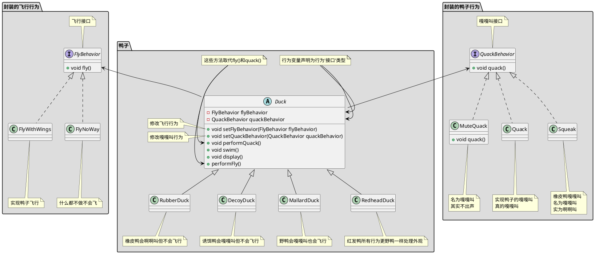

```java

// 叫声行为
public interface QuackBehavior {
    public void quack();
}

// 实现鸭子的嘎嘎叫真的嘎嘎叫
public class Quack implements QuackBehavior {
    public void quack() {
        System.out.println("Quack");
    }
}

// 橡皮鸭嘎嘎叫名为嘎嘎叫实为啊啊叫
public class MuteQuack implements QuackBehavior {
    public void quack() {
        System.out.println("<< Silence >>");
    }
}

// 名为嘎嘎叫其实不出声
public class Squack implements QuackBehavior {
    public void quack() {
        System.out.println("Squack");
    }
}

// 飞行行为
public interface FlyBehavior {
    public void fly();
}

// 实现鸭子飞行
public class FlyWithWings implements FlyBehavior {
    public void fly() {
        System.out.println("fly");
    }
}

// 什么都不做不会飞
public class FlyNoWay implements FlyBehavior {
    public void fly() {
        System.out.println("not fly");
    }
}


// 鸭子抽象类
public abstract class Duck {
    protected QuackBehavior quackBehavior;
    protected FlyBehavior flyBehavior;
    
    public void setFlyBehavior(FlyBehavior flyBehavior) {
        this.flyBehavior = flyBehavior;
    }
    public void setQuackBehavior(QuackBehavior quackBehavior) {
        this.quackBehavior = quackBehavior;
    }

    // 为了执行嘎嘎叫,Duck只要让quackBehavior所引用的对象为嘎嘎叫即可.
    // 在这部分代码中我们不关心具体Duck是那种对象
    // 只要它知道这么quack()就可以了
    public void performQuack() {
        quackBehavior.quack();
    }

    public void performFly() {
        flyBehavior.fly();
    }

    // 识别应用中变化的方面,把它们和不变的方面分开
    public abstract void swim() {
        System.out.println("所有的鸭子都会漂浮，甚至是游泳");
    }
    public abstract void display();

}

// 野鸭会嘎嘎叫也会飞行
public class MallardDuck extends Duck {
    // 实例化Duck的quackBehavior flyBehavior
    public MallardDuck() {
        // MallardDuck 使用Quack类来处理嘎嘎叫,因此 performQuack() 被调用时,嘎嘎叫的责任被委托给Quack对象我们得到了真正的嘎嘎叫
        this.quackBehavior = new Quack();
        this.flyBehavior = new FlyWithWings();
    }

    public void display() {
        System.out.println("我是一个红色的野鸭");
    }
}


// 测试类
public class MiniDuckSimulator {
    public static void main(String[] args) {
        Duck mallard = new MallardDuck();
        mallard.performQuack(); // 输出 Quack
        mallard.performFly(); // 输出 fly

        // 改变为不会飞行
        mallard.setFlyBehavior(new FlyNoWay());
        mallard.performFly(); // 输出 not fly
    }
}

```

## 观察者模式

### 观察者模式定义

定义对象之间的一对多依赖,这样一来,当一个对象改变状态时,它的所有依赖都会收到他嗯直并自动更新

#### 主题/观察者

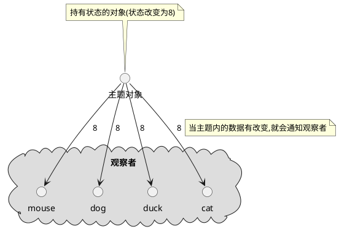

主题和和观察者定义了一对多关系.当主题有变化时,会通知众多观察者.观察者是主题的依赖者,当主题的状态变化,观察者被通知.

观察者模式有几种不同的实现方式,但大多数围绕着包括主题和观察者接口的类设计

#### 观察者模式类图

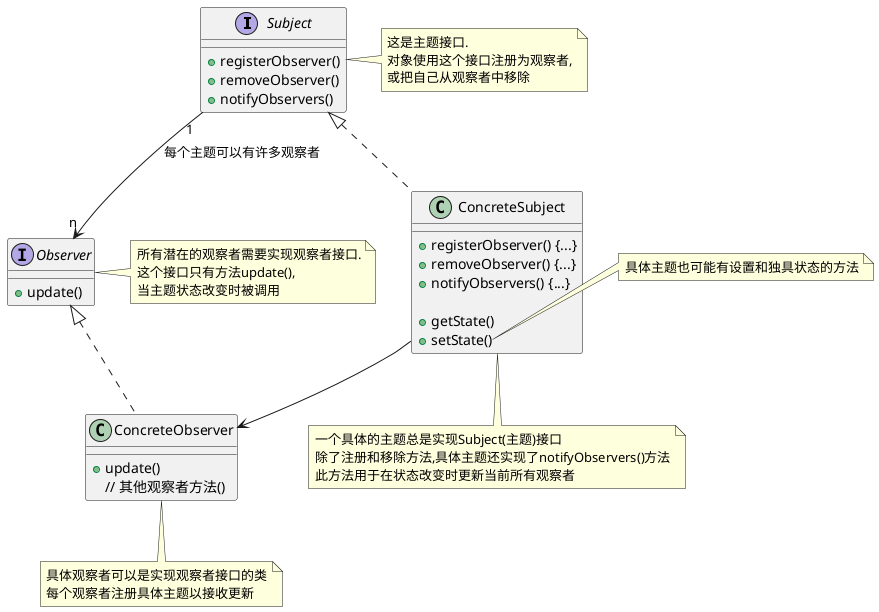

### 观察者模式要点

1. 观察者模式定义对象之间的一对多关系
2. 主题使用通用接口更新观察者
3. 任何具体类型的观察者都可以参与该模式,只要它们实现观察者接口
4. 观察者是松耦合的,处理知道它们实现观察者接口之外,主题对它们的其他事情不知情.
5. 使用该模式时,你可以从主题推或拉数据(拉被认为更 "正确")
6. Swing 大量使用观察者模式,许多 GUI 框架也是这样
7. 你也会在其他很多地方发现该模式,包括 RxJava , JavaBeans 和 RMI , 以及其他语言的框架, 像 Cocoa , Swift 和 JavaScript 事件
8. 观察者模式和出版/订阅模式相关.出版/订阅模式用于更复杂得多主题和/或多消息类型的情形.
9. 观察者模式是一个常用的模式,当我们学习模型-视图-控制器(MVC)时,还会看到它

### 观察者模式探讨

1. 主题一有状态的变化就通知所有的观察者,但某个状态的变化只是部分观察者关心
2. 主题为啥不给特定的观察者状态变化而是把所有状态都给出去
3. 观察者为啥不主动拉取主题状态
4. 观察者不要依赖特的通知次序

### 观察者例子:气象观测站
有一个气象观测站需要追踪当前天气并且有个对象WeatherData追踪当前天气状况,WeatherData对象如下
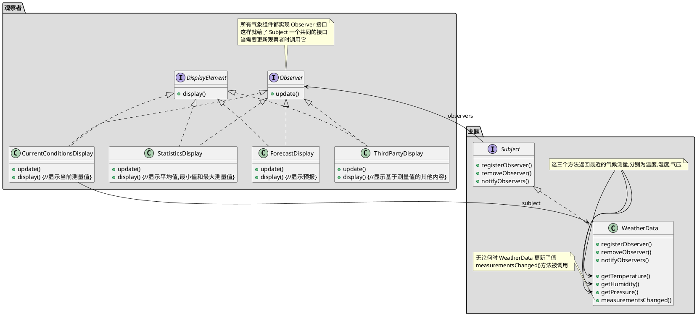

```java

public interface Subject {
    // 这两个方法都用一个Observer作为参数,即要注册或被移除的Observer
    public void registerObserver(Observer o);
    public void removeObserver(Observer o);
    // 当Subject的状态改变时,这个方法会被调用,以通知所有的观察者
    public void notifyObservers();
}

public interface Observer {
    // 这些都是当气象测量数据变化时观察者从Subject获取的状态值
    public void update(float temp, float humidity, float pressure);
}

// DisplayElement 接口只包含一个方法 display(), 当显示元素需要显示时,调用此方法
public interface DisplayElement {
    public void display();     
}


import java.util.*;
// WeatherData 实现 Subject 接口
public class WeatherData implements Subject {
    // 我们添加一个 List 来持有 Observer
    private List<Observer> observers;
    private float temperature;
    private float humidity;
    private float pressure;

    public WeatherData() {
        observers = new ArrayList<Observer>();
    }

    public void registerObserver(Observer o) {
        observers.add(o);
    }

    public void removeObserver(Observer o) {
        observers.remove(o);
    }

    public void notifyObservers() {
        for (Observer observer : observers) {
            observer.update(temperature, humidity, pressure);
        }
    }
   public void measurementsChanged() {
        notifyObservers();
    }

   // 模拟气象站测量到气象数据变化时候嗲用
    public void setMeasurements(float temperature, float humidity, float pressure) {
        this.temperature = temperature;
        this.humidity = humidity;
        this.pressure = pressure;
        measurementsChanged();
    }

    public float getTemperature() {
        return temperature;
    }

    public float getHumidity() {
        return humidity;
    }

    public float getPressure() {
        return pressure;
    }

}

// 这个接口实现了 Observer 方法所以它可以从 WeatherData 对象中获取变化
// 它也实现了 DisplayElement 因为我们的 API 打算要求所有显示元素实现这个接口
public class CurrentConditionsDisplay implements Observer, DisplayElement { 
    private float temperature;
    private float humidity;
    private WeatherData weatherData;
      
    public CurrentConditionsDisplay(WeatherData weatherData) { 
        this.weatherData = weatherData;
        weatherData.registerObserver(this);
    } 
      
    public void update(float temperature, float humidity, float pressure) { 
        this.temperature = temperature;
        this.humidity = humidity;
        display();
    } 
      
    public void display() { 
        System.out.println("Current conditions: " + temperature 
            + "F degrees and " + humidity + "% humidity");
    } 
}

// 测试程序
public class WeatherStation {
      
    public static void main(String[] args) {
        WeatherData weatherData = new WeatherData();
    
        CurrentConditionsDisplay currentDisplay = 
            new CurrentConditionsDisplay(weatherData);
        // StatisticsDisplay statisticsDisplay = new StatisticsDisplay(weatherData); 
        // ForecastDisplay forecastDisplay = new ForecastDisplay(weatherData);

        weatherData.setMeasurements(80, 65, 30.4f);
        weatherData.setMeasurements(82, 70, 29.2f);
        weatherData.setMeasurements(78, 90, 29.2f);
        
        weatherData.removeObserver(forecastDisplay);
        weatherData.setMeasurements(62, 90, 28.1f);
    }
}

```

### Java 内置的观察者模式

#### ~~Java Observer Observable 类~~

在 java9 中已经废弃不讨论

#### JavaBean PropertyChangeEvent

```java
import java.beans.PropertyChangeEvent;
import java.beans.PropertyChangeListener;
import java.beans.PropertyChangeSupport;
import java.io.Serializable;

public class PropertyChangeEventMain {

    public static void main(String[] args) {
        JavaBean bean = new JavaBean();

        bean.setId(1L);
        bean.setName("java bean 1");
        bean.setName("java bean 2");

        // id未发生变化不发送事件
        bean.setId(1L);
    }


    // 这个例子自身即是主题又是观察者
    static class JavaBean implements PropertyChangeListener, Serializable {

        private Long id;
        private String name;

        // 这个是一个主题
        private PropertyChangeSupport pcs = new PropertyChangeSupport(this);

        public JavaBean() {
            // 注册监听所有变化(所有变化观察者)
            pcs.addPropertyChangeListener(this);
            // 注册只是监听 id 的变化(id变化观察者)
            pcs.addPropertyChangeListener("id", this);
            // 注册只是监听 name 的变化(name变化观察者)
            pcs.addPropertyChangeListener("name", this);
        }

        /**
         * 观察者update(),即 Observer.update()
         *
         * @param evt 事件/消息
         */
        @Override
        public void propertyChange(PropertyChangeEvent evt) {
            System.out.println("property name is : " + evt.getPropertyName());
            System.out.println("old value is : " + evt.getOldValue());
            System.out.println("new value is : " + evt.getNewValue());
            System.out.println("======================");
        }
        public Long getId() {
            return this.id;
        }

        public void setId(Long id) {
            Long oldId = this.id;
            this.id = id;

            // 发送 id 已经变更事件, 类似于主题notifyObservers(),即Subject.notifyObservers()
            pcs.firePropertyChange("id", oldId, id);
        }

        public String getName() {
            return this.name;
        }

        public void setName(String name) {
            String oldName = this.name;
            this.name = name;

            // 发送 name 已经变更事件, 类似于主题notifyObservers(),即Subject.notifyObservers()
            pcs.firePropertyChange("name", oldName, name);
        }
    }
}

```

## 装饰者模式

### 装饰者模式定义

***装饰者模式*** 动态地将额外责任附加到对象上.对于扩展功能,装饰者提供子类化之外的弹性替代方案

### 装饰者模式要点

1. 继承是扩展形式之一,但未必是达到弹性设计的最佳方式
2. 在我们的设计中,允许行为可以被扩展,而无需修改已有代码
3. 组合和委托经常可以用来运行时添加新行为
4. 装饰者模式提供了子类化扩展行为的替代品
5. 装饰者模式涉及一群装饰者类,这些类用来包装具体组件
6. 装饰者类反映了它们所装饰组件类型(事实上,它们和所装饰的组件类型相同,都经过了继承或接口实现)
7. 装饰者通过对组件的方法调用之前(或/和之后,甚至在那一刻)添加功能改变其组件的行为
8. 你可以用任意数目装饰者来包裹一个组件
9. 装饰者一般对组件的客户是透明的,除非客户依赖于组件的具体类型
10. 装饰者会导致设计中出现许多小对象,过度使用会让代码变得复杂

### 装饰者模式探讨

- 装饰者有着和所装饰对象相同的超类型
- 你可以用一个或多个装饰者包裹一个对象
- 鉴于装饰者有着和所装饰对象相同的超类型,在需要原始对象的场合,我们可以传递一个被装饰的对象
- ***装饰者在委托给所装饰对象之前或之后添加自己的行为,来在做剩下的工作***
- 对象可以在任何时候被装饰,因此我们可以在运行时用任意数量的装饰者动态地装饰对象,只要我们乐意
- 被装饰的对象尽量使用组合而不是继承,这样我们可以用我们喜欢的方式在运行时混合与匹配装饰者,而不是在编译时静态地决定
- 装饰者模式容易造成大量的小类(参考 java.io 类)
- 装饰者模式有类型问题:如果代码中依赖特定类型,如果引入装饰者就会出问题
    > 比如在starbuzz咖啡中如果 HouseBlend 作了类似打折的事情,一旦我用装饰者包裹 HouseBlend , 代码就不工作了  
    > 只是知道最外层的装饰者,比如对于starbuzz咖啡中如果一个带 Mocha,Soy,Whip的DarkRoast,编码时荣誉引用到Soy而不是Whip,这意味者订单中不包含Whip  
    > 无法户欧链条上的其他装饰,比如对于starbuzz咖啡中如果一个带 Mocha,Soy,Whip的DarkRoast,只是知道最外层
- 装饰者模式会增加实例化组件所需代码的复杂度,一旦用了装饰者,你不只要实例化组件,还要把它包裹进装饰者中
- 组件: 查看 [starbuzz咖啡类图](#starbuzz咖啡类图) 的Beverage注释和package咖啡/具体组件

### 与代理模式区别

TODO 代补充

### 装饰者模式例子: starbuzz咖啡

starbuzz咖啡是以扩张速度最快闻名的咖啡连锁店. 如果你在街角看到它的店, 沿街望去, 还会看到另一家店  
因为扩张实在太快, 他们着急更新其下单系统, 以匹配他们的饮料供应需求

当他们第一次经如业务时, 类设计像这样, 除了咖啡本身, 你也可以要求各种调料, 如摩卡,奶泡...  
这样设计简直类爆炸
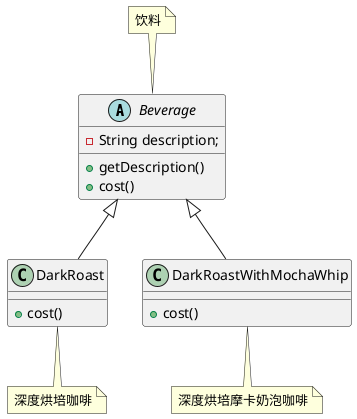

#### starbuzz咖啡类图

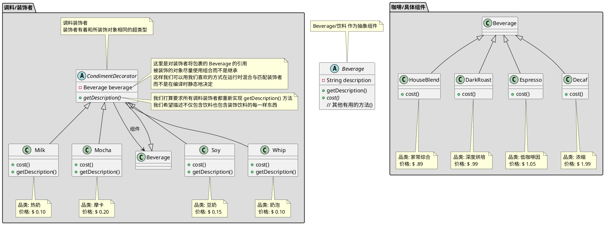
#### 深度烘培摩卡奶泡 代码

```java

// 饮料
public abstract class Beverage {
    String description = "未知饮料";
  
    public String getDescription() {
        return description;
    }   
 
    public abstract double cost();
}

// 家常综合咖啡
public class HouseBlend extends Beverage {
    public HouseBlend() {
        description = "家常综合咖啡";
    }

    public double cost() {
        return .89;
    }
}

// 深度烘培咖啡
public class DarkRoast extends Beverage {
    public DarkRoast() {
        description = "深度烘培咖啡";
    }

    public double cost() {
        return .99;
    }
}

// 低咖啡因咖啡
public class Espresso extends Beverage {

    public Espresso() {
        description = "低咖啡因咖啡";
    }

    public double cost() {
        return 1.99;
    }
}

// 浓缩咖啡
public class Decaf extends Beverage {
    public Decaf() {
        description = "浓缩咖啡";
    }

    public double cost() {
        return 1.05;
    }
}

// 调料装饰者
public abstract class CondimentDecorator extends Beverage {
    Beverage beverage;

    // 我们打算要求所有调料装饰者都重新实现 getDescription() 方法
    // 我们希望描述不仅包含饮料也包含装饰饮料的每一样东西
    public abstract String getDescription();
}

// 热奶
public class Milk extends CondimentDecorator {
    public Milk(Beverage beverage) {
        this.beverage = beverage;
    }

    public String getDescription() {
        return beverage.getDescription() + ", 热奶";
    }

    public double cost() {
        return .10 + beverage.cost();
    }
}

// 摩卡
public class Mocha extends CondimentDecorator {
    public Mocha(Beverage beverage) {
        this.beverage = beverage;
    }

    public String getDescription() {
        return beverage.getDescription() + ", 摩卡";
    }

    public double cost() {
        return .20 + beverage.cost();
    }
}

// 豆奶
public class Soy extends CondimentDecorator {
    public Soy(Beverage beverage) {
        this.beverage = beverage;
    }

    public String getDescription() {
        return beverage.getDescription() + ", 豆奶";
    }

    public double cost() {
        return .15 + beverage.cost();
    }
}

// 奶泡
public class Whip extends CondimentDecorator {
    public Whip(Beverage beverage) {
        this.beverage = beverage;
    }

    public String getDescription() {
        return beverage.getDescription() + ", 奶泡";
    }

    public double cost() {
        return .10 + beverage.cost();
    }
}

// 下单测试代码
public class StarbuzzCoffee {

    public static void main(String args[]) {

        // 要一杯浓缩咖啡,不加调料,打印出他的描述和价格
        Beverage beverage = new Espresso();
        System.out.println(beverage.getDescription()
                + " $" + beverage.cost());

        // 做一个 深度烘培咖啡
        Beverage beverage2 = new DarkRoast();
        // 用一个摩卡包裹它
        beverage2 = new Mocha(beverage2);
        // 用第二个摩卡包裹它
        beverage2 = new Mocha(beverage2);
        // 用一个奶泡包裹它
        beverage2 = new Whip(beverage2);
        System.out.println(beverage2.getDescription()
                + " $" + beverage2.cost());

        // 给我们一份家常豆奶奶泡咖啡
        Beverage beverage3 = new HouseBlend();
        beverage3 = new Soy(beverage3);
        beverage3 = new Mocha(beverage3);
        beverage3 = new Whip(beverage3);
        System.out.println(beverage3.getDescription()
                + " $" + beverage3.cost());

        // 最后给我们一份 深度烘培摩卡奶泡卡咖啡
        Beverage beverage4 = new DarkRoast();
        beverage4 = new Mocha(beverage4);
        beverage4 = new Whip(beverage4);
        System.out.println(beverage4.getDescription()
                + " $" + beverage4.cost());


    }
}

```

#### 深度烘培摩卡奶泡咖啡 调用流程

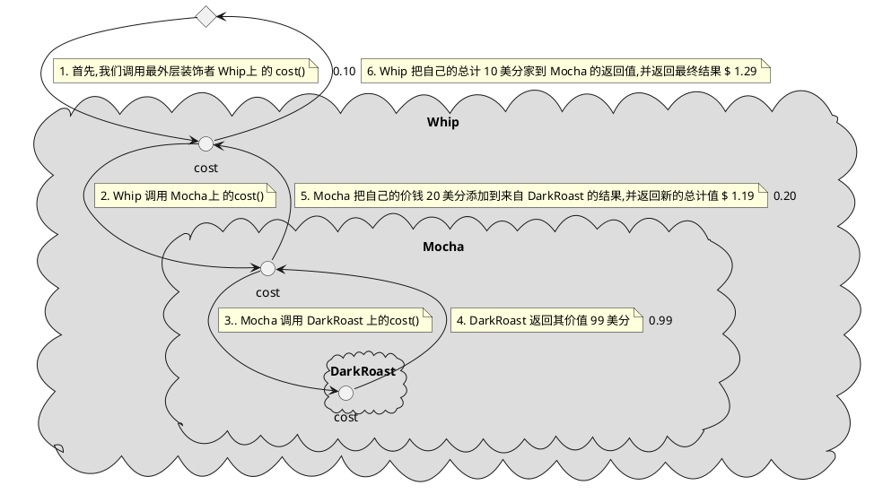

### 装饰者模式在java的应用 java.io

以 InputStream 为例
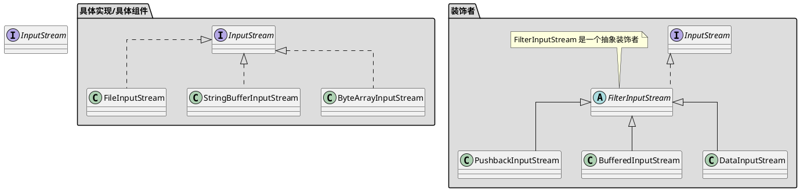

```java
import java.io.*;              

// 把输入流中所有的大写字符转成小写
// 比如读入 "I know the Decorator Pattern therefore I RULE" -> "i know the decorator pattern therefore i rule" 
public class LowerCaseInputStream extends FilterInputStream {
  
    public LowerCaseInputStream(InputStream in) {
        super(in);             
    }
    
    public int read() throws IOException { 
        int c = in.read();
        return (c == -1 ? c : Character.toLowerCase((char)c));
    } 
        
    public int read(byte[] b, int offset, int len) throws IOException {
        int result = in.read(b, offset, len);
        for (int i = offset; i < offset+result; i++) {
            b[i] = (byte)Character.toLowerCase((char)b[i]);
        }
        return result;
    }
}

import java.io.*;

// 测试类
public class InputTest {
    public static void main(String[] args) throws IOException {
        int c;
        InputStream in = null;
        try {
            in =
                new LowerCaseInputStream(
                    new BufferedInputStream(
                        new FileInputStream("test.txt")));

            while((c = in.read()) >= 0) {
                System.out.print((char)c);
            }
        } catch (IOException e) {
            e.printStackTrace();
        } finally {
            if (in != null) { in.close(); }
        }
        System.out.println();
        try (InputStream in2 =
                new LowerCaseInputStream(
                    new BufferedInputStream(
                        new FileInputStream("test.txt"))))
        {
            while((c = in2.read()) >= 0) {
                System.out.print((char)c);
            }
        } catch (IOException e) {
            e.printStackTrace();
        }
    }
}

```

## 工厂模式

### 背景

当你使用new操作符时, 你无疑是在实例化一个具体类,因此这肯定是一个实现而不是接口.  
在技术上,new操作符没有错,有问题的是"变化",以及它对使用new的影响.  
比如你的代码针对接口编写, 那么通过多态它可以和任何这个接口的实现类一起工作.  
但你的代码利用了大量的具体类时,一旦加入新的具体类, 就必须修改代码  
怎样把应用中所有实例化具体类的代码拿出来分离,或者封装起来,这样不会影响应用的其他部分  
> 工厂模式主要用来封装实例化行为, 这样客户在实例化对象时, 只依赖接口, 而不是具体类, 也可以避免代码中的重复

### 工厂模式讨论
1. 如果只有一个 ConcreteCreator (具体创建者) 工厂方法模式也可以将唱片的实现解耦,也不影响Creator(因为Creator没有和任何ConcreteCreator紧耦合)
2. 工厂方法模式的每个ConcreteCreator(具体创建者)都类似于简单工厂模式
3. 工厂方法的Creator类可以时具体的Creator这样就有一个缺省的实现

### 工厂方法要点
1. 所有工厂方法都封装对象的创建
2. 简单工厂不是一个真正的设计模式, 但依然可以作为一个简单的方法, 将客户从具体类解耦
3. 工厂方法靠继承: 对象创建被委托给子类, 子类实现工厂方法来创建对象
4. 抽象工厂靠对象组合: 对象创建在工厂接口暴露的方法中实现
5. 所欧工厂模式都通过减少应用对具体类的依赖, 促进了松耦合
6. 工厂方法的意图, 是允许一个类延迟实例化到其子类
7. 抽象工厂的意图, 是创建相关对象家族, 不必依赖于其具体类
8. 依赖倒置原则指导我们避免依赖具体类型, 尽量依赖抽象
9. 工厂是强有力的技巧, 让我们针对抽象编码, 而不是针对具体类

### 简单工厂

简单工厂不是一个真正的模式,更多是一种编程习惯

#### 简单工厂例子,比萨简单工厂

假设你有一家比萨店, 店里能制作多种比萨, 
有天你想要添加一些流行风味的比萨: 蛤蜊(Clam)比萨, 素食(Veggie)比萨 ,
并且希腊(Greek)比萨销售不佳,因此你决定将它从菜单中去除
所以初始代码如下
```java

public class PizzaStore {
    public Pizza orderPizze(String type) {
        Pizze pizza;
    
        if (type.equals("cheese")) {
            pizza = new CheesePizza();
        } 
        /* 希腊(Greek)比萨销售不佳,因此你决定将它从菜单中去除
        else if (type.equals("greek")) {
            pizza = new GreekPizza();
        }
        **/ 
        else if (type.equals("pepperoni")) {
            pizza = PepperoniPizza();
        } 
        //  有天你想要添加一些流行风味的比萨: 蛤蜊(Clam)比萨, 素食(Veggie)比萨
        else if (type.equals("clam")) {
            pizza = ClamPizza();
        } else if (type.equals("veggie")) {
            pizza = VeggiePizza();
        }
    
        // 准备比萨
        pizza.perpare();
        // 烘焙比萨
        pizza.bake();
        // 切割比萨
        pizza.cut();
        // 打包比萨
        pizza.box();
        
        return pizza;
    }
}
```

显然关于哪个具体类被实例化的代码才是真正搞乱 orderPizze() 方法的罪魁祸首  
如果你添加/减少了具体实现类在所有初始化的地方都需要修改  
所以需要把对象创建移到 orderPizze() 方法外

##### 比萨简单工厂类图

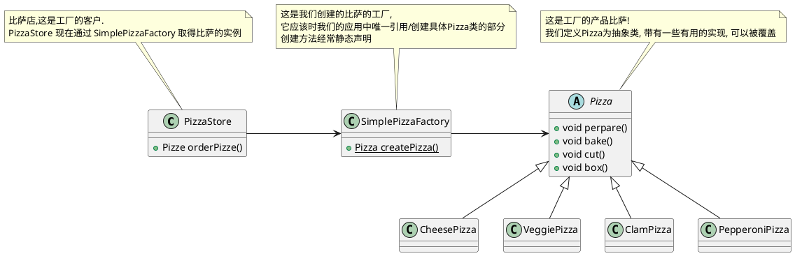

##### 比萨简单工厂代码
```java
public class PizzaStore {      
    SimplePizzaFactory factory;
  
    public PizzaStore(SimplePizzaFactory factory) { 
        this.factory = factory;
    }
  
    public Pizza orderPizza(String type) { 
        Pizza pizza;           
    
        pizza = factory.createPizza(type);
    
        pizza.prepare();
        pizza.bake();
        pizza.cut();
        pizza.box();           

        return pizza;
    }

}

public class SimplePizzaFactory {

    public Pizza createPizza(String type) {
        Pizza pizza = null;

        if (type.equals("cheese")) {
            pizza = new CheesePizza();
        } else if (type.equals("pepperoni")) {
            pizza = new PepperoniPizza();
        } else if (type.equals("clam")) {
            pizza = new ClamPizza();
        } else if (type.equals("veggie")) {
            pizza = new VeggiePizza();
        }
        return pizza;
    }
}

abstract public class Pizza {
    String name;
    
    // 面饼
    String dough;
    // 调味
    String sauce;
    // 陷料
    List<String> toppings = new ArrayList<String>();
  
    public String getName() {  
        return name;
    } 

    // 准备比萨 
    public void prepare() {    
        System.out.println("Preparing " + name);
    }

    // 烘焙比萨
    public void bake() {       
        System.out.println("Baking " + name);
    }

    // 切割比萨
    public void cut() {        
        System.out.println("Cutting " + name);
    }

    // 打包比萨
    public void box() {
        System.out.println("Boxing " + name);
    }

    public String toString() {
        // code to display pizza name and ingredients
        StringBuffer display = new StringBuffer();
        display.append("---- " + name + " ----\n");
        display.append(dough + "\n");
        display.append(sauce + "\n");
        for (String topping : toppings) {
            display.append(topping + "\n");
        }
        return display.toString();
    }

}

public class CheesePizza extends Pizza {
    public CheesePizza() {
        name = "Cheese Pizza";
        dough = "Regular Crust";
        sauce = "Marinara Pizza Sauce";
        toppings.add("Fresh Mozzarella");
        toppings.add("Parmesan");
    }
}


public class ClamPizza extends Pizza {
    public ClamPizza() {
        name = "Clam Pizza";
        dough = "Thin crust";
        sauce = "White garlic sauce";
        toppings.add("Clams");
        toppings.add("Grated parmesan cheese");
    }
}

public class PepperoniPizza extends Pizza {
    public PepperoniPizza() {
        name = "Pepperoni Pizza";
        dough = "Crust";
        sauce = "Marinara sauce";
        toppings.add("Sliced Pepperoni");
        toppings.add("Sliced Onion");
        toppings.add("Grated parmesan cheese");
    }
}

public class VeggiePizza extends Pizza {
    public VeggiePizza() {
        name = "Veggie Pizza";
        dough = "Crust";
        sauce = "Marinara sauce";
        toppings.add("Shredded mozzarella");
        toppings.add("Grated parmesan");
        toppings.add("Diced onion");
        toppings.add("Sliced mushrooms");
        toppings.add("Sliced red pepper");
        toppings.add("Sliced black olives");
    }
}
```


### 工厂方法

定义了一个创建对象的接口, 但由子类决定要实例化那个类. 工厂方法让类把实例化推迟到子类

#### 工厂方法模式类图

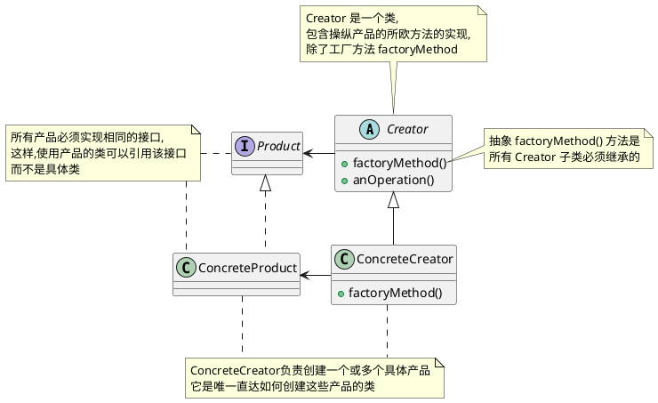

#### 工厂方法模式例子比萨工厂

如果比萨店生意很好, 需要开加盟店, 但是每个地区的人的口味不一样,  
所以需要根据加盟地区提供不同风味的比萨(比如纽约, 芝加哥, 加州)

##### 工厂方法模式例子比萨工厂类图

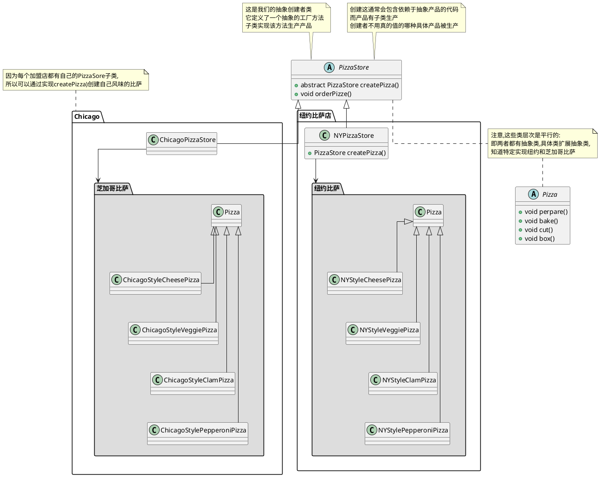

##### 工厂方法模式例子比萨工厂代码

```java
public abstract class PizzaStore {
  
    abstract Pizza createPizza(String item); 
    
    public Pizza orderPizza(String type) { 
        Pizza pizza = createPizza(type);
        System.out.println("--- Making a " + pizza.getName() + " ---");
        pizza.prepare();
        pizza.bake();
        pizza.cut();
        pizza.box();
        return pizza;
    }
}

public abstract class Pizza {
    String name;
    
    // 面饼
    String dough;
    // 调味
    String sauce;
    // 陷料
    List<String> toppings = new ArrayList<String>();
  
    public String getName() {  
        return name;
    } 

    // 准备比萨 
    public void prepare() {    
        System.out.println("Preparing " + name);
    }

    // 烘焙比萨
    public void bake() {       
        System.out.println("Baking " + name);
    }

    // 切割比萨
    public void cut() {        
        System.out.println("Cutting " + name);
    }

    // 打包比萨
    public void box() {
        System.out.println("Boxing " + name);
    }

    public String toString() {
        // code to display pizza name and ingredients
        StringBuffer display = new StringBuffer();
        display.append("---- " + name + " ----\n");
        display.append(dough + "\n");
        display.append(sauce + "\n");
        for (String topping : toppings) {
            display.append(topping + "\n");
        }
        return display.toString();
    }

}

public class NYPizzaStore extends PizzaStore {

    Pizza createPizza(String item) {
        if (item.equals("cheese")) {
            return new NYStyleCheesePizza();
        } else if (item.equals("veggie")) {
            return new NYStyleVeggiePizza();
        } else if (item.equals("clam")) {
            return new NYStyleClamPizza();
        } else if (item.equals("pepperoni")) {
            return new NYStylePepperoniPizza();
        } else return null;
    }
}

public class NYStyleCheesePizza extends Pizza {

    public NYStyleCheesePizza() {
        name = "NY Style Sauce and Cheese Pizza";
        dough = "Thin Crust Dough";
        sauce = "Marinara Sauce";

        toppings.add("Grated Reggiano Cheese");
    }
}

public class ChicagoPizzaStore extends PizzaStore {

    Pizza createPizza(String item) {
        if (item.equals("cheese")) {
            return new ChicagoStyleCheesePizza();
        } else if (item.equals("veggie")) {
            return new ChicagoStyleVeggiePizza();
        } else if (item.equals("clam")) {
            return new ChicagoStyleClamPizza();
        } else if (item.equals("pepperoni")) {
            return new ChicagoStylePepperoniPizza();
        } else return null;
    }
}


public class ChicagoStyleCheesePizza extends Pizza {

    public ChicagoStyleCheesePizza() {
        name = "Chicago Style Deep Dish Cheese Pizza";
        dough = "Extra Thick Crust Dough";
        sauce = "Plum Tomato Sauce";

        toppings.add("Shredded Mozzarella Cheese");
    }

    // 芝加哥比萨重新切割比萨
    void cut() {
        System.out.println("Cutting the pizza into square slices");
    }
}

public class PizzaTestDrive {

    public static void main(String[] args) {
        PizzaStore nyStore = new NYPizzaStore();
        PizzaStore chicagoStore = new ChicagoPizzaStore();

        Pizza pizza = nyStore.orderPizza("cheese");
        System.out.println("Ethan ordered a " + pizza.getName() + "\n");

        pizza = chicagoStore.orderPizza("cheese");
        System.out.println("Joel ordered a " + pizza.getName() + "\n");
    }
}
```

### 工厂方法的依赖倒置

对于使用简单工厂方法的类如下

```java
public class DependentPizzaStore {
  
    public Pizza createPizza(String style, String type) {
        Pizza pizza = null;    
        if (style.equals("NY")) {       
            if (type.equals("cheese")) {
                pizza = new NYStyleCheesePizza();
            } else if (type.equals("veggie")) {
                pizza = new NYStyleVeggiePizza();
            } else if (type.equals("clam")) { 
                pizza = new NYStyleClamPizza(); 
            } else if (type.equals("pepperoni")) { 
                pizza = new NYStylePepperoniPizza();
            }
        } else if (style.equals("Chicago")) {
            if (type.equals("cheese")) {    
                pizza = new ChicagoStyleCheesePizza();
            } else if (type.equals("veggie")) {
                pizza = new ChicagoStyleVeggiePizza();
            } else if (type.equals("clam")) { 
                pizza = new ChicagoStyleClamPizza();
            } else if (type.equals("pepperoni")) { 
                pizza = new ChicagoStylePepperoniPizza();
            }
        } else {               
            System.out.println("Error: invalid type of pizza");
            return null;
        }
        pizza.prepare();
        pizza.bake();
        pizza.cut();
        pizza.box();
        return pizza;
    }
}

```
对象依赖依赖如下

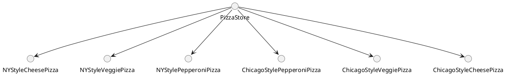

使用工厂方法模式后依赖图如下
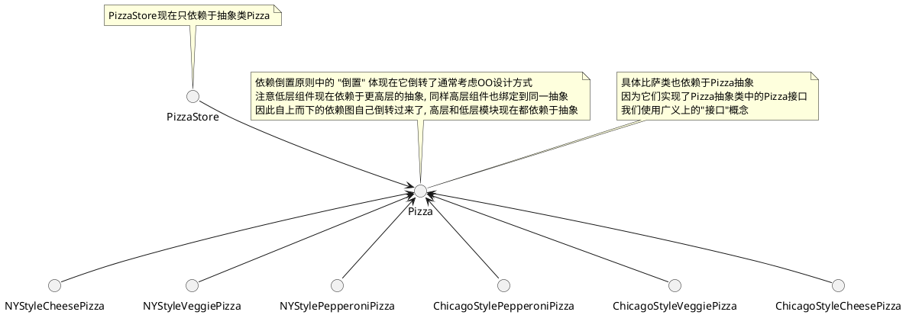

### 抽象工厂模式

`抽象工厂模式`: 提供一个接口来创建相关或依赖对象的家族, 而不需要指定具体类

#### 抽象工厂模式类图

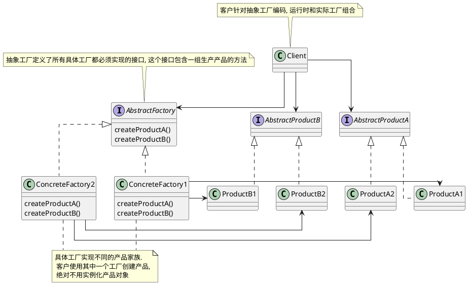

#### 抽象工厂模式例子比萨店的原料工厂

比萨店的成功在于新鲜,高质量的原料, 为了加盟店遵循你的流程, 规范原料, 你打算建立一个原料工厂(抽象工厂)

为了搞定原料工厂你不得不弄清楚如何处理原料家族

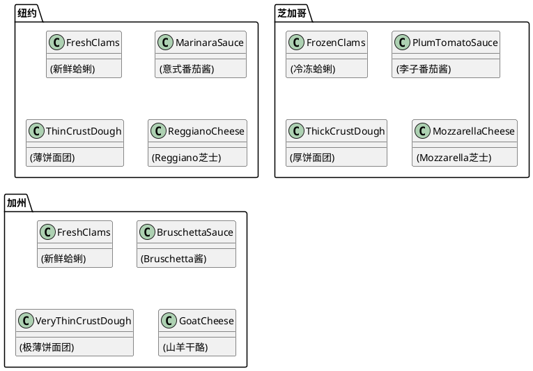

所以对于原料工厂来说, 可以创建所有的原料代码如下

```java
// 比萨原料工厂
public interface PizzaIngredientFactory {

    // 面团
    public Dough createDough();
    // 酱
    public Sauce createSauce();
    // 奶酪
    public Cheese createCheese();
    // 蔬菜
    public Veggies[] createVeggies();
    // 意大利辣香肠
    public Pepperoni createPepperoni();
    // 蛤蜊
    public Clams createClam();

}
```

全部代码如下

```java

// 比萨原料工厂
public interface PizzaIngredientFactory {

    // 面团
    public Dough createDough();
    // 酱
    public Sauce createSauce();
    // 奶酪
    public Cheese createCheese();
    // 蔬菜
    public Veggies[] createVeggies();
    // 意大利辣香肠
    public Pepperoni createPepperoni();
    // 蛤蜊
    public Clams createClam();

}

// 纽约原料工厂
public class NYPizzaIngredientFactory implements PizzaIngredientFactory {
 
    public Dough createDough() {
        return new ThinCrustDough();    
    }
 
    public Sauce createSauce() {    
        return new MarinaraSauce();     
    }
 
    public Cheese createCheese() {  
        return new ReggianoCheese();    
    }
 
    public Veggies[] createVeggies() {
        Veggies veggies[] = { new Garlic(), new Onion(), new Mushroom(), new RedPepper() };
        return veggies;
    }
 
    public Pepperoni createPepperoni() {
        return new SlicedPepperoni();   
    }

    public Clams createClam() {
        return new FreshClams();        
    }
}

// 芝加哥原料工厂
public class ChicagoPizzaIngredientFactory implements PizzaIngredientFactory {

    public Dough createDough() {
        return new ThickCrustDough();
    }

    public Sauce createSauce() {
        return new PlumTomatoSauce();
    }

    public Cheese createCheese() {
        return new MozzarellaCheese();
    }

    public Veggies[] createVeggies() {
        Veggies veggies[] = { new BlackOlives(),
                              new Spinach(),
                              new Eggplant() };
        return veggies;
    }

    public Pepperoni createPepperoni() {
        return new SlicedPepperoni();
    }
    public Clams createClam() {
        return new FrozenClams();
    }
}

// 面团
public interface Dough {
    public String toString();
}

// 酱
public interface Sauce {
    public String toString();
}

// 奶酪
public interface Cheese {
    public String toString();
}

// 蔬菜
public interface Veggies {
    public String toString();
}

// 意大利辣香肠
public interface Pepperoni {
    public String toString();
}

// 蛤蜊
public interface Clams {
    public String toString();
}

// 重做比萨, 主要是将 prepare() 声明未抽象的, 这个方法收集比萨所需的原料, 当然这些原料来自原料工厂
public abstract class Pizza {
    String name;

    // 比萨所需的原料如下
    Dough dough;
    Sauce sauce;
    Veggies veggies[];
    Cheese cheese;
    Pepperoni pepperoni;
    Clams clam;

    abstract void prepare();   

    void bake() {
        System.out.println("Bake for 25 minutes at 350");
    }

    void cut() {
        System.out.println("Cutting the pizza into diagonal slices");
    }

    void box() {
        System.out.println("Place pizza in official PizzaStore box");
    } 
    void setName(String name) {
        this.name = name;
    }

    String getName() {
        return name;
    }
    public String toString() {
        StringBuffer result = new StringBuffer();
        result.append("---- " + name + " ----\n");
        if (dough != null) {
            result.append(dough);
            result.append("\n");
        }
        if (sauce != null) {
            result.append(sauce);
            result.append("\n");
        }
        if (cheese != null) {
            result.append(cheese);
            result.append("\n");
        }
        if (veggies != null) {
            for (int i = 0; i < veggies.length; i++) {
                result.append(veggies[i]);
                if (i < veggies.length-1) {
                    result.append(", ");
                }
            }
            result.append("\n");
        }
        if (clam != null) {
            result.append(clam);
            result.append("\n");
        }
        if (pepperoni != null) {
            result.append(pepperoni);
            result.append("\n");
        }
        return result.toString();
    }
}

// 奶酪比萨如下
public class CheesePizza extends Pizza {
    PizzaIngredientFactory ingredientFactory;

    // 现在要制作比萨, 我们需要一个工厂提供原料
    public CheesePizza(PizzaIngredientFactory ingredientFactory) {
        this.ingredientFactory = ingredientFactory;
    }

    void prepare() {
        System.out.println("Preparing " + name);
        dough = ingredientFactory.createDough();
        sauce = ingredientFactory.createSauce();
        cheese = ingredientFactory.createCheese();
    }
}

public class ClamPizza extends Pizza {
    PizzaIngredientFactory ingredientFactory;

    public ClamPizza(PizzaIngredientFactory ingredientFactory) {
        this.ingredientFactory = ingredientFactory;
    }

    void prepare() {
        System.out.println("Preparing " + name);
        dough = ingredientFactory.createDough();
        sauce = ingredientFactory.createSauce();
        cheese = ingredientFactory.createCheese();
        // 蛤蜊比萨多了蛤蜊
        clam = ingredientFactory.createClam();
    }
}

// 纽约比萨店
public class NYPizzaStore extends PizzaStore {

    protected Pizza createPizza(String item) {
        Pizza pizza = null;
        PizzaIngredientFactory ingredientFactory =
            new NYPizzaIngredientFactory();

        if (item.equals("cheese")) {

            pizza = new CheesePizza(ingredientFactory);
            pizza.setName("New York Style Cheese Pizza");

        } else if (item.equals("veggie")) {

            pizza = new VeggiePizza(ingredientFactory);
            pizza.setName("New York Style Veggie Pizza");

        } else if (item.equals("clam")) {

            pizza = new ClamPizza(ingredientFactory);
            pizza.setName("New York Style Clam Pizza");

        } else if (item.equals("pepperoni")) {

            pizza = new PepperoniPizza(ingredientFactory);
            pizza.setName("New York Style Pepperoni Pizza");

        }
        return pizza;
    }
}


```

类图如下
```plantuml
@startuml
skinparam linetype ortho
package  "比萨原料工厂" as  PizzaIngredientFactory_together #DDDDDD {
    interface PizzaIngredientFactory {
        createDough()
        createSauce()
        createCheese()
        createVeggies()
        createPepperoni()
        createClam()
    }
    
    class NYPizzaIngredientFactory implements PizzaIngredientFactory {
    }
    
    class ChicagoPizzaIngredientFactory implements PizzaIngredientFactory {
    }

}
class NYPizzaStore {
    createPizza()
}

package 比萨原料 as PizzaIngredient_package #DDDDDD {
    together Dough_together {
        interface Dough {}
        class ThickCrustDough implements Dough {}
        class ThinCrustDough implements Dough {}
    }
    
    together Sauce_together {
        interface Sauce {}
        class PlumTomatoSauce implements Sauce {}
        class MarinaraSauce implements Sauce {}
    }
    
    together Cheese_together {
        interface Cheese {}
        class MozzarellaCheese implements Cheese {}
        class ReggianoCheese implements Cheese {}
    }
    
    together Clams_together {
        interface Clams {}
        class FrozenClams implements Clams {}
        class FreshClams implements Clams {}
    }
}

NYPizzaStore --> PizzaIngredientFactory
NYPizzaStore --> Dough
NYPizzaStore --> Sauce
NYPizzaStore --> Cheese
NYPizzaStore --> Clams
NYPizzaIngredientFactory -right-> ThinCrustDough
NYPizzaIngredientFactory -right-> MarinaraSauce
NYPizzaIngredientFactory -right-> ReggianoCheese
NYPizzaIngredientFactory -right-> FreshClams
ChicagoPizzaIngredientFactory -left-> ThickCrustDough
ChicagoPizzaIngredientFactory -left-> PlumTomatoSauce
ChicagoPizzaIngredientFactory -left-> MozzarellaCheese
ChicagoPizzaIngredientFactory -left-> FrozenClams

' 控制布局无意义


NYPizzaStore -down[hidden]--> Dough_together
Dough_together -down[hidden]---> Sauce_together
Sauce_together -down[hidden]---> Cheese_together
Cheese_together -down[hidden]---> Clams_together

PizzaIngredientFactory_together -right[hidden]-> Dough_together
PizzaIngredientFactory_together -right[hidden]-> Sauce_together
PizzaIngredientFactory_together -right[hidden]-> Cheese_together
PizzaIngredientFactory_together -right[hidden]-> Clams_together

@enduml
```

## 单例模式/单件模式

`单例模式`: 确保一个类只有一个实例, 并提供一个全局访问点

### 单例模式讨论

1. 如果有多个类加载器会导致, 多次家在同一个类, 就会产生多个单例
2. 反射和序列化/反序列化可有可能导致多个单例
3. 单例模式违反松耦合原则/单一责任原则
4. 单例模式对比全局变量来说可以做到延迟加载
5. 全局变量怂恿开发人员用大量对小对象的全局引用来污染命名空间

### 单列模式要点

1. 单列模式确保应用中一个类最多只有一个实例
2. 单例模式也是提供访问次实例的全局点
3. Java的单例实现用了一个私有构造器, 一个静态方法以及一个静态变量
4. 检查你的性能和资源, 为多线程应用小心选择一个适当的单例实现(我们英国把所有应用都考虑为时多线程的)
5. 提供双重检查加锁实现, Java5 之前的版本, 不是线程安全的
6. 如果你使用多个类加载器, 要小心, 可能倒置单例实现失效, 导致出现多个实例
7. 你可以使用Java的枚举来简化单列的实现

### 单例模式类图

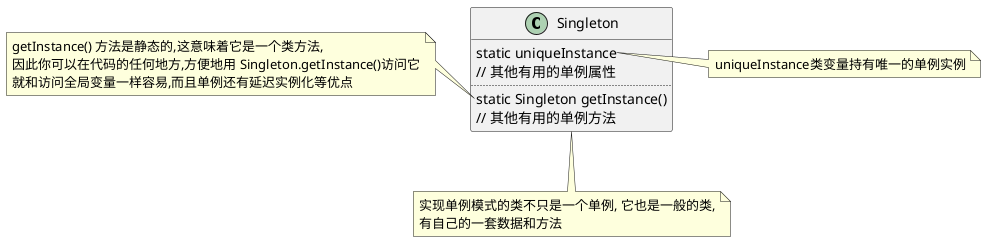

### 单例模式实现

```java
public class Singleton {
    private static Singleton uniqueInstance;
    // 其他有用的单例属性

    private Singleton() {}

    /**
     * <pre>
     * 该方式存在多线程问题, 可能会创建多个 Singleton
     * 但是如果调用 getInstance() 方法没有给你的应用增加很重的负担并且允许有多个实例, 可以使用该方法
     * </pre>
     */
    public static Singleton getInstance() {
        if (uniqueInstance == null) {
            uniqueInstance == new Singleton();
        }
        return uniqueInstance;
    }

    // 其他有用的单例方法
}

public class Singleton {
    private static Singleton uniqueInstance = new Singleton();
    // 其他有用的单例属性

    private Singleton() {}
    
    /**
     * 急切的创建实例, 而不用延迟创建
     */
    public static Singleton getInstance() {
        return uniqueInstance;
    }

    // 其他有用的单例方法
}


public class Singleton {
    // volatile 关键字确保: 当 uniqueInstance 变量被初始化未单例实例时, 多个线程正确处理 uniqueInstance 变量
    private volatile static Singleton uniqueInstance;
    // 其他有用的单例属性

    private Singleton() {}

    /**
     * <pre>
     * 双重检查加锁, 初始化实例, 在特定场景下有问题
     * 当 uniqueInstance 被分配地址但未执行 init 方法时可能会有问题
     * </pre>
     */
    public static Singleton getInstance() {
        // 检查实例, 如果没有, 进入同步区块
        if (uniqueInstance == null) {
            // 注意, 只有第一次才同步
            synchronized (Singleton.class) {
                if (uniqueInstance == null) {
                    // 进入区块后, 再检查一次. 如果依然是空的, 创建一个实例
                    uniqueInstance == new Singleton();
                }
            }
        }
        return uniqueInstance;
    }

    // 其他有用的单例方法
}
```

## 命令模式

`命令模式`: 把请求封装为对象, 以便用不同的请求/队列或者日志请求来参数化其它对象, 并支持可以撤销的操作

### 命令模式要点

1. 命令模式把做出请求的对象从知道如何执行请求的对象解耦
2. 命令对象处在解耦的中心, 封装接收者以及一个(或一组)动作(命令)
3. 调用者通过调用命令对象的execute()做出请求, 这会使得接收者的动作被调用
4. 调用者可以用命令参数化, 甚至可以在运行时动态地进行
5. 通过实现一个undo()方法来把对象重建到最后一次执行execute()前状态, 命令可以支持撤销
6. 宏命令是命令模式的一种简单延伸. 它允许调用多个命令. 同样, 宏命令很容易支持 undo()
7. 在实践中, "聪明" 命令对象并不少见. 这些对象自己实现请求, 而不是委托给接收者
8. 命令也可以用来实现日志和事务系统

### 命令模式类图

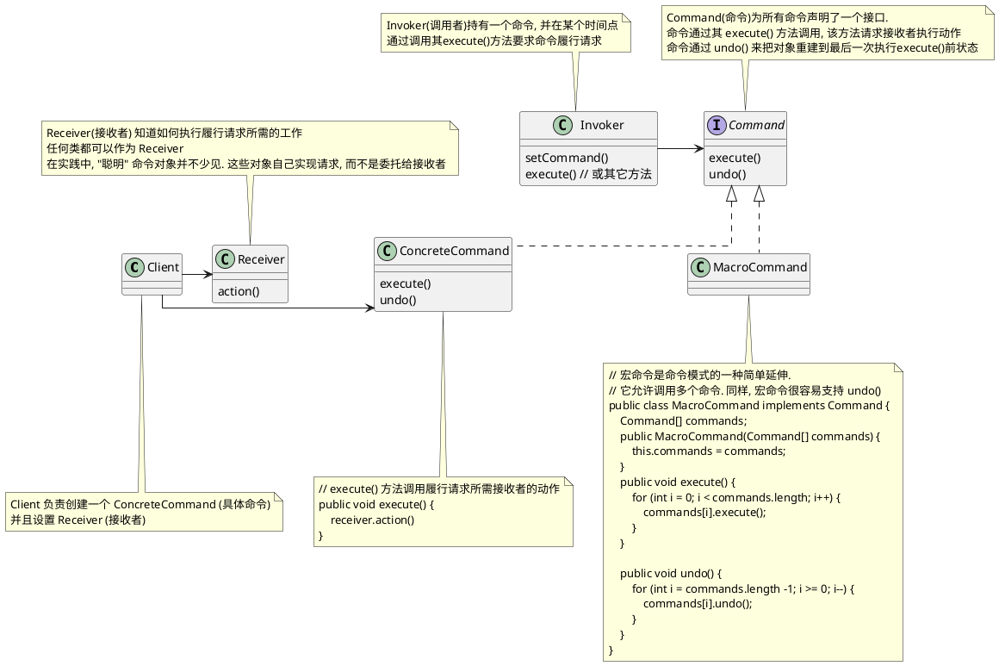
### 命令模式流程图

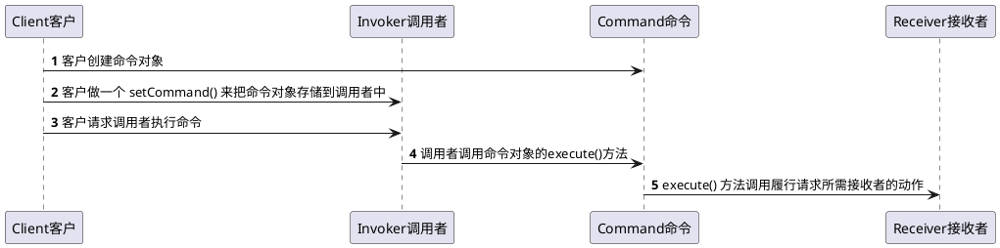

### 命令模式例子遥控器

我们要设计一个遥控器代码, 让每个槽可以被分配控制一个或一组设备  
请注意, 要能沟控制目前所有的设备以及厂商未来可以能提供的任何设备  

以下是我们需要从控制器控制对象的接口, 这些设备中有些接口差别很大

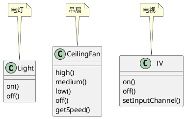

```plantuml
@startuml

package 遥控器 as remote_control {
    
    together together1 {
        () ON1
        () OFF1

        note right of ON1 : 电灯开
        note left of OFF1 : 电灯关
    }
    
    together together2 {
        () ON2
        () OFF2

        note right of ON2 : 吊扇开到高速\n(由于篇幅问题吊扇低速和中速不展示)
        note left of OFF2 : 吊扇关
    }
    
    together together3 {
        () ON3
        () OFF3

        note right of ON3 : 电视开
        note left of OFF3 : 电视关
    }
  
    together together4 {
        () ON4
        () OFF4

        note right of ON4 : 电灯,电视开,吊扇开到高速
        note left of OFF4 : 电灯,吊扇,电视关
    }
    
    together together_undo {
        () undo
        note right of undo : 对象重建到最后一次执行execute()前状态,\n但电视使用 lambda 无法撤销
    }

' 控制布局无意义

together1 -down[hidden]-> together2
together2 -down[hidden]-> together3
together3 -down[hidden]-> together4
together4 -down[hidden]-> together_undo
}

note top of remote_control
4个槽都有各自的开和关按钮
每组槽都需要编程. 我们可以在每个槽上放不同设备
然后通过按钮控制它
还有一个 undo 槽用来回到把对象重建到最后一次执行execute()前状态
end note

@enduml
```

遥控器类图如下

```plantuml
@startuml

skinparam linetype ortho

class RemoteLoader {

}

class RemoteControl {
    Command[] onCommands;
    Command[] offCommands;

    setCommand()
    onButtonWasPushed()
    offButtonWasPushed()
}

interface Command {
    execute()
}
' 电灯
class Light {
    on()
    off()
}
note top of Light : 电灯
class LightOnCommand implements Command {
    execute()
}
class LightOffCommand implements Command {
    execute()
}

' 吊扇
class CeilingFan {
    high()
    medium()
    low()
    off()
    getSpeed()
}
note top of CeilingFan : 吊扇
class CeilingFanHighCommand implements Command {
    execute()
}
class CeilingFanOffCommand implements Command {
    execute()
}

' 电视
class TV {
    on()
    off()
    setInputChannel()
}
note top of TV : 电视, 使用两个 lambda 表达式生成命令

class MacroCommand implements Command {
    execute()
}

RemoteLoader -> Light
RemoteLoader -> CeilingFan
RemoteLoader -> TV
RemoteLoader -> LightOnCommand
RemoteLoader -> LightOffCommand
RemoteLoader -> CeilingFanHighCommand
RemoteLoader -> CeilingFanOffCommand

RemoteControl -> Command


@enduml
```

代码如下
```java
// This is the invoker(调用者)
public class RemoteControl {
    Command[] onCommands;
    Command[] offCommands;     
    Command undoCommand;
 
    public RemoteControl() {   
        onCommands = new Command[4];
        offCommands = new Command[4];   
 
        Command noCommand = new NoCommand();
        for(int i=0;i<4;i++) { 
            onCommands[i] = noCommand;
            offCommands[i] = noCommand;
        }
        undoCommand = noCommand;        
    }
  
    public void setCommand(int slot, Command onCommand, Command offCommand) {
        onCommands[slot] = onCommand;   
        offCommands[slot] = offCommand; 
    }
    public void onButtonWasPushed(int slot) {
        onCommands[slot].execute();
        undoCommand = onCommands[slot];
    }

    public void offButtonWasPushed(int slot) {
        offCommands[slot].execute();
        undoCommand = offCommands[slot];
    }

    public void undoButtonWasPushed() {
        undoCommand.undo();
    }

    public String toString() {
        StringBuffer stringBuff = new StringBuffer();
        stringBuff.append("\n------ Remote Control -------\n");
        for (int i = 0; i < onCommands.length; i++) {
            stringBuff.append("[slot " + i + "] " + onCommands[i].getClass().getName()
                + "    " + offCommands[i].getClass().getName() + "\n");
        }
        stringBuff.append("[undo] " + undoCommand.getClass().getName() + "\n");
        return stringBuff.toString();
    }
}

// 命令接口
public interface Command {
    public void execute();
    public default void undo() {}

    // 每个命令被执行时, 会存储到磁盘中
    public default void store() {}
    // 系统失败后, 这些对象会被重新加载
    public default Command load() {return null;}
}

// 默认空实现, 防止空指针异常
public class NoCommand implements Command {
    public void execute() { }
    public void undo() { }
}

// 宏命令是命令模式的一种简单延伸
// 它允许调用多个命令. 同样, 宏命令很容易支持 undo()
public class MacroCommand implements Command {
    Command[] commands;

    public MacroCommand(Command[] commands) {
        this.commands = commands;
    }

    public void execute() {
        for (int i = 0; i < commands.length; i++) {
            commands[i].execute();
        }
    }

    /**
     * NOTE:  这些命令必须向后完成，以确保正确的撤消功能
     */
    public void undo() {
        for (int i = commands.length -1; i >= 0; i--) {
            commands[i].undo();
        }
    }
}

// 电灯
public class Light {
    String location = "";

    public Light(String location) {
        this.location = location;
    }

    public void on() {
        System.out.println(location + " light is on");
    }

    public void off() {
        System.out.println(location + " light is off");
    }
}


// 普通的电灯开关(最普通的命令模式)
public class LightOffCommand implements Command {
    Light light;

    public LightOffCommand(Light light) {
        this.light = light;
    }

    public void execute() {
        light.off();
    }

    public void undo() {
        light.on();
    }
}

// 普通的电灯开关(最普通的命令模式)
public class LightOnCommand implements Command {
    Light light;

    public LightOnCommand(Light light) {
        this.light = light;
    }

    public void execute() {
        light.on();
    }

    public void undo() {
        light.off();
    }
}

// 吊扇
public class CeilingFan {
    public static final int HIGH = 3;
    public static final int MEDIUM = 2;
    public static final int LOW = 1;
    public static final int OFF = 0;
    String location;
    int speed;

    public CeilingFan(String location) {
        this.location = location;
    }

    public void high() {
        // turns the ceiling fan on to high
        speed = HIGH;
        System.out.println(location + " ceiling fan is on high");
    }

    public void medium() {
        // turns the ceiling fan on to medium
        speed = MEDIUM;
        System.out.println(location + " ceiling fan is on medium");
    }

    public void low() {
        // turns the ceiling fan on to low
        speed = LOW;
        System.out.println(location + " ceiling fan is on low");
    }

    public void off() {
        // turns the ceiling fan off
        speed = OFF;
        System.out.println(location + " ceiling fan is off");
    }

    public int getSpeed() {
        return speed;
    }
}

// 用状态实现撤销, 吊扇允许有多种转速度, 按钮控制速度为高速
public class CeilingFanHighCommand implements Command {
    CeilingFan ceilingFan;
    // 添加局部变量来跟踪吊扇之前的转速
    int prevSpeed;

    public CeilingFanHighCommand(CeilingFan ceilingFan) {
        this.ceilingFan = ceilingFan;
    }
    public void execute() {
        // 在 execute() 中, 改变吊扇的转速之前, 需要先记录它之前的状态, 以便撤销功能时使用
        prevSpeed = ceilingFan.getSpeed();
        ceilingFan.high();
    }

    // 我们把吊扇的转速设置会之前的转速, 达到撤销的目的
    public void undo() {
        switch (prevSpeed) {
            case CeilingFan.HIGH:   ceilingFan.high(); break;
            case CeilingFan.MEDIUM: ceilingFan.medium(); break;
            case CeilingFan.LOW:    ceilingFan.low(); break;
            default:                ceilingFan.off(); break;
        }
    }
}

// 关闭吊扇
public class CeilingFanOffCommand implements Command {
    CeilingFan ceilingFan;     
    int prevSpeed;
    
    public CeilingFanOffCommand(CeilingFan ceilingFan) {
        this.ceilingFan = ceilingFan;   
    }   
    public void execute() {    
        prevSpeed = ceilingFan.getSpeed();
        ceilingFan.off();      
    } 
    public void undo() {       
        switch (prevSpeed) {
            case CeilingFan.HIGH:   ceilingFan.high(); break;
            case CeilingFan.MEDIUM: ceilingFan.medium(); break;
            case CeilingFan.LOW:    ceilingFan.low(); break;
            default:                ceilingFan.off(); break;
        }
    }
}

public class TV {
    String location;
    int channel;

    public TV(String location) {
        this.location = location;
    }

    public void on() {
        System.out.println(location + " TV is on");
    }

    public void off() {
        System.out.println(location + " TV is off");
    }

    public void setInputChannel() {
        this.channel = 3;
        System.out.println(location + " TV channel is set for DVD");
    }
}

public class RemoteLoader {

    public static void main(String[] args) {

        RemoteControl remoteControl = new RemoteControl();

        // 普通的电灯开关(最普通的命令模式)
        Light light = new Light("Living Room");
        LightOnCommand lightOn = new LightOnCommand(light);
        LightOffCommand lightOff = new LightOffCommand(light);
        remoteControl.setCommand(0, lightOn, lightOff);
        
        // 吊扇开关(用状态实现撤销)
        CeilingFan ceilingFan = new CeilingFan("Living Room");
        CeilingFanHighCommand ceilingFanHigh = new CeilingFanHighCommand(ceilingFan);
        CeilingFanOffCommand ceilingFanOff = new CeilingFanOffCommand(ceilingFan);
        remoteControl.setCommand(1, ceilingFanHigh, ceilingFanOff);
 
        // 电视开关, 使用 lambda 表达式, 不支持 undo()
        TV tv = new TV("Living Room");
        remoteControl.setCommand(2, () -> tv.on(), tv.off());
        
        // 宏命令模式, 同时开启电灯和吊扇高速和电视, 和同时关闭电灯和吊扇和电视
        Command[] partyOn = { lightOn, ceilingFanHigh};
        Command[] partyOff = { lightOff, ceilingFanOff};
        MacroCommand partyOnMacro = new MacroCommand(partyOn);
        MacroCommand partyOffMacro = new MacroCommand(partyOff);
        remoteControl.setCommand(3, partyOnMacro, partyOffMacro);

        System.out.println(remoteControl);
        System.out.println("--- Pushing Macro On---");
        remoteControl.onButtonWasPushed(0);
        System.out.println("--- Pushing Macro Off---");
        remoteControl.offButtonWasPushed(0);
    }
}

```

### 命令模式使用场景

#### 请求队列(如线程池)

命令把一小块计算打包(一个接收者和一组动作), 然后把它作为头筹对象传来传去.   
即使在一些客户应用创建命令对象很久之后, 计算自身依然可能被调用.  
事实上, 甚至可以被不用线程调用. 我们可以把这个场景应用到许多应用上  
比如: 日程安排, 线程池, 以及作业队列


想象一个作业队列: 你添加命令到队列的一端, 另一端有一组线程.  
线程运行以下脚本: 从队列移除命令, 调用其 execute() 方法,  
等待这个调用完成, 然后丢弃该命令对象, 检索新的命令对象......  
作业对象类完全从做计算的对象解耦. 这一分钟, 线程可能做财务计算,  
下一分钟可能从网络检索信息.  
作业队列对象不关心, 它们只检索命令并调用 exectue() 
同样, 只要你把对象放进去实现命令模式的队列, 当线程可用时, execute() 方法就会被调用


#### 日志请求

如果某些应用需要我们把所有动作都记录在日志中, 并能在系统崩溃后, 通过重新调用这些动作来恢复, 我们可以通过添加两个方法 store(), load(), 命令模式能够支持这一点. 在 JAVA 中我们可以使用对象序列化来实现这些方法

那么这样做呢? 单我们执行命令时, 把历史存储在磁盘中, 一旦出现崩溃, 就重新加载命令对象, 并成批地依次调用它们的 execute() 方法

```plantuml
@startuml

() 调用者 as invoker
() Command1 as command1
() Command2 as command2
() Command3 as command3

[持久化机器] as store

invoker ..> command1 : 1. execute()
invoker ..> command2 : 2. execute()
invoker ..> command3 : 3. execute()

command1 --> store : 存储
command2 --> store : 存储
command3 --> store : 存储

@enduml
```

崩溃后从持久化机器上重建

```plantuml
@startuml

() 调用者 as invoker
() Command1 as command1
() Command2 as command2
() Command3 as command3

[持久化机器] as store

invoker ..> command1 : 1. execute()
invoker ..> command2 : 2. execute()
invoker ..> command3 : 3. execute()

command1 <-- store : 加载
command2 <-- store : 加载
command3 <-- store : 加载

@enduml
```

