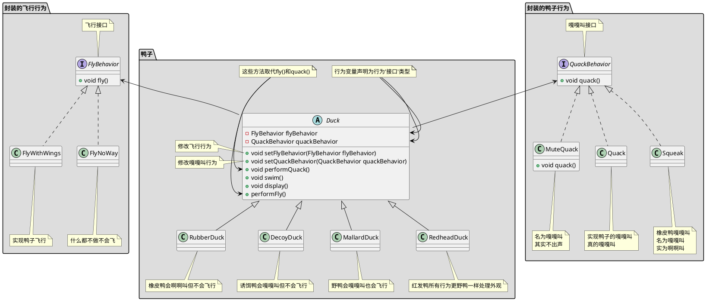
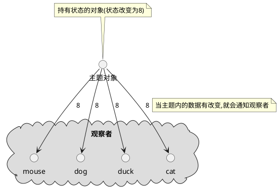
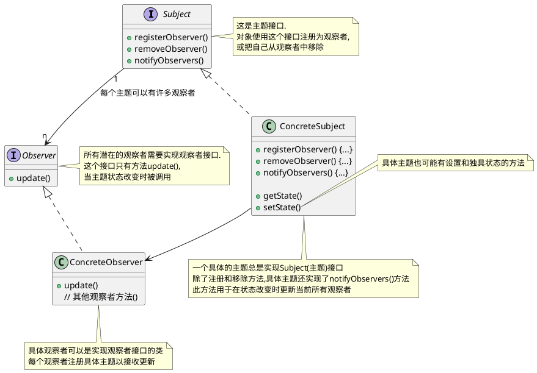
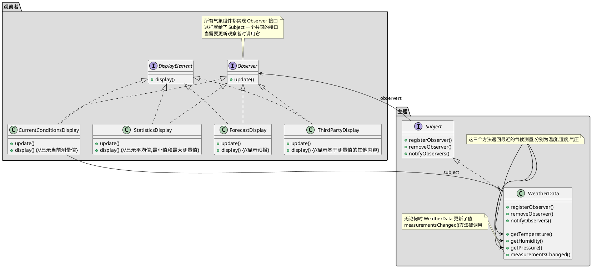

# 设计模式

## 资料
1. 官方代码 : https://github.com/bethrobson/Head-First-Design-Patterns


## OO(面向对象)基础知识

### OO基础

- 抽象
- 封装
- 多态
- 继承

### OO原则/设计原则

- 封装变化: 识别应用中变化的方面,把它们和不变的方面分开
- 针对接口编程,而不是针对实现编程
    > 针对接口编程真正的意思是针对超类型编程.  
    > 接口一词在这里有多个含义.  接口是一个概念也是java的一个构造.  针对接口编程不必真的使用java的接口.  
    > 要点是通过针对超类型编程来利用多态,这样实际的运行时对象不会被锁定到代码  
- 优先使用组合而不是继承
- 尽量做到交互对象之间的松耦合设计


## 策略模式
策略模式: 定义了一个算法族,分别封装起来,是的他们之间可以相互变换.策略让算法的变化独立使用它的客户

### 策略模式例子:鸭塘模拟游戏
下面例子中鸭子(客户)使用了算法(飞行行为,鸭子行为),不同实现用于替换

joe上班的公司做了一款相当成功的鸭塘模拟游戏SimUDuck.游戏中会出现各种鸭子,一边戏水,一边嘎嘎叫.


```java

// 叫声行为
public interface QuackBehavior {
    public void quack();
}
public class Quack implements QuackBehavior {
    public void quack() {
        System.out.println("Quack");
    }
}
public class MuteQuack implements QuackBehavior {
    public void quack() {
        System.out.println("<< Silence >>");
    }
}
public class Squack implements QuackBehavior {
    public void quack() {
        System.out.println("Squack");
    }
}

// 飞行行为
public interface FlyBehavior {
    public void fly();
}
public class FlyWithWings implements FlyBehavior {
    public void fly() {
        System.out.println("fly");
    }
}
public class FlyNoWay implements FlyBehavior {
    public void fly() {
        System.out.println("not fly");
    }
}


// 鸭子抽象类
public abstract class Duck {
    protected QuackBehavior quackBehavior;
    protected FlyBehavior flyBehavior;
    
    public void setFlyBehavior(FlyBehavior flyBehavior) {
        this.flyBehavior = flyBehavior;
    }
    public void setQuackBehavior(QuackBehavior quackBehavior) {
        this.quackBehavior = quackBehavior;
    }

    // 为了执行嘎嘎叫,Duck只要让quackBehavior所引用的对象为嘎嘎叫即可.
    // 在这部分代码中我们不关心具体Duck是那种对象
    // 只要它知道这么quack()就可以了
    public void performQuack() {
        quackBehavior.quack();
    }

    public void performFly() {
        flyBehavior.fly();
    }

    // 识别应用中变化的方面,把它们和不变的方面分开
    public abstract void swim() {
        System.out.println("所有的鸭子都会漂浮，甚至是游泳");
    }
    public abstract void display();

}

// 野鸭会嘎嘎叫也会飞行
public class MallardDuck extends Duck {
    // 实例化Duck的quackBehavior flyBehavior
    public MallardDuck() {
        // MallardDuck 使用Quack类来处理嘎嘎叫,因此 performQuack() 被调用时,嘎嘎叫的责任被委托给Quack对象我们得到了真正的嘎嘎叫
        this.quackBehavior = new Quack();
        this.flyBehavior = new FlyWithWings();
    }

    public void display() {
        System.out.println("我是一个红色的野鸭");
    }
}


// 测试类
public class MiniDuckSimulator {
    public static void main(String[] args) {
        Duck mallard = new MallardDuck();
        mallard.performQuack(); // 输出 Quack
        mallard.performFly(); // 输出 fly

        // 改变为不会飞行
        mallard.setFlyBehavior(new FlyNoWay());
        mallard.performFly(); // 输出 not fly
    }
}

```

## 观察者模式

### 观察者摸索定义

定义对象之间的一对多依赖,这样一来,当一个对象改变状态时,它的所有依赖都会收到他嗯直并自动更新

### 观察者模式探讨

1. 主题一有状态的变化就通知所有的观察者,但某个状态的变化只是部分观察者关心
2. 主题为啥不给特定的观察者状态变化而是把所有状态都给出去
3. 观察者为啥不主动拉取主题状态
4. 观察者不要依赖特的通知次序

#### 主题/观察者



主题和和观察者定义了一对多关系.当主题有变化时,会通知众多观察者.观察者是主题的依赖者,当主题的状态变化,观察者被通知.

观察者模式有几种不同的实现方式,但大多数围绕着包括主题和观察者接口的类设计

#### 观察者模式类图



### 观察者例子:气象观测站
有一个气象观测站需要追踪当前天气并且有个对象WeatherData追踪当前天气状况,WeatherData对象如下


```java

public interface Subject {
    // 这两个方法都用一个Observer作为参数,即要注册或被移除的Observer
    public void registerObserver(Observer o);
    public void removeObserver(Observer o);
    // 当Subject的状态改变时,这个方法会被调用,以通知所有的观察者
    public void notifyObservers();
}

public interface Observer {
    // 这些都是当气象测量数据变化时观察者从Subject获取的状态值
    public void update(float temp, float humidity, float pressure);
}

// DisplayElement 接口只包含一个方法 display(), 当显示元素需要显示时,调用此方法
public interface DisplayElement {
    public void display();     
}


import java.util.*;
// WeatherData 实现 Subject 接口
public class WeatherData implements Subject {
    // 我们添加一个 List 来持有 Observer
    private List<Observer> observers;
    private float temperature;
    private float humidity;
    private float pressure;

    public WeatherData() {
        observers = new ArrayList<Observer>();
    }

    public void registerObserver(Observer o) {
        observers.add(o);
    }

    public void removeObserver(Observer o) {
        observers.remove(o);
    }

    public void notifyObservers() {
        for (Observer observer : observers) {
            observer.update(temperature, humidity, pressure);
        }
    }
   public void measurementsChanged() {
        notifyObservers();
    }

   // 模拟气象站测量到气象数据变化时候嗲用
    public void setMeasurements(float temperature, float humidity, float pressure) {
        this.temperature = temperature;
        this.humidity = humidity;
        this.pressure = pressure;
        measurementsChanged();
    }

    public float getTemperature() {
        return temperature;
    }

    public float getHumidity() {
        return humidity;
    }

    public float getPressure() {
        return pressure;
    }

}

// 这个接口实现了 Observer 方法所以它可以从 WeatherData 对象中获取变化
// 它也实现了 DisplayElement 因为我们的 API 打算要求所有显示元素实现这个接口
public class CurrentConditionsDisplay implements Observer, DisplayElement { 
    private float temperature;
    private float humidity;
    private WeatherData weatherData;
      
    public CurrentConditionsDisplay(WeatherData weatherData) { 
        this.weatherData = weatherData;
        weatherData.registerObserver(this);
    } 
      
    public void update(float temperature, float humidity, float pressure) { 
        this.temperature = temperature;
        this.humidity = humidity;
        display();
    } 
      
    public void display() { 
        System.out.println("Current conditions: " + temperature 
            + "F degrees and " + humidity + "% humidity");
    } 
}

// 测试程序
public class WeatherStation {
      
    public static void main(String[] args) {
        WeatherData weatherData = new WeatherData();
    
        CurrentConditionsDisplay currentDisplay = 
            new CurrentConditionsDisplay(weatherData);
        // StatisticsDisplay statisticsDisplay = new StatisticsDisplay(weatherData); 
        // ForecastDisplay forecastDisplay = new ForecastDisplay(weatherData);

        weatherData.setMeasurements(80, 65, 30.4f);
        weatherData.setMeasurements(82, 70, 29.2f);
        weatherData.setMeasurements(78, 90, 29.2f);
        
        weatherData.removeObserver(forecastDisplay);
        weatherData.setMeasurements(62, 90, 28.1f);
    }
}

```
