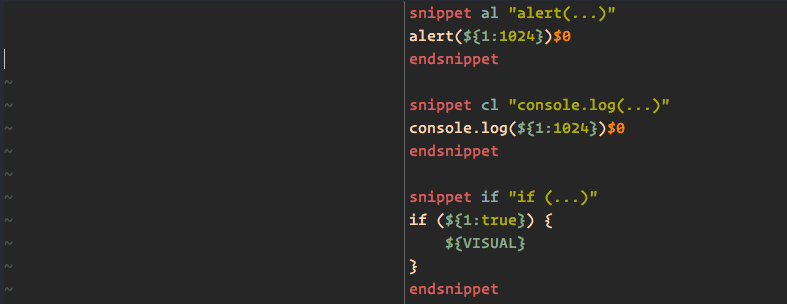
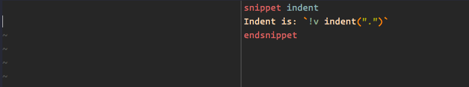
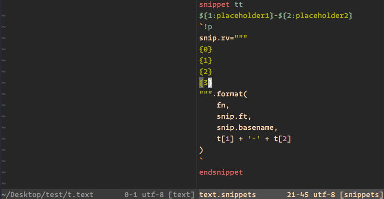
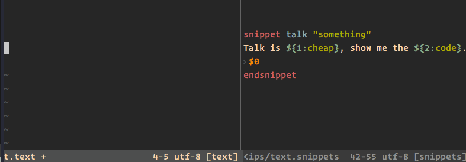
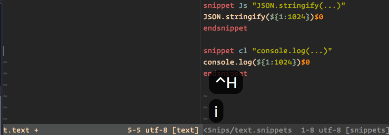
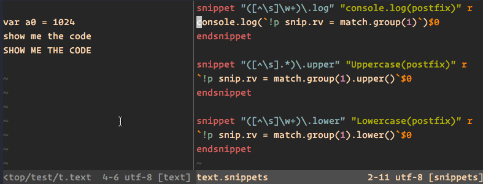
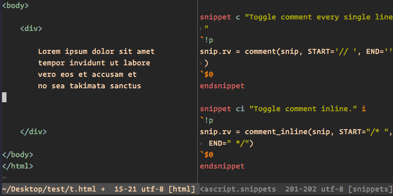

# VIM 代码片段插件 Ultisnips 使用教程


## 安装

[Ultisnips](https://github.com/SirVer/ultisnips) 插件安装分两部分，一个是 ultisnips 插件本身，另外一个是代码片段仓库。一般来说把默认的代码片段仓库下载下来按需修改后上传到自己的 github 即可。如果你和我一样也使用 vim-plug 来管理 插件的话，添加下面的代码到你的 vimrc 中保存刷新即可

```vim
Plug 'SirVer/ultisnips'
" 你自己的代码仓库 git 地址
Plug 'keelii/vim-snippets'
```

上面的示例中所有的代码片段都存放在插件安装目录下面的 `vim-snippets/UltiSnips` 中，文件命名格式为 `ft`.snippets, `ft` 就是 vim 中的 `filetype`，其中有个 `all.snippets` 是唯一一个所有文件都适用的代码片段

## 配置

快捷键设置，我一般使用 tab 来触发代码片段补全，**且不使用 YCM** （官方文档表示使用YCM的话就不能使用tab补全）

```vim
let g:UltiSnipsExpandTrigger="<tab>"
" 使用 tab 切换下一个触发点，shit+tab 上一个触发点
let g:UltiSnipsJumpForwardTrigger="<tab>"
let g:UltiSnipsJumpBackwardTrigger="<S-tab>"
" 使用 UltiSnipsEdit 命令时垂直分割屏幕
let g:UltiSnipsEditSplit="vertical"
```

## 依赖

ultisnips 插件需要你的 vim 支持 python，可以在 vim 命令模式下使用下面的检测你的 vim 版本是否支持 python，返回 1 表示支持

```vim
:echo has("python")
:echo has("python3")
```

## 定义一个代码片段

## snippets 文件对应文件类型规则

- 1. 如果sh.snippets 对于shell脚本的代码片段 则 sh_xxx.snippets 也对应对于shell脚本的代码片段

## 定义格式

```vim
snippet 触发字符 ["代码片段说明" [参数]]
代码片段内容
endsnippet
```

## 最小化的一个代码片段

```vim
snippet if "if (condition) { ... }"
if (${1:true}) {
    $0
}
endsnippet
```

这时当你在 vim 中输入 if 敲 tab 就会 展开一条 if 语句，第一个触发点是 if 条件表达式，最后一个是 if 语句体

`${1:true}` 表示这是第一个触发点，占位 符为 `true`，如果占位符没有默认值可直接使用 `$1`, `$2`, `$3`...

## 可视选择区的内容为占位符

```text
snippet if "if (...)"
if (${1:true}) {
    ${VISUAL}
}
endsnippet
```

`${VISUAL}` 表示在 vim 中使用可视模式下选择的文本，这个在重构代码的时候**非常有用**（后面会有高级用法），上个图感受一下



## 代码片段的参数

- `b` 表示触发字符应该在一行的开始
- `i` 表示触发字符可以在单词内（连续展 示会使用这个选项）
- `w` 表示触发字符的前后必须是一个字母分界点
- `r` 表示触发字符可以是一个正则表达式
- `t` 表示展开的代码片段中如果有制表符，原样输出，即使你的 vimrc 里面设置了 expandtab
- `m` 表示删除代码片段右边的所有空白字符
- `e` 表示自定义上 下文
- `A` 表示自动触发，不需要按 tab，类似于 VIM 中的 abbr

## 内容解释器

Ultisnips 定义的代码片段中支持三种不同的语言注入：shell, vimscript, python，在代码片段中用反引号表示

## shell 代码

就是在你的命令行 shell 能执行的代码片段，比如输出当前时间

```text
➜ date
2018年 8月27日 星期一 18时19分38秒 CST
```

在代码片段中用反引号「\`」引用即可

```vim
snippet today
Today is the `date`.
endsnippet
```

输入 today 按 tab 展开后（格式和上面shell中的不一样，估计是因为 vim 语言设置的问题）：

```text
Today is the Mon Aug 27 18:24:51 CST 2018.
```

## vimscript 代码

使用 `indent` 来输出当前缩进值，使用前缀 `!v` 表示是 vimscript

```vim
snippet indent
Indent is: `!v indent(".")`.
endsnippet
```



## python 代码

在代码片段中解释执行 python 代码是 ultisnips 最强大的功能，以前缀 `!p` 开始 。系统会向 python 中注入一些变量，可以使用 python 代码直接对其进行操作

- `fn` - 表示当前文件名
- `path` - 当前文件名的路径
- `t` - 占位符的字典，可以使用 `t[1], t[2], t.v` 来取占位符内容
- `snip` - [UltiSnips.TextObjects.SnippetUtil](https://github.com/SirVer/ultisnips/blob/6fdc3647f72e0a1f321ea6bd092ecd01f7c187ba/pythonx/UltiSnips/text_objects/_python_code.py#L56v) 对象的一个实例
- `match` - 正则代码片段时返回 的匹配元素（非常强大）

其中最常用的 `snip` 对象提供了下面一些变量：

- `snip.rv` 表示 return value，python 代码执行后处理过的字符串赋给 rv 即可
- `snip.fn` 表示当前文件名
- `snip.ft` 表示当前文件类型
- `snip.v` 表示 VISUAL 模式变量，其中 `snip.v.mode` 表示模式类型，`snip.v.text` 表示 VISUAL 模式中选择的字符



## 占位符选择

UltiSnips 支持使用快捷键切换占位符，我使用 `<tab>` 和 `<shift-tab>` 来切换 `下一个` 和 `上一个` 占位符，占位符切换的作用域为当前代码片段内部（即使占位符已被修改过），当光标移动出去以后就不起作用了



## 自定义上下文

自定义上下文可以通过正则匹配来决定代码片断是否可用，比如判断在指定的 if 语句里面才起作用的代码片断，定义格式如下：

> snippet 触发字符 "描述" "表达式" 参数

比如我们定义一个 **只有** 在上一行以 `if (DEVELOPMENT) {` 开头才可以展开的代码片段

```text
snippet dbg "if (DEVELOPMENT) dbg" "re.match('^if \(DEVELOPMENT\) \{', snip.buffer[snip.line-1])" be
debugger;
endsnippet
```

## 常见用法

## 行内连续展开

这个常见于需要连续展开代码片段的情况，比如，有两个片段 ，一个打印变量，一个处理 JSON 序列化。这时需要使用参数选项 `i`n-word



## 使用正则代码片段

通常写代码的时候需要使用 log, print 等来打印上下文中的变量。使用普通片段按 cl 展示 console.log\(\) 然后把变量字符复制进括号，这样操作会比较复杂。使用正则来动态匹配前面的字符可以很好的解决这个问题

```vim
snippet "([^\s]\w+)\.log" "console.log(postfix)" r
console.log(`!p snip.rv = match.group(1)`)$0
endsnippet
snippet "([^\s].*)\.upper" "Uppercase(postfix)" r
`!p snip.rv = match.group(1).upper()`$0
endsnippet
snippet "([^\s]\w+)\.lower" "Lowercase(postfix)" r
`!p snip.rv = match.group(1).lower()`$0
endsnippet
```

动图演示



**注意**：正则代码片段只适用于单行文本处理，如果是多行转换还是得用到 下面的 python + VISUAL 代码片段来处理

## 使用 python 解释器 + VISUAL 模式实现代码注释功能

通常我们需要使用一大堆插件来实现各种代码的注释功能。不过 Ultisnips 提供了 VISUAL 模式可以提取 vim 可视模式中选择的内容到代码片段里面，于是我们就可以结合起来制作一个**具有注释功能的代码片段**

流程大概是这样的：

1.  进入 vim 可视模式，选择要注释的内容
2.  按 tab，清除选择内容
3.  输入代码片段触发字符，按 tab 完成

由于实现的 python 代码相对复杂一些，主要分成两个方法。单行注释和多行注释，注意 Ultisnips 中可以直接写 python 但是大段的方法建议放在插件目录下面的 pythonx 目录下面，使用的时候在对应的代码片段中的全局 python 代码 `global !p` 引入即可

**单行注释**\(pythonx/javascript\_snippets.py\)：

```python
def comment(snip, START="", END=""):
    lines = snip.v.text.split('\n')[:-1]
    first_line = lines[0]
    spaces = ''
    initial_indent = snip._initial_indent

    # Get the first non-empty line
    for idx, l in enumerate(lines):
        if l.strip() != '':
            first_line = lines[idx]
            sp = re.findall(r'^\s+', first_line)
            if len(sp):
                spaces = sp[0]
            break

    # Uncomment
    if first_line.strip().startswith(START):
        result = [line.replace(START, "", 1).replace(END, "", 1) if line.strip() else line for line in lines]
    else:
        result = [f'{spaces}{START}{line[len(spaces):]}{END}' if line.strip() else line for line in lines ]

    # Remove initial indent
    if result[0] and initial_indent:
        result[0] = result[0].replace(initial_indent, '', 1)

    if result:
        return '\n'.join(result)
    else:
        return ''
```

**多行注释：**

```python
def comment_inline(snip, START="/* ", END=" */"):
    text = snip.v.text
    lines = text.split('\n')[:-1]
    first_line = lines[0]
    initial_indent = snip._initial_indent
    spaces = ''

    # Get the first non-empty line
    for idx, l in enumerate(lines):
        if l.strip() != '':
            first_line = lines[idx]
            sp = re.findall(r'^\s+', first_line)
            if len(sp):
                spaces = sp[0]
            break

    if text.strip().startswith(START):
        result = text.replace(START, '', 1).replace(END, '', 1)
    else:
        result = text.replace(spaces, spaces + START, 1).rstrip('\n') + END + '\n'

    if initial_indent:
        result = result.replace(initial_indent, '', 1)

    return result
```

**代码片段定义：**

```vim
global !p
from javascript_snippets import (
    comment, comment_inline
)
endglobal

# ...

snippet c "Toggle comment every single line"
`!p
snip.rv = comment(snip, START='// ', END='')
`$0
endsnippet

snippet ci "Toggle comment inline."
`!p
snip.rv = comment_inline(snip, START="/* ", END=" */")
`$0
endsnippet
```

动图演示



不同的语言可以在对应的片段文件中定义并传入注释符号参数即可，有了这个功能就可以愉快的删除其它的 vim 注释插件了

